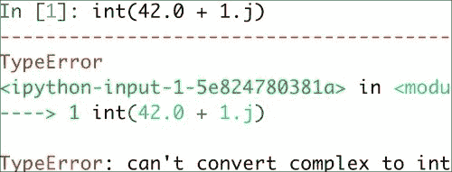
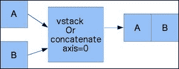
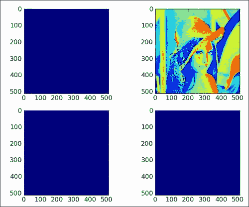
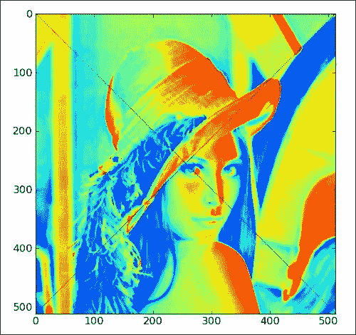
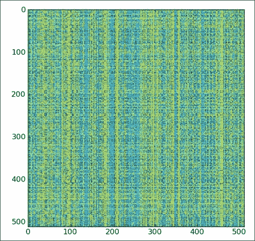
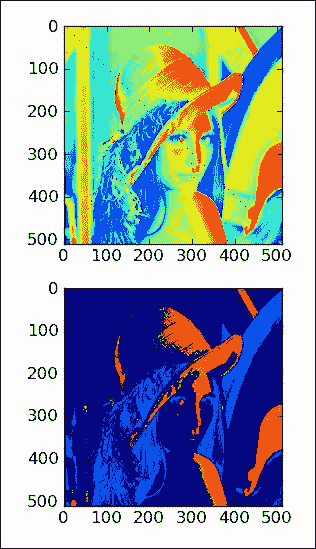

# 二、NumPy 基础

安装 NumPy 并使一些代码正常工作之后，该介绍 NumPy 的基础知识了。 本章向您介绍 NumPy 和数组的基础。 在本章的最后，您将对 NumPy 数组及其关联函数有基本的了解。

我们将在本章中介绍的主题如下：

*   资料类型
*   数组类型
*   类型转换
*   创建数组
*   索引编制
*   花式索引
*   切片
*   操纵形状

# NumPy 数组对象

NumPy 具有一个称为 `ndarray`的多维数组对象。 它由两部分组成，如下所示：

*   实际数据
*   一些描述数据的元数据

大多数阵列操作均保持原始数据不变。 更改的唯一方面是元数据。

在上一章中，我们已经学习了如何使用`arange()`函数创建数组。 实际上，我们创建了一个包含一组数字的一维数组。 `ndarray`对象可以具有多个维度。

## 使用 NumPy 数组的优点

NumPy 数组是通用的同类数组-数组中的项必须为相同类型（存在异类的特殊数组类型）。 好处是，如果我们知道数组中的项目属于同一类型，则很容易确定数组所需的存储大小。 NumPy 数组可以对整个数组执行矢量化操作。 将此与 Python 列表进行对比，通常情况下，您必须遍历该列表并一次对每个元素执行操作。 而且，NumPy 使用优化的 C API 进行这些操作，使其特别快。

NumPy 数组的索引就像在 Python 中一样，从 0 开始。数据类型由特殊对象表示。 这些对象将在本章中进一步详细讨论。

我们将再次使用`arange()`函数创建一个数组（请参见本书代码捆绑`Chapter02`文件夹中的`arrayattributes.py`文件）。 在本章中，您将看到已经导入 NumPy 的 IPython 会话中的代码片段。 以下代码段向我们展示了如何获取数组的数据类型：

```py
In: a = arange(5)
In: a.dtype
Out: dtype('int64')
```

数组`a`的数据类型为`int64`（至少在我的机器上），但是如果使用 32 位 Python，则可能会得到`int32`作为输出。 在这两种情况下，我们都处理整数（64 位或 32 位）。 除了数组的数据类型外，了解其形状也很重要。 第 1 章， “NumPy 入门”中的示例演示了如何创建向量（实际上是一维 NumPy 数组）。 向量通常用于数学中，但是大多数时候我们需要高维的对象。 让我们确定在本节前面创建的矢量的形状：

```py
In: a
Out: array([0, 1, 2, 3, 4])
In: a.shape
Out: (5,)
```

如您所见，向量具有五个元素，其值范围从`0`到`4`。 数组的`shape`属性是一个元组； 在这种情况下，是一个元素的元组，其中包含每个维度的长度。

# 创建多维数组

既然我们知道如何创建向量，就可以创建多维 NumPy 数组了。 创建矩阵之后，我们将再次想要显示其形状（请参见本书代码捆绑`Chapter02`文件夹中的`arrayattributes.py`文件），如以下代码段所示：

*   要创建多维数组，请参见以下代码：

    ```py
    In: m = array([arange(2), arange(2)])
    In: m
    Out:
    array([[0, 1],[0, 1]])
    ```

*   要显示数组形状，请参见以下代码行：

    ```py
    In: m.shape
    Out: (2, 2)
    ```

我们使用`arange()`函数创建了一个 2 x 2 的数组。 没有任何警告，`array()`功能出现在舞台上。

`array()`函数从提供给它的对象创建一个数组。 该对象必须是类似数组的，例如 Python 列表。 在前面的示例中，我们传入了一个数组列表。 该对象是`array()`函数的唯一必需参数。 NumPy 函数倾向于具有许多带有预定义默认值的可选参数。

# 选择数组元素

从时间到时间，我们将要选择数组的特定元素。 我们将看一下如何执行此操作，但首先，让我们再次创建一个 2 x 2 矩阵（请参见本书代码包`Chapter02`文件夹中的`elementselection.py`文件）：

```py
In: a = array([[1,2],[3,4]])
In: a
Out:
array([[1, 2],       [3, 4]])
```

这次是通过将列表列表传递给`array()`函数来创建矩阵的。 现在，我们将一次选择矩阵的每个项目，如以下代码片段所示。 请记住，索引从 0 开始编号。

```py
In: a[0,0]
Out: 1
In: a[0,1]
Out: 2
In: a[1,0]
Out: 3
In: a[1,1]
Out: 4
```

如您所见，选择数组的元素非常简单。 对于数组`a`，我们只使用符号`a[m,n]`，其中`m`和`n`是数组中该项的索引。


# NumPy 数值类型

Python 具有整数类型，浮点类型和复杂类型。 但是，这对于科学计算而言还不够。 实际上，我们需要更多具有不同精度的数据类型，因此，该类型的内存大小也有所不同。 因此，NumPy 具有更多的数据类型。 NumPy 数值类型的大多数以数字结尾。 该数字指示与类型关联的位数。 下表（根据 NumPy 用户指南改编）概述了 NumPy 数值类型：

| 类型 | 描述 |
| --- | --- |
| `bool` | 布尔（`True`或`False`）存储为一个位 |
| `inti` | 平台整数（通常为`int32`或`int64`） |
| `int8` | 整数，范围为 -128 至 127 |
| `int16` | 整数，范围为 -32768 至 32767 |
| `int32` | 整数，范围为`-2 ** 31`至`2 ** 31 -1` |
| `int64` | 整数，范围为`-2 ** 63`至`2 ** 63 -1` |
| `uint8` | 无符号整数，范围为 0 到 255 |
| `uint16` | 无符号整数，范围为 0 到 65535 |
| `uint32` | 无符号整数，范围为 0 到`2 ** 32-1` |
| `uint64` | 无符号整数，范围为 0 到`2 ** 64-1` |
| `float16` | 半精度浮点数，具有符号位，5 位指数和 10 位尾数 |
| `float32` | 单精度浮点数，具有符号位，8 位指数和 23 位尾数 |
| `float64`或`float` | 双精度浮点数，具有符号位，11 位指数和 52 位尾数 |
| `complex64` | 复数，由两个 32 位浮点数（实部和虚部）表示 |
| `complex128`或`complex` | 复数，由两个 64 位浮点数（实部和虚部）表示 |

对于每种数据类型，都有一个对应的转换函数（请参见本书代码包的`Chapter02`文件夹中的`numericaltypes.py`文件），如以下代码片段所示：

```py
In: float64(42)
Out: 42.0
In: int8(42.0)
Out: 42
In: bool(42)
Out: True
In: bool(0)
Out: False
In: bool(42.0)
Out: True
In: float(True)
Out: 1.0
      In: float(False)
     Out: 0.0
```

许多函数都有一个数据类型参数，该参数通常是可选的：

```py
In: arange(7, dtype=uint16)
Out: array([0, 1, 2, 3, 4, 5, 6], dtype=uint16)
```

重要的是要知道您不允许将复数转换为整数类型的数字。 尝试执行此操作会触发`TypeError`，如以下屏幕截图所示：



将复数转换为浮点类型数也是如此。 顺便提及， `j`部分是复数的虚数系数。 但是，您可以将浮点数转换为复数，例如`complex(1.0)`。 复数的实部和虚部可以分别通过`real()`和`imag()`函数提取。

## 数据类型对象

**数据类型对象**是`numpy.dtype`类的实例。 数组再次具有数据类型。 确切地说，NumPy 数组中的每个元素都具有相同的数据类型。 数据类型对象可以告诉您数据的大小（以字节为单位）。 字节的大小由`dtype`类的`itemsize`属性给出（请参见本书代码束的`Chapter02`文件夹中的`dtypeattributes.py`文件），如以下代码行所示：

```py
In: a.dtype.itemsize
Out: 8
```

## 字符代码

**NumPy 包含字符代码**，以便与 Numeric 向后兼容。 Numeric 是 NumPy 的前身。 不建议使用它们，但是此处提供了代码，因为它们会在多个位置弹出。 您应该改用`dtype`对象。 下表显示了不同的数据类型和与其关联的字符代码：

| 类型 | 字符码 |
| --- | --- |
| 整数 | `i` |
| 无符号整数 | `u` |
| 单精度浮点 | `f` |
| 双精度浮点 | `d` |
| 布尔 | `b` |
| 复数 | `D` |
| 字符串 | `S` |
| Unicode | `U` |
| 无 | `V` |

查看下面的代码以创建一个单精度浮点数数组（请参见本书代码包的`Chapter02`文件夹中的`charcodes.py`文件）：

```py
In: arange(7, dtype='f')
Out: array([ 0.,  1.,  2.,  3.,  4.,  5.,  6.], dtype=float32)
Likewise this creates an array of complex numbers
In: arange(7, dtype='D')
Out: array([ 0.+0.j,  1.+0.j,  2.+0.j,  3.+0.j,  4.+0.j,  5.+0.j,  6.+0.j])
```

## dtype 构造函数

我们有多种创建数据类型的方式。 以浮点数据为例（请参见本书代码束的`Chapter02`文件夹中的`dtypeconstructors.py`文件），如下所示：

*   我们可以使用通用的 Python 浮点数，如以下代码行所示：

    ```py
    In: dtype(float)
    Out: dtype('float64')
    ```

*   我们可以使用字符代码指定一个单精度浮点数，如以下代码行所示：

    ```py
    In: dtype('f')
    Out: dtype('float32')
    ```

*   我们可以使用双精度浮点字符代码，如以下代码行所示：

    ```py
    In: dtype('d')
    Out: dtype('float64')
    ```

*   我们可以给数据类型构造函数一个两个字符的代码。 第一个字符表示类型，第二个字符是一个数字，用于指定数据类型中的字节数（数字 2、4 和 8 分别对应于 16 位，32 位和 64 位浮点数），在以下代码行中显示：

    ```py
    In: dtype('f8')
    Out: dtype('float64')
    ```

可以通过调用`sctypeDict.keys()`找到所有数据类型名称的列表：

```py
In: sctypeDict.keys()
Out: [0, …'i2','int0']
```

## dtype 属性

`dtype`类具有许多有用的属性。 例如，我们可以通过`dtype`的属性获取有关数据类型的字符代码的信息（请参见本书代码捆绑`Chapter02`文件夹中的`dtypeattributes2.py`文件），如以下代码片段所示：

```py
In: t = dtype('Float64')
In: t.char
Out: 'd'
```

`type`属性对应于数组元素的对象类型：

```py
In: t.type
Out: <type 'numpy.float64'>
```

`dtype`的`str`属性给出了数据类型的字符串表示形式。 它从代表字节序的字符开始（如果适用），然后是字符代码，后跟与每个数组项所需的字节数相对应的数字。 这里的字节顺序表示字节在 32 位或 64 位字中的排序方式。 按照大端顺序，最高有效字节先存储，由“ >”指示。 按照小端顺序，最低有效字节首先存储，由`<`指示，如以下代码行所示：

```py
In: t.str
Out: '<f8'
```

# 创建记录数据类型

记录数据类型是一种异构数据类型-认为它表示电子表格或数据库中的一行。 以记录数据类型为例，我们将为商店库存创建一条记录。 该记录包含以 40 个字符的字符串表示的商品名称，商店中以 32 位整数表示的商品数量，最后以 32 位浮点数表示的商品价格。 以下步骤显示了如何创建记录数据类型（请参见本书代码包的`Chapter02`文件夹中的`record.py`文件）：

1.  要创建记录，请检查以下代码片段：

    ```py
    In: t = dtype([('name', str_, 40), ('numitems', int32), ('price', float32)])
    In: t
    Out: dtype([('name', '|S40'), ('numitems', '<i4'), ('price', '<f4')])
    ```

2.  要查看字段的类型，请检查以下代码段：

    ```py
    In: t['name']
    Out: dtype('|S40')
    ```

如果不为`array()`函数提供数据类型，则将假定它正在处理浮点数。 现在要创建一个数组，我们实际上必须指定数据类型，如以下代码行所示； 否则，我们将获得`TypeError`：

```py
In: itemz = array([('Meaning of life DVD', 42, 3.14), ('Butter', 13, 2.72)], dtype=t)
In: itemz[1]
Out: ('Butter', 13, 2.7200000286102295)
```

我们创建了一个记录数据类型，它是一个异构数据类型。 记录包含一个名称（作为字符串），一个数字（一个整数）和一个以浮点值表示的价格。

# 一维切片和索引

一维 NumPy 数组的切片与 Python 列表的切片一样。 我们可以从`3`到`7`的索引中选择一个数组的，以提取`3`到`6`的元素（请参见本书代码包`Chapter02`文件夹中的`slicing1d.py`文件） ），如以下代码段所示：

```py
In: a = arange(9)
In: a[3:7]
Out: array([3, 4, 5, 6])
```

我们可以以两个为步长从索引`0`到`7`中选择元素，如以下代码行所示：

```py
In: a[:7:2]
Out: array([0, 2, 4, 6])
```

就像在 Python 中一样，我们可以使用负索引并反转数组，如以下代码行所示：

```py
In: a[::-1]
Out: array([8, 7, 6, 5, 4, 3, 2, 1, 0])
```

# 操纵数组形状

另一个重复执行的任务是将数组展平。 在这种情况下，展平意味着将多维数组转换为一维数组。 在此示例中，我们将展示许多方法从展平开始操作数组形状：

*   `ravel()`：我们可以使用`ravel()`函数完成的拼合（请参见本书代码捆绑`Chapter02`文件夹中的`shapemanipulation.py`文件），如以下代码所示：

    ```py
    In: b
    Out:
    array([[[ 0,  1,  2,  3],[ 4,  5,  6,  7],[ 8,  9, 10, 11]],[[12, 13, 14, 15],[16, 17, 18, 19],[20, 21, 22, 23]]])
    In: b.ravel()
    Out:
    array([ 0,  1,  2,  3,  4,  5,  6,  7,  8,  9, 10, 11, 12, 13, 14, 15, 16, 17, 18, 19, 20, 21, 22, 23])
    ```

*   `flatten()`：适当命名的功能`flatten()`与`ravel()`相同，但是`flatten()`总是分配新的内存，而`ravel()`可能返回数组的视图。 这意味着我们可以按以下方式直接操作数组：

    ```py
    In: b.flatten()
    Out:
    array([ 0,  1,  2,  3,  4,  5,  6,  7,  8,  9, 10, 11, 12, 13, 14, 15, 16, 17, 18, 19, 20, 21, 22, 23])
    ```

*   `shape`: Besides the `reshape()` function, we can also set the shape directly with a tuple, which is shown as follows:

    ```py
    In: b.shape = (6,4)
    In: b
    Out:
    array([[ 0,  1,  2,  3],[ 4,  5,  6,  7],[ 8,  9, 10, 11],[12, 13, 14, 15],[16, 17, 18, 19],[20, 21, 22, 23]])
    ```

    如您所见，这将直接更改数组。 现在我们有一个 6 x 4 的阵列。

*   `transpose()`：在线性代数中，通常转置矩阵。 我们也可以使用`transpose()`函数来做到这一点，如以下代码所示：

    ```py
    In: b.transpose()
    Out:
    array([[ 0,  4,  8, 12, 16, 20],[ 1,  5,  9, 13, 17, 21],[ 2,  6, 10, 14, 18, 22],[ 3,  7, 11, 15, 19, 23]])
    ```

*   `resize()`：`resize()`方法的工作方式与`reshape()`方法相同，但是修改了它操作的数组：

    ```py
    In: b.resize((2,12))
    In: b
    Out:
    array([[ 0,  1,  2,  3,  4,  5,  6,  7,  8,  9, 10, 11],[12, 13, 14, 15, 16, 17, 18, 19, 20, 21, 22, 23]])
    ```

## 堆叠数组

阵列可以水平，深度或垂直堆叠。 为此，我们可以使用`vstack()`，`dstack()`，`hstack()`，`column_stack()`，`row_stack()`和`concatenate()`功能。 首先，让我们设置一些数组（请参见本书代码包的`Chapter02`文件夹中的`stacking.py`文件），如以下代码所示：

```py
In: a = arange(9).reshape(3,3)
In: a
Out:
array([[0, 1, 2],[3, 4, 5],[6, 7, 8]])
In: b = 2 * a
In: b
Out:
array([[ 0,  2,  4],[ 6,  8, 10],[12, 14, 16]])
```

以下是不同类型的堆叠：

*   **Horizontal stacking**: Starting with horizontal stacking, we will form a tuple of `ndarray` and give it to the `hstack()` function. This is shown as follows:

    ```py
    In: hstack((a, b))
    Out:
    array([[ 0,  1,  2,  0,  2,  4],[ 3,  4,  5,  6,  8, 10],[ 6,  7,  8, 12, 14, 16]])
    ```

    我们可以使用`concatenate()`函数实现相同的功能，如下所示：

    ```py
    In: concatenate((a, b), axis=1)
    Out:
    array([[ 0,  1,  2,  0,  2,  4],[ 3,  4,  5,  6,  8, 10],[ 6,  7,  8, 12, 14, 16]])
    ```

    下图显示了水平堆叠：

    

*   **Vertical stacking**: With vertical stacking, again, a tuple is formed. This time, it is given to the `vstack()` function. This can be seen as follows:

    ```py
    In: vstack((a, b))
    Out:
    array([[ 0,  1,  2],[ 3,  4,  5],[ 6,  7,  8],[ 0,  2,  4],[ 6,  8, 10],[12, 14, 16]])
    ```

    `concatenate()`函数在将轴参数设置为`0`的情况下产生相同的结果。 这是`axis`参数的默认值，如以下代码所示：

    ```py
    In: concatenate((a, b), axis=0)
    Out:
    array([[ 0,  1,  2],[ 3,  4,  5],[ 6,  7,  8],[ 0,  2,  4],[ 6,  8, 10],[12, 14, 16]])
    ```

    请参阅下图进行垂直堆叠：

    

*   **深度堆叠**：当然还有使用`dstack()`和元组的深度堆叠。 这意味着沿第三轴（深度）堆叠数组列表。 例如，我们可以彼此堆叠图像数据的二维数组：

    ```py
    In: dstack((a, b))
    Out:
    array([[[ 0,  0],[ 1,  2],[ 2,  4]],[[ 3,  6],[ 4,  8],[ 5, 10]],[[ 6, 12],[ 7, 14],[ 8, 16]]])
    ```

*   **Column stacking**: The `column_stack()` function stacks one-dimensional arrays column-wise. It's shown as follows:

    ```py
    In: oned = arange(2)
    In: oned
    Out: array([0, 1])
    In: twice_oned = 2 * oned
    In: twice_oned
    Out: array([0, 2])
    In: column_stack((oned, twice_oned))
    Out:
    array([[0, 0],[1, 2]])
    ```

    二维数组以`hstack()`的方式堆叠，如以下代码所示：

    ```py
    In: column_stack((a, b))
    Out:
    array([[ 0,  1,  2,  0,  2,  4],[ 3,  4,  5,  6,  8, 10],[ 6,  7,  8, 12, 14, 16]])
    In: column_stack((a, b)) == hstack((a, b))
    Out:
    array([[ True,  True,  True,  True,  True,  True],[ True,  True,  True,  True,  True,  True],[ True,  True,  True,  True,  True,  True]], dtype=bool)
    ```

    是的，您猜对了！ 我们用`==`运算符比较了两个数组。 这不漂亮吗？

*   **Row stacking**: NumPy, of course, also has a function that does row-wise stacking. It is called `row_stack()`, and for one-dimensional arrays, it just stacks the arrays in rows into a two-dimensional array:

    ```py
    In: row_stack((oned, twice_oned))
    Out:
    array([[0, 1],[0, 2]])
    ```

    二维数组的`row_stack()`函数结果等于`vstack()`函数结果，如下所示：

    ```py
    In: row_stack((a, b))
    Out:
    array([[ 0,  1,  2],[ 3,  4,  5],[ 6,  7,  8],[ 0,  2,  4],[ 6,  8, 10],[12, 14, 16]])
    In: row_stack((a,b)) == vstack((a, b))
    Out:
    array([[ True,  True,  True],[ True,  True,  True],[ True,  True,  True],[ True,  True,  True],[ True,  True,  True],[ True,  True,  True]], dtype=bool)
    ```

## 拆分数组

可以在垂直，水平或深度方向拆分阵列。 涉及的功能是`hsplit()`，`vsplit()`，`dsplit()`和`split()`。 我们既可以将数组拆分为相同形状的数组，也可以指示拆分之后应该发生的位置。

*   **Horizontal splitting**: The ensuing code splits an array along its horizontal axis into three pieces of the same size and shape (see the `splitting.py` file in the `Chapter02` folder of this book's code bundle):

    ```py
    In: a
    Out:
    array([[0, 1, 2],[3, 4, 5],[6, 7, 8]])
    In: hsplit(a, 3)
    Out:
    [array([[0],[3],[6]]),array([[1],[4],[7]]),array([[2],[5],[8]])]
    ```

    将其与 `split()`函数的调用以及附加参数`axis=1`进行比较：

    ```py
    In: split(a, 3, axis=1)
    Out:
    [array([[0],[3],[6]]),array([[1],[4],[7]]),array([[2],[5],[8]])]
    ```

*   **Vertical splitting**: The `vsplit()` function splits an array along the vertical axis:

    ```py
    In: vsplit(a, 3)
    Out: [array([[0, 1, 2]]), array([[3, 4, 5]]), array([[6, 7, 8]])]
    ```

    `split()`函数与`axis=0`一起也沿垂直轴拆分了一个数组：

    ```py
    In: split(a, 3, axis=0)
    Out: [array([[0, 1, 2]]), array([[3, 4, 5]]), array([[6, 7, 8]])]
    ```

*   **深度分割**： `dsplit()`功能毫不奇怪，深度拆分数组。 我们将需要一个排名第三的数组：

    ```py
    In: c = arange(27).reshape(3, 3, 3)
    In: c
    Out:
    array([[[ 0,  1,  2],[ 3,  4,  5],[ 6,  7,  8]],[[ 9, 10, 11],[12, 13, 14],[15, 16, 17]],[[18, 19, 20],[21, 22, 23],[24, 25, 26]]])
    In: dsplit(c, 3)
    Out:
    [array([[[ 0],[ 3],[ 6]],[[ 9],[12],[15]],[[18],[21],[24]]]),array([[[ 1],[ 4],[ 7]],[[10],[13],[16]],[[19],[22],[25]]]),array([[[ 2],[ 5],[ 8]],[[11],[14],[17]],[[20],[23],[26]]])]
    ```

## 数组属性

除了，`shape`和`dtype`属性外，`ndarray`还有许多其他属性，如下表所示：

*   `ndim`：此属性为提供数组维数（请参见本书代码捆绑包`Chapter02`文件夹中的`arrayattributes2.py`文件）：

    ```py
    In: b
    Out:
    array([[ 0,  1,  2,  3,  4,  5,  6,  7,  8,  9, 10, 11],[12, 13, 14, 15, 16, 17, 18, 19, 20, 21, 22, 23]])
    In: b.ndim
    Out: 2
    ```

*   `size`：此属性显示元素数。 如下所示：

    ```py
    In: b.size
    Out: 24
    ```

*   `itemsize`：此属性给出数组中每个元素的字节数：

    ```py
    In: b.itemsize
    Out: 8
    ```

*   `nbytes`：此属性为提供数组所需的字节总数。 它只是`itemsize`和`size`属性的乘积：

    ```py
    In: b.nbytes
    Out: 192
    In: b.size * b.itemsize
    Out: 192
    ```

*   `T`: This attribute has the same effect as the `transpose()` function, which is shown as follows:

    ```py
    In: b.resize(6,4)
    In: b
    Out:
    array([[ 0,  1,  2,  3],[ 4,  5,  6,  7],[ 8,  9, 10, 11],[12, 13, 14, 15],[16, 17, 18, 19],[20, 21, 22, 23]])
    In: b.T
    Out:
    array([[ 0,  4,  8, 12, 16, 20],[ 1,  5,  9, 13, 17, 21],[ 2,  6, 10, 14, 18, 22],[ 3,  7, 11, 15, 19, 23]])
    ```

    如果数组的排名低于 2，我们将只获得数组的视图：

    ```py
    In: b.ndim
    Out: 1
    In: b.T
    Out: array([0, 1, 2, 3, 4])
    ```

    NumPy 中的复数由`j`表示。 例如，我们可以创建一个包含复数的数组：

    ```py
    In: b = array([1.j + 1, 2.j + 3])
    In: b
    Out: array([ 1.+1.j,  3.+2.j])
    ```

*   `real`：此属性为我们提供了数组的实部；如果数组本身仅包含实数，则为数组本身：

    ```py
    In: b.real
    Out: array([ 1.,  3.])
    ```

*   `imag`: This attribute contains the imaginary part of an array:

    ```py
    In: b.imag
    Out: array([ 1.,  2.])
    ```

    如果数组包含复数，则数据类型也将自动变为复数：

    ```py
    In: b.dtype
    Out: dtype('complex128')
    In: b.dtype.str
    Out: '<c16'
    ```

*   `flat`: This attribute returns a `numpy.flatiter` object. This is the only way to acquire a `flatiter`—we do not have access to a `flatiter` constructor. The flat iterator enables us to loop through an array as if it is a flat array, as shown in the following code:

    ```py
    In: b = arange(4).reshape(2,2)
    In: b
    Out:
    array([[0, 1],[2, 3]])
    In: f = b.flat
    In: f
    Out: <numpy.flatiter object at 0x103013e00>
    In: for item in f: print item
       .....:
    0
    1
    2
    3
    ```

    可以使用`flatiter`对象直接获取元素，如下所示：

    ```py
    In: b.flat[2]
    Out: 2
    ```

    也可以按如下方式获取多个元素：

    ```py
    In: b.flat[[1,3]]
    Out: array([1, 3])
    ```

    `flat`属性是可设置的。 设置`flat`属性的值会导致覆盖整个数组的值，如下所示：

    ```py
    In: b.flat = 7
    In: b
    Out:
    array([[7, 7],[7, 7]])
    ```

    您甚至可以按以下方式获取选定的元素：

    ```py
    In: b.flat[[1,3]] = 1
    In: b
    Out:
    array([[7, 1],[7, 1]])
    ```

下图显示了 ndarray 的不同属性：


## 转换数组

我们可以通过`tolist()`函数将[NumPy]数组转换为 Python 列表（请参见本书代码捆绑`Chapter02`文件夹中的`arrayconversion.py`文件），如下所示：

*   要将数组转换为列表，请检查以下代码片段：

    ```py
    In: b
    Out: array([ 1.+1.j,  3.+2.j])
    In: b.tolist()
    Out: [(1+1j), (3+2j)]
    ```

*   `astype()`函数将数组转换为指定类型的数组，如以下代码所示：

    ```py
    In: b
    Out: array([ 1.+1.j,  3.+2.j])
    In: b.astype(int)
    /usr/local/bin/ipython:1: ComplexWarning: Casting complex values to real discards the imaginary part
      #!/usr/bin/python
    Out: array([1, 3])
    ```

### 注意

从复杂类型转换为`int`时，我们将丢失虚部。

`astype()`函数还接受类型名称作为字符串，如以下代码片段所示：

```py
In: b.astype('complex')
Out: array([ 1.+1.j,  3.+2.j])
```

这次不会显示任何警告，因为我们使用了正确的数据类型。

# 创建视图和副本

在关于`ravel()`功能的示例中，提到了视图。 视图不应与数据库视图的概念混淆。 NumPy 世界中的视图不是只读的，并且您无法保护基础数据。 了解何时使用共享数组视图以及何时拥有数组数据副本非常重要。 例如，切片将创建一个视图。 这意味着，如果您将切片分配给变量，然后更改基础数组，则此变量的值将更改。 我们将根据著名的 Lena 图像创建一个数组，复制该数组，创建一个视图，最后修改视图。 Lena 图像阵列来自 SciPy 函数。

1.  要创建 Lena 数组的副本，请使用以下代码行：

    ```py
    acopy = lena.copy()
    ```

2.  现在，要创建数组的视图，请使用以下代码行：

    ```py
    aview = lena.view()
    ```

3.  使用平面迭代器将视图的所有值设置为`0`，如下所示：

    ```py
    aview.flat = 0
    ```

最终结果是只有一张图像显示了花花公子模型。 其他人被完全审查，如下图所示。



请参阅本部分的以下代码（不带注释以节省空间；有关完整的代码，请参见本书代码捆绑`Chapter02`文件夹中的`copy_view.py`文件），该信息显示了数组视图的行为。 并复制：

```py
import scipy.misc
import matplotlib.pyplot as plt

lena = scipy.misc.lena()
acopy = lena.copy()
aview = lena.view()
plt.subplot(221)
plt.imshow(lena)
plt.subplot(222)
plt.imshow(acopy)
plt.subplot(223)
plt.imshow(aview)
aview.flat = 0
plt.subplot(224)
plt.imshow(aview)
plt.show()
```

如您所见，通过在程序末尾更改视图，我们更改了原始的 Lena 数组。 此产生了三个蓝色（如果您正在观看黑白图像，则为黑色）图像。 复制的数组不受影响。 重要的是要记住，视图不是只读的。

# 花式索引

花式索引是不包含整数或切片的索引，这是常规索引。 在本节中，我们将应用花式索引将 Lena 图像的对角线值设置为`0`。 这将沿着对角线绘制黑线，穿过它，这不是因为图像有问题，而是作为一种练习。 执行以下步骤进行花式索引编制：

1.  将第一个对角线的值设置为`0`。 要将对角线值设置为`0`，我们需要为`x`和`y`值定义两个不同的范围，如下所示：

    ```py
    lena[range(xmax), range(ymax)] = 0
    ```

2.  现在，将另一个对角线的值设置为`0`。 要设置另一个对角线的值，我们需要使用一组不同的范围，但是原理保持不变，如下所示：

    ```py
    lena[range(xmax-1,-1,-1), range(ymax)] = 0
    ```

最后，我们得到以下对角线被划掉的图像：



此部分的以下代码不带注释。 本书的代码包`Chapter02`文件夹中的`fancy.py`文件中包含完整代码。

```py
import scipy.misc
import matplotlib.pyplot as plt

lena = scipy.misc.lena()
xmax = lena.shape[0]
ymax = lena.shape[1]
lena[range(xmax), range(ymax)] = 0
lena[range(xmax-1,-1,-1), range(ymax)] = 0
plt.imshow(lena)
plt.show()
```

我们为`x`和`y`值定义了单独的范围。 这些范围用于索引 Lena 数组。 花式索引是基于内部 NumPy 迭代器对象执行的。 这可以通过执行以下三个步骤来实现：

1.  创建迭代器对象。
2.  迭代器对象绑定到数组。
3.  数组元素通过迭代器访问。

# 索引位置列表

让我们使用`ix_()`功能来随机播放 Lena 图像。 此功能从多个序列创建一个网格。 作为参数，我们给出一维序列，并且该函数返回 NumPy 数组的元组。 例如，检查以下代码片段：

```py
In : ix_([0,1], [2,3])
Out:
(array([[0], [1]]), array([[2, 3]]))
```

要使用位置列表为数组建立索引，请执行以下步骤：

1.  随机排列数组索引。 使用`numpy.random`模块的`shuffle()`函数创建一个随机索引数组，如以下代码行所示。 该函数顺便更改了数组`inplace`。

    ```py
    def shuffle_indices(size):
       arr = np.arange(size)
       np.random.shuffle(arr)

       return arr
    ```

2.  现在，按如下所示绘制改组后的索引：

    ```py
    plt.imshow(lena[np.ix_(xindices, yindices)])
    ```

我们得到的是一个完全混乱的 Lena，如下图所示：



此部分的以下代码不带注释。 完整的代码可以在本书代码捆绑包的`Chapter02`文件夹中的`ix.py`文件中找到。

```py
import scipy.misc
import matplotlib.pyplot
import numpy as np

lena = scipy.misc.lena()
xmax = lena.shape[0]
ymax = lena.shape[1]

def shuffle_indices(size):
   arr = np.arange(size)
   np.random.shuffle(arr)

   return arr

xindices = shuffle_indices(xmax)
np.testing.assert_equal(len(xindices), xmax)
yindices = shuffle_indices(ymax)
np.testing.assert_equal(len(yindices), ymax)
plt.imshow(lena[np.ix_(xindices, yindices)])
plt.show()
```

# 使用布尔值索引数组

布尔索引是基于布尔数组的索引，属于奇特索引的类别。 由于布尔索引是幻想索引的一种形式，因此它的工作方式基本相同。 表示在特殊的迭代器对象的帮助下进行索引。 执行以下步骤为数组建立索引：

1.  首先，我们创建一个在对角线上带有点的图像。 这在某种程度上类似于“花式索引”部分。 这次，我们在图像的对角线上选择取四点为模，如以下代码片段所示：

    ```py
    def get_indices(size):
       arr = np.arange(size)
       return arr % 4 == 0
    ```

2.  然后，我们只需应用此选择并绘制点，如以下代码片段所示：

    ```py
    lena1 = lena.copy() 
    xindices = get_indices(lena.shape[0])
    yindices = get_indices(lena.shape[1])
    lena1[xindices, yindices] = 0
    plt.subplot(211)
    plt.imshow(lena1)
    ```

3.  在最大值的四分之一到四分之三之间选择数组值，并将它们设置为`0`，如下面的代码行所示：

    ```py
    lena2[(lena > lena.max()/4) & (lena < 3 * lena.max()/4)] = 0
    ```

带有两个新图像的图如下所示：



以下是该部分的代码（请参见本书代码捆绑`Chapter02`文件夹中的`boolean_indexing.py`文件）：

```py
import scipy.misc
import matplotlib.pyplot as plt
import numpy as np

lena = scipy.misc.lena()

def get_indices(size):
   arr = np.arange(size)
   return arr % 4 == 0

lena1 = lena.copy() 
xindices = get_indices(lena.shape[0])
yindices = get_indices(lena.shape[1])
lena1[xindices, yindices] = 0
plt.subplot(211)
plt.imshow(lena1)
lena2 = lena.copy() 
lena2[(lena > lena.max()/4) & (lena < 3 * lena.max()/4)] = 0
plt.subplot(212)
plt.imshow(lena2)
plt.show()
```

# 数独大步技巧

我们甚至可以使用 NumPy 做更华丽的事情。 `ndarray`类具有一个字段`strides`，该字段是一个元组，指示通过数组时每个维度要步进的字节数。 数独是起源于日本的流行拼图。 尽管在其他国家/地区以前也以类似的形式知道它。 如果您不了解 Sudoku，那可能会更好，因为它极易上瘾。 让我们对将数独谜题拆分为 3 x 3 正方形的问题应用一些大的技巧：

1.  首先定义 Sudoku 拼图数组，如以下代码片段所示。 这是一个实际已解决的数独难题的内容（为简洁起见，省略了部分数组）。

    ```py
    sudoku = np.array([[2, 8, 7, 1, 6, 5, 9, 4, 3],[9, 5, 4, 7, 3, 2, 1, 6, 8],…[7, 3, 6, 2, 8, 4, 5, 1, 9]])
    ```

2.  现在计算步幅。 `ndarray`的`itemsize`字段为我们提供了数组中的字节数。 `itemsize`计算步幅如下：

    ```py
    strides = sudoku.itemsize * np.array([27, 3, 9, 1])
    ```

3.  现在，我们可以使用`np.lib.stride_tricks`模块的`as_strided()`函数将拼图分解为正方形，如以下代码行所示：

    ```py
    squares = np.lib.stride_tricks.as_strided(sudoku, shape=shape, strides=strides)
    print(squares)
    ```

这将打印单独的数独方块（为了节省空间，一些方块被省略了），如下所示：

```py
[[[[2 8 7][9 5 4][6 1 3]]…[[[8 7 9][4 2 1][3 6 5]]…[[[1 9 8][5 4 2][7 3 6]]…[[4 2 6][3 8 7][5 1 9]]]]

```

以下是此示例的完整源代码（请参见本书代码包`Chapter02`文件夹中的`strides.py`文件）：

```py
import numpy as np

sudoku = np.array([[2, 8, 7, 1, 6, 5, 9, 4, 3],[9, 5, 4, 7, 3, 2, 1, 6, 8],[6, 1, 3, 8, 4, 9, 7, 5, 2],[8, 7, 9, 6, 5, 1, 2, 3, 4],[4, 2, 1, 3, 9, 8, 6, 7, 5],[3, 6, 5, 4, 2, 7, 8, 9, 1],[1, 9, 8, 5, 7, 3, 4, 2, 6],[5, 4, 2, 9, 1, 6, 3, 8, 7],[7, 3, 6, 2, 8, 4, 5, 1, 9]])

shape = (3, 3, 3, 3)
strides = sudoku.itemsize * np.array([27, 3, 9, 1])
squares = np.lib.stride_tricks.as_strided(sudoku, shape=shape, strides=strides)
print(squares)
```

我们应用了大步技巧，将数独谜题分解为 3 x 3 的正方形。 步幅告诉我们通过 Sudoku 数组时，每个步骤需要跳过多少字节。

# 广播阵列

简而言之，即使操作数的形状不同，NumPy 也会尝试执行操作。 在本节中，我们将一个数组和一个标量相乘。 标量扩展为数组操作数的形状，然后执行乘法。 我们将下载音频文件并制作一个更安静的新版本：

1.  首先，读取 WAV 文件。 我们将使用标准的 Python 代码下载 Austin Powers 的音频文件，叫做“Smashing，baby”。 SciPy 具有`wavfile`模块，可让您加载声音数据或生成 WAV 文件。 如果已安装 SciPy，则我们应该已经有此模块。 `read()`函数返回数据数组和采样率。 在这个例子中，我们只关心数据。

    ```py
    sample_rate, data = scipy.io.wavfile.read(WAV_FILE)
    ```

2.  使用 Matplotlib 绘制原始 WAV 数据。 为子图命名为`Original`，如以下代码行所示：

    ```py
    plt.subplot(2, 1, 1)
    plt.title("Original")
    plt.plot(data)
    ```

3.  现在创建一个新数组。 我们将使用 NumPy 制作更安静的音频样本。 只是通过乘以常量来创建具有较小值的新数组。 这就是广播魔术发生的地方。 最后，由于 WAV 格式，我们需要确保与原始数组具有相同的数据类型。

    ```py
    newdata = data * 0.2
    newdata = newdata.astype(np.uint8)
    ```

4.  现在，可以将这个新数组写入新的 WAV 文件，如下所示：

    ```py
    scipy.io.wavfile.write("quiet.wav",
        sample_rate, newdata)
    ```

5.  使用 Matplotlib 绘制新数据数组，如下所示：

    ```py
    matplotlib.pyplot.subplot(2, 1, 2)
    matplotlib.pyplot.title("Quiet")
    matplotlib.pyplot.plot(newdata)
    matplotlib.pyplot.show()
    ```

结果是原始 WAV 文件数据和具有较小值的新数组的图，如下图所示：


以下是本节的完整代码（请参见本书代码捆绑`Chapter02`文件夹中的 broadcast.py 文件）：

```py
import scipy.io.wavfile
import matplotlib.pyplot
import urllib2
import numpy as np

response = urllib2.urlopen('http://www.thesoundarchive.com/austinpowers/smashingbaby.wav')
print response.info()
WAV_FILE = 'smashingbaby.wav'
filehandle = open(WAV_FILE, 'w')
filehandle.write(response.read())
filehandle.close()
sample_rate, data = scipy.io.wavfile.read(WAV_FILE)
print "Data type", data.dtype, "Shape", data.shape
plt.subplot(2, 1, 1)
plt.title("Original")
plt.plot(data)
newdata = data * 0.2
newdata = newdata.astype(np.uint8)
print "Data type", newdata.dtype, "Shape", newdata.shape
scipy.io.wavfile.write("quiet.wav",
    sample_rate, newdata)
plt.subplot(2, 1, 2)
plt.title("Quiet")
plt.plot(newdata)
plt.show()
```

# 摘要

在本章中，我们从 NumPy 基础知识中学到了很多东西：数据类型和数组。 数组有几个描述它们的属性。 我们了解到，这些属性之一是数据类型，在 NumPy 中，该数据类型由完整的对象表示。

就像 Python 列表一样，可以有效地对 NumPy 数组进行切片和索引。 NumPy 数组具有处理多个维度的附加功能。

数组的形状可以通过多种方式进行操作，例如堆叠，调整大小，重新塑形和拆分。 本章演示了许多用于形状处理的便捷功能。

了解了基础知识之后，是时候继续使用第 3 章，“使用 NumPy 进行基本数据分析”的常用功能进行数据分析了。 这包括基本统计和数学功能的使用。