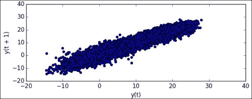
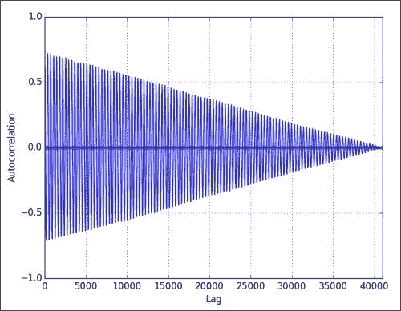
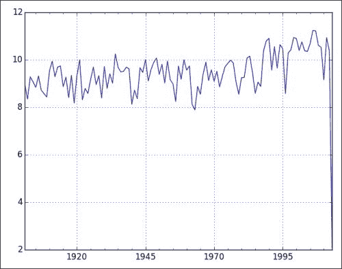
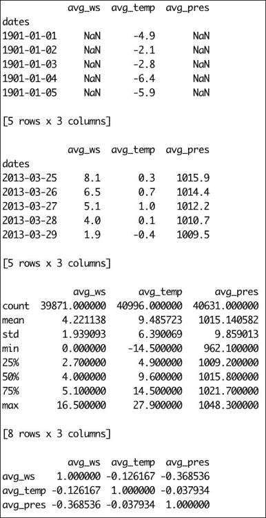
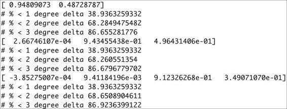
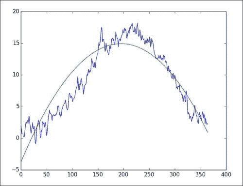
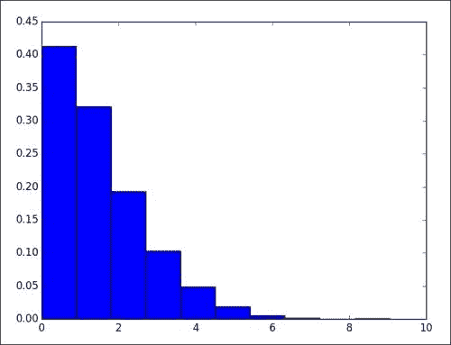
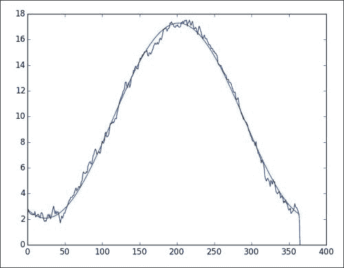
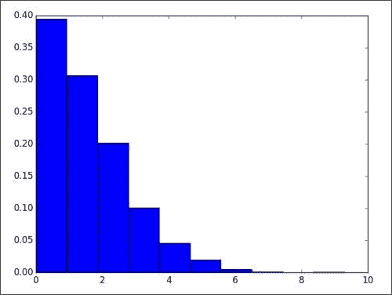
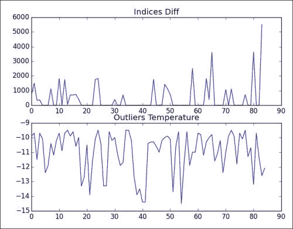

# 第 4 章。使用 NumPy 进行简单的预测分析

在上一章探索了气象数据之后，我们现在将尝试预测温度。 通常，天气预测是通过复杂的模型和顶级的超级计算机来完成的。 大多数人无法访问这些资源，因此我们会偷工减料并使用更简单的模型。 本章涵盖的主题列表如下：

*   自相关
*   自回归模型
*   可靠的统计

# 检查平均温度与大熊猫的自相关

**大熊猫** （ **Python 数据分析** ）库只是 NumPy，Matplotlib， 和其他 Python 库。 您可以在熊猫网站上的 [http://pandas.pydata.org/pandas-docs/stable/install.html](http://pandas.pydata.org/pandas-docs/stable/install.html) 上找到更多信息，包括安装说明。 大多数良好的 API（例如 NumPy）似乎都遵循 Unix 的哲学-保持简单并做一件事。 这种理念产生了许多小型工具和实用程序，这些实用程序可以用作更大对象的构建块。 熊猫库在其方法中模仿 R 编程语言。

pandas 库具有绘图子例程，可以绘制滞后图和自相关图。 自相关是数据集中的相关性，可以指示趋势。 例如，如果我们有一天的延迟，我们可以查看昨天的平均温度是否会影响今天的温度。 对于这种情况，自相关值需要相对较高。

熊猫也可以用于重新采样数据。 现在让我们学习如何对 De Bilt 数据的每日平均温度进行重新采样以得出年度平均值。

在以下代码段中，`pd`是指导入的熊猫模块。 我们将跳过数据的导入和加载（有关更多详细信息，请参见本书代码包的`Chapter04`文件夹中的`pandas_plots.py`文件）。 现在，让我们借助以下步骤来绘制滞后数据：

1.  从日期列表中创建`DatetimeIndex`对象：

    ```py
    dtidx = pd.DatetimeIndex([dt.fromordinal(int(date)) for date in dates])
    ```

2.  创建一个熊猫`Series`数组，这是一个时间序列数组。 由于文件中记录温度的方式，我们必须将温度乘以 0.1：

    ```py
    data = pd.Series(avg_temp * .1, index=dtidx)
    ```

3.  Graph the lag plot as follows:

    ```py
    lag_plot(data)
    ```

    获得以下滞后图，其中将时间序列中的下一个值`y(t+1)`相对于前一个值`y(t)`进行了绘制：

    

4.  Plot the autocorrelation as follows:

    ```py
    autocorrelation_plot(data)
    ```

    这可能会导致以下图表：

    

    如您所见，自相关下降的延迟更大。 这一点很重要，以后需要记住。

5.  Resample to annual (denoted by `'A'`) averages, and plot the resampled data as follows:

    ```py
    resampled = data.resample('A')
    resampled.plot()
    ```

    重新采样的图显示如下，其中年份与平均温度相对应：

    

您可能会注意到，我们在上一章中使用纯 NumPy 进行了相同的重采样，这还需要更多工作。

# 用 pandas DataFrames 描述数据

幸运的是，熊猫具有描述性的统计实用程序。 我们将从 KNMI De Bilt 数据文件中读取平均风速，温度和压力值到熊猫 DataFrame 中。 该对象类似于 R 数据框，它类似于电子表格或数据库中的数据表。 列被标记，可以为数据建立索引，并且您可以对数据进行计算。 然后，我们将打印出描述性统计数据和相关矩阵，如以下步骤所示：

1.  使用熊猫`read_csv`功能读取 CSV 文件。 此函数的工作方式类似于 NumPy `load_txt`函数：

    ```py
    to_float = lambda x: .1 * float(x.strip() or np.nan)
    to_date = lambda x: dt.strptime(x, "%Y%m%d")
    cols = [4, 11, 25]
    conv_dict = dict( (col, to_float) for col in cols) 

    conv_dict[1] = to_date
    cols.append(1)

    headers = ['dates', 'avg_ws', 'avg_temp', 'avg_pres']
    df = pd.read_csv(sys.argv[1], usecols=cols, names=headers, index_col=[0], converters=conv_dict)
    ```

2.  Print the descriptive statistics with the functions described in the following table:

    <colgroup class="calibre19"><col class="calibre20"> <col class="calibre20"></colgroup> 
    | 

    功能

     | 

    描述

     |
    | --- | --- |
    | `head` | 这类似于`head` Unix 命令，并选择`DataFrame`的第一条记录。 |
    | `tail` | 这类似于`tail` Unix 命令，并选择`DataFrame`的最后一条记录 |
    | `describe` | 这将计算一些预定义的描述性统计信息 |
    | `corr` | 计算相关矩阵 |

    代码如下：

    ```py
    print df.head()
    print

    print df.tail()
    print

    print df.describe()
    print

    print df.corr()
    ```

    输出如下：

    

# 将天气和种群与大熊猫相关联

我们将尝试将荷兰的股票市场数据与我们上一次根据 KNMI De Bilt 气象数据生成的数据框进行关联。 作为股票市场的代理，我们将使用 EWN ETF 的收盘价。 顺便说一句，这可能不是最佳选择，因此，如果您有更好的主意，请使用适当的股票报价器。 此练习的步骤如下：

1.  从 Yahoo Finance 下载具有特殊功能的 EWN 数据。 代码如下：

    ```py
    #EWN start Mar 22, 1996
    start = dt(1996, 3, 22)
    end = dt(2013, 5, 4)

    symbol = "EWN"
    quotes = finance.quotes_historical_yahoo(symbol, start, end, asobject=True)
    ```

2.  使用下载的数据中的可用日期创建一个`DataFrame`对象：

    ```py
    df2 = pd.DataFrame(quotes.close, index=dt_idx, columns=[symbol])
    ```

3.  Join the new `DataFrame` object with `DataFrame` of the weather data. We will then obtain the correlation matrix:

    ```py
    df3 = df.join(df2)

    print df3.corr()
    ```

    相关矩阵如下：

    

如您所见，股价与天气参数之间的相关性非常弱。

# 预测温度

温度是热力学变量，量化为热还是冷。 为了预测温度，我们可以运用热力学和气象学的知识。 通常，这将导致创建具有大量输入的复杂天气模型。 但是，这超出了本书的范围，因此我们将尝试使我们继续的示例保持简单和可管理。

## 滞后 1 的自回归模型

明天的温度是多少？ 可能与今天相同，但有所不同。 我们可以假设温度是前一天温度的函数。 这可以通过我们之前创建的自相关图来证明。 为简单起见，我们将进一步假设该函数是多项式。 我们将定义一个用于拟合的截止点。 应将 90％的数据用于此目的。 让我们用 NumPy 为这个想法建模：

1.  使用`polyfit`函数将数据拟合为不同次数的多项式，如以下代码行所示：

    ```py
    poly = np.polyfit( avg_temp[: cutoff - 1], avg_temp[1 : cutoff], degree)
    ```

2.  根据上一步获得的多项式计算值。 在这里，我们使用剩余的 10％的数据。 代码如下：

    ```py
    fit = np.polyval(poly, avg_temp[cutoff:-1])
    ```

3.  计算实际温度和预测温度之间的绝对差：

    ```py
    delta = np.abs(avg_temp[cutoff + 1:] - fit)
    ```

4.  For each polynomial fit, the calculated percentage of deltas is within 1, 2, or 3 degrees Celsius error range, as shown in the following screenshot:

    

如您所见，高阶多项式的精度几乎与一阶多项式相同。

## 滞后 2 的自回归模型

从理论上回顾两天，可以使我们的模型更准确。 但是，由于与滞后 2 相关的自相关不是那么强，因此无法保证。 在 NumPy 中，我们有几种方法来建立模型。 在这里，我选择使用`lstsq`功能来执行此操作。 我们对滞后 1 和滞后 2 分量假定某种线性组合，然后应用线性回归。 该方法可以延长较长的回溯期，但现在暂时可以滞后 2。 此练习的步骤如下：

1.  设置一个矩阵`A`，并在其中输入滞后 2 和 1 直到截止点的值。 代码如下：

    ```py
    A = np.zeros((2, cutoff - 2), float)

    A[0, ] = temp[:cutoff - 2]
    A[1, ] = temp[1 :cutoff - 1]
    ```

2.  使用我们要适合的值创建向量`b`：

    ```py
    b = temp[2 : cutoff]
    ```

3.  Solve the equation *Ax = b*. The code is as follows:

    ```py
    (x, residuals, rank, s) = np.linalg.lstsq(A.T, b)
    print x
    ```

    滞后 1 和滞后 2 的系数打印如下：

    ```py
    [-0.08293789  1.06517683]
    ```

4.  预测高于临界点的值：

    ```py
    fit = x[0] * temp[cutoff-1:-2] + x[1] * temp[cutoff:-1]
    ```

5.  计算绝对误差：

    ```py
    delta = np.abs(temp[cutoff + 1:] - fit)
    ```

6.  Plot a histogram of the absolute errors:

    ```py
    plt.hist(delta, bins = 10, normed=True)
    ```

    绝对误差的直方图如下所示（请参考本书代码捆绑`Chapter04`文件夹中的`lag2.py`文件）：

    

# 分析年内每日平均温度

我们将通过将日期转换为数字来表示年的对应天，从而来查看一年内的温度变化。 此数字介于 1 和 366 之间，其中 1 对应于 1 月 1 日，而 365（或 366）对应于 12 月 31 日。 执行以下步骤来分析年内日平均温度：

1.  初始化范围为 1-366 的数组，将平均值初始化为`zeros`：

    ```py
    rng = np.arange(1, 366)
    avgs = np.zeros(365)
    avgs2 = np.zeros(365)
    ```

2.  在截止点之前和之后的一年中的一天之前计算平均值：

    ```py
    for i in rng: 
       indices = np.where(days[:cutoff] == i)
       avgs[i-1] = temp[indices].mean()
       indices = np.where(days[cutoff+1:] == i)
       avgs2[i-1] = temp[indices].mean()
    ```

3.  Fit the averages before the cutoff point to a quadratic polynomial (just a first-order approximation):

    ```py
    poly = np.polyfit(rng, avgs, 2)
    print poly
    ```

    打印以下幂次幂的多项式系数：

    ```py
    [ -4.91329859e-04   1.92787493e-01  -3.98075418e+00]

    ```

4.  Plot the average after the cutoff point, and display a fit using the polynomial we obtained:

    ```py
    plt.plot(avgs2)
    plt.plot(np.polyval(poly, rng))
    plt.show()
    ```

    正如您在下图中所看到的，拟合度很好，但并不完美。 正如您在夏天前后所观察到的那样，在年中，我们的气温最高。 一月和十二月，温度达到最低点。

    

# 引入年度温度模型

继续与我们在上一个示例中所做的工作一起，我想提出一个新模型，其中温度是一年中某一天（介于 1 和 366 之间）的的函数。 当然，该模型并不完整，但是可以用作更高级模型的组成部分，该模型应考虑我们对滞后 2 所做的先前自回归模型。该模型的过程如下所示：

1.  Fit the temperature data before the cutoff point to a quadratic polynomial just as in the previous section but without averaging:

    ```py
    poly = np.polyfit(days[:cutoff], temp[:cutoff], 2)
    print poly
    ```

    信不信由你，我们得到了与之前相同的多项式系数：

    ```py
    [ -4.91072584e-04   1.92682505e-01  -3.97182941e+00]

    ```

2.  计算预测值与实际值之间的绝对差：

    ```py
    delta = np.abs(np.polyval(poly, days[cutoff:]) - temp[cutoff:])
    ```

3.  Plot a histogram of the absolute error:

    ```py
    plt.hist(delta, bins = 10, normed = True)
    plt.show()
    ```

    请参考下图。 似乎我们用自回归模型得到了更好的结果。

    

# 使用 SciPy Minimumsq 函数建模温度

因此，现在我们有两个想法：或者今天的温度取决于昨天和前天的温度，并且我们假设某种线性组合形成了，或者温度取决于一个 一年中的一天（介于 1 到 366 之间）。 我们可以结合这些想法，但是问题是如何实现的。 看来我们可以有一个乘法模型或一个加法模型。

让我们选择加性模型，因为它看起来更简单。 这意味着我们假设温度是自回归成分和循环成分的总和。 将其写成一个方程式很容易。 我们将使用 SciPy `leastsq`函数来最小化此方程式误差的平方。 该模型的过程如下所示：

1.  定义一个计算模型误差的函数。 代码如下：

    ```py
    def error(p, d, t, lag2, lag1):
       l2, l1, d2, d1, d0 = p

       return t - l2 * lag2 + l1 * lag1 + d2 * d ** 2 + d1 * d + d0
    ```

2.  Give an initial guess for all the parameters in our equation:

    ```py
    p0 = [-0.08293789,  1.06517683, -4.91072584e-04,   1.92682505e-01,  -3.97182941e+00]
    ```

    这里的值来自以前的程序，但是原则上您可以使用其他值，只要解决方案收敛得足够快即可。

3.  如以下代码行所示，应用`leastsq`函数：

    ```py
    params = leastsq(error, p0, args=(days[2:cutoff], temp[2:cutoff], temp[:cutoff - 2], temp[1 :cutoff - 1]))[0]
    print params
    ```

4.  模型的最终参数如下打印。 看起来除第一个参数外的所有参数的绝对大小都已减小。 我不知道这是否是偶然的，但据我所知，参数的顺序无关紧要。

    ```py
    [ -1.52297691e-01  -9.89195783e-01   8.20879954e-05  -3.16870659e-02    6.06397834e-01]

    ```

5.  We then calculate the absolute error for the model applied above the cutoff point and plot the histogram of the error. The code is omitted here for the sake of brevity.

    请参考下图。 该模型的准确性似乎并不比具有滞后 2 的简单自回归模型更好。

    

# 一年中的温度需要两个

可以提高和逐年温度拟合的二次多项式近似。 到目前为止，我们尚未使用任何 NumPy 三角函数。 这些应该很适合这个问题。 因此，让我们尝试使用三角函数并再次使用`scipy.optimize`模块（准确地说是`leastsq`）中的函数进行拟合，如下所示：

1.  设置一个简单的`model`函数和一个要最小化的`error`函数，如以下代码片段所示：

    ```py
    def model(p, d):
       a, b, w, c = p
       return a + b * np.cos(w * d + c)

    def error(p, d, t):
       return t - model(p, d)
    ```

2.  Give the initial guess and fit the data:

    ```py
    p0 = [.1, 1, .01, .01]
    params = leastsq(error, p0, args=(days, temp))[0]
    print params
    ```

    我们得到以下参数：

    ```py
    [ 9.6848106  -7.59870042 -0.01766333 -5.83349705]

    ```

### 注意

此处，在 365 上的-2 *pi* 等于第三参数。 我相信第一个参数等于所有温度的平均值，我们可以对其他参数得出类似的解释。 计算一年中每一天的平均值，并绘制平均值和拟合值。 我们之前已经做过，因此省略了这部分代码。

我们在下图中得到拟合：



# 滞后 1 的移动平均温度模型

时间序列的移动平均模型将数据表示为围绕数据均值的振荡。 假定滞后分量是白噪声（据我所知，这不是一个政治上不正确的术语），它形成线性组合。 我们将再次使用`leastsq`函数来拟合模型：

1.  我们将从一个简单的移动平均模型开始。 它只有一个滞后分量，因此只有一个系数。 代码段如下：

    ```py
    def model(p, ma1):
       return p * ma1
    ```

2.  Call the `leastsq` function. Here, we subtract the mean from the data:

    ```py
    params = leastsq(error, p0, args=(temp[1:cutoff] - mu, temp[:cutoff-1] - mu))[0]
    print params
    ```

    程序打印以下参数：

    ```py
    [ 0.94809073]

    ```

    我们得到以下绝对误差直方图图，该图可与自回归模型结果进行比较：

    

# 自回归移动平均温度模型

**自回归移动平均值** （ **ARMA** ）模型混合了 **自回归** （ **AR** ）和 **移动平均线** （ **MA** ） 楷模。 我们已经讨论了这两种模型。 非正式地说，我们可以说自回归分量周围带有白噪声。 可以将这种白噪声的一部分建模为滞后分量加上一些常数的线性组合，如下所示：

1.  使用我们从上一个脚本

    ```py
    def ar(a):
       ar_p = [1.06517683, -0.08293789]

       return ar_p[0] * a[1:-1] + ar_p[1] * a[:-2]
    ```

    获得的线性系数定义滞后 2 的自回归模型
2.  定义滞后 1 的移动平均模型：

    ```py
    def model(p, ma1):
       c0, c1 = p

       return c0 + c1 * ma1
    ```

3.  Subtract the autoregressive model values from the data, giving us the error terms (white noise):

    ```py
    err_terms = temp[cutoff+1:] - ar(temp[cutoff-1:])
    ```

    该模型的大多数代码对您来说应该看起来很熟悉，如以下代码所示：

    ```py
    import sys
    import numpy as np
    import matplotlib.pyplot as plt
    from datetime import datetime as dt
    from scipy.optimize import leastsq

    temp = .1 * np.loadtxt(sys.argv[1], delimiter=',', usecols=(11,), unpack=True)
    cutoff = 0.9 * len(temp)

    def model(p, ma1):
       c0, c1 = p

       return c0 + c1 * ma1

    def error(p, t, ma1):
       return t - model(p, ma1)

    p0 = [.1, .1]

    def ar(a):
       ar_p = [1.06517683, -0.08293789]

       return ar_p[0] * a[1:-1] + ar_p[1] * a[:-2]

    err_terms = temp[2:cutoff] - ar(temp[:cutoff])
    params = leastsq(error, p0, args=(err_terms[1:], err_terms[:-1]))[0]
    print params

    err_terms = temp[cutoff+1:] - ar(temp[cutoff-1:])
    delta = np.abs(error(params, err_terms[1:], err_terms[:-1]))
    print "% delta less than 2", (100\. * len(delta[delta <= 2]))/len(delta)

    plt.hist(delta, bins = 10, normed = True)
    plt.show()
    ```

    脚本的输出如下：

    ```py
    [ 0.16506278  0.01041355] 
    % delta less than 2 69.7169350903

    ```

# 时变温度均值调整的自回归模型

这是一个大嘴巴，但听起来并不像那样复杂。 让我们在以下几点分析标题：

*   我们发现，一年中每一天的平均温度似乎都符合一年的周期。 这可能与地球绕太阳旋转有关。
*   似乎有温度升高的趋势。 有人称其为全球变暖和怪罪行业以及人类。 在不进行政治讨论的情况下，我们假定此主张中存在真理。 此外，让我们现在假设这种趋势取决于年份。 我知道我会为此感到麻烦，但现在我们也假设该关系基于一次多项式（一条直线）。
*   为了争辩，让我们声明前两点共同构成一个时间相关的均值。 我们将剩余的东西建模为自回归滞后分量的线性组合。

我们需要执行以下步骤来建立和创建模型：

1.  为年份，年份和温度创建数组。
2.  平均一年中每一天的温度。
3.  从上一步中的值中减去当日平均值。
4.  将余数拟合为一条直线，然后从余数中减去拟合值。
5.  Do a least squares fit to an autoregressive model with lag 2.

    根据该模型预测温度并绘制绝对误差图。

该代码很简单，给出如下：

```py
import sys
import numpy as np
import matplotlib.pyplot as plt
from datetime import datetime as dt
from scipy.optimize import leastsq

to_ordinal = lambda x: dt.strptime(x, "%Y%m%d").toordinal()
ordinals, temp = np.loadtxt(sys.argv[1], delimiter=',', usecols=(1, 11), unpack=True, converters={1: to_ordinal})
days = np.array([dt.fromordinal(int(d)).timetuple().tm_yday for d in ordinals])
years = np.array([dt.fromordinal(int(d)).year for d in ordinals])
temp = .1 * temp
cutoff = 0.9 * len(temp)

avgs = np.zeros(366)

for i in xrange(1, 366):
   indices = np.where(days[:cutoff] == i)
   avgs[i-1] = temp[indices].mean()

def subtract_avgs(a, doy):
   return a - avgs[doy.astype(int)-1]

def subtract_trend(a, poly, b):
   return a - poly[0] * b - poly[1]

def print_stats(a):
   print "Min", a.min(), "Max", a.max(), "Mean", a.mean(), "Std", a.std()
   print

# Step 1\. DOY avgs
less_avgs = subtract_avgs(temp[:cutoff], days[:cutoff])
print "After Subtracting DOY avgs"
print_stats(less_avgs)

# Step 2\. Linear trend
trend = np.polyfit(years[:cutoff], less_avgs, 1)
print "Trend coeff", trend
less_trend = subtract_trend(less_avgs, trend, years[:cutoff])
print "After Subtracting Linear Trend"
print_stats(less_trend)

def model(p, lag2, lag1):
   l1, l2 = p

   return l2 * lag2 + l1 * lag1

def error(p, t, lag2, lag1):
   return t - model(p, lag2, lag1) 

p0 = [1.06517683, -0.08293789]
params = leastsq(error, p0, args=(less_trend[2:], less_trend[:-2], less_trend[1:-1]))[0]
print "AR params", params

#Step 1\. again
less_avgs = subtract_avgs(temp[cutoff+1:], days[cutoff+1:])

#Step 2\. again
less_trend = subtract_trend(less_avgs, trend, years[cutoff+1:])

delta = np.abs(error(params, less_trend[2:], less_trend[:-2], less_trend[1:-1]))
print "% delta less than 2", (100\. * len(delta[delta <= 2]))/len(delta)

plt.hist(delta, bins = 10, normed = True)
plt.show()
```

打印以下输出：


# De Bilt 平均温度的异常值分析

离群值是数据集中的值，被认为是极值。 离群值可能是由测量或其他类型的错误引起的，也可能是由自然现象引起的。 离群值有几种定义。 在此示例中，我们将使用使用轻微异常值的定义。 此定义取决于第一和第三四分位数的位置。 数据集中项目的四分之一和四分之三分别小于第一和第三四分位数的值。 这些特定四分位数之间的差异称为 **四分位数间距** 。 这是一种类似于标准偏差的强大色散测量方法。 轻度离群值的定义是与第一个或第三个四分位数相差 1.5 个四分位数。 我们可以如下研究温度异常值：

1.  使用 SciPy 的函数查找第一个四分位数：

    ```py
    q1 = scoreatpercentile(temp, 25)
    ```

2.  找到第三个四分位数：

    ```py
    q3 = scoreatpercentile(temp, 75)
    ```

3.  查找温和异常值的指数：

    ```py
    indices = np.where(temp < (q1 - N * irq))
    ```

4.  绘制索引（显示聚类）和离群值的差异：

    ```py
    plt.subplot(211)
    plt.plot(np.diff(indices)[0])
    plt.title('Indices Diff')
    plt.subplot(212)
    plt.title('Outliers Temperature')
    plt.plot(outliers)
    plt.show()
    ```

以下 NumPy 代码分析异常值，并尝试找出是否发生异常值的聚类：

```py
import sys
import numpy as np
import matplotlib.pyplot as plt
from scipy.stats import scoreatpercentile
from datetime import datetime as dt

to_ordinal = lambda x: dt.strptime(x, "%Y%m%d").toordinal()
ordinals, temp = np.loadtxt(sys.argv[1], delimiter=',', usecols=(1, 11), unpack=True, converters={1: to_ordinal})
temp = .1 * temp
q1 = scoreatpercentile(temp, 25)
print "1st Quartile", q1
q3 = scoreatpercentile(temp, 75)
print "3rd Quartile", q3
irq = q3 - q1
print "Std", temp.std(), "IRQ", irq
N = 1.5 
print len(temp[temp > (q3 + N * irq)])
indices = np.where(temp < (q1 - N * irq))

outliers =  temp[indices]
print "#Outliers", len(outliers)
plt.subplot(211)
plt.plot(np.diff(indices)[0])
plt.title('Indices Diff')
plt.subplot(212)
plt.title('Outliers Temperature')
plt.plot(outliers)
plt.show()
```

显然，离群值位于较冷的一侧，如以下输出所示：


下图显示了一些聚类，但据我所知没有规则的模式：



# 使用更强大的统计信息

我们可以通过执行以下操作，使 *的 c 节点更可靠：时间相关的温度均值调整的自回归模型* 部分：

*   计算中位数而不是平均值

    ```py
    avgs[i-1] = np.median(temp[indices])
    ```

*   忽略带遮罩数组的异常值

    ```py
    temp[:cutoff] = ma.masked_array(temp[:cutoff], temp[:cutoff] < (q1 - 1.5 * irq))
    ```

使用修改后的代码，我们得到的输出会略有不同，预测值的大约 70％的绝对误差小于 2 摄氏度：

```py
AR params [ 0.95095073 -0.17373633]
% delta less than 2 70.8567244325

```

# 摘要

在本章中，我们学习了几种简单的温度预测技术。 当然，他们还不具备可以使用超级计算机并可以应用复杂方程式的气象学家水平。 但是我们的简单方法确实取得了很大的进步。

在下一章中，我们将切换到不同的数据集。 下一章将重点介绍信号处理技术。