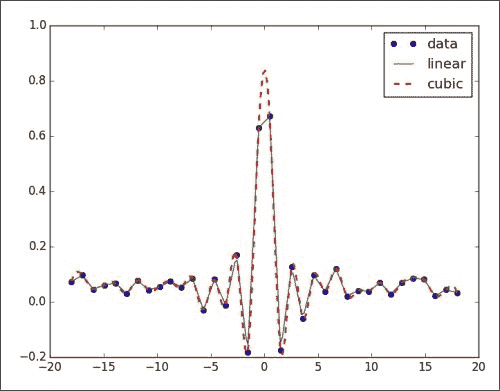
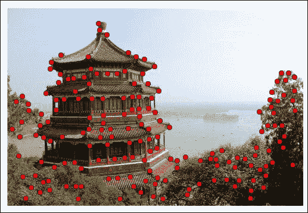

# 第 7 章.Python 科学生态系统

SciPy 是在 NumPy 之上构建的。 它增加了功能，例如数值积分，优化，统计和特殊功能。 从历史上看，NumPy 是 SciPy 的一部分，但后来被分离以供其他 Python 库使用。 当这些结合在一起时，就定义了用于科学和数值分析的通用堆栈。 当然，堆栈本身并不是固定的。 但是，每个人都同意 NumPy 是一切的中心。 本章中的示例应使您对科学 Python 生态系统的功能有所了解。

在本章中，我们将介绍以下主题：

*   数值积分
*   插补
*   将 Cython 与 NumPy 结合使用
*   使用 scikit-learn 进行聚类
*   检测角落
*   比较 NumPy 与 Blaze

# 数值积分

数值积分是使用数值方法而不是分析方法的积分。 SciPy 具有数值集成软件包`scipy.integrate`，在 NumPy 中没有等效的软件包。 `quad`函数可以在两个点之间集成一个变量函数。 这些点可以是无穷大。

### 注意

`quad`函数在引擎盖下使用了久经考验的 QUADPACK Fortran 库。

高斯积分与`error`函数相关，但没有限制。 它评估为 *pi* 的平方根。 让我们用`quad`函数计算高斯积分，如以下代码行所示：

```py
print "Gaussian integral", np.sqrt(np.pi),integrate.quad(lambda x: np.exp(-x**2), -np.inf, np.inf)
```

返回值是结果，其错误将是：

```py
Gaussian integral 1.77245385091 (1.7724538509055159, 1.4202636780944923e-08)

```

# 插值

插值根据观察结果预测范围内的值。 例如，我们可以在两个变量`x`和`y`之间建立关系，并且有一组观察到的`x`-`y`对。 在这种情况下，我们可以尝试在给定`x`值范围内的情况下预测`y`值。 该范围将从已经观察到的最低`x`值开始，到已经观察到的最高`x`值结束。 `scipy.interpolate`函数根据实验数据对函数进行插值。 `interp1d`类可以创建线性或三次插值函数。 默认情况下，会构造线性插值函数，但是如果设置了`kind`参数，则会创建三次插值函数。 `interp2d`类的工作方式相同，但是是二维的。

我们将使用`sinc`函数创建数据点，然后向其中添加一些随机噪声。 之后，我们将进行线性和三次插值并绘制结果，如下所示：

1.  创建数据点并添加噪声，如下所示：

    ```py
    x = np.linspace(-18, 18, 36)
    noise = 0.1 * np.random.random(len(x))
    signal = np.sinc(x) + noise
    ```

2.  创建一个线性插值函数，然后将其应用于具有五倍数据点的输入数组：

    ```py
    interpolated = interpolate.interp1d(x, signal)
    x2 = np.linspace(-18, 18, 180)
    y = interpolated(x2)
    ```

3.  执行与上一步相同的操作，但使用三次插值：

    ```py
    cubic = interpolate.interp1d(x, signal, kind="cubic")
    y2 = cubic(x2)
    ```

4.  Plot the results with Matplotlib as follows:

    ```py
    plt.plot(x, signal, 'o', label="data")
    plt.plot(x2, y, '-', label="linear")
    plt.plot(x2, y2, '--', lw=2, label="cubic")

    plt.legend()
    plt.show()
    ```

    下图是数据，线性和三次插值的图形：

    

我们通过`sinc`函数创建了一个数据集，并添加了噪声。 然后，我们使用`scipy.interpolate`模块的`interp1d`类进行了线性和三次插值（请参见本书代码捆绑包`Chapter07`文件夹中的`sincinterp.py`文件）：

```py
import numpy as np
from scipy import interpolate
import matplotlib.pyplot as plt

x = np.linspace(-18, 18, 36)
noise = 0.1 * np.random.random(len(x))
signal = np.sinc(x) + noise

interpolated = interpolate.interp1d(x, signal)
x2 = np.linspace(-18, 18, 180)
y = interpolated(x2)

cubic = interpolate.interp1d(x, signal, kind="cubic")
y2 = cubic(x2)

plt.plot(x, signal, 'o', label="data")
plt.plot(x2, y, '-', label="linear")
plt.plot(x2, y2, '--', lw=2, label="cubic")

plt.legend()
plt.show()
```

# 将 Cython 与 NumPy 结合使用

Cython 是，是一种相对较年轻的基于 Python 的编程语言。 不同之处在于，使用 Python，我们可以选择为代码中的变量声明静态类型。 Cython 是一种生成 CPython 扩展模块的编译语言。 除了提供性能增强外，Cython 的主要用途是将现有的 C / C ++软件与 Python 接口。

我们可以像整合 Cython 和 Python 代码一样，整合 Cython 和 NumPy 代码。 让我们看一个示例，该示例分析股票的上涨天数（接近前一天）的比率。 我们将对二项式比例置信度应用公式（ [http://en.wikipedia.org/wiki/Binomial_proportion_confidence_interval](http://en.wikipedia.org/wiki/Binomial_proportion_confidence_interval) ）。 这表明该比率有多重要。

1.  Write a `.pyx` file.

    `.pyx`文件包含 Cython 代码。 基本上，Cython 代码是标准 Python 代码，并为变量添加了可选的静态类型声明。 让我们编写一个`.pyx`文件，其中包含一个函数，该函数计算上升天数的比率及其相关的置信度。 首先，该函数计算价格之间的差异。 然后，我们计算正差的数量，从而得出上升天数的比率。 最后，我们在引言中的 Wikipedia 页面上应用公式来增强置信度，如下所示。

    ```py
    import numpy

    def pos_confidence(numbers):
       diffs = numpy.diff(numbers)
       n = float(len(diffs))
       p = len(diffs[diffs > 0])/n
       confidence = numpy.sqrt(p * (1 - p)/ n)

       return (p, confidence)
    ```

2.  Write the `setup.py` file.

    我们将使用以下`setup.py`文件：

    ```py
    from distutils.core import setup
    from distutils.extension import Extension
    from Cython.Distutils import build_ext

    ext_modules = [Extension("binomial_proportion", ["binomial_proportion.pyx"])]

    setup(
            name = 'Binomial proportion app',
            cmdclass = {'build_ext': build_ext},
            ext_modules = ext_modules
         )
    ```

3.  Now, use the Cython module.

    我们可以使用以下命令进行构建：

    ```py
    python setup.py build_ext --inplace

    ```

    构建完成后，我们可以通过导入使用上一步中的 Cython 模块。 我们将编写一个 Python 程序，使用 Matplotlib 下载股价数据。 然后，我们将置信函数应用于收盘价。

    ```py
    from matplotlib.finance import quotes_historical_yahoo
    from datetime import date
    import numpy
    import sys
    from binomial_proportion import pos_confidence

    #1\. Get close prices.
    today = date.today()
    start = (today.year - 1, today.month, today.day)

    quotes = quotes_historical_yahoo(sys.argv[1], start, today)
    close =  numpy.array([q[4] for q in quotes])
    print pos_confidence(close)
    ```

    AAPL 程序的输出如下：

    ```py
    (0.56746031746031744, 0.031209043355655924)

    ```

# 使用 scikit-learn 聚类股票

Scikit-learn 是用于机器学习的开源软件。 聚类是类型的机器学习算法，旨在基于相似度对项目进行分组。

### 注意

存在大量的锡克奇人。 这些都是开源的科学 Python 项目。 有关 scikits 的列表，请参考 [https://scikits.appspot.com/scikits](https://scikits.appspot.com/scikits) 。

群集是不受监督的，这意味着您不必创建学习示例。 该算法根据某种距离度量将项目放入适当的存储桶中，以便彼此靠近的项目最终位于同一存储桶中。 在此示例中，我们将使用**道琼斯工业**（**DJI**）指数中的股票对数收益 。

### 注意

存在无数的聚类算法，并且由于这是一个快速发展的领域，因此每年都会发明新的算法。 由于本书的紧急性，我们无法一一列举。 有兴趣的读者可以看看 [https://en.wikipedia.org/wiki/Cluster_analysis](https://en.wikipedia.org/wiki/Cluster_analysis) 。

首先，我们将从 Yahoo Finance 下载这些股票的 EOD 价格数据。 其次，我们将计算平方亲和矩阵。 最后，我们将股票分类为`AffinityPropagation`。 与其他聚类算法相比，亲和力传播不需要聚类数作为参数。 该算法依赖于所谓的亲和力矩阵。 这是一个包含数据点亲和力的矩阵，可以将其解释为距离。

1.  我们将使用 DJI Index 的股票代码下载 2013 年的价格数据。 在此示例中，我们仅对收盘价感兴趣。 代码如下：

    ```py
    # 2012 to 2013
    start = datetime.datetime(2012, 01, 01)
    end = datetime.datetime(2013, 01, 01)

    #Dow Jones symbols
    symbols = ["AA", "AXP", "BA", "BAC", "CAT", "CSCO", "CVX", "DD", "DIS", "GE", "HD", "HPQ", "IBM", "INTC", "JNJ", "JPM", "KO", "MCD", "MMM", "MRK", "MSFT", "PFE", "PG", "T", "TRV", "UTX", "VZ", "WMT", "XOM"]

    for symbol in symbols:
          try :
             quotes.append(finance.quotes_historical_yahoo_ochl(symbol, start, end, asobject=True))
          except urllib2.HTTPError:
             print symbol, "not found"

    close = np.array([q.close for q in quotes]).astype(np.float)
    ```

2.  使用对数收益率作为指标来计算不同股票之间的相似性。 代码如下：

    ```py
    logreturns = np.diff(np.log(close))
    print logreturns.shape

    logreturns_norms = np.sum(logreturns ** 2, axis=1)
    S = - logreturns_norms[:, np.newaxis] - logreturns_norms[np.newaxis, :] + 2 * np.dot(logreturns, logreturns.T)
    ```

3.  给`AffinityPropagation`类上一步的结果。 此类使用适当的群集编号标记数据点或本例中的库存。 代码如下：

    ```py
    aff_pro = sklearn.cluster.AffinityPropagation().fit(S)
    labels = aff_pro.labels_

    for i in xrange(len(labels)):
        print '%s in Cluster %d' % (symbols[i], labels[i])
    ```

以下是完整的群集程序：

```py
import datetime
import numpy as np
import sklearn.cluster
from matplotlib import finance
import urllib2

#1\. Download price data

# 2012 to 2013
start = datetime.datetime(2012, 01, 01)
end = datetime.datetime(2013, 01, 01)

#Dow Jones symbols
symbols = ["AA", "AXP", "BA", "BAC", "CAT", "CSCO", "CVX", "DD", "DIS", "GE", "HD", "HPQ", "IBM", "INTC", "JNJ", "JPM", "KO", "MCD", "MMM", "MRK", "MSFT", "PFE", "PG", "T", "TRV", "UTX", "VZ", "WMT", "XOM"]

quotes = []
```

对于符号内的符号，代码如下：

```py
      try :       
  quotes.append(finance.quotes_historical_yahoo_ochl(symbol, start, end, asobject=True))
      except urllib2.HTTPError:
         print symbol, "not found"

close = np.array([q.close for q in quotes]).astype(np.float)
print close.shape

#2\. Calculate affinity matrix
logreturns = np.diff(np.log(close))
print logreturns.shape

logreturns_norms = np.sum(logreturns ** 2, axis=1)
S = - logreturns_norms[:, np.newaxis] - logreturns_norms[np.newaxis, :] + 2 * np.dot(logreturns, logreturns.T)

#3\. Cluster using affinity propagation
aff_pro = sklearn.cluster.AffinityPropagation().fit(S)
labels = aff_pro.labels_

for i in xrange(len(labels)):
    print '%s in Cluster %d' % (symbols[i], labels[i])
```

每个股票的集群编号输出如下：

```py
AA in Cluster 2
AXP in Cluster 0
BA in Cluster 0
BAC in Cluster 1
CAT in Cluster 2
CSCO in Cluster 3
CVX in Cluster 8
DD in Cluster 0
DIS in Cluster 6
GE in Cluster 8
HD in Cluster 0
HPQ in Cluster 4
IBM in Cluster 0
INTC in Cluster 0
JNJ in Cluster 6
JPM in Cluster 5
KO in Cluster 6
MCD in Cluster 6
MMM in Cluster 8
MRK in Cluster 6
MSFT in Cluster 0
PFE in Cluster 6
PG in Cluster 6
T in Cluster 6
TRV in Cluster 6
UTX in Cluster 0
VZ in Cluster 6
WMT in Cluster 7
XOM in Cluster 8

```

# 检测角

角点检测是计算机视觉中的标准技术。 Scikits-image（专门用于图像处理的软件包）提供了 Harris 拐角检测器，由于拐角检测非常复杂，因此该功能非常好。 显然，我们可以从头开始做，但是这违反了不重新发明轮子的基本原则。 我们将从 scikits-learn 加载示例图像。 对于此示例，这不是绝对必要的。 您可以改用其他任何图像。

### 注意

有关转角检测的更多信息，请参考 [https://en.wikipedia.org/wiki/Corner_detection](https://en.wikipedia.org/wiki/Corner_detection) 。

您可能需要在系统上安装 jpeglib 才能加载 scikits-learn 图像，该图像是 JPEG 文件。 如果您使用的是 Windows，请使用安装程序。 否则，下载发行版，解压缩，然后使用以下命令行从顶部文件夹中进行构建：

```py
./configure
 make
 sudo make install

```

要检测图像的角，请执行以下步骤：

1.  Load the sample image.

    Scikits-learn 当前在数据集结构中具有两个样本 JPEG 图像。 我们将仅看第一张图像，如下所示：

    ```py
    dataset = load_sample_images()
    img = dataset.images[0]
    ```

2.  Then, detect corners by calling the `harris` function to get the coordinates of corners:

    ```py
    harris_coords = harris(img)
    print "Harris coords shape", harris_coords.shape
    y, x = np.transpose(harris_coords)
    ```

    角点检测的代码如下：

    ```py
    from sklearn.datasets import load_sample_images
    from matplotlib.pyplot import imshow, show, axis, plot
    import numpy as np
    from skimage.feature import harris

    dataset = load_sample_images()
    img = dataset.images[0] 
    harris_coords = harris(img)
    print "Harris coords shape", harris_coords.shape
    y, x = np.transpose(harris_coords)
    axis('off')
    imshow(img)
    plot(x, y, 'ro')
    show()
    ```

    我们得到一个带有红点的图像，其中的角点检测如下：

    

# 比较 NumPy 与 Blaze

由于我们接近本书结尾，因此似乎很适合讨论 NumPy 的未来。 NumPy 的未来是 Blaze，这是新的开源 Python 数字库。 Blaze 应该比 NumPy 更好地处理大数据。 大数据可以通过多种方式定义。 在这里，我们将大数据定义为无法存储在内存中甚至无法在一台机器上的数据。 通常，数据分布在多个服务器之间。 Blaze 还应该能够处理从未存储的大量流数据。

### 注意

可以在 [http://blaze.pydata.org/](http://blaze.pydata.org/) 中找到。

就像 NumPy 一样，Blaze 允许科学家，分析师和工程师快速编写高效的代码。 但是，Blaze 更进一步，它还负责与分配计算以及从各种数据源类型提取和转换数据有关的工作。

Blaze 围绕一般的多维数组和表抽象。 Blaze 中的类表示现实世界中发现的不同数据类型和数据结构。 Blaze 具有通用的计算引擎，可以处理分布在多个服务器上的数据，并将指令发送到专用的低级内核。

Blaze 扩展了 NumPy，以提供自定义数据类型和异构形状。 当然，这允许更大的灵活性和易用性。

Blaze 是围绕阵列设计的。 就像 NumPy `ndarray`一样，Blaze 提供带有额外计算信息的元数据。 元数据定义数据的存储方式（异构），并以多维数组的形式进行索引。 可以在各种硬件上执行计算，包括 CPU 和 GPU 的异构集群。

Blaze 有志成为多个节点集群和分布式计算的 NumPy。 就像 NumPy 一样，其主要思想是着眼于数组和数组操作，同时将凌乱的细节抽象化。

### 注意

Blaze 具有特殊的 LLVM 编译器。 有关 LLVM 编译器的更多信息，请参见 [http://en.wikipedia.org/wiki/LLVM](http://en.wikipedia.org/wiki/LLVM) 。 简而言之，LLVM 是一个开源编译器技术项目。

可以使用 Blaze 数据适配器在不同格式之间转换数据。 Blaze 还管理计算的调度，该调度可以是自动的，也可以由用户配置的，可以延迟计算表达式。

# 摘要

在本章中，我们仅介绍了科学 Python 生态系统的可能性。 我们使用了一些库，即使不是通用堆栈的一部分，也至少是基础库。 我们使用了 SciPy 提供的插值和数值积分。 演示了 scikit-learn 中数十种算法中的两种。 我们还看到了 Cython 的实际应用，从技术上讲，它是一种编程语言。 最后，我们看了 Blaze，这是一个应该推广和扩展 NumPy 原理的库。 鉴于大数据和云计算等最新发展。 Blaze 和相关项目仍处于孵化阶段，但我们可以期望在不久的将来生产稳定的软件。 您可以参考其中一些项目的 [http://continuum.io/developer-resources](http://continuum.io/developer-resources) 。

不幸的是，我们到了本书的结尾。 由于本书的格式（即页数），您应该掌握 NumPy 的基本知识，并且可能会需要更多。 但是，请不要担心这还不够。 您可以期待同一作者的 *学习 Python 数据分析* ，该书将于 2015 年初发布。