# 五、使用 NumPy 对批发分销商的客户进行聚类

通过查看 NumPy 在各种使用案例中的使用，您肯定可以提高自己的技能。 本章介绍的分析类型与迄今为止所见不同。 聚类是一种无监督的学习技术，用于理解和捕获数据集中的各种形式。 由于您没有标签来监督您的学习算法，因此在很多情况下，可视化是关键，这就是为什么您也会看到各种可视化技术的原因。

在本章中，我们将介绍以下主题：

*   无监督学习和聚类
*   超参数
*   扩展简单算法以聚集批发分销商的客户

## 无监督学习和聚类

让我们用一个例子快速回顾一下监督学习。 在训练机器学习算法时，您可以通过提供标签来观察和指导学习。 考虑下面的数据集，其中每一行代表一个客户，每一列代表一个不同的特征，例如**年龄**，**性别**，**收入**，**职业** ，**任期**和**城市**。 看看这个表：

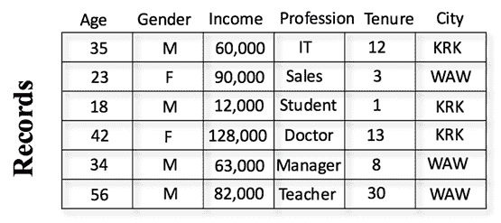

您可能需要执行不同类型的分析。 其中一项可能是预测哪些客户可能会离开，即客户流失分析。 为此，您需要根据每个客户的历史记录为其标记标签，以指示哪些客户已离开或留下，如下表所示：

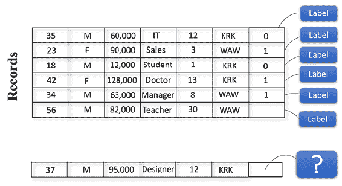

您的算法将根据客户的标签了解客户的特征。 算法将学习离开或留下的客户的特征，并且，当您希望根据这些特征为新客户评分时，算法将根据该学习进行预测。 这称为**监督学习**。

关于此数据集可能要问的另一个问题可能是：此数据集中存在多少个客户组，以便其组中的每个客户都与其他客户相似，而与属于其他组的客户不同。 流行的聚类算法（例如 k-means）可以帮助您解决这一问题。 例如，一旦 k 均值将客户分配到不同的集群，则一个集群可以大体上包括 30 岁以下且以 **IT** 作为职业的客户，而另一个集群可以大体上包括 60 岁以上的客户并且职业为**老师**。 您无需标记数据集即可执行此分析，因为算法足以查看记录并确定它们之间的相似性。 由于没有监督，因此这种学习称为**无监督学习**。

进行此类分析时，首先可视化数据集会很有帮助。 您可以从可用的数据集开始构建您的处理和建模工作流程。 以下代码段显示了如何使用`plotly`可视化三维数据集。`plotly`是一个库，可让您绘制许多不同的交互式图表以进行探索性分析，并使数据探索更加容易。

首先，您需要使用以下代码段安装必要的库：

```py
## Installing necessary libraries with pip 
!pip install plotly --user  
!pip install cufflinks -user 
```

然后，使用以下代码导入必要的库：

```py
## Necessary imports 
import os 
import sys 
import numpy as np 
import pandas 
import matplotlib.pyplot as plt 
%matplotlib inline 
import plotly.plotly as py 
from plotly.offline import download_plotlyjs, init_notebook_mode, plot, iplot 
import cufflinks as cf 
import plotly.graph_objs as go 

init_notebook_mode(connected=True) 
sys.path.append("".join([os.environ["HOME"]]))
```

您将使用`sklearn.datasets`模块中可用的`iris`数据集，如下所示：

```py
from sklearn.datasets import load_iris 
iris_data = load_iris() 
```

`iris`数据具有四个功能； 它们如下：

```py
iris_data.feature_names 

['sepal length (cm)', 
 'sepal width (cm)', 
 'petal length (cm)', 
 'petal width (cm)'] 
```

首先，让我们检查一下前两个功能：

```py
x = [v[0] for v in iris_data.data] 
y = [v[1] for v in iris_data.data]
```

创建一个`trace`，然后创建数据和图形，如下所示：

```py
trace = go.Scatter( 
    x = x, 
    y = y, 
    mode = 'markers' 
) 

layout= go.Layout( 
    title= 'Iris Dataset', 
    hovermode= 'closest', 
    xaxis= dict( 
        title= 'sepal length (cm)', 
        ticklen= 5, 
        zeroline= False, 
        gridwidth= 2, 
    ), 
    yaxis=dict( 
        title= 'sepal width (cm)', 
        ticklen= 5, 
        gridwidth= 2, 
    ), 
    showlegend= False 
)
```

```py
data = [trace] 

fig= go.Figure(data=data, layout=layout) 
plot(fig) 
```

如下图所示，这将为您提供以下输出：

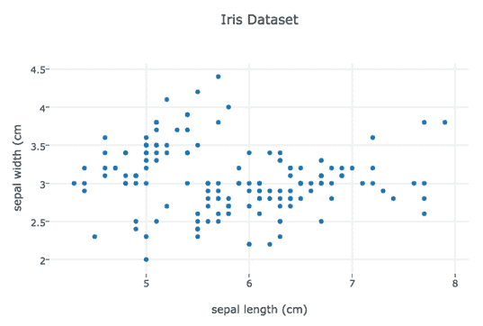

您可以继续查看其他变量，但是要更好地理解一张图表中要素之间的关系，可以使用`scatterplot`矩阵。 创建`pandas.DataFrame`与`plotly`结合使用会更加方便：

```py
import pandas as pd
df = pd.DataFrame(iris_data.data,
columns=['sepal length (cm)',
'sepal width (cm)',
'petal length (cm)',
'petal width (cm)'])

df['class'] = [iris_data.target_names[i] for i in iris_data.target] 

df.head() 
```


使用`plotly`图形工厂，可以绘制`scatterplot`矩阵，如下所示：

```py
import plotly.figure_factory as ff

fig = ff.create_scatterplotmatrix(df, index='class', diag='histogram', size=10, height=800, width=800) 

plot(fig)
```

这将为您提供以下图表，如下图所示：

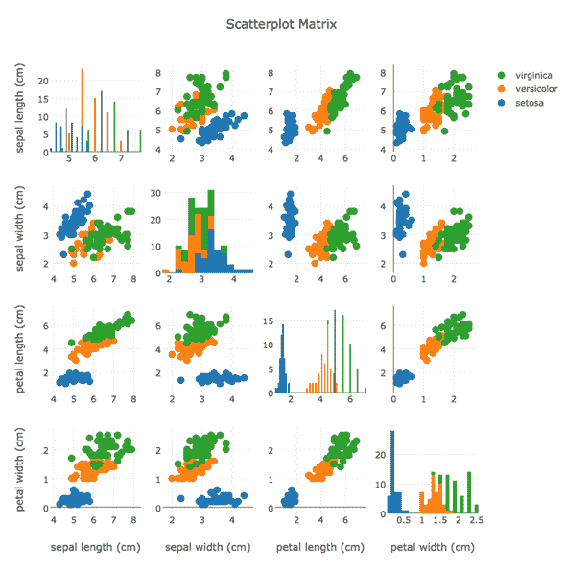

乍一看，**花瓣长度**，**花瓣宽度**和**萼片长度**似乎是建模的不错选择。 您可以通过以下代码使用 3D 图表进一步检查该数据集：

```py
## Creating data for the plotly 
trace1 = go.Scatter3d( 
    # Extracting data based on label 
    x=[x[0][0] for x in zip(iris_data.data, iris_data.target) if x[1] == 0], 
    y=[x[0][2] for x in zip(iris_data.data, iris_data.target) if x[1] == 0], 
    z=[x[0][3] for x in zip(iris_data.data, iris_data.target) if x[1] == 0], 
    mode='markers', 
    marker=dict( 
        size=12, 
        line=dict( 
            color='rgba(217, 217, 217, 0.14)', 
            width=0.5 
        ), 
        opacity=0.8 
    ) 
) 

trace2 = go.Scatter3d( 
    # Extracting data based on label 
    x=[x[0][0] for x in zip(iris_data.data, iris_data.target) if x[1] == 1], 
    y=[x[0][2] for x in zip(iris_data.data, iris_data.target) if x[1] == 1], 
    z=[x[0][3] for x in zip(iris_data.data, iris_data.target) if x[1] == 1], 
    mode='markers', 
    marker=dict( 
        color='rgb(#3742fa)', 
        size=12, 
        symbol='circle', 
        line=dict( 
            color='rgb(204, 204, 204)', 
            width=1 
        ), 
        opacity=0.9 
    ) 
) 

trace3 = go.Scatter3d( 
    # Extracting data based on label 
    x=[x[0][0] for x in zip(iris_data.data, iris_data.target) if x[1] == 2], 
    y=[x[0][2] for x in zip(iris_data.data, iris_data.target) if x[1] == 2], 
    z=[x[0][3] for x in zip(iris_data.data, iris_data.target) if x[1] == 2], 
    mode='markers', 
    marker=dict( 
        color='rgb(#ff4757)', 
        size=12, 
        symbol='circle', 
        line=dict( 
            color='rgb(104, 74, 114)', 
            width=1 
        ), 
        opacity=0.9 
    ) 
) 

data = [trace1, trace2, trace3] 

## Layout settings 
layout = go.Layout( 
    scene = dict( 
        xaxis = dict( 
            title= 'sepal length (cm)'), 
        yaxis = dict( 
            title= 'petal length (cm)'), 
        zaxis = dict( 
            title= 'petal width (cm)'),), 
) 

fig = go.Figure(data=data, layout=layout) 
plot(fig)
```

这将为您提供以下交互式图表，如下图所示：

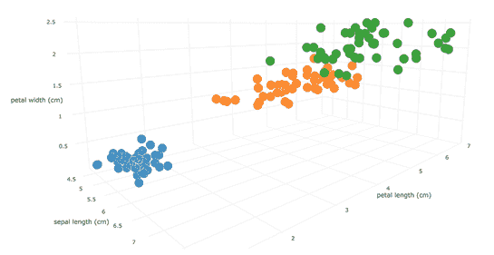

Interactive plotting of petal length, petal width, and sepal length

使用这些图表，您可以更好地理解数据并为建模做准备。

## 超参数

**超参数**可以被视为确定模型各种属性之一的高级参数，例如复杂性，训练行为和学习率。 这些参数自然与模型参数有所不同，因为它们需要在训练开始之前设置。

例如，k 均值或 k 最近邻中的 k 是这些算法的超参数。 k 均值中的 k 表示要找到的聚类数，k 邻域中的 k 表示用于进行预测的最近记录数。

**调整超参数**是任何机器学习项目中提高预测性能的关键步骤。 有多种调优技术，例如网格搜索，随机搜索和贝叶斯优化，但这些技术不在本章范围之内。

让我们通过以下屏幕快照快速浏览 scikit-learn 库中的 k-means 算法参数：

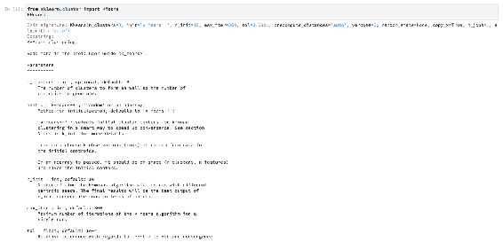

如您所见，有许多参数可以使用，并且至少应查看算法的功能签名，以查看运行算法之前的选项。

让我们一起玩吧。 基线模型将与样本数据一起使用，几乎具有默认设置，如下所示：

```py
from sklearn.datasets.samples_generator import make_blobs 
X, y = make_blobs(n_samples=20, centers=3, n_features=3, random_state=42) 

k_means = KMeans(n_clusters=3) 
y_hat = k_means.fit_predict(X) 
```

`y_hat`保留集群的成员身份信息，这与原始标签相同，如您在此处看到的：

```py
y_hat
## array([0, 2, 1, 1, 1, 0, 2, 0, 0, 0, 2, 0, 1, 2, 1, 2, 2, 1, 0, 1],
dtype=int32)

y
## array([0, 2, 1, 1, 1, 0, 2, 0, 0, 0, 2, 0, 1, 2, 1, 2, 2, 1, 0, 1])
```

您可以使用不同的选项来查看它如何影响训练和预测。

## 损失函数

损失函数通过测量误差来帮助算法在训练过程中更新模型参数，这是预测性能的指标。 损失函数通常表示为：


其中`L`测量预测值与实际值之间的差。 在训练过程中，此误差被最小化。 不同的算法具有不同的损失函数，迭代次数将取决于收敛条件。

例如，k 均值的损失函数使点与最接近的簇均值之间的平方距离最小化，如下所示：


您将在以下部分中看到详细的实现。

## 为单个变量实现我们的算法

让我们为单个变量实现 k-means 算法。 您将从一维向量开始，该向量具有 20 条记录，如下所示：

```py
data = [1,2,3,2,1,3,9,8,11,12,10,11,14,25,26,24,30,22,24,27] 

trace1 = go.Scatter( 
    x=data, 
    y=[0 for x in data], 
    mode='markers', 
    name='Data', 
    marker=dict( 
        size=12 
    ) 
) 

layout = go.Layout( 
```

```py
title='1D vector',
)

traces = [trace1]

fig = go.Figure(data=traces, layout=layout)

plot(fig)
```

如下图所示，将输出以下图表：


我们的目标是找到在数据中可见的`3`簇。 为了开始实施 k-means 算法，您需要通过选择随机索引来初始化集群中心，如下所示：

```py
n_clusters = 3

c_centers = np.random.choice(X, n_clusters)

print(c_centers)

## [ 1 22 26]
```

接下来，您需要计算每个点与聚类中心之间的距离，因此请使用以下代码：

```py
deltas = np.array([np.abs(point - c_centers) for point in X])

deltas
array([[ 7, 26, 10],
       [ 6, 25,  9],
       [ 5, 24,  8],
       [ 6, 25,  9],
       [ 7, 26, 10],
       [ 5, 24,  8],
       [ 1, 18,  2],
       [ 0, 19,  3],
       [ 3, 16,  0],
       [ 4, 15,  1],
       [ 2, 17,  1],
       [ 3, 16,  0],
       [ 6, 13,  3],
       [17,  2, 14],
       [18,  1, 15],
       [16,  3, 13],
       [22,  3, 19],
       [14,  5, 11],
       [16,  3, 13],
      [19,  0, 16]])
```

现在，可以使用以下代码来计算集群成员资格：

```py
deltas.argmin(1)
## array([0, 0, 0, 0, 0, 0, 0, 0, 2, 2, 2, 2, 2, 1, 1, 1, 1, 1, 1, 1])
```

现在，您需要使用以下代码来计算记录和群集中心之间的距离：

```py
c_centers = np.array([X[np.where(deltas.argmin(1) == i)[0]].mean() for i in range(3)])

print(c_centers)

## [ 3.625      25.42857143 11.6       ]
```

这是一次迭代； 您可以继续计算新的群集中心，直到没有任何改善为止。

您可以编写一个函数来包装所有这些功能，如下所示：

```py
def Kmeans_1D(X, n_clusters, random_seed=442):

  # Randomly choose random indexes as cluster centers
  rng = np.random.RandomState(random_seed)
  i = rng.permutation(X.shape[0])[:n_clusters]
  c_centers = X[i]

  # Calculate distances between each point and cluster centers
  deltas = np.array([np.abs(point - c_centers) for point in X])

  # Get labels for each point
  labels = deltas.argmin(1)
  while True:
    # Calculate mean of each cluster
    new_c_centers = np.array([X[np.where(deltas.argmin(1) == i)[0]].mean() for i in range(n_clusters)])

    # Calculate distances again
    deltas = np.array([np.abs(point - new_c_centers) for point in X])

    # Get new labels for each point
    labels = deltas.argmin(1)

    # If there's no change in centers, exit
    if np.all(c_centers == new_c_centers):
      break
    c_centers = new_c_centers

  return c_centers, labels

c_centers, labels = Kmeans_1D(X, 3)

print(c_centers, labels)

## [11.16666667 25.42857143  2.85714286] [2 2 2 2 2 2 0 0 0 0 0 0 0 1 1 1 1 1 1 1]
```

让我们使用以下代码绘制集群中心的图表：

```py
trace1 = go.Scatter(
    x=X,
    y=[0 for num in X],
    mode='markers',
    name='Data',
    marker=dict(
    size=12
    )
)

trace2 = go.Scatter(
    x = c_centers,
    y = [0 for num in X],
    mode='markers',
    name = 'Cluster centers',
    marker = dict(
    size=12,
    color = ('rgb(122, 296, 167)')
    )
)

layout = go.Layout(
    title='1D vector',
)

traces = [trace1, trace2]

fig = go.Figure(data=traces, layout=layout)

plot(fig)
```

看下图。 给定的代码将输出以下内容：

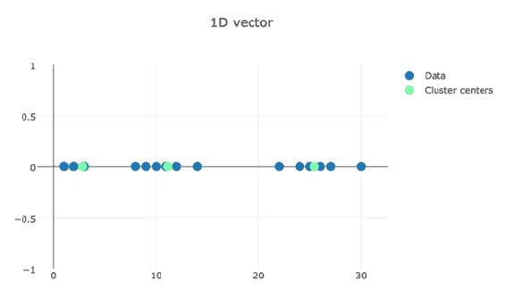

您可以清楚地看到，可以为每个元素分配一个聚类中心。

## 修改我们的算法

现在，您已经了解了单个变量的 k 均值内部，可以将该实现扩展到多个变量，并将其应用于更实际的数据集。

本节中使用的数据集来自 [*UCI 机器学习存储库*](https://archive.ics.uci.edu/ml/datasets/wholesale+customers)，它包括批发分销商的客户信息。 有 440 个具有八项功能的客户。 在下面的列表中，前六个功能与相应产品的年度支出相关，第七个功能显示了购买该产品的渠道，第八个功能显示了该地区：

*   新鲜
*   牛奶
*   杂货店
*   冷冻
*   DETERGENTS_PAPER
*   熟食
*   渠道
*   地区

首先下载数据集并将其读取为`numpy`数组：

```py
from numpy import genfromtxt
wholesales_data = genfromtxt('Wholesale customers data.csv', delimiter=',', skip_header=1)
```

您可以快速查看数据。 这里是：

```py
print(wholesales_data[:5])
[[2.0000e+00 3.0000e+00 1.2669e+04 9.6560e+03 7.5610e+03 2.1400e+02
  2.6740e+03 1.3380e+03]
 [2.0000e+00 3.0000e+00 7.0570e+03 9.8100e+03 9.5680e+03 1.7620e+03
  3.2930e+03 1.7760e+03]
 [2.0000e+00 3.0000e+00 6.3530e+03 8.8080e+03 7.6840e+03 2.4050e+03
  3.5160e+03 7.8440e+03]
 [1.0000e+00 3.0000e+00 1.3265e+04 1.1960e+03 4.2210e+03 6.4040e+03
  5.0700e+02 1.7880e+03]
 [2.0000e+00 3.0000e+00 2.2615e+04 5.4100e+03 7.1980e+03 3.9150e+03
  1.7770e+03 5.1850e+03]]
```

选中`shape`将显示行数和变量数，如下所示：

```py
wholesales_data.shape
## (440, 8)
```

该数据集具有`440`个记录，每个记录都有`8`个特征。

通过使用以下代码来规范化数据集是一个好主意：

```py
wholesales_data_norm = wholesales_data / np.linalg.norm(wholesales_data)

print(wholesales_data_norm[:5])
[[ 1\.          0\.          0.30168043  1.06571214  0.32995207 -0.46657183
   0.50678671  0.2638102 ]
 [ 1\.          0\.         -0.1048095   1.09293385  0.56599336  0.08392603
   0.67567015  0.5740085 ]
 [ 1\.          0\.         -0.15580183  0.91581599  0.34441798  0.3125889
   0.73651183  4.87145892]
 [ 0\.          0\.          0.34485007 -0.42971408 -0.06286202  1.73470839
  -0.08444172  0.58250708]
 [ 1\.          0\.          1.02209184  0.3151708   0.28726     0.84957326
   0.26205579  2.98831445]]
```

您可以使用以下代码将数据集读取到`pandas.DataFrame`中：

```py
import pandas as pd

df = pd.DataFrame(wholesales_data_norm,
columns=['Channel',
'Region',
'Fresh',
'Milk',
'Grocery',
'Frozen',
'Detergents_Paper',
'Delicatessen'])

df.head(10)
```

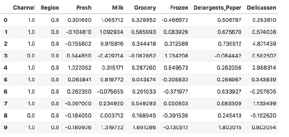

让我们创建一个`scatterplot`矩阵以更仔细地查看数据集。 看一下代码：

```py
fig = ff.create_scatterplotmatrix(df, diag='histogram', size=7, height=1200, width=1200)
plot(fig)
```


您还可以通过运行以下命令来检查要素之间的相关性：

```py
df.corr()
```

这将为您提供一个关联表，如下所示：

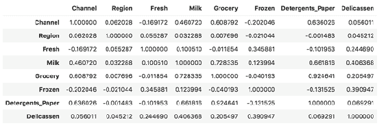

您还可以使用`seaborn`热图，如下所示：

```py
import seaborn as sns; sns.set()
ax = sns.heatmap(df.corr(), annot=True)
```

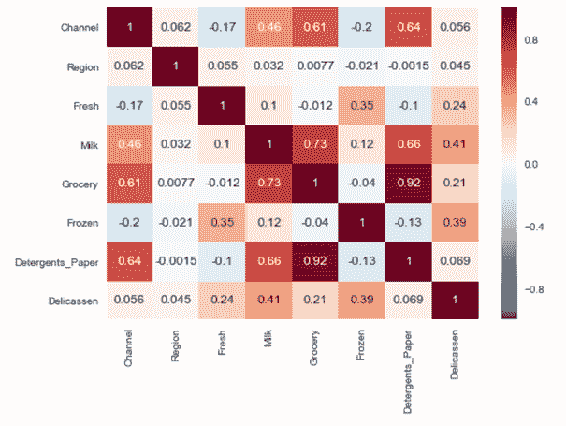

Correlations between the features 

您可以看到特征之间存在一些很强的相关性，例如`Grocery`和`Detergents_Paper`之间的相关性。

让我们使用以下代码绘制`Grocery`，`Detergents_Paper`和`Milk`三个特征：

```py
## Creating data for the plotly
trace1 = go.Scatter3d(
  # Extracting data based on label
  x=df['Grocery'],
  y=df['Detergents_Paper'],
  z=df['Milk'],
  mode='markers',
  marker=dict(
    size=12,
    line=dict(
    color='rgba(217, 217, 217, 0.14)',
    width=0.5
    ),
    opacity=0.8
    )
  )

## Layout settings
layout = go.Layout(
  scene = dict(
    xaxis = dict(
      title= 'Grocery'),
    yaxis = dict(
      title= 'Detergents_Paper'),
    zaxis = dict(
      title= 'Milk'),),
)

data = [trace1]

fig = dict(data=data, layout=layout)

plot(fig)
```

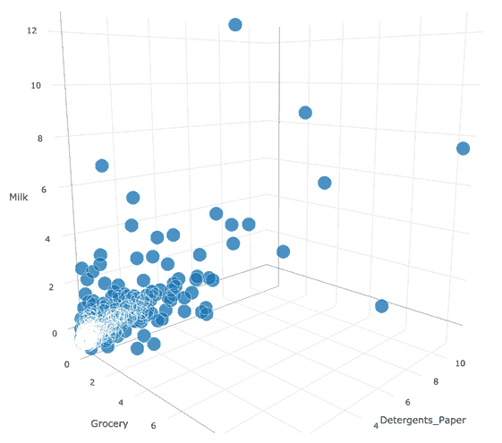

现在，您将继续扩展已为更高维度实现的 k-means 算法。 首先，您可以从数据集中删除`Channel`和`Region`，如下所示：

```py
df = df[[col for col in df.columns if col not in ['Channel', 'Region']]]
df.head(10)
```

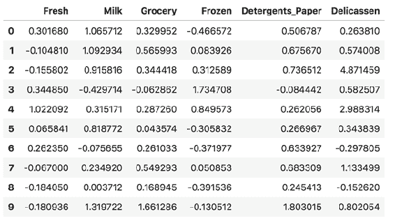

在实现方面，您还可以使用`np.linalg.norm`来计算距离，这实际上取决于您使用哪种距离函数。 另一个替代方法是`scipy.spatial`中的`distance.euclidean`，如下所示：

```py
def Kmeans_nD(X, n_clusters, random_seed=442):

  # Randomly choose random indexes as cluster centers
  rng = np.random.RandomState(random_seed)
  i = rng.permutation(X.shape[0])[:n_clusters]
  c_centers = X[i]

  # Calculate distances between each point and cluster centers
  deltas = np.array([[np.linalg.norm(i - c) for c in c_centers] for i in X])

  # Get labels for each point
  labels = deltas.argmin(1)

  while True:
    # Calculate mean of each cluster
    new_c_centers = np.array([X[np.where(deltas.argmin(1) == i)[0]].mean(axis=0) for i in range(n_clusters)])

    # Calculate distances again
    deltas = np.array([[np.linalg.norm(i - c) for c in new_c_centers] for i in X])

    # Get new labels for each point
    labels = deltas.argmin(1)

    # If there's no change in centers, exit
    if np.array_equal(c_centers, new_c_centers):
      break
    c_centers = new_c_centers

  return c_centers, labels
```

`Grocery`和`Detergents_Paper`将用于聚类，并且`k`将设置为`3`。 通常，应使用外观检查或弯头方法确定`k`，如下所示：

```py
centers, labels = Kmeans_nD(df[['Grocery', 'Detergents_Paper']].values, 3)
```

现在，您可以使用以下命令在数据集中再添加一列：

```py
df['labels'] = labels
```

您可以使用以下代码来首先可视化结果，以查看结果是否有意义：

```py
## Creating data for the plotly
trace1 = go.Scatter(
    # Extracting data based on label
    x=df[df['labels'] == 0]['Grocery'],
    y=df[df['labels'] == 0]['Detergents_Paper'],
    mode='markers',
    name='clust_1',
    marker=dict(
        size=12,
        line=dict(
        color='rgba(217, 217, 217, 0.14)',
        width=0.5
        ),
        opacity=0.8
    )
)

trace2 = go.Scatter(
    # Extracting data based on label
    x=df[df['labels'] == 1]['Grocery'],
    y=df[df['labels'] == 1]['Detergents_Paper'],
    mode='markers',
    name='clust_2',
    marker=dict(
        color='rgb(#3742fa)',
        size=12,
        symbol='circle',
        line=dict(
        color='rgb(204, 204, 204)',
        width=1
        ),
        opacity=0.9
    )
)

trace3 = go.Scatter(
    # Extracting data based on label
    x=df[df['labels'] == 2]['Grocery'],
    y=df[df['labels'] == 2]['Detergents_Paper'],
    mode='markers',
    name='clust_3',
    marker=dict(
        color='rgb(#ff4757)',
        size=12,
        symbol='circle',
        line=dict(
        color='rgb(104, 74, 114)',
        width=1
        ),
        opacity=0.9
    )
)

data = [trace1, trace2, trace3]

## Layout settings
layout = go.Layout(
    scene = dict(
    xaxis = dict(
    title= 'Grocery'),
    yaxis = dict(title= 'Detergents_Paper'),
    )
)

fig = go.Figure(data=data, layout=layout)

plot(fig)
```

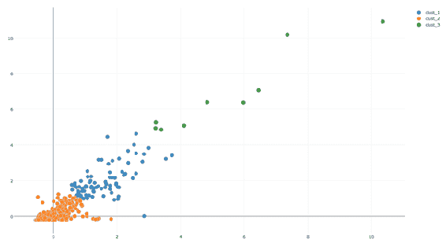

Plotting the clusters

乍一看，集群看起来很合理，并将最终取决于领域知识支持的解释。

您可以使用以下代码轻松查看每个集群每个功能的平均支出：

```py
df.groupby('labels').mean()
```


从这个简单的集群中可以看出，第三集群在`Milk`，`Grocery`和`Detergents_Paper`上的支出最高。 第二个集群的支出较低，第一个集群倾向于`Milk`，`Grocery`和`Detergents_Paper`，因此`k=2`也可以使用。

## 总结

在本章中，您学习了无监督学习的基础知识，并使用 k-means 算法进行聚类。

有许多聚类算法显示不同的行为。 当涉及到无监督学习算法时，可视化是关键，并且您已经看到了几种不同的方式来可视化和检查数据集。

在下一章中，您将学习 NumPy 常用的其他库，例如 SciPy，Pandas 和 scikit-learn。 这些都是从业者工具包中的重要库，它们相互补充。 您会发现自己将这些库与 NumPy 一起使用，因为每个库都会使某些任务变得更容易。 因此，重要的是要了解有关 Python 数据科学堆栈的更多信息。


