# 六、NumPy，SciPy，Pandas 和 Scikit-Learn

到目前为止，您应该能够使用 NumPy 编写小型实现。 在整个章节中，我们旨在提供使用其他库的示例，在本章中，我们应退后一步，看看可以与 NumPy 一起用于项目的周围库。

本章将介绍其他 Python 库如何对 NumPy 进行补充。 我们将研究以下主题：

*   NumPy 和 SciPy
*   NumPy 和 Pandas
*   SciPy 和 Scikit-learn

## NumPy 和 SciPy

到目前为止，您已经看到了许多有关 NumPy 用法的示例，而只有少数 SciPy。 NumPy 具有数组数据类型，它允许您执行各种数组操作，例如排序和整形。

NumPy 具有一些数值算法，可用于执行诸如计算范数，特征值和特征向量之类的任务。 但是，如果数值算法是您的重点，则理想情况下应使用 SciPy，因为它包含更全面的算法集以及最新版本的算法。 SciPy 有许多有用的子程序包可用于某些类型的分析。

以下列表将使您对子软件包有一个整体的了解：

*   `Cluster`：此子程序包包含聚类算法。 它具有两个子模块`vq`和`hierarchy`。`vq`模块提供用于 K 均值聚类的功能。 *层次结构*模块包括用于层次结构聚类的功能。
*   `Fftpack`：此子程序包包含用于快速傅立叶变换的函数和算法，以及差分和伪差分算符。
*   `Interpolate`：此子程序包提供用于单变量和多变量插值的功能：1D 和 2D 样条曲线。
*   `Linalg`：此子程序包提供用于线性代数的函数和算法，例如`matrix`运算和函数，特征值和-向量计算，矩阵分解，矩阵方程求解器和特殊矩阵。
*   `Ndimage`：此子程序包提供用于多维图像处理的功能和算法，例如滤镜，插值，测量和形态。
*   `Optimize`：此子程序包提供函数和算法，用于函数局部和全局优化，函数拟合，求根和线性编程。
*   `Signal`：此子程序包提供信号处理的功能和算法，例如卷积，B 样条，滤波，连续和离散时间线性系统，波形，小波和频谱分析。
*   `Stats`：此子程序包提供概率分布，例如连续分布，多元分布和离散分布，以及可以找到均值，众数，方差，偏度，峰度和相关系数的统计函数。

让我们来看一下其中的一个子包。 以下代码显示了用于群集分析的`cluster`程序包：

```py
Scipy.cluster 

%matplotlib inline 
import matplotlib.pyplot as plt 

## Import ndimage to read the image 
from scipy import ndimage 

## Import cluster for clustering algorithms 
from scipy import cluster 

## Read the image 
image = ndimage.imread("cluster_test_image.jpg") 
## Image is 1000x1000 pixels and it has 3 channels. 
image.shape 

(1000, 1000, 3) 
```

这将为您提供以下输出：

```py
array([[[30, 30, 30], 
        [16, 16, 16], 
        [14, 14, 14], 
        ..., 
        [14, 14, 14], 
        [16, 16, 16], 
        [29, 29, 29]], 

       [[13, 13, 13], 
        [ 0,  0,  0], 
        [ 0,  0,  0], 
        ..., 
        [ 0,  0,  0], 
        [ 0,  0,  0], 
        [12, 12, 12]], 

       [[16, 16, 16], 
        [ 3,  3,  3], 
        [ 1,  1,  1], 
        ..., 
        [ 0,  0,  0], 
        [ 2,  2,  2], 
        [16, 16, 16]], 

       ..., 

       [[17, 17, 17], 
        [ 3,  3,  3], 
        [ 1,  1,  1], 
        ..., 
        [34, 26, 39], 
        [27, 21, 33], 
        [59, 55, 69]], 

       [[15, 15, 15], 
        [ 2,  2,  2], 
        [ 0,  0,  0], 
        ..., 
        [37, 31, 43], 
        [34, 28, 42], 
        [60, 56, 71]], 

       [[33, 33, 33], 
        [20, 20, 20], 
        [17, 17, 17], 
        ..., 
        [55, 49, 63], 
        [47, 43, 57], 
        [65, 61, 76]]], dtype=uint8) 

```

在这里，您可以看到该图：

```py
plt.figure(figsize = (15,8)) 
plt.imshow(image) 
```

您可以从前面的代码块中获得以下图表：


使用以下代码将图像数组转换为二维数据集：

```py
x, y, z = image.shape 
image_2d = image.reshape(x*y, z).astype(float) 
image_2d.shape 

(1000000, 3) 

image_2d 

array([[30., 30., 30.], 
       [16., 16., 16.], 
       [14., 14., 14.], 
       ..., 
       [55., 49., 63.], 
       [47., 43., 57.], 
       [65., 61., 76.]]) 

## kmeans will return cluster centers and the distortion 
cluster_centers, distortion = cluster.vq.kmeans(image_2d, k_or_guess=2) 

print(cluster_centers, distortion) 

[[179.28653454 179.30176248 179.44142117] 
 [  3.75308484   3.83491111   4.49236356]] 26.87835069294931 

image_2d_labeled = image_2d.copy() 

labels = [] 

from scipy.spatial.distance import euclidean 
import numpy as np 

for i in range(image_2d.shape[0]): 
    distances = [euclidean(image_2d[i], center) for center in cluster_centers] 
    labels.append(np.argmin(distances)) 

plt.figure(figsize = (15,8)) 
plt.imshow(cluster_centers[labels].reshape(x, y, z)) 
```

您从前面的代码中获得以下输出：


## SciPy 和 NumPy 和线性回归

您已经了解了如何使用 NumPy 从头开始编写线性回归算法。`Scipy.stats`模块具有`linregress`功能，用于计算斜率，截距，相关系数（*r* 值），两侧 *p* 值以及标准差估计，如下所示：

```py
from sklearn import datasets 
%matplotlib inline 
import matplotlib.pyplot as plt 

## Boston House Prices dataset 
boston = datasets.load_boston() 
x = boston.data 
y = boston.target 

boston.feature_names 

array(['CRIM', 'ZN', 'INDUS', 'CHAS', 'NOX', 'RM', 'AGE', 'DIS', 'RAD', 
       'TAX', 'PTRATIO', 'B', 'LSTAT'], dtype='<U7') 

x.shape 
(506, 13) 

y.shape 
(506,) 

## We will consider "lower status of population" as independent variable for its importance 
lstat = x[0:,-1] 
lstat.shape 
(506,) 

from scipy import stats 

slope, intercept, r_value, p_value, std_err = stats.linregress(lstat, y) 

print(slope, intercept, r_value, p_value, std_err) 

-0.9500493537579909 34.55384087938311 -0.737662726174015 5.081103394387796e-88 0.03873341621263942 

print("r-squared:", r_value**2) 
r-squared: 0.5441462975864798 

plt.plot(lstat, y, 'o', label='original data') 
plt.plot(lstat, intercept + slope*lstat, 'r', label='fitted line') 
plt.legend() 
plt.show() 
```

我们从前面代码的输出中获得以下图表，如下图所示：

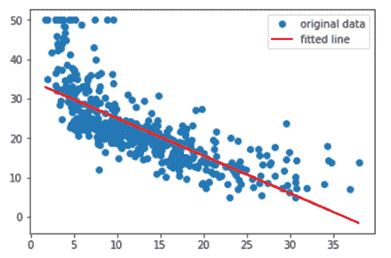

您还可以查看*平均房间数*与房价之间的关系。 以下代码块打印出性能指标：

```py
rm = x[0:,5] 

slope, intercept, r_value, p_value, std_err = stats.linregress(rm, y) 

print(slope, intercept, r_value, p_value, std_err) 

print("r-squared:", r_value**2) 

## 9.102108981180308 -34.670620776438554 0.6953599470715394 2.48722887100781e-74 0.4190265601213402 
## r-squared: 0.483525455991334 
```

以下代码块绘制了拟合线：

```py
plt.plot(rm, y, 'o', label='original data') 
plt.plot(rm, intercept + slope*rm, 'r', label='fitted line') 
plt.legend() 
plt.show() 
```

我们从前面的代码中获得以下输出，如下图所示：


## NumPy 和 Pandas

考虑一下时，NumPy 是一个相当低级的数组操作库，大多数其他 Python 库都写在它的顶部。

这些库之一是`pandas`，它是一个高级数据处理库。 浏览数据集时，通常会执行诸如计算描述性统计数据，按特定特征分组以及合并之类的操作。`pandas`库具有许多友好的功能来执行这些各种有用的操作。

在此示例中，我们使用糖尿病数据集。`sklearn.datasets`中的糖尿病数据集使用零均值和 L2 范数标准化。

该数据集包含 442 条记录，这些记录具有 10 个特征：年龄，性别，体重指数，平均血压和 6 个血清测量值。

目标代表采取这些基准措施后的疾病进展。 您可以在 [web](https://www4.stat.ncsu.edu/~boos/var.select/diabetes.html) 和[相关论文](http://web.stanford.edu/~hastie/Papers/LARS/LeastAngle_2002.pdf) 中查看数据描述。

我们从操作开始，如下所示：

```py
import pandas as pd 
from sklearn import datasets 

%matplotlib inline 
import matplotlib.pyplot as plt 
import seaborn as sns 

diabetes = datasets.load_diabetes() 

df = pd.DataFrame(diabetes.data, columns=diabetes.feature_names) 

diabetes.feature_names 
['age', 'sex', 'bmi', 'bp', 's1', 's2', 's3', 's4', 's5', 's6'] 

df.head(10) 
```

我们从前面的代码中获得以下输出，如下表所示：

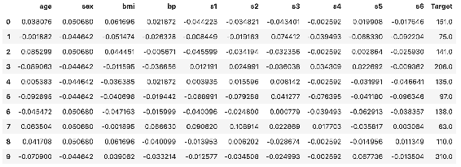

这段代码向您展示了如何在数据帧中创建目标列：

```py
df['Target'] = diabetes.target 
df.head(10) 
```

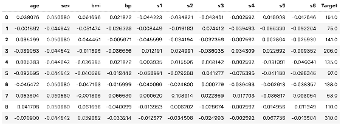

Pandas 帮助我们轻松地处理表格数据，并通过各种辅助方法和可视化支持我们的分析。 看一下代码：

```py
## Descriptive statistics 
df.describe() 
```

我们从前面的代码中获得以下输出，如下表所示：


通过使用以下代码行，看看目标的分布方式：

```py
plt.hist(df['Target']) 
```

下图显示了上一行的输出：

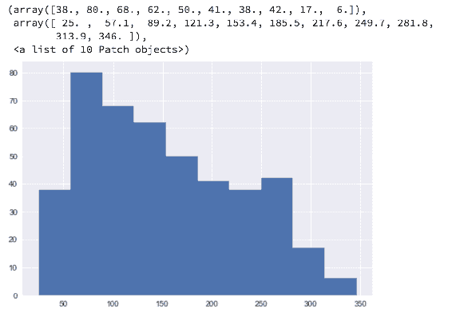

您可以看到目标变量向右倾斜。 看一下这段代码：

```py
## Since 'sex' is categorical, excluding it from numerical columns 
numeric_cols = [col for col in df.columns if col != 'sex'] 

numeric_cols 
## ['age', 'bmi', 'bp', 's1', 's2', 's3', 's4', 's5', 's6', 'Target'] 

## You can have a look at variable distributions individually, but there's a better way 
df[numeric_cols].hist(figsize=(20, 20), bins=30, xlabelsize=12, ylabelsize=12) 

## You can also choose create dataframes for numerical and categorical variables 
```

前一个代码块的输出：

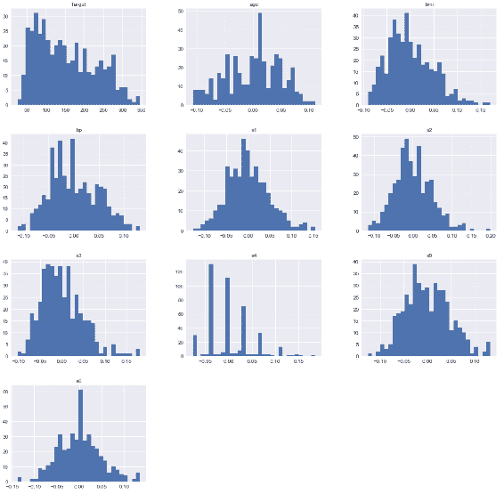

Feature distributions 

您可以检查其中一些功能的分布，并确定其中哪些看起来相似。 对于此示例，特征`s1`，`s2`和`s6`似乎具有相似的分布，如从此代码中可以看到的：

```py
## corr method will give you the correlation between features 
df[numeric_cols].corr() 
```

下图显示了上一行的输出：

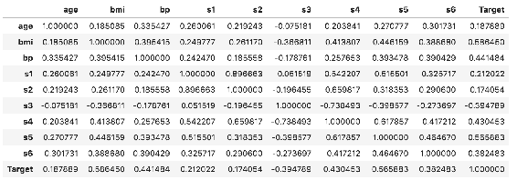

您可以使用`heatmap`更好地表示这种关系，如下所示：

```py
plt.figure(figsize=(15, 15)) 
sns.heatmap(df[numeric_cols].corr(), annot=True) 
```

下图是由前面的代码块生成的热图：

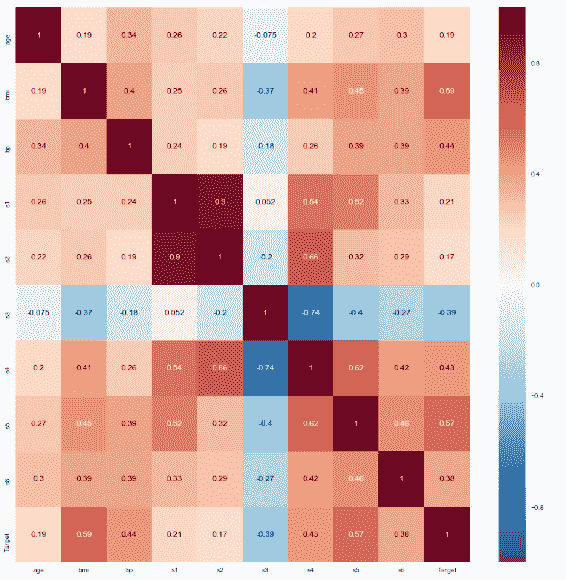

Correlations heatmap

您还可以通过以下方式过滤相关性：

```py
plt.figure(figsize=(18, 15)) 
sns.heatmap(df[numeric_cols].corr() 
            [(df[numeric_cols].corr() >= 0.3) & (df[numeric_cols].corr() <= 0.5)],  
            annot=True) 
```

此图显示了过滤后的相关性：

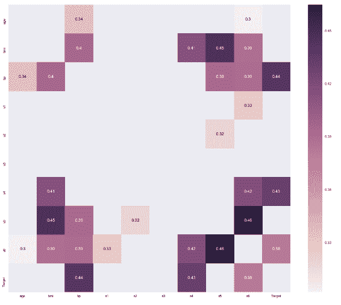

Filtered correlations heatmap

您还可以使用其他有用的可视化来检查统计关系，如下所示：

```py
fig, ax = plt.subplots(3, 3, figsize = (18, 12)) 
for i, ax in enumerate(fig.axes): 
    if i < 9: 
        sns.regplot(x=df[numeric_cols[i]],y='Target', data=df, ax=ax) 
```

该图显示了前面代码的以下输出：

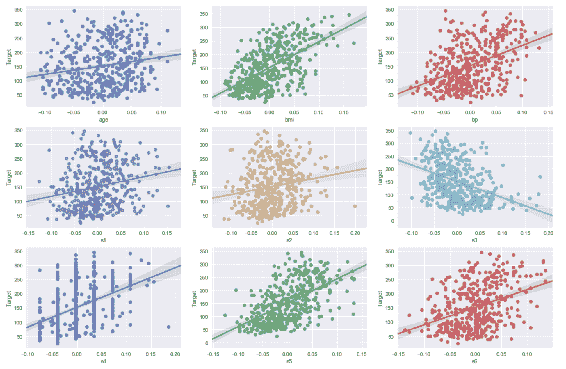

Regression Plots

您可以看到，使用`pandas`使探索性数据分析相对简单。 使用`pandas`，您可以检查特征及其关系。

## Pandas 和股票价格的定量建模

`pandas`最初是为在金融数据集中使用而编写的，它包含许多用于处理时间序列数据的便捷功能。 在本节中，您将看到如何使用`pandas`库处理股票价格序列。

您将使用`quandl` Python 库获取公司的财务数据。 看一下这段代码：

```py
import quandl msft = quandl.get('WIKI/MSFT') 

msft.columns 
## Index(['Open', 'High', 'Low', 'Close', 'Volume', 'Ex-Dividend', 'Split Ratio', 'Adj. Open', 'Adj. High', 'Adj. Low', 'Adj. Close', 'Adj. Volume'], dtype='object') 

msft.tail()
```

下表显示了`msft.tail()`的输出：


让我们通过导入以下设置来自定义绘图：

```py
matplotlib.font_manager as font_manager font_path = '/Library/Fonts/Cochin.ttc' font_prop = font_manager.FontProperties(fname=font_path, size=24) axis_font = {'fontname':'Arial', 'size':'18'} title_font = {'fontname':'Arial', 'size':'22', 'color':'black', 'weight':'normal', 'verticalalignment':'bottom'} plt.figure(figsize=(10, 8)) plt.plot(msft['Adj. Close'], label='Adj. Close') plt.xticks(fontsize=22) plt.yticks(fontsize=22) plt.xlabel("Date", **axis_font) plt.ylabel("Adj. Close", **axis_font) plt.title("MSFT", **title_font) plt.legend(loc='upper left', prop=font_prop, numpoints=1) plt.show()
```

该图显示了来自先前设置的图：

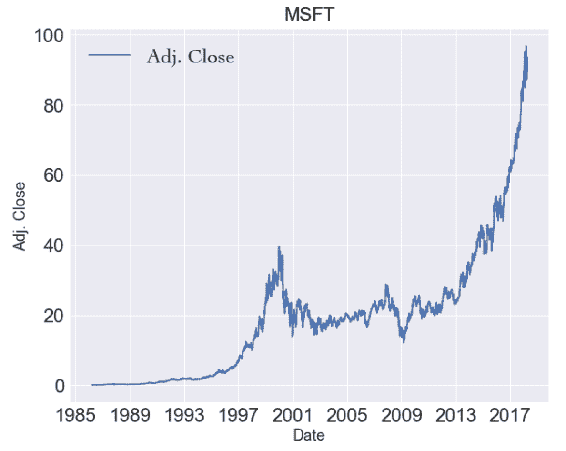

您可以使用以下代码来计算每日变化：

```py
msft['Daily Pct. Change'] = (msft['Adj. Close'] - msft['Adj. Open']) / msft['Adj. Open'] 

msft.tail(10)
```

下图显示了`msft.tail(10)`的输出：


尝试使用此每日收益的直方图：

```py
plt.figure(figsize=(22, 8)) 
plt.hist(msft['Daily Pct. Change'], bins=100)
```

如下图所示，它将为您提供以下图表：

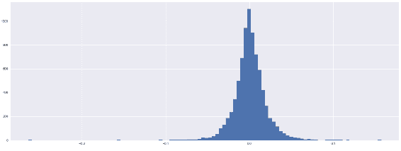

Distribution of daily returns

返回的分布具有较长的尾巴，尤其是在负侧，这是财务分析中的已知现象。 它产生的风险称为尾部风险，它与市场收益服从正态分布的假设相矛盾。 这基本上告诉您，极端事件发生的可能性比更正态分布的可能性更大。

在可视化方面，使它们具有交互性很有帮助。 为此，`plotly`提供了一个很好的替代当前绘图库的方法，如下所示：

```py
import plotly.plotly as py 
import plotly.graph_objs as go 
from plotly.offline import download_plotlyjs, init_notebook_mode, plot, iplot init_notebook_mode(connected=True) 
from datetime import datetime 
import pandas_datareader.data as web 
import quandl 

msft = quandl.get('WIKI/MSFT') 
msft['Daily Pct. Change'] = (msft['Adj. Close'] - msft['Adj. Open']) / msft['Adj. Open'] 

data = [go.Scatter(x=msft.index, y=msft['Adj. Close'])] 

plot(data)
```

我们从前面的代码中获得以下图表，如下图所示：

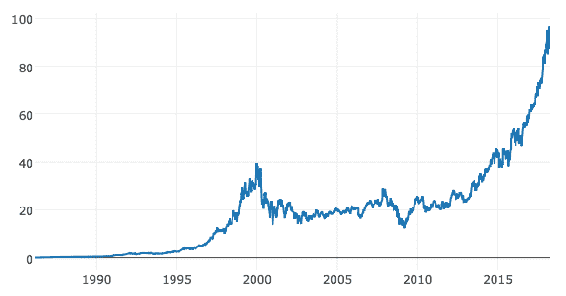

您可以创建**开盘-最高-最低-收盘价**（**OHLC**）的图表，其中每个日期都有 4 个不同的价格值，它们是开，高，低和关。 看一下这段代码：

```py
charts trace = go.Ohlc(x=msft.index, open=msft['Adj. Open'], high=msft['Adj. High'], low=msft['Adj. Low'], close=msft['Adj. Close']) 

data = [trace] 

plot(data)
```

该图显示了先前代码的图：


您可以通过在图表上选择自定义范围来检查特定区域。 看一下这个图：


同样，您可以使用以下代码创建`Candlestick`图表：

```py
trace = go.Candlestick(x=msft.index, open=msft['Adj. Open'], high=msft['Adj. High'], low=msft['Adj. Low'], close=msft['Adj. Close']) 

data = [trace] 

plot(data)
```

下图显示了此代码的输出：

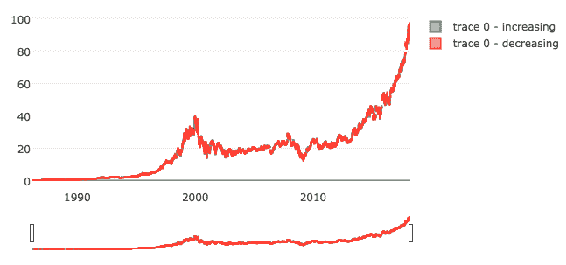

您也可以在`Candlestick`图表中选择特定范围。 看一下这个图：


分布图如下：

```py
import plotly.figure_factory as ff 

fig = ff.create_distplot([msft['Daily Pct. Change'].values], ['MSFT Daily Returns'], show_hist=False) 

plot(fig)
```

下图显示了前面代码的输出：

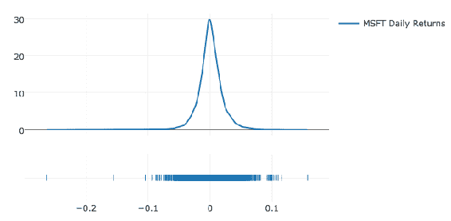

我们可以创建三个移动平均线，如下所示：

```py
msft['200MA'] = msft['Adj. Close'].rolling(window=200).mean() 
msft['100MA'] = msft['Adj. Close'].rolling(window=100).mean() 
msft['50MA'] = msft['Adj. Close'].rolling(window=50).mean() 

msft.tail(10)
```

下表显示了`msft.tail(10)`的输出：


根据切片的数据，将包括最近 2,000 天。 看一下这段代码：

```py
trace_adjclose = go.Scatter( x=msft[-2000:].index, y=msft[-2000:]['Adj. Close'], name = "Adj. Close", line = dict(color = '#000000'), opacity = 0.8) 

trace_200 = go.Scatter( x=msft[-2000:].index, y=msft[-2000:]['200MA'], name = "200MA", line = dict(color = '#FF0000'), opacity = 0.8) 

trace_100 = go.Scatter( x=msft[-2000:].index, y=msft[-2000:]['100MA'], name = "100MA", line = dict(color = '#0000FF'), opacity = 0.8) 

trace_50 = go.Scatter( x=msft[-2000:].index, y=msft[-2000:]['50MA'], name = "50MA", line = dict(color = '#FF00FF'), opacity = 0.8) 

data = [trace_adjclose, trace_200, trace_100, trace_50] 

layout = dict( title = "MSFT Moving Averages: 200, 100, 50 days", ) 

fig = dict(data=data, layout=layout) 

plot(fig)
```

下图显示了前面代码块中的图：

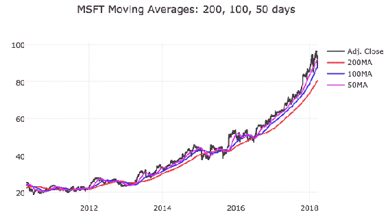

移动平均线用于监视金融市场的趋势。 在此示例中，有三个移动平均线，每个移动线均具有不同的周期。 您可以设置分析天数，以进行短期，中期和长期趋势监视。

当您开始使用财务时间序列时，您会很快意识到您需要基于不同期间的汇总，并且在`pandas`中创建这些汇总非常容易。 以下代码段将通过计算平均值每月汇总记录：

```py
msft_monthly = msft.resample('M').mean() 

msft_monthly.tail(10)
```

下图显示了`msft_monthly.tail(10)`的输出：


这是一个简单的时间序列图：

```py
data = [go.Scatter(x=msft_monthly[-24:].index, y = msft_monthly[-24:]['Adj. Close'])] 

plot(data)
```

如下图所示，这将为您提供以下图表：

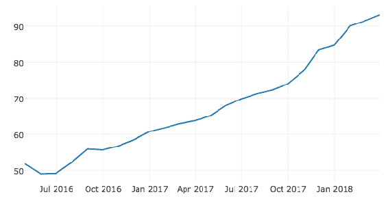

在检查要素之间的关系时，可以使用我们在前面的示例中已经看到的相关矩阵。 在时间序列中，从业者对自相关感兴趣，自相关显示了时间序列与其自身的相关性。 例如，理想情况下，您希望时间序列中出现周期性的峰值，以显示您的季节性。 通过使用以下代码，让我们看看每日百分比变化是否有任何明显的峰值：

```py
plt.figure(figsize=(22, 14)) pd.plotting.autocorrelation_plot(msft_monthly['Daily Pct. Change'])
```

我们从前面的代码中获得以下图表，如下图所示：

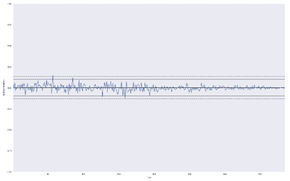

Monthly autocorrelation plot

在这个系列中没有有意义的显着滞后，但是如果您使用宏观经济变量（例如 GDP，通货膨胀率和失业水平）进行尝试，则可能会看到显着的季度或年度峰值。

## SciPy 和 Scikit-learn

**Scikit-learn** 是用于机器学习的 SciKit 库之一，它建立在 SciPy 之上。 您可以使用它执行回归分析，就像在前几章中使用 scikit-learn 库所做的那样。 看一下这段代码：

```py
from sklearn import datasets, linear_model 
from sklearn.metrics import mean_squared_error, r2_score 

diabetes = datasets.load_diabetes() 

linreg = linear_model.LinearRegression() 

linreg.fit(diabetes.data, diabetes.target) 

## You can inspect the results by looking at evaluation metrics 
print('Coeff.: n', linreg.coef_) 
print("MSE: {}".format(mean_squared_error(diabetes.target, linreg.predict(diabetes.data)))) print('Variance Score: {}'.format(r2_score(diabetes.target, linreg.predict(diabetes.data))))
```

## scikit-learn 和住房数据的 K 均值聚类

在本节中，我们将使用 scikit-learn 的 K 均值算法对房屋数据进行聚类，如下所示：

```py
from sklearn.cluster import KMeans from sklearn.datasets import load_boston boston = load_boston()
## As previously, you have implemented the KMeans from scracth and in this example, you use sklearns API k_means = KMeans(n_clusters=3) # Training k_means.fit(boston.data)
KMeans(algorithm='auto', copy_x=True, init='K 均值++', max_iter=300, n_clusters=3, n_init=10, n_jobs=1, precompute_distances='auto', random_state=None, tol=0.0001, verbose=0)
print(k_means.labels_)
```

前面代码的输出如下：

```py
[1 1 1 1 1 1 1 1 1 1 1 1 1 1 1 1 1 1 1 1 1 1 1 1 1 1 1 1 1 1 1 1 1 1 1 1 1
1 1 1 1 1 1 1 1 1 1 1 1 1 1 1 1 1 1 1 1 1 1 1 1 1 1 1 1 1 1 1 1 1 1 1 1 1
1 1 1 1 1 1 1 1 1 1 1 1 1 1 1 1 1 1 1 1 1 1 1 1 1 1 1 1 0 1 1 1 1 1 1 1 1
1 1 1 1 1 1 1 1 1 1 1 1 1 1 1 1 1 1 1 1 1 1 1 1 1 1 1 1 1 1 1 1 1 1 1 1 1
1 1 1 1 1 1 1 0 0 1 1 1 1 1 1 1 1 1 1 1 1 1 1 1 1 1 1 1 1 1 1 1 1 1 1 1 1
1 1 1 1 1 1 1 1 1 1 1 1 1 1 1 1 1 1 1 1 1 1 1 1 1 1 1 1 1 1 1 1 1 1 1 1 1
1 1 1 1 1 1 1 1 1 1 1 1 1 1 1 1 1 1 1 1 1 1 1 1 1 1 1 1 1 1 1 1 1 1 1 1 1
1 1 1 1 1 1 1 1 1 1 1 1 1 1 1 1 1 1 1 1 1 1 1 1 1 1 1 1 1 1 1 1 1 1 1 1 1
1 1 1 1 1 1 1 1 1 1 1 1 1 1 1 1 1 1 1 1 1 1 1 1 1 1 1 1 1 1 1 1 1 1 1 1 1
1 1 1 1 1 1 1 1 1 1 1 1 1 1 1 1 1 1 1 1 1 1 1 2 2 2 2 2 2 2 2 2 2 2 0 2 2
2 2 2 2 2 2 2 2 2 2 2 2 2 2 2 2 2 2 2 2 2 2 2 2 2 2 2 2 2 2 2 2 2 2 2 2 2
2 2 0 0 0 0 0 0 0 0 0 0 0 2 2 2 0 0 0 0 0 0 0 0 0 0 0 0 0 0 0 0 2 2 2 2 2
2 0 2 2 2 2 0 2 2 2 0 0 0 0 2 2 2 2 2 2 2 2 0 2 2 2 2 2 2 2 2 2 2 2 2 2 2
2 2 2 2 2 2 2 2 2 2 2 2 1 1 1 1 1 1 1 1 1 1 1 1 1]
```

您可以使用以下代码行检查群集中心：

```py
print(k_means.cluster_centers_)
```

这是控制台的输出：

```py
[[ 1.49558803e+01 -5.32907052e-15 1.79268421e+01 2.63157895e-02
6.73710526e-01 6.06550000e+00 8.99052632e+01 1.99442895e+00
2.25000000e+01 6.44736842e+02 1.99289474e+01 5.77863158e+01
2.04486842e+01]
[ 3.74992678e-01 1.57103825e+01 8.35953552e+00 7.10382514e-02
5.09862568e-01 6.39165301e+00 6.04133880e+01 4.46074481e+00
4.45081967e+00 3.11232240e+02 1.78177596e+01 3.83489809e+02
1.03886612e+01]
[ 1.09105113e+01 5.32907052e-15 1.85725490e+01 7.84313725e-02
6.71225490e-01 5.98226471e+00 8.99137255e+01 2.07716373e+00
2.30196078e+01 6.68205882e+02 2.01950980e+01 3.71803039e+02
1.78740196e+01]]
```

关于聚类算法的评估，通常将使用诸如轮廓分析或弯头方法之类的技术来评估聚类的质量并确定正确的超参数（例如 K 均值）。 使用 scikit-learn 提供的简单 API，您还将发现这种分析易于执行。 强烈建议您通过实践从这些示例中学到的知识为基础，这将提高您的知识和技能。

## 总结

在本章中，您使用各种示例（主要用于机器学习任务）练习了 NumPy，SciPy，Pandas 和 scikit-learn。 使用 Python 数据科学库时，通常有不止一种执行给定任务的方法，而且通常有助于了解不止一种方法。

您可以使用替代方法以获得更好的实现，也可以出于比较的目的。 在为给定任务尝试不同的方法时，您可能会找到不同的选项，这些选项将允许您进一步自定义实现，或者只是观察到一些性能改进。

本章的目的是向您展示这些不同的选项，以及 Python 语言由于其丰富的分析库生态系统而具有的灵活性。 在下一章中，您将了解有关 NumPy 内部的更多信息，例如 numpy 如何管理数据结构和内存，代码概要分析以及有效编程的技巧。


