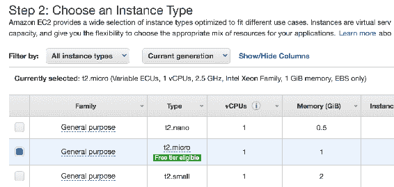
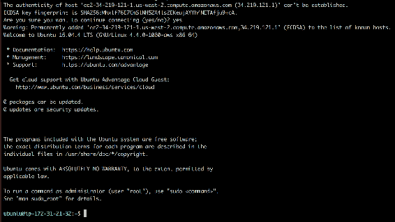
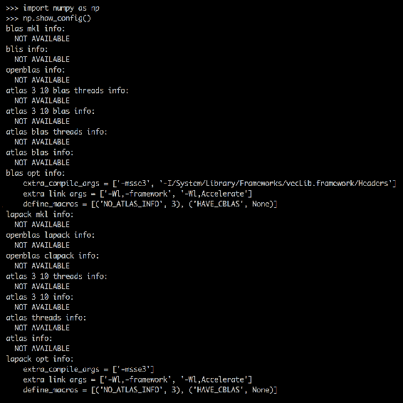
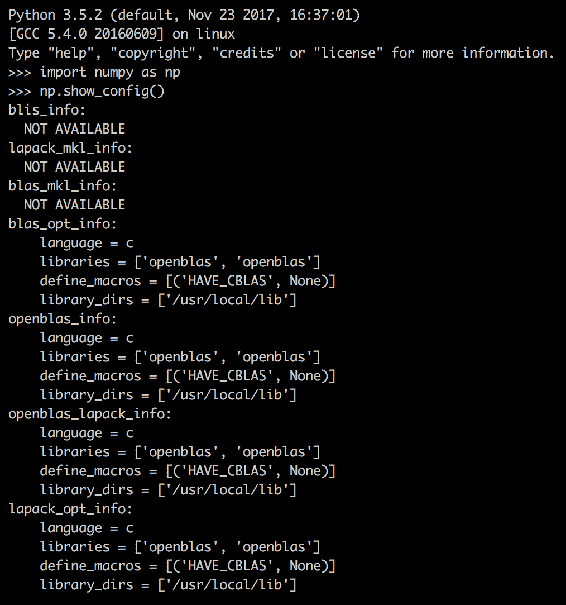
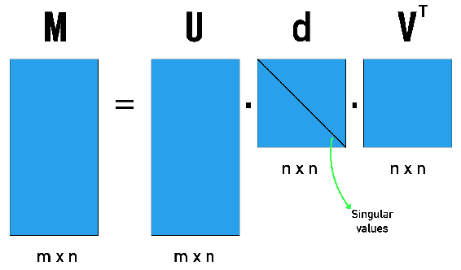
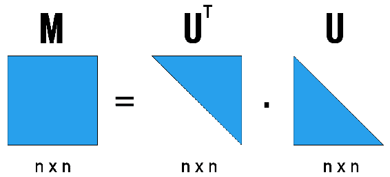
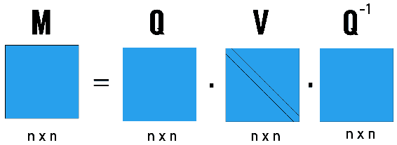
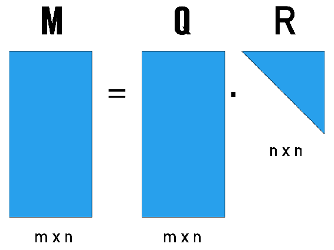

# 八、高性能数值计算库概述

在科学计算应用程序中可以执行许多数值运算，并且未经优化的代码或库实现会导致严重的性能瓶颈。

NumPy 库通过更有效地使用其内存布局来帮助提高 Python 程序的性能。

在实际应用中，最常用的数学分支之一是线性代数。 线性代数用于计算机图形学，密码学，计量经济学，机器学习，深度学习和自然语言处理，仅举几个例子。 具有高效的矩阵和向量运算至关重要。

高性能，低级框架（例如 BLAS，LAPACK 和 ATLAS）是 Netlib 库的一部分，用于密集的线性代数运算；其他框架（例如 Intel MKL）也可以在其中使用您的程序。 这些库在计算中具有很高的性能和准确性。 您可以通过其他高级编程语言（例如 Python 或 C++）调用它们来使用这些库。

当 NumPy 与不同的 BLAS 库链接时，您可以观察到性能差异而无需更改代码，因此了解哪种链接可以更好地提高性能非常重要。

让我们看一下这些低级库。

## BLAS 和 LAPACK

**BLAS** 代表**基本线性代数子程序**，并且是处理线性代数运算的低级例程的标准。 低级例程包括向量和矩阵加/乘，线性组合等操作。 BLAS 为线性代数运算提供了三种不同的级别：

*   **BLAS1**：标量向量和向量向量运算
*   **BLAS2**：矩阵向量运算
*   **BLAS3**：矩阵矩阵运算

**LAPACK** 代表**线性代数软件包**，并包含更高级的操作。 LAPACK 提供了用于矩阵分解（例如 LU，Cholesky 和 QR）以及解决特征值问题的例程。 LAPACK 主要取决于 BLAS 例程。

## ATLAS

有许多优化的 BLAS 实现。 **ATLAS** 代表**自动调谐线性代数软件**，并且是与平台无关的项目，可以生成优化的 BLAS 实现。

## 英特尔 MKL

英特尔 MKL 为英特尔处理器优化了 BLAS。 改进了例程和功能，例如 1 级，2 级和 3 级 BLAS，LAPACK 例程，求解器，FFT 函数，其他数学和统计函数。 这些改进的例程和功能得益于共享内存多处理等改进，它们可用于在发行版（如 Anaconda 发行版）中加速科学 python 库（例如 NumPy 和 SciPy）。 如果您查看其[发行说明](https://software.intel.com/en-us/articles/intel-math-kernel-library-release-notes-and-new-features)， 可以看到每个发行版都进行了一些重要的改进，例如 LAPACK 函数的性能得到了提高。

## OpenBLAS

**OpenBLAS** 是另一个优化的 BLAS 库，它为不同的配置提供了 BLAS3 级的优化。 作者报告说，与 BLAS 相比，性能增强和改进可与英特尔 MKL 的性能相媲美。

## 使用 AWS EC2 和底层库配置 NumPy

1.  登录到 AWS。 如果您没有帐户，请创建一个：


2.  选择 EC2 。

3.  单击启动实例：


4.  选择`Ubuntu Server 16.04 LTS (HVM), SSD Volume Type - ami-db710fa3`：


5.  选择`t2.micro`实例类型：



6.  点击**启动**：


7.  单击**启动**。
8.  选择**创建一个新的密钥对**：


9.  给它命名，然后单击**启动实例**。 它需要一些时间才能运行：


10.  一旦其状态为`running`，点击实例 ID ，在这种情况下为`i-00ccaeca61a24e042`。 然后选择实例并单击`Connect`：


11.  然后它将向您显示以下窗口，其中包含一些有用的信息：


12.  打开终端，然后导航到保存所生成密钥的文件夹。 在此示例中，键名称为`aws_oregon`。 运行以下命令：

```py
$ chmod 400 aws_oregon.pem
```

13.  然后，在上一个窗口的示例部分中复制该行并运行它：

```py
$ ssh -i "aws_oregon.pem" ubuntu@ec2-34-219-121-1.us-west-2.compute.amazonaws.com
```

14.  在第一个问题的答案中输入`yes`将其添加到已知主机中，它将连接到您的实例：



您需要做的第一件事是通过运行以下命令来更新和升级预安装的软件包：

```py
sudo apt-get update
sudo apt-get upgrade
```

`sudo`短语为您提供了更新和升级的必要权利，因为软件包的更改可能会对系统产生负面影响，并非所有人都可以对其进行授权。 您可以将`apt-get`视为 Ubuntu 的软件包管理器。

您可以创建许多虚拟环境，并链接到不同的低级库，但是，每次使用新的低级库配置 NumPy 时，您都将从一个新的预配实例开始。 这将为您提供有关配置过程的想法，以后使您可以轻松地设置虚拟环境。

## 安装 BLAS 和 LAPACK

为了设置您的开发环境，您需要在运行以下命令后安装所需的软件包，例如编译器，库和其他必要的部分，

```py
$ sudo apt-get update $ sudo apt-get upgrade
```

对于此配置，很幸运，因为您可以运行以下命令来安装 Python 的 SciPy 软件包，它将安装所有必需的软件包，包括 NumPy，基本线性代数子程序（`libblas3`）和线性代数软件包（`liblapack3`）：

```py
$ sudo apt-get install python3-scipy
```

控制台输出：


1.  输入`Y`并按`Enter`继续。 安装完成后，运行以下命令以打开`python3`解释器：

```py
$ python3
```

启动 Python 控制台：


2.  导入`numpy`并使用`show_config`方法查看 NumPy 的配置：

控制台输出：


3.  由于在安装 NumPy 时可以使用 BLAS 和 LAPACK 库，因此它使用它们来构建库。 您可以在`lapack_info`和`blas_info`中看到它们； 否则，您将不会在输出中看到它们，如以下屏幕截图所示：


4.  如果您使用的是 macOS，则可以使用 Accelerate/vecLib 框架。 以下命令将输出 macOS 系统的加速器选项：



## 安装 OpenBLAS

OpenBLAS 的步骤略有不同，如下所示：

1.  在先前的配置中运行以下命令：

```py
$ sudo apt-get update $ sudo apt-get upgrade
```

2.  您需要通过运行以下命令来安装`build-essential`，其中包括`make`命令和其他必要的库：

```py
$ sudo apt-get install build-essential libc6 gcc gfortran
```

3.  创建一个名为`openblas_setup.sh`的文件，然后粘贴[以下内容](https://github.com/shivaram/matrix-bench/blob/master/build-openblas-ec2-usr-lib.sh)。 如果您搜索 GitHub，则可以找到不同的设置脚本，并且可以尝试一种满足您需要的脚本：

```py
##!/bin/bash

set -e

pushd /root
git clone https://github.com/xianyi/OpenBLAS.git

pushd /root/OpenBLAS
  make clean
  make -j4

  rm -rf /root/openblas-install
  make install PREFIX=/root/openblas-install
popd

ln -sf /root/openblas-install/lib/libopenblas.so /usr/lib/libblas.so
ln -sf /root/openblas-install/lib/libopenblas.so /usr/lib/libblas.so.3
ln -sf /root/openblas-install/lib/libopenblas.so /usr/lib/liblapack.so.3
```

4.  保存此文件并运行以下命令：

```py
$ chmod +777 openblas_setup.sh
$ sudo ./openblas_setup.sh
```

5.  安装完成后，您可以按以下方式安装 numpy 和 scipy：

```py
$ sudo apt-get install python3-pip
$ pip3 install numpy
$ pip3 install scipy
```

6.  现在，您可以像以前一样检查 NumPy 配置：



## 安装英特尔 MKL

为了针对英特尔 MKL 构建 NumPy 和 SciPy，请按照以下说明进行操作

1.  运行以下命令：

```py
$ sudo apt-get update
$ sudo apt-get upgrade
```

2.  您需要安装 Anaconda 发行版，因为 Anaconda 的安装随 Intel MKL 一起提供。 首先使用以下命令下载 Anaconda：

```py
$ wget https://repo.continuum.io/archive/Anaconda3-5.2.0-Linux-x86_64.sh
```

3.  安装完成后，将`cd`插入`anaconda3/bin`并运行`python`：

```py
$ cd anaconda3/bin
$ ./python
```

4.  您可以像以前一样检查`numpy`配置：


## 安装 ATLAS

为了针对 ATLAS 构建 NumPy，请按照以下说明进行操作

1.  运行以下命令：

```py
$ sudo apt-get update
$ sudo apt-get upgrade
```

2.  您需要通过运行以下命令来安装`build-essential`，其中包括`make`命令和其他必要的库：

```py
$ sudo apt-get install build-essential libc6 gcc gfortran
```

3.  然后，您需要安装`atlas`：

```py
$ sudo apt-get install libatlas-base-dev
```

4.  您现在可以按以下方式安装`pip`和`numpy`：

```py
$ sudo apt-get install python3-pip
$ pip3 install --no-cache-dir Cython
$ git clone https://github.com/numpy/numpy.git
$ cd numpy
$ cp site.cfg.example site.cfg
$ vi site.cfg
```

在`site.cfg`内，您应注释掉地图集行，并将其设置为地图集安装，如下所示：

```py
[atlas]
library_dirs = /usr/local/atlas/lib
include_dirs = /usr/local/atlas/include
```

然后运行：

```py
$ sudo python3 setup.py install
```

5.  安装完成后，安装`scipy`：

```py
$ pip3 install scipy
```

然后返回到您的主目录，启动`python`解释器并检查`numpy`配置，这将为您提供以下输出：

```py
>>> import numpy as np
>>> np.show_config()
atlas_blas_info:
 include_dirs = ['/usr/include/atlas']
 language = c
 library_dirs = ['/usr/lib/atlas-base']
 define_macros = [('HAVE_CBLAS', None), ('ATLAS_INFO', '"\\"3.10.2\\""')]
 libraries = ['f77blas', 'cblas', 'atlas', 'f77blas', 'cblas']
 ...
```

您已经介绍了上述所有低级库的配置。 是时候了解基准测试的计算密集型任务了。

## 用于基准测试的计算密集型任务

现在，您将能够使用不同的配置（例如是否使用 BLAS/LAPACK，OpenBLAS，ATLAS 和 Intel MKL）对 NumPy 性能进行基准测试。 让我们回顾一下要为基准计算的内容。

## 矩阵分解

**矩阵分解**或**分解方法**涉及计算矩阵的组成部分，以便可以使用它们简化要求更高的矩阵操作。 在实践中，这意味着将您拥有的矩阵分解为多个矩阵，这样，当您计算这些较小矩阵的乘积时，您将获得原始矩阵。 矩阵分解方法的一些示例是**奇异值分解**（**SVD**），特征值分解，Cholesky 分解，**下上**（**LU**）和 QR 分解。

## 奇异值分解

**SVD** 是线性代数中最有用的工具之一。 Beltrami 和 Jordan 发表了有关其使用的几篇论文。 SVD 用于各种应用程序，例如计算机视觉和信号处理。

如果您具有正方形或矩形矩阵（`M`），则可以将其分解为矩阵（`U`），矩阵（`V`）（计算中使用矩阵转置）和奇异值（`d`）。

您的最终公式将如下所示：


以下是奇异值分解的说明：



一种简单的数据精简方法是排除该公式中`d`小到可以忽略不计的部分。

让我们看看如何使用`numpy`来实现：

```py
import numpy as np
M = np.random.randint(low=0, high=20, size=20).reshape(4,5)
print(M)

## Output
[[18 15 11 13 19]
[ 1 6 8 13 18]
[ 9 7 15 13 10]
[17 15 12 14 12]]

U, d, VT = np.linalg.svd(M)
print("U:n {}n".format(U))
print("d:n {}n".format(d))
print("VT:n {}".format(VT))

U:
 [[-0.60773852 -0.22318957  0.5276743  -0.54990921]
 [-0.38123886  0.86738201  0.19333528  0.25480749]
 [-0.42657252  0.10181457 -0.82343563 -0.36003255]
 [-0.55076919 -0.43297652 -0.07832665  0.70925987]]
d:
 [56.31276456 13.15721839  8.08763849  2.51997135]
VT:
 [[-0.43547429 -0.40223663 -0.40386674 -0.46371223 -0.52002929] [-0.72920427 -0.29835313  0.06197899  0.27638212  0.54682545]
 [ 0.11733943  0.26412864 -0.73449806 -0.30022507  0.53557916]
 [-0.32795351  0.55511623 -0.3571117   0.56067806 -0.3773643 ]
 [-0.39661218  0.60932187  0.40747282 -0.55144258  0.03609177]]

## Setting full_matrices to false gives you reduced form where small values close to zero are excluded
U, d, VT = np.linalg.svd(M, full_matrices=False)
print("U:n {}n".format(U))
print("d:n {}n".format(d))
print("VT:n {}".format(VT))

## Output
U:
 [[-0.60773852 -0.22318957  0.5276743  -0.54990921]
 [-0.38123886  0.86738201  0.19333528  0.25480749]
 [-0.42657252  0.10181457 -0.82343563 -0.36003255]
 [-0.55076919 -0.43297652 -0.07832665  0.70925987]]
d:
 [56.31276456 13.15721839  8.08763849  2.51997135]
VT:
 [[-0.43547429 -0.40223663 -0.40386674 -0.46371223 -0.52002929]
 [-0.72920427 -0.29835313  0.06197899  0.27638212  0.54682545]
 [ 0.11733943  0.26412864 -0.73449806 -0.30022507  0.53557916]
 [-0.32795351  0.55511623 -0.3571117   0.56067806 -0.3773643 ]]
```

## Cholesky 分解

如果您有一个正方形矩阵，也可以应用 Cholesky 分解，将一个矩阵（`M`）分解为两个三角形矩阵（`U`和`U^T`）。 Cholesky 分解可帮助您简化计算复杂性。 可以将其总结为以下公式：

```py
M = U^T U
```

以下是 Cholesky 分解的说明：



让我们看看如何使用`numpy`实现它：

```py
from numpy import array
from scipy.linalg import cholesky
M = np.array([[1, 3, 4],
[2, 13, 15],
[5, 31, 33]])

print(M)
## Output
[[ 1  3  4]
 [ 2 13 15]
 [ 5 31 33]]

L = cholesky(M)
print(L)

## Output
[[1\.         3\.         4\.        ]
 [0\.         2\.         1.5       ]
[0\.         0\.         3.84057287]]

L.T.dot(L)
## Output
array([[ 1.,  3.,  4.],
       [ 3., 13., 15.],
       [ 4., 15., 33.]])
```

## LU 分解

与 Cholesky 分解类似，LU 分解将矩阵（`M`）分解为**下**（`L`）和**上**（`U`）三角矩阵。 这也有助于我们简化计算密集型代数。 可以将其总结为以下公式：

```py
M = LU
```

下面是 LU 分解的说明：


让我们看看如何使用`numpy`实现它：

```py
from numpy import array
from scipy.linalg import lu

M = np.random.randint(low=0, high=20, size=25).reshape(5,5)
print(M)
## Output
[[18 12 14 15  2]
 [ 4  2 12 18  3]
 [ 9 19  5 16  8]
 [15 19  6 16 11]
 [ 1 19  2 18 17]]

P, L, U = lu(M)
print("P:n {}n".format(P))
print("L:n {}n".format(L))
print("U:n {}".format(U))

## Output
P:
 [[1\. 0\. 0\. 0\. 0.]
 [0\. 0\. 1\. 0\. 0.]
 [0\. 0\. 0\. 0\. 1.]
 [0\. 0\. 0\. 1\. 0.]
 [0\. 1\. 0\. 0\. 0.]]
L:
 [[ 1\.          0\.          0\.          0\.          0\.        ]
 [ 0.05555556  1\.          0\.          0\.          0\.        ]
 [ 0.22222222 -0.03636364  1\.          0\.          0\.        ]
 [ 0.83333333  0.49090909 -0.70149254  1\.          0\.        ]
 [ 0.5         0.70909091 -0.32089552  0.21279832  1\.        ]]
U:
 [[18\.         12\.         14\.         15\.          2\.        ]
 [ 0\.         18.33333333  1.22222222 17.16666667 16.88888889]
 [ 0\.          0\.          8.93333333 15.29090909  3.16969697]
 [ 0\.          0\.          0\.          5.79918589  3.26594301]
 [ 0\.          0\.          0\.          0\.         -4.65360318]]

P.dot(L).dot(U)
## Output
array([[18., 12., 14., 15.,  2.],
       [ 4.,  2., 12., 18.,  3.],
       [ 9., 19.,  5., 16.,  8.],
       [15., 19.,  6., 16., 11.],
       [ 1., 19.,  2., 18., 17.]])
```

## 特征值分解

**特征值分解**也是一种适用于平方矩阵的分解技术。 使用特征值分解分解方阵（`M`）时，将得到三个矩阵。 这些矩阵之一（`Q`）在列中包含特征向量，另一个矩阵（`L`）在对角线中包含特征值，最后一个矩阵是特征向量矩阵（`Q^(-1)`）。

可以将其总结为以下公式：

```py
M = QVQ^(-1)
```

特征值分解将为您提供矩阵的特征值和特征向量。

下面是特征值分解的说明：



让我们看看如何使用`numpy`实现它：

```py
from numpy import array
from numpy.linalg import eig

M = np.random.randint(low=0, high=20, size=25).reshape(5,5)
print(M)
## Output
[[13  9  5  0 12]
 [13  6 11  8 15]
 [16 17 15 12  1]
 [17  8  5  7  5]
 [10  6 18  5 19]]

V, Q = eig(M)
print("Eigenvalues:n {}n".format(V))
print("Eigenvectors:n {}".format(Q))

## Output
Eigenvalues:
 [50.79415691 +0.j          5.76076687+11.52079216j
  5.76076687-11.52079216j -1.15784533 +3.28961651j
 -1.15784533 -3.28961651j]

Eigenvectors:
 [[ 0.34875973+0.j         -0.36831427+0.21725348j -0.36831427-0.21725348j
  -0.40737336-0.19752276j -0.40737336+0.19752276j]
 [ 0.46629571+0.j         -0.08027011-0.03330739j -0.08027011+0.03330739j
   0.58904402+0.j          0.58904402-0.j        ]
 [ 0.50628483+0.j          0.62334823+0.j          0.62334823-0.j
  -0.27738359-0.22063552j -0.27738359+0.22063552j]
 [ 0.33975886+0.j          0.14035596+0.39427693j  0.14035596-0.39427693j
   0.125282  +0.46663129j  0.125282  -0.46663129j]
 [ 0.53774952+0.j         -0.18591079-0.45968785j -0.18591079+0.45968785j
   0.20856874+0.21329768j  0.20856874-0.21329768j]]

from numpy import diag
from numpy import dot
from numpy.linalg import inv

Q.dot(diag(V)).dot(inv(Q))
## Output
array([[1.30000000e+01-2.88657986e-15j, 9.00000000e+00-2.33146835e-15j,
        5.00000000e+00+2.38697950e-15j, 1.17683641e-14+1.77635684e-15j,
        1.20000000e+01-4.99600361e-16j],
       [1.30000000e+01-4.32986980e-15j, 6.00000000e+00-3.99680289e-15j,
        1.10000000e+01+3.38618023e-15j, 8.00000000e+00+1.72084569e-15j,
        1.50000000e+01-2.77555756e-16j],
       [1.60000000e+01-7.21644966e-15j, 1.70000000e+01-6.66133815e-15j,
        1.50000000e+01+5.71764858e-15j, 1.20000000e+01+2.99760217e-15j,
        1.00000000e+00-6.66133815e-16j],
       [1.70000000e+01-5.27355937e-15j, 8.00000000e+00-3.10862447e-15j,
        5.00000000e+00+4.27435864e-15j, 7.00000000e+00+2.22044605e-15j,
        5.00000000e+00-1.22124533e-15j],
       [1.00000000e+01-3.60822483e-15j, 6.00000000e+00-4.21884749e-15j,
        1.80000000e+01+2.27595720e-15j, 5.00000000e+00+1.55431223e-15j,
        1.90000000e+01+3.88578059e-16j]])
```

## QR 分解

您可以通过应用 QR 分解将正方形或矩形矩阵（`M`）分解为正交矩阵（`Q`）和上三角矩阵（`R`）。 可以用以下公式表示：

```py
M = QR
```

以下是 QR 分解的说明：



让我们看看如何使用`numpy`实现它：

```py
from numpy import array
from numpy.linalg import qr

M = np.random.randint(low=0, high=20, size=20).reshape(4,5)
print(M)
## Output
[[14  6  0 19  3]
 [ 9  6 17  8  8]
 [ 4 13 17  4  4]
 [ 0  0  2  7 11]]

Q, R = qr(M, 'complete')
print("Q:n {}n".format(Q))
print("R:n {}".format(R))

## Output
Q:
 [[-0.81788873  0.28364908 -0.49345895  0.08425845]
 [-0.52578561 -0.01509441  0.83834961 -0.14314877]
 [-0.2336825  -0.95880935 -0.15918031  0.02718015]
 [-0\.         -0\.          0.16831464  0.98573332]]
R:
 [[-17.11724277 -11.09991852 -12.91095786 -20.68090082  -7.59468109]
 [  0\.         -10.85319349 -16.5563638    1.43333978  -3.10504542]
 [  0\.           0\.          11.88250752  -2.12744187   6.4411599 ]
 [  0\.           0\.           0\.           7.4645743   10.05937231]]
array([[1.40000000e+01, 6.00000000e+00, 1.77635684e-15, 1.90000000e+01,
        3.00000000e+00],
       [9.00000000e+00, 6.00000000e+00, 1.70000000e+01, 8.00000000e+00,
        8.00000000e+00],
       [4.00000000e+00, 1.30000000e+01, 1.70000000e+01, 4.00000000e+00,
        4.00000000e+00],
       [0.00000000e+00, 0.00000000e+00, 2.00000000e+00, 7.00000000e+00,
        1.10000000e+01]])
```

## 处理稀疏线性系统

您将不会总是使用密集矩阵，并且当您需要使用稀疏矩阵时，有些库将帮助您优化稀疏矩阵运算。 即使这些可能没有 Python API，您仍可能需要通过使用其他编程语言来使用它们，例如 C 和 C++：

*   **Hypre**：包含预处理器和求解器，以利用并行实现来处理稀疏线性方程组。
*   **SuperLU**：处理大型，稀疏，不对称的线性方程组。
*   **UMFPACK**：解决稀疏线性系统。
*   **CUSP**：带有并行实现的稀疏线性代数和图形计算的开源库。 通过使用 CUSP，您可以访问 NVIDIA GPU 提供的计算资源。
*   **cuSPARSE**：包含用于处理稀疏矩阵的线性代数子例程。 与 CUSP 一样，您可以访问 Nvidia GPU 提供的计算资源。

## 总结

在本章中，您探索了可以与 NumPy 配对的各种低级库及其配置。 我们特意运行了 EC2 条款，以便您熟悉基本的 Linux 命令行操作。 您还研究了各种计算密集型，数值，线性代数运算，这些运算将在下一章中用作基准测试不同的配置。

在下一章中，我们将创建一个基准 python 脚本，以在每种配置上运行。 您将能够查看不同线性代数运算和不同矩阵大小的性能指标


