# 七、描述性统计

本章及下一章主要针对 SAS，SPSS 或 Minitab 用户，尤其是那些使用 R 或 S 语言进行统计计算的用户。 我们将在 IPython 会话的帮助下开发一个环境，以在数据分析领域有效工作，该会话由 SciPy 堆栈中的以下资源提供支持：

*   符号计算库`sympy.stats`的概率和统计子模块。
*   统计函数`scipy.stats`和`scipy.stats.mstats`（后者用于由掩码数组提供的数据）的两个库，以及模块`statsmodels`，用于数据探索，统计模型的估计以及在数值设置中执行统计测试。 软件包`statsmodels`在后台使用了功能强大的库`patsy`来描述统计模型和使用 Python 构建建筑矩阵（R 或 S 用户会发现`patsy`与他们的公式微型语言兼容）。
*   对于统计推断，我们再次使用`scipy.stats`和`statsmodels`（用于频度推断和似然推断）以及实现了贝叶斯统计模型和拟合算法（包括马尔可夫链蒙特卡洛）的模块`pymc`。
*   两个高级数据处理工具的强大功能库。
    *   Wes McKinney 创建的 Python 数据分析库`pandas`以类似于 SQL 的方式处理时间序列，数据对齐和数据库处理的有用功能。
    *   包`PyTables`由 Francesc Alted，Ivan Vilata 等创建，用于管理分层数据集。 它旨在高效，轻松地处理大量数据。
*   用于矢量量化的聚类模块`scipy.cluster`，k-means 算法，分层聚类聚类。
*   一些 SciPy 工具箱（简称 SciKit）：
    *   `scikit-learn`：一组用于机器学习和数据挖掘的 Python 模块。
    *   `scikits.bootstrap`：引导置信区间估计例程。

要掌握这些章节中的技术，需要具备明显的统计知识。 任何优秀的基础教科书，只要有大量示例和问题就可以了。 为了对推断进行更深入的研究，我们建议由 George Casella 和 Roger L. Berger 于 2002 年由 Duxbury 出版的第二版*统计推断*。

以下`python`库的文档可以通过其相应的官方页面在线获得：

*   `sympy.stats`： [http://docs.sympy.org/dev/modules/stats.html](http://docs.sympy.org/dev/modules/stats.html) 。
*   `scipy.stats`和`scipy.stats.mstats`： [http://docs.scipy.org/doc/scipy/reference/stats.html](http://docs.scipy.org/doc/scipy/reference/stats.html) 获取功能列表， [http：//docs.scipy。 org / doc / scipy / reference / tutorial / stats.html](http://docs.scipy.org/doc/scipy/reference/tutorial/stats.html) 提供了不错的概述和教程。
*   `scipy.cluster`： [http://docs.scipy.org/doc/scipy/reference/cluster.html](http://docs.scipy.org/doc/scipy/reference/cluster.html)
*   `PyTables`： [http://www.pytables.org/](http://www.pytables.org/)
*   `PyMC`： [http://pymc-devs.github.io/pymc/index.html](http://pymc-devs.github.io/pymc/index.html)

最好地了解 Pandas 的方法无疑是 Wes McKinney 本人（该库的创建者）所著的 *Python for Data Analysis：与 Pandas，NumPy 和 IPython 进行数据争辩*。 必须熟悉 SQL，为此，我们的建议是在线获得良好的培训。

了解模型估计主题的最佳资源之一是 Joseph Hilbe 和 Andrew Robinson 所著的*统计模型估计方法*。 尽管此资源中的所有代码都是为 R 编写的，但它们很容易移植到`scipy.stats`，`statsmodels`，`PyMC`和`scikit-learn`中的例程和类的组合。

软件包`statsmodels`曾经是`scikit-learn`工具包的一部分。 优秀的文档可用来学习此软件包的用法和功能，以及用于描述统计模型（`patsy`）的底层库，始终是其创建者在线提供的教程：

*   [http://statsmodels.sourceforge.net/stable/](http://statsmodels.sourceforge.net/stable/)
*   [http://patsy.readthedocs.org/en/latest/](http://patsy.readthedocs.org/en/latest/)

对于`scipy`工具包，可以通过其页面 [http://scikits.appspot.com/](http://scikits.appspot.com/) 找到最佳资源。 浏览不同的工具箱将为我们提供良好的教程和更多参考。 特别是对于`scikit-learn`，必读的两个文章是[的官方页面：http：//scikit-learn.org/stable/](http://scikit-learn.org/stable/) 和开创性的文章 *Scikit-learn：机器学习 Fabian Pedregosa 等人的 Python* ，于 2011 年发表在*机器学习研究杂志*上。

但是由于这是本书的习俗，因此我们将从材料本身的角度来开发材料。 因此，我们将论述分为两章，第一章涉及概率论和统计学中最基本的主题：

*   **概率**-随机变量及其分布。
*   **数据浏览**。

在下一章中，我们将讨论“统计和数据分析”中的更多高级主题：

*   **统计推断**。
*   **机器学习**。 可以从数据中学习的系统的构建和研究。 机器学习的重点是基于从某些训练数据中学到的已知属性进行的预测。
*   **数据挖掘**。 在大型数据集中发现模式。 数据挖掘专注于发现数据中的先验未知属性。

# 动机

1857 年 9 月 8 日，星期二，中美洲 SS 汽船于上午 9 点离开哈瓦那。 纽约，载有约 600 名乘客和机组人员。 在这艘船内，存放了珍贵的货物-约翰·詹姆斯·奥杜邦（John James Audubon）的一组手稿以及三吨金条和金币。 这些手稿记录了一次穿越尚未成名的美国西南部和加利福尼亚州的探险之旅，其中包含 200 张有关其野生动植物的素描和绘画。 黄金是加利福尼亚淘金热期间多年探矿和开采的成果，旨在重振船上许多乘客的生活。

9 日，船只撞上了暴风雨，随后演变成飓风。 轮船在海上经历了四天的艰辛，到了星期六早上，这艘船已经注定了。 船长安排将妇女和儿童带到海军陆战队，后者在中午左右为他们提供帮助。 尽管余下的船员和乘客竭尽全力挽救了这艘船，但这不可避免的发生在大约晚上 8 点。 同一天。 沉船夺去了 425 名士兵的生命，并将这些宝贵的货物运到海底。

直到 1980 年代后期，技术才使深海沉船得以恢复。 但是，没有站点的准确位置，任何技术都将无济于事。 在下面的段落中，我们将通过执行简单的仿真来说明 SciPy 堆栈的功能。 目的是为中美洲 SS 残骸的可能位置创建数据集。 我们挖掘这些数据以尝试找出最可能的目标。

我们模拟了上午 7 点之间汽船的几种可能路径（例如 10,000 种随机生成的可能性）。 周六和 13 小时后，周日晚上 8 点。 上午 7 点 在那个星期六，船长威廉·赫恩登（William Herndon）进行了天体修复，并口头将其位置转交给纵帆船 El Dorado。 固定为 31º25'N，77º10'W。 由于该船当时无法操作-没有引擎，也没有帆-在接下来的 13 个小时内，其航向完全受到洋流和风的影响。 有了足够的信息，就可以在不同的可能路径上对漂移和回旋进行建模。

我们首先创建一个`DataFrame`-一种计算结构，它将以非常有效的方式保存我们需要的所有值。 我们在`pandas`库的帮助下做到了：

```py
In [1]: from datetime import datetime, timedelta; \
 ...: from dateutil.parser import parse
In [2]: interval = [parse("9/12/1857 7 am")]
In [3]: for k in range(14*2-1):
 ...:     if k % 2 == 0:
 ...:         interval.append(interval[-1])
 ...:     else:
 ...:         interval.append(interval[-1] + timedelta(hours=1))
 ...:
In [4]: import numpy as np, pandas as pd
In [5]: herndon = pd.DataFrame(np.zeros((28, 10000)),
 ...:                        index = [interval, ['Lat', 'Lon']*14])

```

DataFrame `herndon`的每一列用于保存每小时采样一次的 SS Central America 可能路径的纬度和经度。 例如，要观察第一个路径，我们发出以下命令：

```py
In [6]: herndon[0]
Out[6]:
1857-09-12 07:00:00  Lat    0
 Lon    0
1857-09-12 08:00:00  Lat    0
 Lon    0
1857-09-12 09:00:00  Lat    0
 Lon    0
1857-09-12 10:00:00  Lat    0
 Lon    0
1857-09-12 11:00:00  Lat    0
 Lon    0
1857-09-12 12:00:00  Lat    0
 Lon    0
1857-09-12 13:00:00  Lat    0
 Lon    0
1857-09-12 14:00:00  Lat    0
 Lon    0
1857-09-12 15:00:00  Lat    0
 Lon    0
1857-09-12 16:00:00  Lat    0
 Lon    0
1857-09-12 17:00:00  Lat    0
 Lon    0
1857-09-12 18:00:00  Lat    0
 Lon    0
1857-09-12 19:00:00  Lat    0
 Lon    0
1857-09-12 20:00:00  Lat    0
 Lon    0
Name: 0, dtype: float64

```

劳伦斯·D·斯通（Lawrence D.Stone）在 2010 年国际信息融合会议上的《中美洲 SS 搜索》一文中的劳伦斯·D·斯通（Lawrence D.Stone）所解释的分析之后，让我们根据与哥伦布美国发现组织进行的类似分析来填充此数据。

赫恩登上尉在凌晨 7 点获得的天体定位。 是在暴风雨中与六分仪一起拍摄的。 用这种方法估算的经度和在这些天气条件下存在一些不确定性，这些不确定性由均值（0,0），标准差为 0.9 海里（对于纬度）的双变量正态分布随机变量建模，并且 3.9 海里（经度）。 我们首先创建具有这些特征的随机变量。 让我们用这个想法用几个随机的初始位置填充数据框：

```py
In [7]: from scipy.stats import multivariate_normal
In [8]: celestial_fix = multivariate_normal(cov = np.diag((0.9, 3.9)))

```

### 小费

为了估算相应的天体定位以及所有进一步的大地测量，我们将使用 Vincenty 的椭球的精确公式，假设在`a = 6378137`米赤道的半径和`f = 1/298.257223563`椭球的展平度（这些数字 被视为制图，大地测量和导航的标准之一，并被社区称为“世界大地测量系统 WGS-84 椭球”。

可以在 [https://github.com/blancosilva/Mastering-Scipy/blob/master/chapter7/Geodetic_py.py](https://github.com/blancosilva/Mastering-Scipy/blob/master/chapter7/Geodetic_py.py) 中找到一组用 Python 编码的非常好的公式。 有关这些公式背后的描述和理论，请阅读 Wikipedia 上的出色调查，网址为 [https://en.wikipedia.org/wiki/Vincenty%27s_formulae](https://en.wikipedia.org/wiki/Vincenty%27s_formulae) 。

特别地，在此示例中，我们将使用 Vincenty 的直接公式，该公式计算从纬度`phi1`，经度`L1`开始的对象的最终纬度`phi2`，经度`L2`和方位角`s2`，以及 以初始方位角`s1`行驶`s`米。 纬度，经度和方位角以度为单位，距离以米为单位。 我们还使用为负值分配西纬度的惯例。 要将海里或节的转换应用于国际单位制中的相应单位，我们采用了`scipy.constants`中的单位制。

```py
In [9]: from Geodetic_py import vinc_pt; \
 ...: from scipy.constants import nautical_mile
In [10]: a = 6378137.0; \
 ....: f = 1./298.257223563
In [11]: for k in range(10000):
 ....:     lat_delta,lon_delta = celestial_fix.rvs() * nautical_mile
 ....:     azimuth = 90 - np.angle(lat_delta+1j*lon_delta, deg=True)
 ....:     distance = np.hypot(lat_delta, lon_delta)
 ....:     output = vinc_pt(f, a, 31+25./60,
 ....:                      -77-10./60, azimuth, distance)
 ....:     herndon.ix['1857-09-12 07:00:00',:][k] = output[0:2]
 ....:
In [12]: herndon.ix['1857-09-12 07:00:00',:]
Out[12]:
 0          1          2          3          4          5 
Lat  31.455345  31.452572  31.439491  31.444000  31.462029  31.406287 
Lon -77.148860 -77.168941 -77.173416 -77.163484 -77.169911 -77.168462 

 6          7          8          9       ...           9990 
Lat  31.390807  31.420929  31.441248  31.367623    ...      31.405862 
Lon -77.178367 -77.187680 -77.176924 -77.172941    ...     -77.146794 

 9991       9992       9993       9994       9995       9996 
Lat  31.394365  31.428827  31.415392  31.443225  31.350158  31.392087 
Lon -77.179720 -77.182885 -77.159965 -77.186102 -77.183292 -77.168586 

 9997       9998       9999 
Lat  31.443154  31.438852  31.401723 
Lon -77.169504 -77.151137 -77.134298 
[2 rows x 10000 columns]

```

我们根据公式`D = (V + leeway * W)`模拟漂移。 在此公式中，`V`（洋流）被建模为指向东北（约 45 度方位角）和 1 至 1.5 节之间的可变速度的向量。 另一个随机变量`W`代表飓风期间该地区风的作用，我们选择用南和东之间的方向表示，平均速度为 0.2 节，标准偏差为 1/30 结。 两个随机变量均编码为双变量正态。 最后，我们考虑了余地因素。 根据对 SS 中美洲蓝图进行的一项研究，我们估计这一余地约为 3％：

### 小费

代表海流和风的随机变量的选择不同于上述论文中使用的变量。 在我们的版本中，我们没有使用 Stone 从海军海洋数据中心接收的数据计算出的实际协方差矩阵。 相反，我们提供了一个非常简化的版本。

```py
In [13]: current = multivariate_normal((np.pi/4, 1.25),
 ....:                 cov=np.diag((np.pi/270, .25/3))); \
 ....: wind = multivariate_normal((np.pi/4, .3),
 ....:                 cov=np.diag((np.pi/12, 1./30))); \
 ....: leeway = 3./100
In [14]: for date in pd.date_range('1857-9-12 08:00:00',
 ....:                           periods=13, freq='1h'):
 ....:      before  = herndon.ix[date-timedelta(hours=1)]
 ....:      for k in range(10000):
 ....:           angle, speed = current.rvs()
 ....:           current_v = speed * nautical_mile * (np.cos(angle)
 ....:                             + 1j * np.sin(angle))
 ....:           angle, speed  = wind.rvs()
 ....:           wind_v = speed * nautical_mile * (np.cos(angle)
 ....:                             + 1j * np.sin(angle))
 ....:           drift = current_v + leeway * wind_v
 ....:           azimuth = 90 - np.angle(drift, deg=True)
 ....:           distance = abs(drift)
 ....:           output = vinc_pt(f, a, before.ix['Lat'][k],
 ....:                            before.ix['Lon'][k],
 ....:                            azimuth, distance)
 ....:           herndon.ix[date,:][k] = output[:2]

```

让我们绘制这些模拟路径的前三个：

```py
In [15]: import matplotlib.pyplot as plt; \
 ....: from mpl_toolkits.basemap import Basemap
In [16]: m = Basemap(llcrnrlon=-77.4, llcrnrlat=31.2,urcrnrlon=-76.6,
 ....:             urcrnrlat=31.8, projection='lcc', lat_0 = 31.5,
 ....:             lon_0=-77, resolution='l', area_thresh=1000.)
In [17]: m.drawmeridians(np.arange(-77.4,-76.6,0.1), 
 ....:                 labels=[0,0,1,1]); \
 ....: m.drawparallels(np.arange(31.2,32.8,0.1),labels=[1,1,0,0]);\
 ....: m.drawmapboundary()
In [18]: colors = ['r', 'b', 'k']; \
 ....: styles = ['-', '--', ':']
In [19]: for k in range(3):
 ....:     latitudes = herndon[k][:,'Lat'].values
 ....:     longitudes = herndon[k][:,'Lon'].values
 ....:     longitudes, latitudes = m(longitudes, latitudes)
 ....:     m.plot(longitudes, latitudes, color=colors[k],
 ....:            lw=3, ls=styles[k])
 ....:
In [20]: plt.show()

```

这向我们展示了 SS 中美洲在风暴中漂移时遵循的这三种可能的路径。 正如预期的那样，他们观察到的是东北大方向，有时会显示与强风影响的偏离：

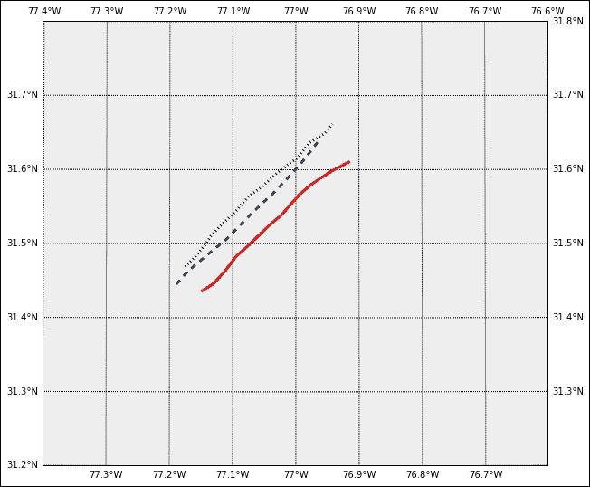

但是，此仿真的重点是所有这些路径的最终位置。 首先，将它们全部绘制在同一张地图上，以进行快速的视觉评估：

```py
In [21]: latitudes, longitudes = herndon.ix['1857-9-12 20:00:00'].values
In [22]: m = Basemap(llcrnrlon=-82., llcrnrlat=31, urcrnrlon=-76,
 ....:             urcrnrlat=32.5, projection='lcc', lat_0 = 31.5,
 ....:             lon_0=-78, resolution='h', area_thresh=1000.)
In [23]: X, Y = m(longitudes, latitudes)
In [24]: x, y = m(-81.2003759, 32.0405369)   # Savannah, GA
In [25]: m.plot(X, Y, 'ko', markersize=1); \
 ....: m.plot(x,y,'bo'); \
 ....: plt.text(x-10000, y+10000, 'Savannah, GA'); \
 ....: m.drawmeridians(np.arange(-82,-76,1), labels=[1,1,1,1]); \
 ....: m.drawparallels(np.arange(31,32.5,0.25), labels=[1,1,0,0]);\
 ....: m.drawcoastlines(); \
 ....: m.drawcountries(); \
 ....: m.fillcontinents(color='coral'); \
 ....: m.drawmapboundary(); \
 ....: plt.show()

```


为了更好地估计沉船的真实位置，可以通过使用挪威树皮埃伦的约翰逊船长的信息来扩展模拟。 这艘船在上午 8 点救出了几名幸存者。 在星期天，在 31º55'N，76º13'W 的记录位置。 我们可以采用类似的技术使用反向漂移来追溯到船只沉没的位置。 对于这种情况，天体中的不确定性可以通过标准偏差为 0.9（纬度）和 5.4 海里（经度）的双变量正态分布来建模。

### 小费

使用 El Dorado 的信息也可以进行第三次仿真，但是我们在计算中没有考虑到这一点。

由于此时唯一相关的信息是沉船的位置，因此我们不需要将中间位置保留在模拟路径中。 我们将数据记录在`pandas Series`中：

```py
In [26]: interval = []
In [27]: for k in range(10000):
 ....:     interval.append(k)
 ....:     interval.append(k)
 ....:
In [28]: ellen = pd.Series(index = [interval, ['Lat','Lon']*10000]);\
 ....: celestial_fix =multivariate_normal(cov=np.diag((0.9,5.4)));\
 ....: current = multivariate_normal((225, 1.25),
 ....:                               cov=np.diag((2./3, .25/3)))
In [29]: for k in range(10000):
 ....:    lat_delta, lon_delta = celestial_fix.rvs()*nautical_mile
 ....:    azimuth = 90 - np.angle(lat_delta+1j*lon_delta, deg=True)
 ....:    distance = np.hypot(lat_delta, lon_delta)
 ....:    output = vinc_pt(f, a, 31+55./60,
 ....:                     -76-13./60, azimuth, distance)
 ....:    ellen[k] = output[0:2]
 ....:
In [30]: for date in pd.date_range('1857-9-13 07:00:00', periods=12,
 ....:                           freq='-1h'):
 ....:     for k in range(10000):
 ....:         angle, speed = current.rvs()
 ....:         output = vinc_pt(f, a, ellen[k,'Lat'],
 ....:                          ellen[k,'Lon'], 90-angle, speed)
 ....:         ellen[k]=output[0:2]
 ....:

```

模拟的目的是构建地图，该地图指示根据纬度和经度发现沉船的可能性。 我们可以通过对模拟数据执行内核密度估计来构造它。 这种情况下的困难在于使用正确的度量。 不幸的是，我们无法在 SciPy 中基于 Vincenty 的公式创建适用于此操作的度量，但是，我们有两个选择：

*   使用库`scipy.stats`中的例程`gaussian_kde`，在小区域内进行线性近似
*   使用工具包`scikit-learn`中的类`KernelDensity`进行球面近似，并采用 Harvesine 度量和球树算法

第一种方法的优点是速度更快，并且最佳带宽的计算是在内部完成的。 如果我们能够提供正确的带宽，则第二种方法更准确。 无论如何，我们都将模拟用作训练数据以相同的方式准备数据：

```py
In [31]: training_latitudes, training_longitudes = herndon.ix['1857-9-12 20:00:00'].values; \
 ....: training_latitudes = np.concatenate((training_latitudes,
 ....:                                       ellen[:,'Lat'])); \
 ....: training_longitudes = np.concatenate((training_longitudes,
 ....:                                       ellen[:,'Lon'])); \
 ....: values = np.vstack([training_latitudes,
 ....:                     training_longitudes]) * np.pi/180.

```

对于线性近似，我们执行以下计算：

```py
In [32]: from scipy.stats import gaussian_kde
In [33]: kernel_scipy = gaussian_kde(values)

```

对于球面近似，并假设小于最佳带宽 10 <sup>-7</sup> ，我们改为发出以下内容：

```py
In [32]: from sklearn.neighbors import KernelDensity
In [33]: kernel_sklearn = KernelDensity(metric='haversine',
 ....:                                bandwidth=1.e-7,
 ....:                                kernel='gaussian',
 ....:                                algorithm='ball_tree')
 ....: kernel_sklearn.fit(values.T)
Out[33]:
KernelDensity(algorithm='ball_tree', atol=0, bandwidth=1e-07,
 breadth_first=True, kernel='gaussian', leaf_size=40,
 metric='haversine', metric_params=None, rtol=0)

```

从这里开始，我们需要做的就是生成一个映射，在其上构建一个网格，并使用这些值，对计算出的内核进行相应的评估。 这将为我们提供相应分布的**概率密度函数**（ **PDF** ）：

```py
In [34]: plt.figure(); \
 ....: m = Basemap(llcrnrlon=-77.1, llcrnrlat=31.4,urcrnrlon=-75.9,
 ....:             urcrnrlat=32.6, projection='lcc', lat_0 = 32,
 ....:             lon_0=-76.5, resolution='l', area_thresh=1000);\
 ....: m.drawmeridians(np.arange(-77.5,-75.5,0.2),
 ....:                 labels=[0,0,1,1]); \
 ....: m.drawparallels(np.arange(31,33,0.2), labels=[1,1,0,0]); \
 ....: grid_lon, grid_lat = m.makegrid(25, 25); \
 ....: xy = np.vstack([grid_lat.ravel(),
 ....:                 grid_lon.ravel()]) * np.pi/180.

```

PDF 的计算取决于所实现的内核，如下所示：

```py
In [35]: data = kernel_scipy(xy)
In [35]: data = np.exp(kernel_sklearn.score_samples(xy.T))

```

剩下的就是绘制结果。 我们显示第一种方法的结果，而将第二种方法作为一个不错的练习：

```py
In [36]: levels = np.linspace(data.min(), data.max(), 6); \
 ....: data = data.reshape(grid_lon.shape)
In [37]: grid_lon, grid_lat = m(grid_lon, grid_lat); \
 ....: cs = m.contourf(grid_lon, grid_lat, data,
 ....:                 clevels=levels, cmap=plt.cm.Greys); \
 ....: cbar = m.colorbar(cs, location='bottom', pad="10%"); \
 ....: plt.show()

```

这为我们提供了大约 50 x 50（海里）的区域，并以相应的密度着色。 较暗的区域表示发现沉船的可能性更高：

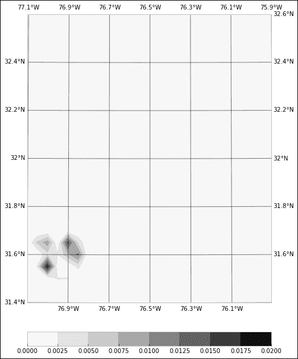

### 注意

中美洲 SS 遗骸的实际位置是在 31º35'N，77º02'W，与我们的粗略估算结果相差不大-实际上，与传达给海军陆战队的赫恩登船长的定位非常接近 。

这个简短的激励示例演示了 SciPy 堆栈执行统计模拟，以最佳方式存储和处理结果数据以及使用最新算法分析它们以提取有价值信息的能力。 在接下来的页面中，我们将更深入地介绍这些技术。

# 可能性

在 SciPy 堆栈中，我们有两种方法来确定概率：符号设置和数值设置。 在此简短的部分中，我们将比较这两个示例序列。

对于随机变量的符号处理，我们使用模块`sympy.stats`，而对于数值处理，我们使用模块`scipy.stats`。 在这两种情况下，目标都是相同的-任何随机变量的实例化，以及对它们的以下三种操作：

*   描述带有数字（参数）的随机变量的概率分布。
*   对随机变量的功能描述。
*   关联概率的计算。

让我们通过两种不同设置的范围来观察几种情况。

## 符号设定

让我们从离散随机变量开始。 例如，让我们考虑几个随机变量，这些变量用于描述滚动三个 6 面骰子，一个 100 面骰子的过程以及可能的结果：

```py
In [1]: from sympy import var; \
 ...: from sympy.stats import Die, sample_iter, P, variance, \
 ...:                         std, E, moment, cdf, density, \
 ...:                         Exponential, skewness
In [2]: D6_1, D6_2, D6_3 = Die('D6_1', 6), Die('D6_2', 6), \
 ...:                    Die('D6_3', 6); \
 ...: D100 = Die('D100', 100); \
 ...: X = D6_1 + D6_2 + D6_3 + D100

```

我们运行一个模拟，将这四个骰子投掷 20 次，并收集每次掷出的总和：

```py
In [3]: for item in sample_iter(X, numsamples=20):
 ...:     print item,
 ...:
45 50 84 43 44 84 102 38 90 94 35 78 67 54 20 64 62 107 59 84

```

让我们说明一下如何轻松计算与这些变量关联的概率。 例如，要计算出三个 6 面骰子的数量之和小于 100 面骰子的掷出次数的概率，可以按以下方式获得：

```py
In [4]: P(D6_1 + D6_2 + D6_3 < D100)
Out[4]: 179/200

```

条件概率也是可以实现的，例如，“如果掷两个 6 面骰子，如果第一个骰子显示 5，则获得至少 10 的概率是多少？”：

```py
In [5]: from sympy import Eq   # Don't use == with symbolic objects!
In [6]: P(D6_1 + D6_2 > 9, Eq(D6_1, 5))
Out[6]: 1/3

```

相关概率分布的参数的计算也非常简单。 在下面的会话中，我们获得`X`的方差，标准差和期望值，以及该变量在零附近的一些其他高阶矩：

```py
In [7]: variance(X), std(X), E(X)
Out[7]: (842, sqrt(842), 61)
In [8]: for n in range(2,10):
 ...:     print "mu_{0} = {1}".format(n, moment(X, n, 0))
 ...:
mu_2 = 4563
mu_3 = 381067
mu_4 = 339378593/10
mu_5 = 6300603685/2
mu_6 = 1805931466069/6
mu_7 = 176259875749813/6
mu_8 = 29146927913035853/10
mu_9 = 586011570997109973/2

```

我们也可以轻松计算出概率质量函数和累积密度函数：

```py
In [9]: cdf(X)                         In [10]: density(X)
Out[9]:                                Out[10]:
{4: 1/21600,                           {4: 1/21600,
 5: 1/4320,                             5: 1/5400,
 6: 1/1440,                             6: 1/2160,
 7: 7/4320,                             7: 1/1080,
 8: 7/2160,                             8: 7/4320,
 9: 7/1200,                             9: 7/2700,
 10: 23/2400,                           10: 3/800,
 11: 7/480,                             11: 1/200,
 12: 1/48,                              12: 1/160,
 13: 61/2160,                           13: 1/135,
 14: 791/21600,                         14: 181/21600,
 15: 329/7200,                          15: 49/5400,
 16: 1193/21600,                        16: 103/10800,
 17: 281/4320,                          17: 53/5400,
 18: 3/40,                              18: 43/4320,

...

 102: 183/200,                          102: 1/100,
 103: 37/40,                            103: 1/100,
 104: 4039/4320,                        104: 43/4320,
 105: 20407/21600,                      105: 53/5400,
 106: 6871/7200,                        106: 103/10800,
 107: 20809/21600,                      107: 49/5400,
 108: 2099/2160,                        108: 181/21600,
 109: 47/48,                            109: 1/135,
 110: 473/480,                          110: 1/160,
 111: 2377/2400,                        111: 1/200,
 112: 1193/1200,                        112: 3/800,
 113: 2153/2160,                        113: 7/2700,
 114: 4313/4320,                        114: 7/4320,
 115: 1439/1440,                        115: 1/1080,
 116: 4319/4320,                        116: 1/2160,
 117: 21599/21600,                      117: 1/5400,
 118: 1}                                118: 1/21600}

```

让我们进入连续随机变量。 此简短会话计算通用指数随机变量的密度和累积分布函数以及几个参数：

```py
In [11]: var('mu', positive=True); \
 ....: var('t'); \
 ....: X = Exponential('X', mu)
In [12]: density(X)(t)
Out[12]: mu*exp(-mu*t)
In [13]: cdf(X)(t)
Out[13]: Piecewise((1 - exp(-mu*t), t >= 0), (0, True))
In [14]: variance(X), skewness(X)
Out[14]: (mu**(-2), 2)
In [15]: [moment(X, n, 0) for n in range(1,10)]
Out[15]:
[1/mu,
 2/mu**2,
 6/mu**3,
 24/mu**4,
 120/mu**5,
 720/mu**6,
 5040/mu**7,
 40320/mu**8,
 362880/mu**9]

```

### 小费

有关模块`sympy.stats`的完整描述以及其所有已实现的随机变量的详尽列举，请参见[上的在线官方文档，网址为 http://docs.sympy.org/dev/modules/stats.html。](http://docs.sympy.org/dev/modules/stats.html) 。

## 数值设定

通过实现来自模块`scipy.stats`的对象`rv_discrete`来执行数字设置中离散随机变量的描述。 该对象具有以下方法：

*   `object.rvs`获取样品
*   `object.pmf`和`object.logpmf`分别计算概率质量函数及其对数
*   `object.cdf`和`object.logcdf`分别计算累积密度函数及其对数
*   `object.sf`和`object.logsf`分别计算生存函数（1-cdf）及其对数
*   `object.ppf`和`object.isf`计算百分比点函数（CDF 的倒数）和生存函数的倒数
*   `object.expect`和`object.moment`计算期望值和其他力矩
*   `object.entropy`计算熵
*   `object.median`，`object.mean`，`object.var`和`object.std`来计算基本参数（也可以通过`object.stats`方法访问）
*   `object.interval`计算具有给定概率的间隔，该间隔包含分布的随机实现

然后，我们可以使用骰子模拟一个实验，类似于上一节。 在这种情况下，我们通过骰子侧面集合的均匀分布来表示骰子：

```py
In [1]: import numpy as np, matplotlib.pyplot as plt; \
 ...: from scipy.stats import randint, gaussian_kde, rv_discrete
In [2]: D6 = randint(1, 7); \
 ...: D100 = randint(1, 101)

```

象征性地，构造这四个独立随机变量之和非常简单。 从数字上讲，我们以不同的方式处理这种情况。 假设一秒钟，我们不知道要获得的随机变量的种类。 我们的第一步通常是创建一个大样本，在这种情况下，将抛出 10,000 次，并生成带有结果的直方图：

```py
In [3]: samples = D6.rvs(10000) + D6.rvs(10000) \
 ...:         + D6.rvs(10000) + D100.rvs(10000)

In [4]: plt.hist(samples, bins=118-4); \
 ...: plt.xlabel('Sum of dice'); \
 ...: plt.ylabel('Frequency of each sum'); \
 ...: plt.show()

```

这给出了以下屏幕截图，清楚地表明我们的新随机变量不一致：

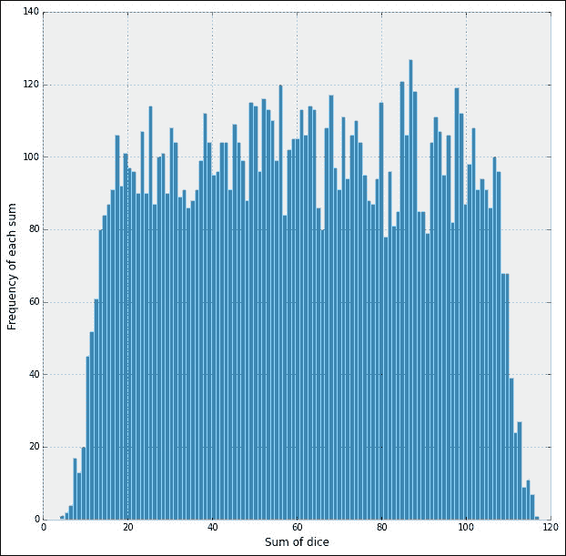

解决此问题的一种方法是根据此数据估算变量的分布，对于该任务，我们使用`scipy.stats`模块的函数`gaussian_kde`，该函数使用高斯内核执行内核密度估计：

```py
In [5]: kernel = gaussian_kde(samples)

```

该`gaussian_kde`对象具有与实际随机变量相似的方法。 为了估计相应的获得 50 的概率的值以及在这四个骰子的掷骰中获得大于 100 的概率的值，我们将分别发布：

```py
In [6]: kernel(50)                     # The actual answer is 1/100
Out[6]: array([ 0.00970843])
In [7]: kernel.integrate_box_1d(0,100) # The actual answer is 177/200
Out[7]: 0.88395064140531865

```

代替估计随机变量的总和，并再次假设我们对实际结果不熟悉，我们可以通过根据被加数的概率质量函数定义其概率质量函数来创建实际随机变量。 钥匙？ 当然，卷积，因为这些骰子的随机变量是独立的。 样本空间是从 4 到 118 的一组数字（以下命令中的`space_sum`），并且与每个元素相关的概率（`probs_sum`）被计算为每个骰子在其样本空间上的对应概率的卷积 ：

```py
In [8]: probs_6dice = D6.pmf(np.linspace(1,6,6)); \
 ...: probs_100dice = D100.pmf(np.linspace(1,100,100))
In [9]: probs_sum = np.convolve(np.convolve(probs_6dice,probs_6dice),
 ...:                    np.convolve(probs_6dice,probs_100dice)); \
 ...: space_sum = np.linspace(4, 118, 115)
In [10]: sum_of_dice = rv_discrete(name="sod",
 ....:                           values=(space_sum, probs_sum))
In [11]: sum_of_dice.pmf(50)
Out[11]: 0.0099999999999999985
In [12]: sum_of_dice.cdf(100)
Out[12]: 0.89500000000000057

```

# 数据探索

数据探索通常是通过呈现其分布的有意义的综合来进行的-它可以通过一系列图形，通过使用一组数值参数进行描述或通过简单函数对其进行近似来实现。 现在，让我们探索不同的可能性，以及如何使用 SciPy 堆栈中的不同工具来实现它们。

## 用图表描绘分布

图的类型取决于变量的类型（分类，定量或日期）。

### 条形图和饼图

当我们用分类变量描述数据时，我们经常使用饼图或条形图来表示它。 例如，我们可以从消费者金融保护局的 [http://catalog.data.gov/dataset/consumer-complaint-database](http://catalog.data.gov/dataset/consumer-complaint-database) 访问消费者投诉数据库。 该数据库于 2014 年 2 月创建，包含了无线电通信局收到的有关金融产品和服务的投诉。 在同年 3 月的更新版本中，它包含了自 2011 年 11 月以来获得的近 300,000 起投诉：

```py
In [1]: import numpy as np, pandas as pd, matplotlib.pyplot as plt
In [2]: data = pd.read_csv("Consumer_Complaints.csv",
 ...:                     low_memory=False, parse_dates=[8,9])
In [3]: data.head()
Out[3]:
 Complaint ID                  Product  \
0       1015754          Debt collection 
1       1015827          Debt collection 
2       1016131          Debt collection 
3       1015974  Bank account or service 
4       1015831  Bank account or service 

 Sub-product  \
0  Other (phone, health club, etc.) 
1                               NaN 
2                           Medical 
3                  Checking account 
4                  Checking account 

 Issue  \
0  Cont'd attempts collect debt not owed 
1    Improper contact or sharing of info 
2        Disclosure verification of debt 
3  Problems caused by my funds being low 
4  Problems caused by my funds being low 

 Sub-issue State  ZIP code  \
0                         Debt was paid    NY     11433 
1     Contacted me after I asked not to    VT      5446 
2  Right to dispute notice not received    TX     77511 
3                                   NaN    FL     32162 
4                                   NaN    TX     77584 

 Submitted via Date received Date sent to company  \
0           Web    2014-09-05           2014-09-05 
1           Web    2014-09-05           2014-09-05 
2           Web    2014-09-05           2014-09-05 
3           Web    2014-09-05           2014-09-05 
4           Web    2014-09-05           2014-09-05 

 Company  \
0                     Enhanced Recovery Company, LLC 
1                     Southwest Credit Systems, L.P. 
2                      Expert Global Solutions, Inc. 
3  FNIS (Fidelity National Information Services, ... 
4                                     JPMorgan Chase 

 Company response Timely response?  \
0  Closed with non-monetary relief              Yes 
1                      In progress              Yes 
2                      In progress              Yes 
3          Closed with explanation              Yes 
4          Closed with explanation              Yes 

 Consumer disputed? 
0                NaN 
1                NaN 
2                NaN 
3                NaN 
4                NaN 

```

### 小费

我们以他们提供的最简单格式（一个逗号分隔值的文件）下载了数据库。 我们使用命令`read_csv`从`pandas`进行操作。 如果要以其他格式（JSON，Excel 等）下载数据库，则只需相应地调整读取命令：

```py
>>> pandas.read_csv("Consumer_Complaints.csv")    # CSV
>>> pandas.read_json("Consumer_Complaints.json")  # JSON
>>> pandas.read_excel("Consumer_Complaints.xls")  # XLS

```

更令人惊讶的是，如果我们知道其 URL，则可以在线检索数据（无需将其保存到我们的计算机）：

```py
>>> url1 = "https://data.consumerfinance.gov/api/views"
>>> url2 = "/x94z-ydhh/rows.csv?accessType=DOWNLOAD"
>>> url = url1 + url2
>>> data = pd.read_csv(url)

```

如果数据库包含琐碎的数据，则解析器可能会与相应的`dtype`混淆。 在这种情况下，我们要求解析器尝试解决这种情况，但以使用更多的内存资源为代价。 我们可以通过包含可选的布尔标志`low_memory=False`来实现此目的，就像我们的运行示例一样。

另外，请注意我们如何指定`parse_dates=True`。 使用数据对文件进行的初步探索表明，第八列和第九列均代表日期。 库`pandas`具有强大的功能，无需借助复杂的`str`操作即可操作这些库，因此我们向读者指示将这些列转换为正确的格式。 这将减轻我们以后对数据的处理。

现在，让我们展示一个条形图，指示每个`Product`上每个公司有多少不同的投诉：

```py
In [4]: data.groupby('Product').size()
Out[4]:
Product
Bank account or service     35442
Consumer loan                8187
Credit card                 39114
Credit reporting            35761
Debt collection             37737
Money transfers              1341
Mortgage                   118037
Payday loan                  1228
Student loan                 8659
dtype: int64
In [5]: _.plot(kind='barh'); \
 ...: plt.tight_layout(); \
 ...: plt.show()

```

这为我们提供了以下有趣的水平条形图，显示了从 2011 年 11 月到 2014 年 9 月每种产品的投诉量：

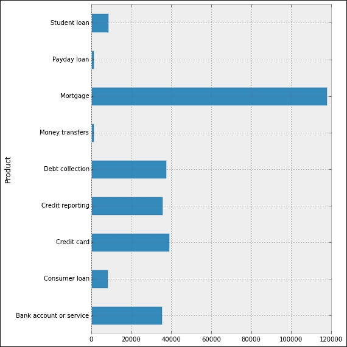

### 注意

`pandas`数据帧上的`groupby`方法等效于 SQL 中的`GROUP BY`。 有关熊猫中所有 SQL 命令及其等效数据框方法的完整说明，请在线访问 [http://pandas.pydata.org/pandas-docs/stable/comparison_with_sql.html](http://pandas.pydata.org/pandas-docs/stable/comparison_with_sql.html) ，获取大量资源。

通过正确堆叠条形图，可以获得另一种有用的条形图。 例如，如果我们专注于 2012 年和 2013 年间有关中西部抵押贷款的投诉，则可以发出以下命令：

```py
In [6]: midwest = ['ND', 'SD', 'NE', 'KS', 'MN', 'IA', \
 'MO', 'IL', 'IN', 'OH', 'WI', 'MI']
In [7]: df = data[data.Product == 'Mortgage']; \
 ...: df['Year'] = df['Date received'].map(lambda t: t.year); \
 ...: df = df.groupby(['State','Year']).size(); \
 ...: df[midwest].unstack().ix[:, 2012:2013]
Out[7]:
Year   2012  2013
State 
ND       14    20
SD       33    34
NE      109   120
KS      146   169
MN      478   626
IA       99   125
MO      519   627
IL     1176  1609
IN      306   412
OH     1047  1354
WI      418   523
MI     1457  1774
In [8]: _.plot(kind="bar", stacked=True, colormap='Greys'); \
 ...: plt.show()

```

该图清楚地说明了在这些州，2013 年是如何引起大量投诉的：

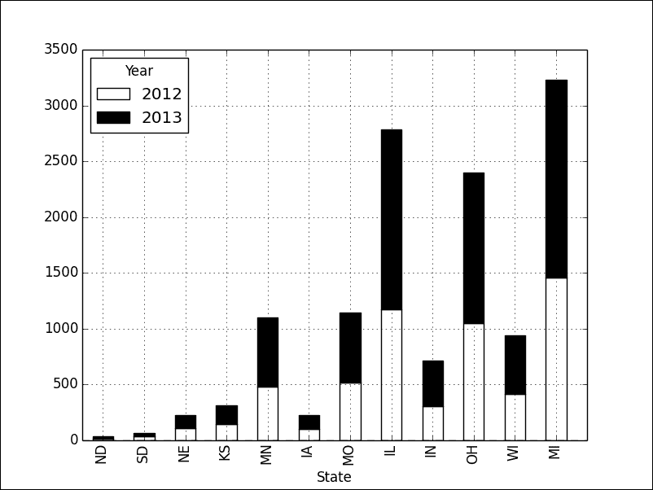

鉴于先前的图表，我们可能倾向于认为，在美国的每个州或地区，抵押贷款都是头号投诉。 从 2011 年 11 月到 2014 年 9 月，仅在波多黎各的饼图显示每种产品的投诉量就不同了：

```py
In [9]: data[data.State=='PR'].groupby('Product').size()
Out[9]:
Product
Bank account or service     81
Consumer loan               20
Credit card                149
Credit reporting           139
Debt collection             62
Mortgage                   110
Student loan                11
Name: Company, dtype: int64
In [10]: _.plot(kind='pie', shadow=True, autopct="%1.1f%%"); \
 ....: plt.axis('equal'); \
 ....: plt.tight_layout(); \
 ....: plt.show()

```

该图说明了信用卡和信用报告是这些岛上投诉的主要来源：

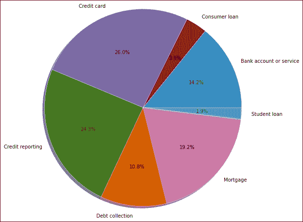

### 直方图

对于定量变量，我们使用直方图。 在上一节中，我们看到了由 10,000 个四骰子掷出构成直方图的示例。 在本节中，我们从`pandas`内生成另一个直方图。 在这种情况下，我们想提供一个直方图来分析每日关于信用卡的投诉与每日关于抵押的投诉的比率：

```py
In [11]: df = data.groupby(['Date received', 'Product']).size(); \
 ....: df = df.unstack()
In [12]: ratios = df['Mortgage'] / df['Credit card']
In [13]: ratios.hist(bins=50); \
 ....: plt.show()

```

例如，结果图表明，在几天中，对抵押贷款的投诉数量约为信用卡投诉数量的 12 倍。 它还表明，最常见的情况是在几天中抵押贷款投诉数量大约是信用卡投诉数量的三倍：

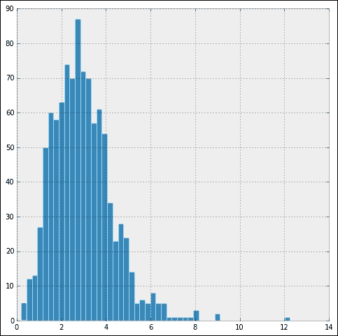

### 时间图

对于随时间间隔测量的变量，我们使用时间图。 库`pandas`可以很好地处理这些问题。 例如，要观察从 2012 年 1 月 1 日到 2013 年 12 月 31 日每天收到的投诉量，我们发出以下命令：

```py
In [14]: ts = data.groupby('Date received').size(); \
 ....: ts = ts['2012':'2013']; \
 ....: ts.plot(); \
 ....: plt.ylabel('Daily complaints'); \
 ....: plt.show()

```

请注意图表的振荡性质，以及在此期间投诉的轻微上升趋势。 我们还会观察到一些离群值-一个在 2012 年 3 月，一个在同年 5 月至 6 月之间，以及在 2013 年 1 月和 2013 年 2 月：

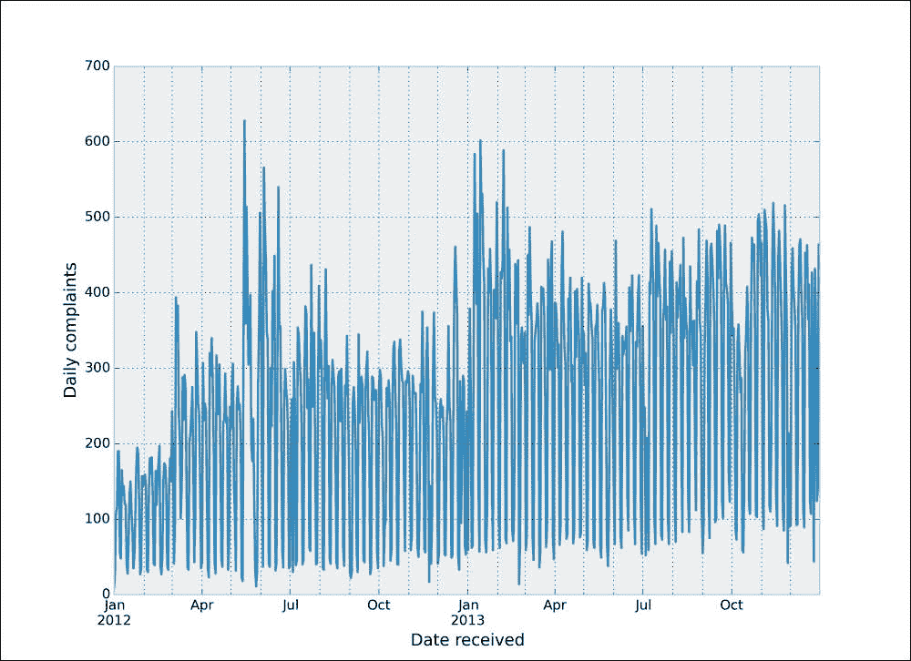

## 用数字和箱形图描述分布

我们要求每个数据集使用常规参数：

*   平均值（算术，几何或谐波）和中位数以测量数据中心
*   四分位数，方差，标准差或均值的标准误，用于测量数据的传播
*   中心矩，偏度和峰度用于测量数据分布中的对称程度
*   在数据中查找最常见值的模式
*   先前参数的修整版，可以更好地描述数据分布，从而减少离群值的影响

呈现上述某些信息的一种好方法是借助五位数摘要或带箱线图。

让我们说明如何在`pandas`（左列）和`scipy.stats`库（右列）中实现这些基本测量：

```py
In [15]: ts.describe()                 In [16]: import scipy.stats
Out[15]:
count     731.000000                   In [17]: scipy.stats.describe(ts) 
mean      247.333789                   Out[17]: 
std       147.02033                    (731,
min         9.000000                   (9, 628),
25%       101.000000                    247.33378932968537,
50%       267.000000                    21614.97884301858,
75%       364.000000                    0.012578861206579875,
max       628.000000                    -1.1717653990872499)
dtype: float64

```

第二个输出为我们提供计数（`731 = 366 + 365`），最小值和最大值（`min=9`，`max=628`），算术平均值（`247`），无偏方差（`21614`），偏斜度（`0.0126`） 和偏峰度（`-1.1718`）。

使用`pandas`（众数和标准偏差）和`scipy.stats`（50 和 600 之间的所有值的均值和修整方差的标准误差）进行的其他参数计算：

```py
In [18]: ts.mode()               In [20]: scipy.stats.sem(ts)
Out[18]:                         Out[20]: 5.4377435122312807
0    59
dtype: int64                     In [21]: scipy.stats.tvar(ts, [50, 600])
 Out[21]: 17602.318623850999
In [19]: ts.std()
Out[19]: 147.02033479426774

```

### 小费

有关`scipy.stats`库中所有统计功能的完整说明，最好的参考是 [http://docs.scipy.org/doc/scipy/reference/stats.html](http://docs.scipy.org/doc/scipy/reference/stats.html) 上的官方文档。

在参数计算中可以忽略`NaN`值。 熊猫中的大多数数据框和序列方法都会自动执行此操作。 如果需要不同的行为，我们可以用那些`NaN`值替代我们认为适当的任何值。 例如，如果我们希望以前的任何计算都考虑所有日期，而不仅考虑注册的日期，则可以在这些事件中将零投诉的值强加于人。 我们使用`dataframe.fillna(0)`方法执行此操作。

使用库`scipy.stats`，如果我们想忽略数组中的`NaN`值，我们可以使用相同的例程在名称前附加关键字`nan`：

```py
>>> scipy.stats.nanmedian(ts)
267.0

```

无论如何，我们计算出的时间序列显示绝对没有`NaN` －在 2012 年和 2013 年，每天每天至少有 9 笔日常财务投诉。

回到中西部地区有关抵押贷款的投诉，以说明箱线图的威力，我们将调查每个州在 2013 年每月对抵押贷款的投诉数量：

```py
In [22]: in_midwest = data.State.map(lambda t: t in midwest); \
 ....: mortgages = data.Product == 'Mortgage'; \
 ....: in_2013 =data['Date received'].map(lambda t: t.year==2013);\
 ....: df = data[mortgages & in_2013 & in_midwest]; \
 ....: df['month'] = df['Date received'].map(lambda t: t.month); \
 ....: df = df.groupby(['month', 'State']).size(); \
 ....: df.unstack()
Out[22]:
State  IA   IL  IN  KS   MI  MN  MO  ND  NE   OH  SD  WI
month 
1      11  220  40  12  183  99  91   3  13  163   5  58
2      14  160  37  16  180  45  47   2  12  120 NaN  37
3       7  138  43  18  184  52  57   3  11  131   5  50
4      14  148  33  19  185  55  52   2  14  104   3  48
5      14  128  44  16  172  63  57   2   8  109   3  43
6      20  136  47  13  164  51  47 NaN  13  116   7  52
7       5  127  30  16  130  57  62   2  11  127   5  39
8      11  133  32  15  155  64  55 NaN   8  120   1  51
9      10  121  24  16   99  31  55 NaN   8  109 NaN  37
10      9   96  35  12  119  50  37   3  10   83 NaN  35
11      4  104  22  10   96  22  39   2   6   82   3  32
12      6   98  25   6  107  37  28   1   6   90   2  41
In [23]: _.boxplot(); \
 ....: plt.show()

```

该箱线图说明了在中西部各州（伊利诺伊州，俄亥俄州和密歇根州）每月抵押贷款投诉最多的情况。 例如，以密歇根州（MI）为例，相应的箱线图表明点差从 96 上升至 185 每月投诉。 该州每月投诉的中位数约为 160。第一和第三四分位数分别为 116 和 180：

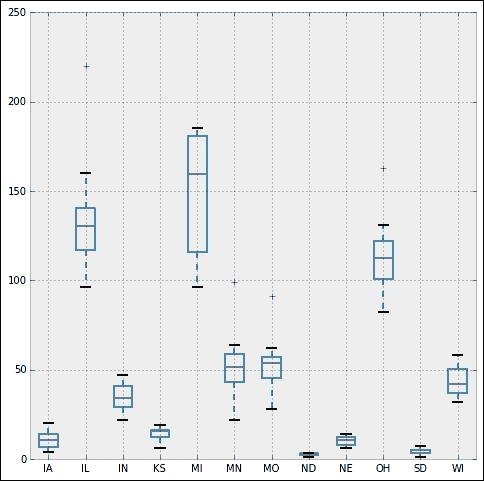

小提琴图是一个箱形图，每侧都有旋转的核密度估计。 这显示了不同值的数据的概率密度。 我们可以从`statsmodels`子模块`graphics.boxplots`使用图形例程`violinplot`获得这些图。 让我们用与之前相同的数据来说明这种图：

### 小费

另一种选择是将小提琴图与所有单个数据点的线散布图结合起来。 我们将其称为 **bean 图**，并且在同一子模块`statsmodels.graphics.boxplot`中具有例程`beanplot`的实现。

```py
In [24]: from statsmodels.graphics.boxplots import violinplot
In [25]: df = df.unstack().fillna(0)
In [26]: violinplot(df.values, labels=df.columns); \
 ....: plt.show()

```

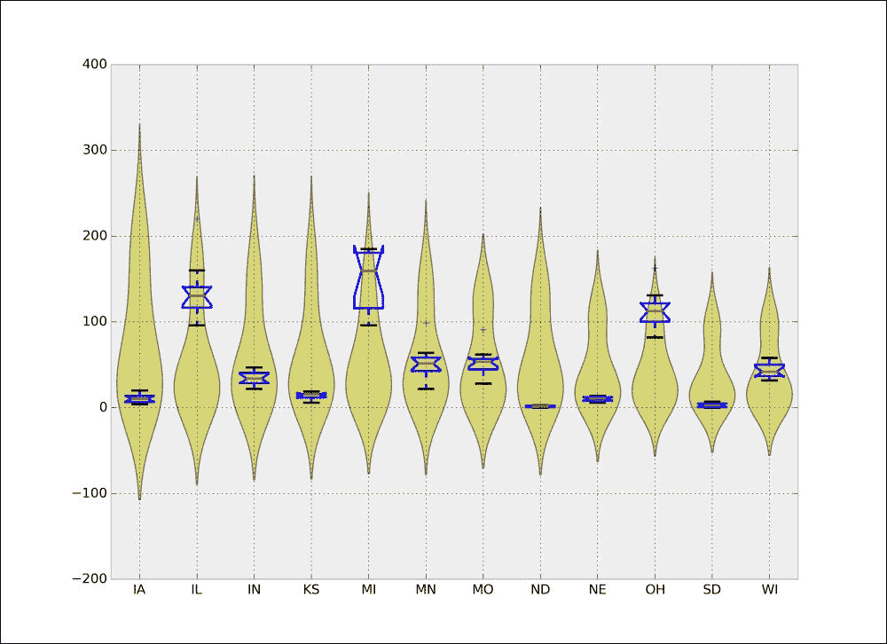

## 定量变量之间的关系

为了表达两个定量变量之间的关系，我们采用三种技术：

*   **散点图**，以可视方式识别该关系
*   **相关系数**的计算，表示通过线性函数表示该关系的可能性
*   **回归**功能是一种预测变量相对于另一个变量的值的方法

### 散点图和关联

例如，我们将尝试在四个人口稠密的州（伊利诺伊州，纽约州，得克萨斯州和加利福尼亚州）和波多黎各的领土之间找到有关抵押贷款投诉数量的任何关系。 我们将比较 2011 年 12 月至 2014 年 9 月期间每个月的投诉数量：

```py
In [27]: from pandas.tools.plotting import scatter_matrix
In [28]: def year_month(t):
 ....:     return t.tsrftime("%Y%m")
 ....: 
In [29]: states = ['PR', 'IL', 'NY', 'TX', 'CA']; \
 ....: states = data.State.map(lambda t: t in states); \
 ....: df = data[states & mortgages]; \
 ....: df['month'] = df['Date received'].map(year_month); \
 ....: df.groupby(['month', 'State']).size().unstack()
Out[29]:
State      CA   IL   NY  PR   TX
month 
2011/12   288   34   90   7   63
2012/01   444   77   90   2  104
2012/02   446   80  110   3  115
2012/03   605   78  179   3  128
2012/04   527   69  188   5  152
2012/05   782  100  242   3  151
2012/06   700  107  204 NaN  153
2012/07   668  114  198   3  153
2012/08   764  108  228   3  187
2012/09   599   92  192   1  140
2012/10   635  125  188   2  150
2012/11   599   99  145   6  130
2012/12   640  127  219   2  128
2013/01  1126  220  342   3  267
2013/02   928  160  256   4  210
2013/03   872  138  270   1  181
2013/04   865  148  254   5  200
2013/05   820  128  242   4  198
2013/06   748  136  232   1  237
2013/07   824  127  258   5  193
2013/08   742  133  236   3  183
2013/09   578  121  203 NaN  178
2013/10   533   96  193   2  123
2013/11   517  104  173   1  141
2013/12   463   98  163   4  152
2014/01   580   80  201   3  207
2014/02   670  151  189   4  189
2014/03   704  141  245   4  182
2014/04   724  146  271   4  212
2014/05   559  110  212  10  175
2014/06   480  107  226   6  141
2014/07   634  113  237   1  171
2014/08   408  105  166   5  118
2014/09     1  NaN    1 NaN    1
In [30]: df = _.dropna(); \
 ....: scatter_matrix(df); \
 ....: plt.show()

```

这给出了每个状态对数据之间的散点图矩阵，以及每个状态下相同数据的直方图：

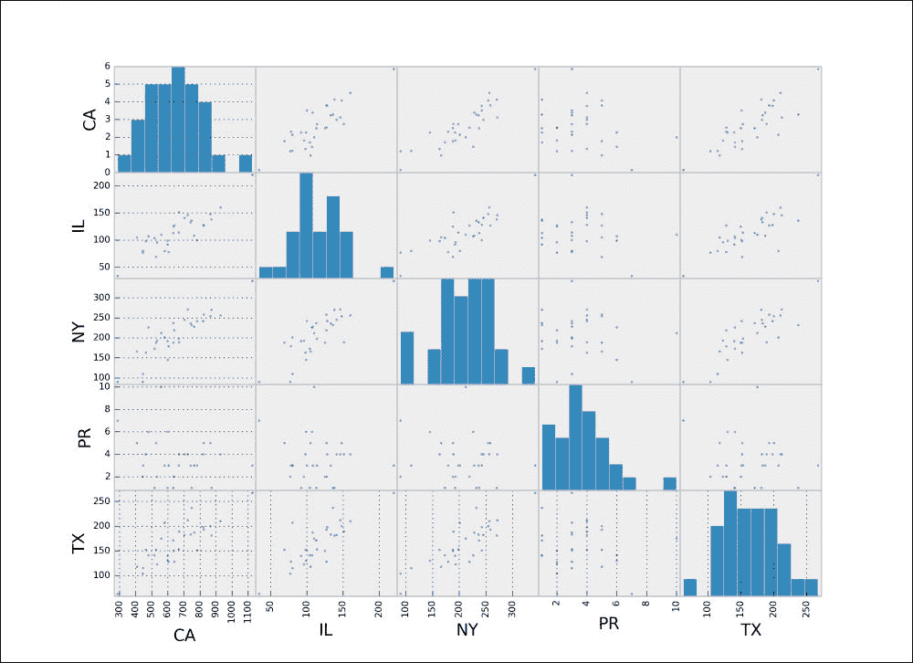

对于添加了置信椭圆的散点图网格，我们可以使用软件包`statsmodels`的图形模块`graphics.plot_grids`中的例程`scatter_ellipse`：

```py
In [31]: from statsmodels.graphics.plot_grids import scatter_ellipse
In [32]: scatter_ellipse(df, varnames=df.columns); \
 ....: plt.show()

```

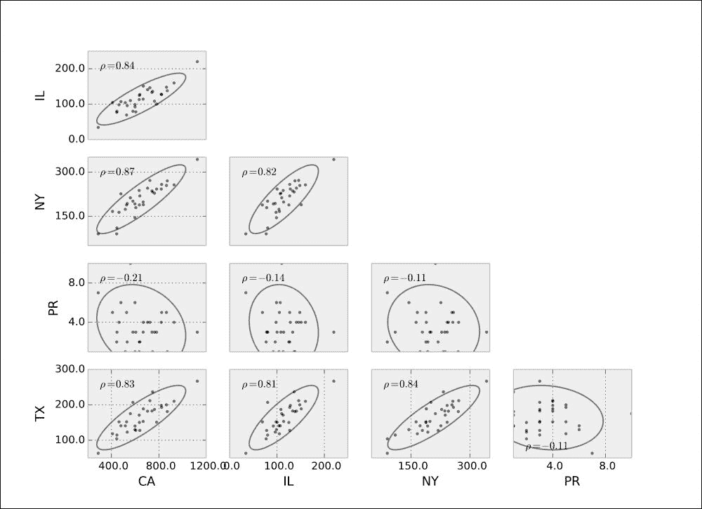

请注意，每个图像如何附带额外的信息。 这是两个变量（在这种情况下为皮尔森氏）的相应相关系数。 看起来几乎完全对齐的数据的相关系数的绝对值非常接近 1。 我们还可以通过`pandas`数据帧方法`corr`获得所有这些系数：

```py
In [33]: df.corr(method="pearson")
Out[33]:
State        CA        IL        NY        PR        TX
State 
CA     1.000000  0.844015  0.874480 -0.210216  0.831462
IL     0.844015  1.000000  0.818283 -0.141212  0.805006
NY     0.874480  0.818283  1.000000 -0.114270  0.837508
PR    -0.210216 -0.141212 -0.114270  1.000000 -0.107182
TX     0.831462  0.805006  0.837508 -0.107182  1.000000

```

### 小费

除了标准的 Pearson 相关系数之外，该方法还允许我们为序数数据（`kendall`）或 Spearman 排名（`spearman`）计算 Kendall Tau：

在模块`scipy.stats`中，我们还具有用于计算这些相关系数的例程。

*   `pearsonr`用于 Pearson 相关系数和用于测试非相关性的 p 值
*   `spearmanr`用于 Spearman 等级相关系数和 p 值以测试不相关
*   `kendalltau`代表肯德尔的牛头
*   `pointbiserial`表示点双数相关系数和关联的 p 值

视觉上显示相关性的另一种可能性是借助于颜色网格。 子模块`statsmodels.graphics.correlation`的图形例程`plot_corr`完成工作：

```py
In [34]: from statsmodels.graphics.correlation import plot_corr
In [35]: plot_corr(df.corr(method='spearman'),
 ....:           xnames=df.columns.tolist()); \
 ....: plt.show()

```

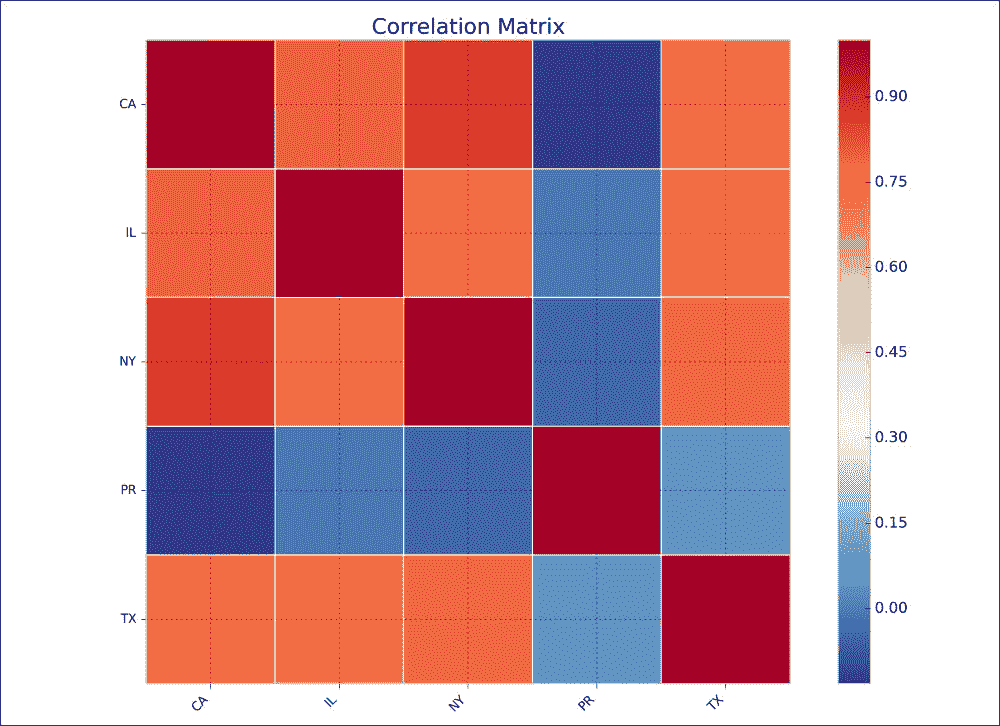

最大的关联发生在纽约州和加利福尼亚州之间（0.874480）。 在下一节中，我们将使用与这两种状态相对应的数据作为后续示例。

### 回归

散点图帮助我们确定了可能通过功能关系关联数据的情况。 这使我们能够制定规则以预测变量的值，而该变量会相互了解。 当我们怀疑存在这样的公式时，我们想找到一个很好的近似值。

在本章中，我们遵循统计学家和数据分析师的行话，因此，我们将其称为**回归**，而不是将其称为**近似**。 我们还附加了一个形容词，指示我们寻求的公式的类型。 这样，如果函数是线性的，我们就称为线性回归；如果函数是多项式的，我们就称为多项式回归，依此类推。 同样，就另一单个变量而言，回归并不一定只涉及一个变量。 因此，我们区分了单变量回归和多元回归。 让我们探索用于回归的不同设置，以及如何从 SciPy 堆栈中解决它们。

#### 中型数据集的普通线性回归

在任何给定情况下，我们都可以使用在最小二乘意义上的近似和插值探索中学到的工具，这些知识在[第 1 章](../Text/1.xhtml#aid-DB7S2 "Chapter 1\. Numerical Linear Algebra")，*数值线性代数*和[中 第 2 章](../Text/2.xhtml#aid-K0RQ2 "Chapter 2\. Interpolation and Approximation")和*插值和近似*。 两个库`scipy.stack`和`statsmodels`中以及工具包`scikit-learn`中都有许多工具可以执行此操作和相关分析：

*   在`scipy.stats`库中计算普通最小二乘回归线`linregress`的基本例程。
*   `scikit-learn`工具包中的`LinearRegression`类，位于`sklearn.linear_model`。
*   在`patsy`包的帮助下，`statsmodel`库中有一组不同的回归例程。

让我们从`scipy.stats`库中通过`linregress`的最简单方法开始。 我们想探索加利福尼亚州和纽约州每月对抵押贷款的投诉数量之间的几乎线性关系：

```py
In [36]: x, y = df[['NY', 'CA']].T.values
In [37]: slope,intercept,r,p,std_err = scipy.stats.linregress(x,y); \
 ....: print "Formula: CA = {0} + {1}*NY".format(intercept, slope)
Formula: CA = 65.7706648926 + 2.82130682025*NY

In [38]: df[['NY', 'CA']].plot(kind='scatter', x='NY', y='CA'); \
 ....: xspan = np.linspace(x.min(), x.max()); \
 ....: plt.plot(xspan, intercept + slope * xspan, 'r-', lw=2); \
 ....: plt.show()

```

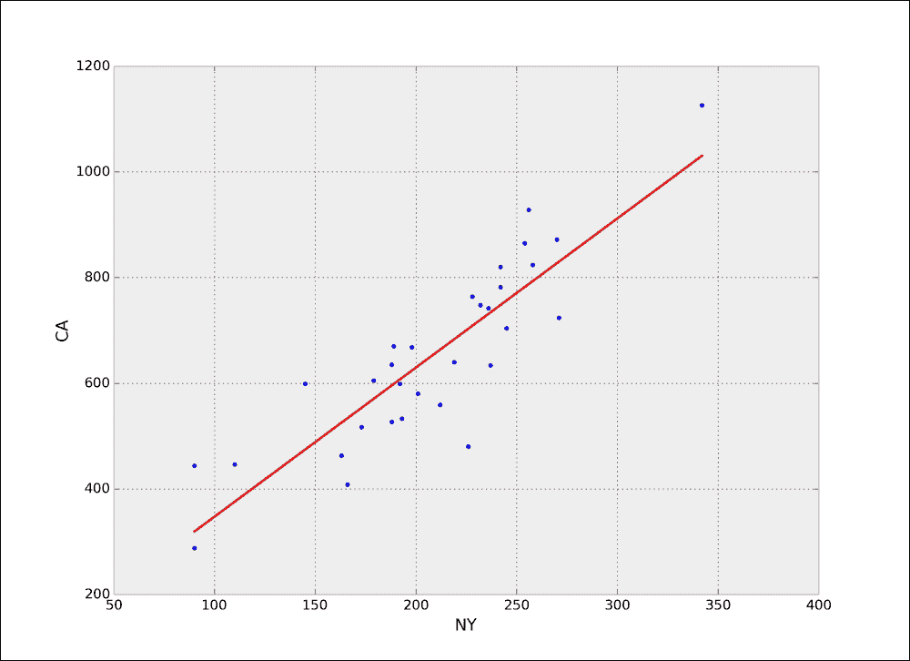

这与通过使用`scikit-learn`工具包中的`LinearRegression`获得的结果完全相同：

```py
In [39]: from sklearn.linear_model import LinearRegression
In [40]: model = LinearRegression()
In [41]: x = np.resize(x, (x.size, 1))
In [42]: model.fit(x, y)
Out[42]: LinearRegression(copy_X=True, fit_intercept=True,
 ....:                  normalize=False)
In [43]: model.intercept_
Out[43]: 65.770664892647233
In [44]: model.coef_
Out[44]: array([ 2.82130682])

```

要对该普通最小二乘回归线进行更高级的处理，以提供更多的信息图和摘要，我们使用`statsmodels`中的例程`ols`以及其一些令人敬畏的绘图工具：

```py
In [45]: import statsmodels.api as sm; \
 ....: from statsmodels.formula.api import ols
In [46]: model = ols("CA ~ NY", data=df).fit()
In [47]: print model.summary2()
 Results: Ordinary least squares
 ==========================================================
 Model:                OLS    AIC:                 366.3982
 Dependent Variable:   CA     BIC:                 369.2662
 No. Observations:     31     Log-Likelihood:      -181.20
 Df Model:             1      F-statistic:         94.26 
 Df Residuals:         29     Prob (F-statistic):  1.29e-10
 R-squared:            0.765  Scale:               7473.2 
 Adj. R-squared:       0.757 
 ----------------------------------------------------------
 Coef.  Std.Err.   t    P>|t|   [0.025   0.975]
 ----------------------------------------------------------
 Intercept 65.7707  62.2894 1.0559 0.2997 -61.6254 193.1667
 NY         2.8213   0.2906 9.7085 0.0000   2.2270   3.4157
 ----------------------------------------------------------
 Omnibus:            1.502      Durbin-Watson:        0.921
 Prob(Omnibus):      0.472      Jarque-Bera (JB):     1.158
 Skew:               -0.465     Prob(JB):             0.560
 Kurtosis:           2.823      Condition No.:        860 
 ==========================================================

```

### 小费

一种有趣的方法来表达一个事实，即我们想要获得一个相对于变量`NY: CA ~ NY`的变量`CA`的公式。 归功于`patsy`库，该舒适的语法成为可能，该库负责进行所有相关的解释并在后台处理相应的数据。

可以使用子模块`statsmodels.graphics.regressionplots`中的图形例程`plot_fit`来显示拟合：

```py
In [48]: from statsmodels.graphics.regressionplots import plot_fit
In [49]: plot_fit(model, 'NY'); \
 ....: plt.show()

```

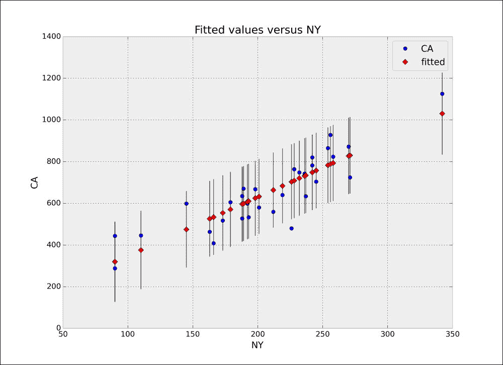

让我们还说明如何使用`statsmodels`进行多元线性回归。 对于以下示例，我们将在 2013 年收集我们怀疑与之相关的三种产品的投诉数量。 我们将尝试找到一个公式，将抵押贷款投诉的总数与信用卡和学生贷款的投诉数量进行近似计算：

```py
In [50]: products = ['Student loan', 'Credit card', 'Mortgage']; \
 ....: products = data.Product.map(lambda t: t in products); \
 ....: df = data[products & in_2013]; \
 ....: df = df.groupby(['State', 'Product']).size()
 ....: df = df.unstack().dropna()
In [51]: X = df[['Credit card', 'Student loan']]; \
 ....: X = sm.add_constant(X); \
 ....: y = df['Mortgage']
In [52]: model = sm.OLS(y, X).fit(); \
 ....: print model.summary2()
 Results: Ordinary least squares
 ===============================================================
 Model:                OLS       AIC:                 827.7591 
 Dependent Variable:   Mortgage  BIC:                 833.7811 
 No. Observations:     55        Log-Likelihood:      -410.88 
 Df Model:             2         F-statistic:         286.6 
 Df Residuals:         52        Prob (F-statistic):  8.30e-29 
 R-squared:            0.917     Scale:               1.9086e+05
 Adj. R-squared:       0.914 
 ---------------------------------------------------------------
 Coef.  Std.Err.    t    P>|t|    [0.025   0.975]
 ---------------------------------------------------------------
 const         2.1214  77.3360  0.0274 0.9782 -153.0648 157.3075
 Credit card   6.0196   0.5020 11.9903 0.0000    5.0121   7.0270
 Student loan -9.9299   2.5666 -3.8688 0.0003  -15.0802  -4.7796
 ---------------------------------------------------------------
 Omnibus:             20.251      Durbin-Watson:         1.808 
 Prob(Omnibus):       0.000       Jarque-Bera (JB):      130.259
 Skew:                -0.399      Prob(JB):              0.000 
 Kurtosis:            10.497      Condition No.:         544 
 ===============================================================

```

注意`r-squared`的值，所以要接近`1`。 这表明已经计算出线性公式，并且相应的模型很好地拟合了数据。 现在，我们可以生成一个可视化显示它：

```py
In [53]: from mpl_toolkits.mplot3d import Axes3D
In [54]: xspan = np.linspace(X['Credit card'].min(),
 ....:                     X['Credit card'].max()); \
 ....: yspan = np.linspace(X['Student loan'].min(),
 ....:                     X['Student loan'].max()); \
 ....: xspan, yspan = np.meshgrid(xspan, yspan); \
 ....: Z = model.params[0] + model.params[1] * xspan + \
 ....:     model.params[2] * yspan; \
 ....: resid = model.resid
In [55]: fig = plt.figure(figsize=(8, 8)); \
 ....: ax = Axes3D(fig, azim=-100, elev=15); \
 ....: surf = ax.plot_surface(xspan, yspan, Z, cmap=plt.cm.Greys,
 ....:                        alpha=0.6, linewidth=0); \
 ....: ax.scatter(X[resid>=0]['Credit card'],
 ....:            X[resid>=0]['Student loan'],
 ....:            y[resid >=0],
 ....:            color = 'black', alpha=1.0, facecolor='white'); \
 ....: ax.scatter(X[resid<0]['Credit card'],
 ....:            X[resid<0]['Student loan'],
 ....:            y[resid<0],
 ....:            color='black', alpha=1.0); \
 ....: ax.set_xlabel('Credit cards'); \
 ....: ax.set_ylabel('Student loans'); \
 ....: ax.set_zlabel('Mortgages'); \
 ....: plt.show()

```

相应的图以白色显示平面上方的数据点，以黑色显示平面下方的数据点。 平面的强度由抵押投诉数量的相应预测值确定（较亮的区域等于低的残差，较暗的区域等于高的残差）。

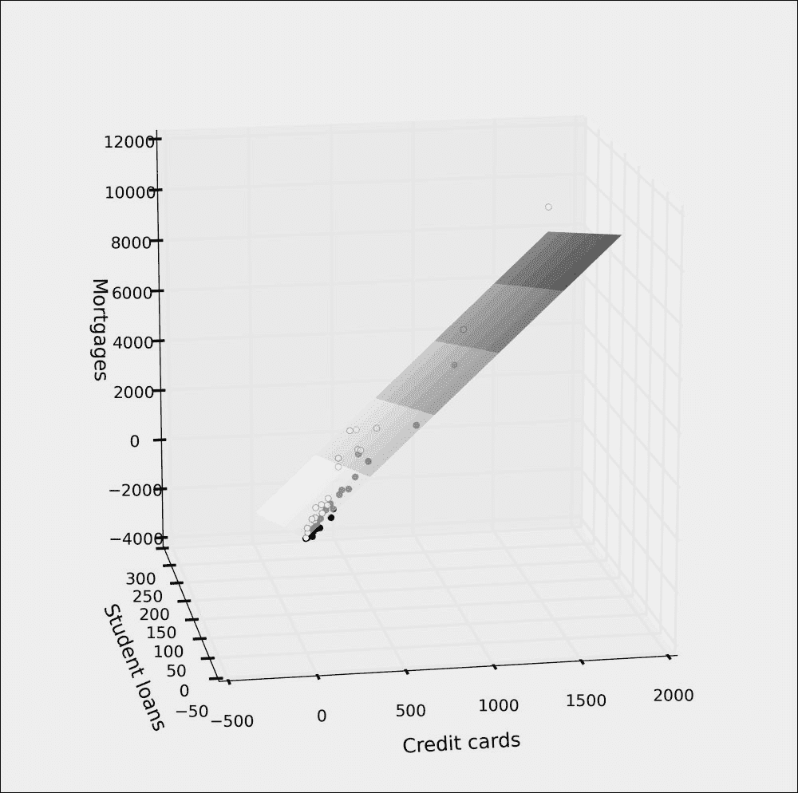

#### 大型数据集的普通最小二乘回归

对于大型数据集（超过 100,000 个样本）的线性回归，最优算法使用**随机梯度下降**（ **SGD** ）回归学习，并具有不同的损失函数和损失。 我们可以使用`sklearn.linear_model`中的`SGDregressor`类访问它们。

#### 超出普通最小二乘法的线性回归

在多元线性回归的一般情况下，如果不着重于特定变量集，我们将采用岭回归。 我们通过`scikit-learn`工具包中的`sklearn.linear_model.Ridge`类进行操作。

Ridge 回归基本上是一种普通的最小二乘算法，对涉及的系数大小有额外的惩罚。 它的性能也可以与普通最小二乘法相媲美，因为它们的复杂度大致相同。

在任何给定的线性回归中，如果我们承认只有很少的变量对整体回归有很大影响，则首选方法是**最小绝对收缩和选择算子**（ **LASSO** ）和 **弹性网**。 当样本数量远大于变量数量时，我们选择套索，并寻找一个稀疏公式，其中与非重要变量相关的大多数系数为零。

当变量数量接近或大于样本数量时，弹性网始终是首选算法。

两种方法都可以通过`scikit-learn`-`sklearn.linear_model.lasso`和`sklearn.linear_model.ElasticNet`类实现。

#### 支持向量机

支持向量回归是另一种强大的算法，其前提是训练数据的子集对整个变量集有很大影响。 这种解决不平衡问题的方法的优势在于，只需将算法中的核函数更改为决策函数，我们就可以访问不同类型的回归（不仅是线性回归）。 但是，当变量多于样本时，这不是一个好选择。

在`scipy-learn`工具包中，我们有两个不同的类来实现此算法的变体：`svm.SCV`和`svm.NuSVC`。 带有线性核的`svm.SVC`的简化变体可以称为`svm.LinearSVC`类。

#### 设定方法

当其他所有方法都失败时，我们有几种算法结合了几种基本估计量的功能。 这些算法分为两个大家族：

*   **平均方法**：此方法通过平均来组合估计量，以减少残差方差的值
*   **增强方法**：这建立了一系列弱估计量，这些估计量收敛到回归而没有任何偏差

有关通过`scikit-learn`工具包对这些方法，示例和实现的详细说明，请参阅[上的官方文档，网址为 http://scikit-learn.org/stable/modules/ensemble.html](http://scikit-learn.org/stable/modules/ensemble.html) 。

## 时间序列分析

时间序列建模和分析的子领域也非常丰富。 从企业业务/行业指标（经济预测，股票市场分析，效用研究等）到生物过程（流行病学动态，人口研究等），这种数据出现在许多过程中。 建模和分析背后的思想是，随着时间的推移获取的数据可能具有某种基础结构，例如，对于预测目的，跟踪该趋势是理想的。

我们使用 **Box-Jenkins** 模型（也称为**自回归综合移动平均值**模型，或简称为 **ARIMA** ）将系列的现值与 过去的值和过去的预测错误。 在包`statsmodels`中，我们通过子模块`statsmodels.tsa`中的以下类实现：

*   为了描述**自回归**模型 **AR（p）**，我们使用类`ar_model.AR`或等效地为`arima_model.AR`。
*   为了描述**自回归移动平均值**模型 **ARMA（p，q）**，我们采用了`arima_model.ARMA`类。 卡尔曼滤波器的实现可帮助 ARIMA 模型。 我们用`kalmanf.kalmanfilter.KalmanFilter`（同样在`statsmodels.tsa`子模块中）调用此代码。
*   For the general **ARIMA** model **ARIMA(p,d,q)**, we use the classes `arima_model.ARIMA`.

    ### 小费

    可以使用不同类型的模型根据其自身的历史预测时间序列-使用滞后和差异的回归模型，随机游走模型，指数平滑模型和季节性调整。 实际上，所有这些类型的模型都是 Box-Jenkins 模型的特例。

一个基本的例子就足够了。 回想一下我们通过收集 2013 年和 2014 年所有日常投诉创建的时间序列。从其图上可以明显看出，我们的时间序列`ts`不是季节性的，也不是平稳的（有轻微的上升趋势）。 该系列过于尖锐，无法进行舒适的分析。 在进行任何描述之前，我们会每周对其进行重新采样。 对于此任务，我们使用`pandas`时间序列的重采样方法：

```py
In [56]: ts = ts.resample('W')
In [57]: ts.plot(); \
 ....: plt.show()

```

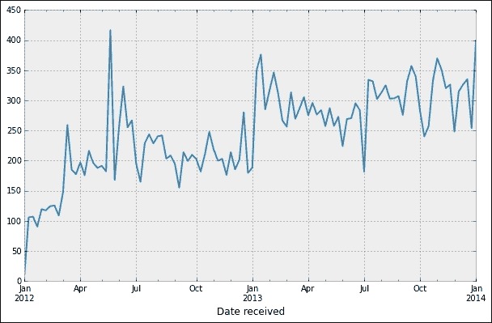

使用第一个或第二个差异去趋势化–这表明我们必须使用带有`d=1`或`d=2`的 ARIMA（p，d，q）模型来描述它。

让我们计算和可视化第一个差异序列`ts[date] - ts[date-1]`：

### 小费

在`pandas`中，我们有一个很好的方法来计算任何时间段之间的差异，例如`ts.diff(periods=k)`。

```py
In [58]: ts_1st_diff = ts.diff(periods=1)[1:]
In [59]: ts_1st_diff.plot(marker='o'); \
 ....: plt.show()

```

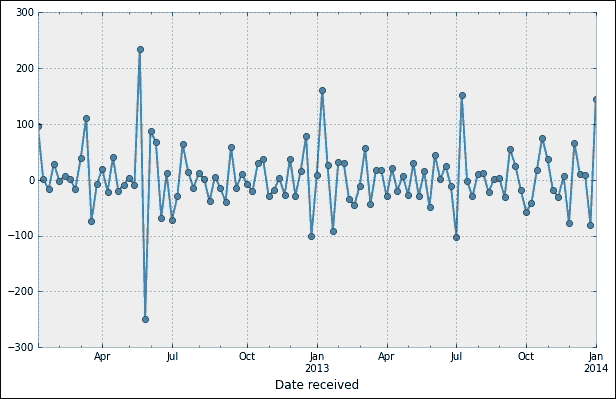

确实看起来像是平稳的系列。 因此，我们将为 ARIMA 模型选择`d=1`。 接下来，是该新时间序列的相关图的可视化。 我们有两种方法来执行此任务：`pandas`中的基本自相关和滞后图，以及`statsmodels.api.graphics.tsa`中的一组更复杂的相关图：

```py
In [60]: from pandas.tools.plotting import autocorrelation_plot, \
 ....:                                   lag_plot
In [61]: autocorrelation_plot(ts_1st_diff); \
 ....: plt.show()

```

这给出了下图，显示了在不同时滞（在这种情况下，从 0 到 1000 天）中数据与自身的相关性。 黑色实线对应于 95％置信带，虚线对应于 99％置信带：

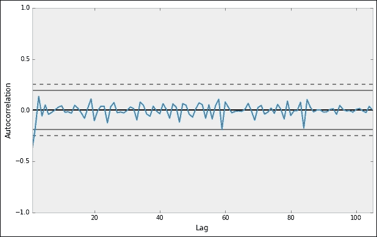

在非随机时间序列的情况下，一个或多个自相关将明显为非零。 请注意，在我们的情况下，此图对于随机性是一个很好的情况。

滞后图加强了这种观点：

```py
In [62]: lag_plot(ts_1st_diff, lag=1); \
 ....: plt.axis('equal'); \
 ....: plt.show()

```

在这种情况下，我们选择了一天的滞后图，该图既不显示对称也不显示明显的结构：

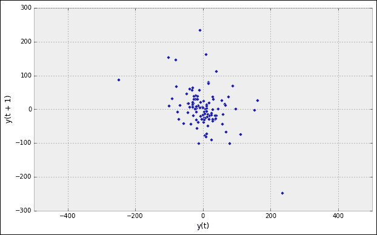

`statsmodels`库通过其子模块`tsa`和`api.graphics.tsa`擅长处理时间序列。 例如，要像以前一样执行自相关，但这次将延迟限制为 40，我们发出`sm.graphics.tsa.plot_acf`。 我们可以使用以下命令：

```py
In [63]: fig = plt.figure(); \
 ....: ax1 = fig.add_subplot(211); \
 ....: ax2 = fig.add_subplot(212); \
 ....: sm.graphics.tsa.plot_acf(ts_1st_diff, lags=40,
 ....:                          alpha=0.05, ax=ax1); \
 ....: sm.graphics.tsa.plot_pacf(ts_1st_diff, lags=40,
 ....:                           alpha=0.05, ax=ax2); \
 ....: plt.show()

```

这是呈现自相关函数的另一种方式，但同样有效。 注意我们如何控制置信带。 我们对 alpha 的选择决定了其含义-例如，在这种情况下，通过选择`alpha=0.05`，我们强加了 95％的置信带。

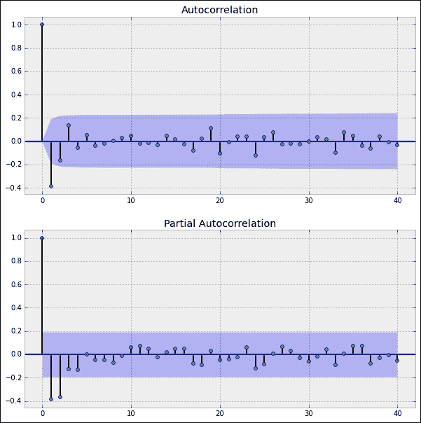

为了将相应的值呈现给计算出的自相关，我们使用子模块`statsmodels.tsa.stattools`中的例程`acf`和`pacf`：

```py
In [64]: from statsmodels.tsa.stattools import acf, pacf
In [65]: acf(ts_1st_diff, nlags=40)
Out[65]:
array([ 1\.        , -0.38636166, -0.16209701,  0.13397057,
 -0.0555708 ,  0.05048394, -0.0407119 , -0.02082811,
 0.0040006 ,  0.02907198,  0.04330283, -0.02011055,
 -0.01537464, -0.02978855,  0.04849505,  0.01825439,
 -0.02593023, -0.07966487,  0.02102888,  0.10951272,
 -0.10171504, -0.00645926,  0.03973507,  0.03865624,
 -0.12395291,  0.03391616,  0.07447618, -0.02474901,
 -0.01742892, -0.02676263, -0.00276295,  0.03135769,
 0.0155686 , -0.09556651,  0.07881427,  0.04804349,
 -0.03797063, -0.05942366,  0.03913402, -0.00854744, - 
 0.03463874])
In [66]: pacf(ts_1st_diff, nlags=40)
Out[66]:
array([ 1\.        , -0.39007667, -0.37436812, -0.13265923,
 -0.14290863, -0.00457552, -0.05168091, -0.05241386,
 -0.07909324, -0.01776889,  0.06631977,  0.07931566,
 0.0567529 , -0.02606054,  0.02271939,  0.05509316,
 0.06013166, -0.09309867, -0.11283787,  0.03704051,
 -0.06223677, -0.05993707, -0.03659954,  0.07764279,
 -0.16189567, -0.11602938,  0.00638008,  0.09157757,
 0.04046057, -0.04838127, -0.08806197, -0.02527639,
 0.06392126, -0.13768596,  0.00641743,  0.11618549,
 0.12550781, -0.14070774, -0.05995693, -0.0024937 ,
 -0.0905665 ])

```

鉴于先前计算的相关图，我们有一个`MA(1)`签名； ACF 图中有一个负尖峰，而 PACF 图中有一个衰减模式（从下方）。 ARIMA 模型的一个明智的参数选择是`p=0`，`q=1`和`d=1`（这对应于一个简单的指数平滑模型，可能添加了一个常数项）。 然后，使用以下选择进行模型描述和进一步的预测：

```py
In [67]: from statsmodels.tsa import arima_model
In [68]: model = arima_model.ARIMA(ts, order=(0,1,1)).fit()

```

在运行时，此代码通知我们有关其实现的一些详细信息：

```py
RUNNING THE L-BFGS-B CODE

 * * *

Machine precision = 2.220D-16
 N =            2     M =           12
 This problem is unconstrained.

At X0         0 variables are exactly at the bounds

At iterate    0    f=  5.56183D+02    |proj g|=  2.27373D+00

At iterate    5    f=  5.55942D+02    |proj g|=  1.74759D-01

At iterate   10    f=  5.55940D+02    |proj g|=  0.00000D+00

 * * *

Tit   = total number of iterations
Tnf   = total number of function evaluations
Tnint = total number of segments explored during Cauchy searches
Skip  = number of BFGS updates skipped
Nact  = number of active bounds at final generalized Cauchy point
Projg = norm of the final projected gradient
F     = final function value

 * * *

 N    Tit     Tnf  Tnint  Skip  Nact     Projg        F
 2     10     12      1     0     0   0.000D+00   5.559D+02
 F =   555.940373727761 

CONVERGENCE: NORM_OF_PROJECTED_GRADIENT_<=_PGTOL 

 Cauchy                time 0.000E+00 seconds.
 Subspace minimization time 0.000E+00 seconds.
 Line search           time 0.000E+00 seconds.

 Total User time 0.000E+00 seconds.

```

类`arima_model.ARIMA`的方法`fit`在`statsmodels.tsa`，`arima_model_ARIMAResults`中创建了一个新类，其中包含我们需要的所有信息以及一些提取方法：

```py
In [69]: print model.summary()

```

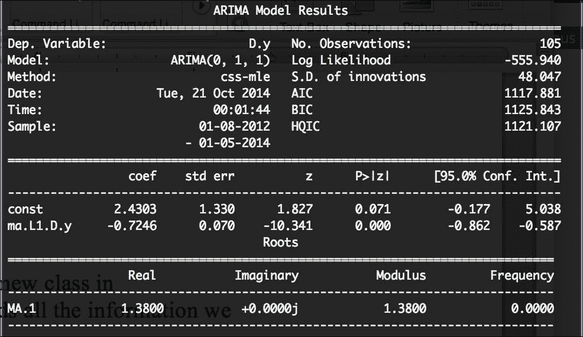

让我们观察一下残差的相关图。 我们可以使用对象模型的方法`resid`计算这些值：

```py
In [70]: residuals = model.resid
In [71]: fig = plt.figure(); \
 ....: ax1 = fig.add_subplot(211); \
 ....: ax2 = fig.add_subplot(212); \
 ....: sm.graphics.tsa.plot_acf(residuals, lags=40,
 ....:                          alpha=0.05, ax=ax1); \
 ....: ax1.set_title('Autocorrelation of the residuals of the ARIMA(0,1,1) model'); \
 ....: sm.graphics.tsa.plot_pacf(residuals, lags=40,
 ....:                           alpha=0.05, ax=ax2); \
 ....: ax2.set_title('Partial Autocorrelation of the residuals of the ARIMA(0,1,1) model'); \
 ....: plt.show()

```

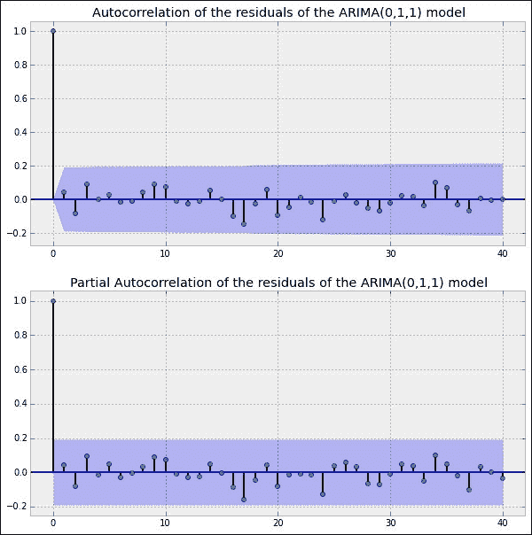

这些图表明我们选择了一个好的模型。 剩下的只是使用它来产生预测。 为此，我们在对象模型中采用了方法`predict`。 例如，通过考虑自 2013 年 10 月以来的所有数据进行的 2014 年前几周的预测可以如下执行：

```py
In [72]: np.where((ts.index.year==2013) & (ts.index.month==10))
Out[72]: (array([92, 93, 94, 95]),)
In [73]: prediction = model.predict(start=92, end='1/15/2014')
In [74]: prediction['10/2013':].plot(lw=2, label='forecast'); \
 ....: ts_1st_diff['9/2013':].plot(style='--', color='red',
 ....:                  label='True data (first differences)'); \
 ....: plt.legend(); \
 ....: plt.show()

```

这给了我们以下预测：

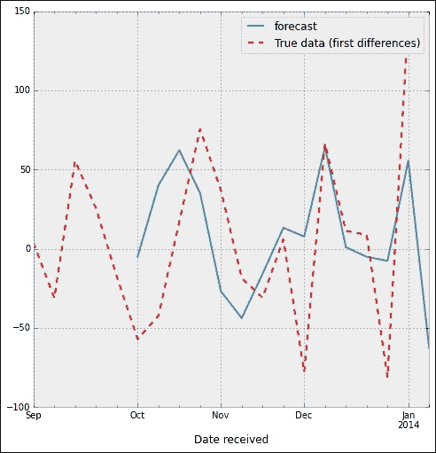

# 摘要

到此为止，我们分两章介绍了数据分析的第一部分，其中我们探索了 SciPy 堆栈中用于计算和描述性统计的可视化的高级 Python 工具。 在下一章中，我们对推断统计，数据挖掘和机器学习进行类似的处理。