# 八、推断和数据分析

上一章介绍的各种描述性统计技术使我们可以直接从数据中展示事实。 下一个逻辑步骤是**推论**-提出主张并得出比样本数据所代表的人口更大的结论的过程。

本章将涵盖以下主题：

*   统计推断。
*   数据挖掘和机器学习。

# 统计推断

统计推断是通过数据分析来推断基础分布的属性的过程。 推断统计分析可推断总体的属性； 这包括检验假设和推导估计。

有三种类型的推断：

*   *参数最合适的单个值的估计*。
*   *间隔估计*，用于评估参数值的哪个区域与给定数据最一致。
*   *假设检验*，以确定在两个选项之间哪个参数值与数据最一致。

解决这些问题的方法主要有三种：

*   **Frequentist** ：根据重复采样的性能来判断推断。
*   **贝叶斯**：推断必须是主观的。 为我们寻求的参数选择一个先验分布，然后在获得联合分布之前将数据的密度合并起来。 贝叶斯定理的进一步应用为我们提供了给定数据的参数分布。 要在此设置下执行计算，我们使用包`PyMC`。
*   **可能性**：推论基于以下事实：有关参数的所有信息都可以通过检查与概率密度函数成比例的似然函数来获得。

在本节中，我们简要说明三种推断类型的三种方法。 我们回到前面的例子中，每天抵押贷款对信用卡的投诉比率：

```py
In [1]: import numpy as np, pandas as pd, matplotlib.pyplot as plt
In [2]: data = pd.read_csv("Consumer_Complaints.csv", \
 ...:                     low_memory=False, parse_dates=[8,9])
In [3]: df = data.groupby(['Date received', 'Product']).size(); \
 ...: df = df.unstack(); \
 ...: ratios = df['Mortgage'] / df['Credit card']
In [4]: ratios.describe()
Out[4]:
count    1001.000000
mean        2.939686
std         1.341827
min         0.203947
25%         1.985507
50%         2.806452
75%         3.729167
max        12.250000
dtype: float64

```

通过直方图的目视检查，我们可以很好地假设此数据是来自具有参数`mu`（平均值）和`sigma`（标准偏差）的正态分布的随机样本。 为了简单起见，我们进一步假设比例参数`sigma`是已知的，并且其值为`1.3`。

### 小费

在本节的稍后部分，我们将实际探索 SciPy 堆栈中拥有哪些工具来更精确地确定数据的分布。

## 参数估计

在这种情况下，我们要解决的问题是使用获得的数据估算平均值`mu`。

### 惯常做法

这是最简单的设置。 常用方法使用估计的数据平均值：

```py
In [5]: ratios.mean()
Out[5]: 2.9396857495543731
In [6]: from scipy.stats import sem  # Standard error
In [7]: sem(ratios.dropna())
Out[7]: 0.042411109594665049

```

### 小费

然后，常客会说：*参数* `mu` *的估计值为* `2.9396857495543731` *，标准误差为* `0.042411109594665049`。

### 贝叶斯方法

对于贝叶斯方法，我们为`mu`选择一个先验分布，我们可以方便地假定它是具有标准偏差`1.3`的正态分布。 平均值`mu`被视为变量，最初，我们假定其值可以在数据范围内的任何位置（具有均匀分布）。 然后，我们使用贝叶斯定理为`mu`计算**后验分布**。 然后，我们估计的参数是`mu`的后验分布的平均值：

```py
In [8]: import pymc as pm
In [9]: mu = pm.Uniform('mu', lower=ratios.min(), upper=ratios.max())
In [10]: observation = pm.Normal('obs', mu=mu, tau=1./1.3**2,
 ....:                        value=ratios.dropna(), observed=True)
In [11]: model = pm.Model([observation, mu])

```

### 注意

请注意，在`PyMC`中，正态分布的定义如何需要平均参数`mu`，但是期望标准精度`tau = 1/sigma**2`而不是标准偏差或方差。

变量`observation`通过选项`value=ratios.dropna()`将我们的数据与我们建议的数据生成方案结合，该方案由变量`mu`给出。 为了确保在分析过程中保持不变，我们施加`observed=True`。

在学习步骤中，我们使用**马氏链蒙特卡洛**（ **MCMC** ）方法返回大量随机变量，用于`mu`的后验分布：

```py
In [12]: mcmc = pm.MCMC(model)
In [13]: mcmc.sample(40000, 10000, 1)
[---------------100%---------------] 40000 of 40000 complete in 4.5 sec
In [14]: mcmc.stats()
Out[14]:
{'mu': {'95% HPD interval': array([ 2.86064764,  3.02292213]),
 'mc error': 0.00028222883254203107,
 'mean': 2.9396811517572554,
 'n': 30000,
 'quantiles': {2.5: 2.8589908555161485,
 25: 2.9117191652137464,
 50: 2.9396815504225815,
 75: 2.9675088640073439,
 97.5: 3.0216312862055279},
 'standard deviation': 0.041412844137324857}}
In [15]: mcmc.summary()
Out[15]:
mu:
 Mean             SD               MC Error        95% HPD interval
 ------------------------------------------------------------------
 2.94             0.041            0.0              [ 2.861  3.023]

 Posterior quantiles:
 2.5             25              50              75            97.5
 |---------------|===============|===============|---------------|
 2.859            2.912           2.94           2.968        3.022
In [16]: from pymc.Matplot import plot as mcplot
In [17]: mcplot(mcmc); \
 ....: plt.show()
Plotting mu

```

我们应该得到类似于以下的输出：

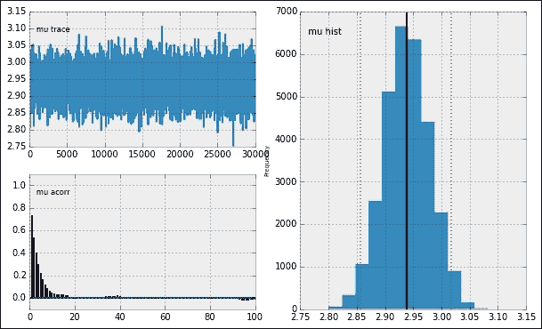

参数的估计值为`2.93968`。 `mu`的后验分布的标准偏差为`0.0414`。

### 可能性方法

我们有一个方便的方法来执行似然法，以估计子模块`scipy.stats`中表示为类的任何分布的参数。 在我们的例子中，由于我们要固定标准偏差（`scale`作为该特定类的正态分布参数），我们将发出以下命令：

```py
In [18]: from scipy.stats import norm as NormalDistribution
In [19]: NormalDistribution.fit(ratios.dropna(), fscale=1.3)
Out[19]: (2.9396857495543736, 1.3)

```

这为我们提供了相似的均值。 `mu`的（非负对数）似然函数图可以如下获得：

```py
In [20]: nnlf = lambda t: NormalDistribution.nnlf([t, 1.3],
 ....:                                  ratios.dropna()); \
 ....: nnlf = np.vectorize(nnlf)
In [21]: x = np.linspace(0, 14); \
 ....: plt.plot(x, nnlf(x), lw=2, color='r',
 ....:       label='Non-negative log-likely function for $\mu$'); \
 ....: plt.legend(); \
 ....: plt.annotate('Minimum', xy=(2.9, nnlf(2.9)), xytext=(0,20),
 ....:         textcoords='offset points', ha='right', va='bottom',
 ....:         bbox=dict(boxstyle='round,pad=0.5', fc='yellow',
 ....:                   color='k', alpha=1),
 ....:         arrowprops=dict(arrowstyle='->', color='k',
 ....:                         connectionstyle='arc3,rad=0')); \
 ....: plt.show()

```

我们应该得到类似于以下的输出：


无论如何，结果在视觉上是我们期望的：

```py
In [22]: distribution = NormalDistribution(loc=2.9396857495543736,
 ....:                                   scale=1.3)
In [23]: plt.plot(x, distribution.pdf(x), 'r-', lw=2,
 ....:          label='Computed Probability Density Function'); \
 ....: ratios.hist(bins=50, alpha=0.2, normed=True,
 ....:             label='Histogram of data (normalized)'); \
 ....: plt.legend(); \
 ....: plt.show()

```

我们应该得到类似于以下的输出：

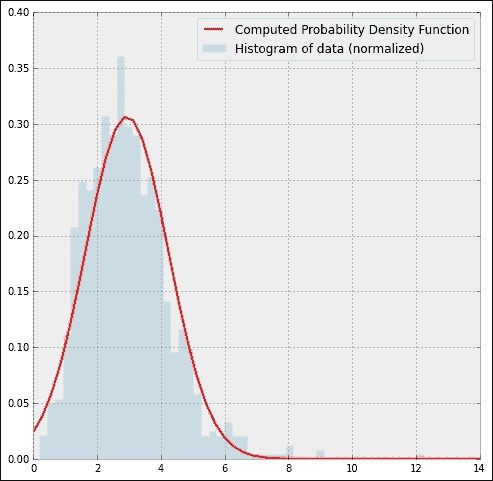

## 间隔估算

在此设置中，我们寻求数据支持的`mu`值的间隔。

### 惯常做法

在常识性方法中，我们从提供一个小的**置信系数** `alpha`开始，然后继续寻找一个间隔，以使包含参数`mu`的概率为`1-alpha`。 在我们的示例中，我们设置`alpha = 0.05`（因此，施加的概率为 95％），然后使用定义在模块`scipy.stats`中的连续分布的任何类别的方法`interval`来计算间隔：

```py
In [24]: loc = ratios.mean(); \
 ....: scale = ratios.sem(); \
 ....: NormalDistribution.interval(0.95, scale=scale, loc=loc)
Out[24]: (2.8565615022044484, 3.0228099969042979)

```

根据该方法，`2.8565615022044484`和`3.0228099969042979`之间的平均值`mu`的值与基于 95％置信区间的数据一致。

### 贝叶斯方法

在贝叶斯方法中，等效于置信区间的区域称为**可信区域**（或**区间**），并且与**最高后验密度区域**相关联。 一组参数的最可能值，这些值合计构成后部质量的`100*(1 - alpha)`百分比。

回想一下，当使用 MCMC 进行采样时，我们获得了`alpha = 0.05`的可靠区域。

为了获得其他 alpha 值的可信区间，我们直接在子模块`pymc.utils`中使用例程`hpd`。 例如，`alpha = 0.01`的最高后验密度区域计算如下：

```py
In [25]: pm.utils.hpd(mcmc.trace('mu')[:], 1-.99)
Out[25]: array([ 2.83464531,  3.04706652])

```

### 可能性方法

这也可以借助任何分布的方法`nnlf`来完成。 在这种情况下，我们需要确定似然性超过`1/k`的参数值的间隔，其中`k`为 8（有力证据）或 32（非常有力证据）。

相应间隔的估计然后是优化的简单应用。 我们将此作为练习。

# 数据挖掘与机器学习

我们将集中讨论三种问题：*分类*，*降维*和*聚类*。 这些问题中的每一个都用于数据挖掘和机器学习中，以得出有关数据的结论。 让我们在不同的部分中解释每个设置。

## 分类

分类是**监督学习**的示例。 有一组**训练数据**，其属性将其分类为几种类别之一。 目的是为新数据找到该属性的值。 例如，通过运行中的数据库，我们可以使用 2013 年以来的所有数据来确定哪些财务投诉为客户带来了积极的解决，哪些财务投诉得到了缓解而没有解决，哪些仍在*进行中* 。 例如，这将为我们提供很好的见解，例如哪些公司可以更快地积极响应消费者的投诉，某些州解决投诉的可能性较小等。

让我们从查找数据库中观察到的公司回复类型开始：

```py
In [1]: import numpy as np, pandas as pd, matplotlib.pyplot as plt
In [2]: data = pd.read_csv("Consumer_Complaints.csv",
 ...:                    low_memory=False, parse_dates=[8,9])
In [3]: print data['Company response'].unique()
['Closed with non-monetary relief' 'In progress' 'Closed with explanation'
 'Closed with monetary relief' 'Closed' 'Untimely response'
 'Closed without relief' 'Closed with relief']

```

这是八个不同的类别，也是我们确定未来投诉命运的目标。 让我们通过收集 2013 年提出的所有投诉并创建一个训练数据集，并仅保留我们认为与决策过程相关的列：

*   引发投诉的产品和子产品。
*   消费者与产品有关的问题（但不是子问题）。
*   说明投诉所在的州（而非邮政编码）。
*   投诉方式。
*   提供服务的公司。

该训练数据的大小将指示要用于分类的算法。

### 小费

在处理数据之前，我们需要对非数字标签进行编码，以便可以使用不同的分类算法对其进行正确处理。 我们使用模块`sklearn.preprocessing`中的类`LabelEncoder`进行此操作。

然后，我们将尝试对 2014 年提出的所有投诉进行分类：

```py
In [4]: in_2013 = data['Date received'].map(lambda t: t.year==2013);\
 ...: in_2014 = data['Date received'].map(lambda t: t.year==2014);\
 ...: df = data[in_2013 | in_2014]; \
 ...: df['Year'] = df['Date received'].map(lambda t: t.year); \
 ...: irrelevant = ['Date received', 'Date sent to company',
 ...:               'Complaint ID', 'Timely response?',
 ...:               'Consumer disputed?', 'Sub-issue','ZIP code'];\
 ...: df.drop(irrelevant, 1, inplace=True); \
 ...: df = df.dropna()
In [5]: from sklearn.preprocessing import LabelEncoder
In [6]: encoder = {}
In [7]: for column in df.columns:
 ...:     if df[column].dtype != 'int':
 ...:          le = LabelEncoder()
 ...:          le.fit(df[column].unique())
 ...:          df[column] = le.transform(df[column])
 ...:          encoder[column] = le
 ...:
In [8]: training = df[df.Year==2013]; \
 ...: target = training['Company response']; \
 ...: training.drop(['Company response', 'Year'], 1, inplace=True)
In [9]: test = df[df.Year==2014]; \
 ...: true_result = test['Company response']; \
 ...: test.drop(['Company response', 'Year'], 1, inplace=True)
In [10]: len(training)
Out[10]: 77100

```

### 支持向量分类

此处的培训数据不太大（少于 100,000 的数据被认为是可管理的）。 对于此数量的训练数据，建议我们采用带有线性核的支持向量分类。

该算法的三种形式在模块`sklearn.svm`（用于支持向量机）中被编码为类：SVC，NuSVC 和具有线性内核的 Linear SVC 的简化版本 SVC，这是我们所需要的：

```py
In [11]: from sklearn.svm import LinearSVC
In [12]: clf = LinearSVC(); \
 ....: clf.fit(training, target)
Out[12]:
LinearSVC(C=1.0, class_weight=None, dual=True, fit_intercept=True,
 intercept_scaling=1, loss='l2', multi_class='ovr', penalty='l2',
 random_state=None, tol=0.0001, verbose=0)

```

我们准备评估此分类器的性能：

```py
In [13]: clf.predict(test)==true_result
Out[13]:
0     False
2     False
3      True
4      True
6     False
7      True
9      True
11    False
12    False
13    False
14    False
15     True
16     True
20    False
21    False
...
101604     True
101607    False
101610     True
101611     True
101613     True
101614     True
101616     True
101617     True
101618     True
101620     True
101621     True
101622     True
101625     True
101626     True
101627     True
Name: Company response, Length: 65282, dtype: bool
In [18]: float(sum(_)) / float(len(_))
Out[18]: 0.7985509022395147

```

使用这种方法，我们可以正确分类将近 80％的投诉。

### 小费

在这种方法行不通的极少数情况下，我们始终可以使用经过精心选择的内核求助于普通的`SVC`或其`NuSVC`变体。

分类器的功能在于应用程序。 例如，如果我们想通过网络从南卡罗来纳州的美国银行购买*常规固定抵押*，而我们担心*结算过程和成本*有问题，该怎么办？ 分类者告诉我们有关问题解决的机会？

```py
In [19]: encoder['Product'].transform(['Mortgage'])[0]
Out[19]: 4
In [20]: encoder['Sub-product'].transform(['Conventional fixed mortgage'])[0]
Out[20]: 5
In [21]: encoder['Issue'].transform(['Settlement process and costs'])[0]
Out[21]: 27
In [19]: encoder['State'].transform(['SC'])[0]
Out[19]: 50
In [23]: encoder['Submitted via'].transform(['Web'])[0]
Out[23]: 5
In [24]: encoder['Company'].transform(['Bank of America'])[0]
Out[24]: 247
In [25]: clf.predict([4,5,27,50,5,247])
Out[25]: array([1])
In [26]: encoder['Company response'].inverse_transform(_)[0]
Out[26]: 'Closed with explanation'

```

满意的外观！

### 树木

可以创建一个决策树，说明一组有助于分类的规则。 在`scikit-learn`工具包中，我们为此目的实现了一个类-子模块`sklearn.tree`中的`DecisionTreeClassifier`。 让我们来看看它的作用：

```py
In [27]: from sklearn.tree import DecisionTreeClassifier
In [28]: clf = DecisionTreeClassifier().fit(training, target)
In [29]: clf.predict(test) == true_result
Out[29]:
0      True
2     False
3      True
4      True
6     False
7      True
9      True
11    False
12    False
13    False
14    False
15     True
16     True
20    False
21    False
...
101604     True
101607     True
101610     True
101611     True
101613     True
101614     True
101616     True
101617     True
101618     True
101620     True
101621     True
101622     True
101625     True
101626    False
101627     True
Name: Company response, Length: 65282, dtype: bool
In [30]: float(sum(_)) / len(_)
Out[30]: 0.7400661744431849

```

看起来这个简单的分类器成功地预测了 2014 年约 74％的投诉结果。

### 小费

可以使用在 [http://www.graphviz.org/](http://www.graphviz.org/) 上提供的 Graphviz 可视化软件创建可读的`dot`文件：

```py
In [31]: from sklearn.tree import export_graphviz
In [32]: export_graphviz(clf, out_file="tree.dot")

```

在 Graphviz 中打开此文件为我们提供了一组令人印象深刻的规则

以下是树的详细信息（太大而无法容纳在这些页面中！）：

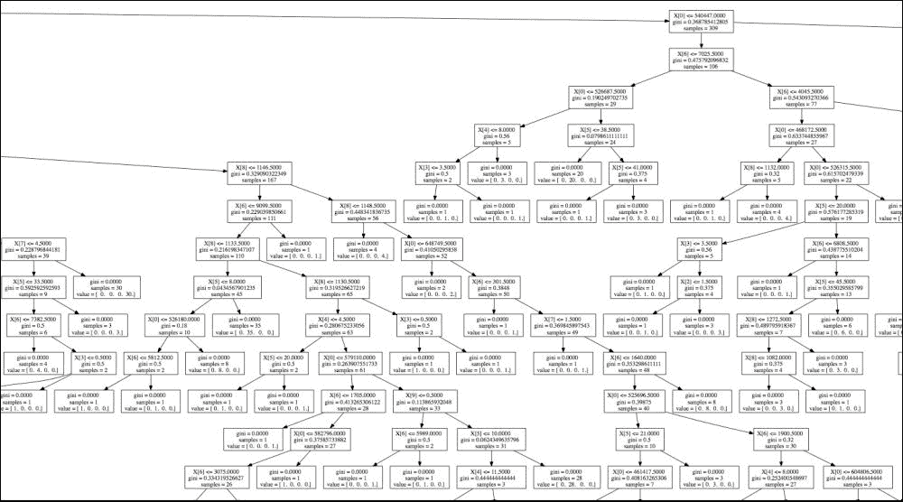

我们也有随机森林和极随机树的实现，它们都在子模块`sklearn.ensemble`中。 相应的类分别称为`RandomForestClassifier`和`ExtraTreesClassifier`。

在任何上述情况下，分类器的编码都与 SVC 和基本决策树的情况完全相同。

### 朴素贝叶斯

使用朴素贝叶斯方法可获得相似的结果。 在模块`sklearn.naive_bayes`中，我们有此算法的三种实现：

*   高斯朴素贝叶斯类的`GaussianNB`类，其中特征的似然性假定为高斯。
*   用于数据的朴素贝叶斯类`BernoulliNB`根据多元 Bernoulli 分布进行分布（每个特征均假定为二进制值变量）。
*   用于多重分布数据的类`MultinomialNB`。

### 最近的邻居

为了在这种情况下获得更好的结果，我们采用最近邻居的分类方法。 这与我们在计算几何的设置中用来执行相应的几何查询问题的过程完全相同。 在这种情况下，请注意如何将我们的数据编码为高维欧氏空间中的点，从而可以将这些方法转换为用于此分类的目的。

这种情况下的优势在于，我们不必在计算中使用欧几里得距离。 例如，由于数据无论其数值如何本质上都不同，因此强加汉明度量以计算标签之间的距离是有意义的。 我们对在模块`sklearn.neighbors`中实现为类`KNeighborsClassifier`的最近邻居算法进行了概括：

```py
In [33]: from sklearn.neighbors import KNeighborsClassifier
In [34]: clf = KNeighborsClassifier(n_neighbors=8,metric='hamming');\
 ....: clf.fit(training, target)
Out[34]:
KNeighborsClassifier(algorithm='auto', leaf_size=30,metric='hamming',
 n_neighbors=8, p=2, weights='uniform')
In [35]: clf.predict(test)==true_result
Out[35]:
0      True
2     False
3      True
4      True
6     False
7      True
9      True
11    False
12    False
13    False
14    False
15     True
16     True
20    False
21    False
...
101604     True
101607    False
101610     True
101611     True
101613     True
101614     True
101616     True
101617     True
101618     True
101620     True
101621     True
101622     True
101625     True
101626     True
101627     True
Name: Company response, Length: 65282, dtype: bool
In [36]: float(sum(_))/len(_)
Out[36]: 0.791274777120799

```

成功率超过 79％！

## 降维

数据通常观察内部结构，但是高维（从某种意义上讲是列数）使其难以提取和选择此内部结构。 通常，可以在低维流形上执行此数据的智能投影，并分析这些投影以搜索特征。 我们将此技术称为**降维**。

### 注意

对于以下示例，我们决定删除包含任何`NaN`的所有日期。 这大大减少了数据量，使后续研究和结果更易于理解。 为了更详尽，更全面的研究，将`NaN`的所有出现都强制为零-用`fillna(0)`代替`dropna()`方法。

让我们通过运行示例观察如何从这些过程中获利。 我们按产品收集所有日常投诉，并分析数据：

```py
In [37]: df = data.groupby(['Date received', 'Product']).size(); \
 ....: df = df.unstack().dropna()
In [38]: df.head()
Out[38]:
Product        Bank account or service  Consumer loan  Credit card  \
Date received 
2013-11-06                          66             14           41 
2013-11-07                          44             11           33 
2013-11-08                          49             11           36 
2013-11-09                           9              4           20 
2013-11-11                          15              4           23 
Product        Credit reporting  Debt collection  Money transfers  Mortgage  \
Date received 
2013-11-06                   62              129                2       153 
2013-11-07                   43               99                2       128 
2013-11-08                   44               83                8       113 
2013-11-09                   19               33                2        23 
2013-11-11                   32               68                2        46 
Product        Payday loan  Student loan 
Date received 
2013-11-06               2            14 
2013-11-07               8            10 
2013-11-08              12             7 
2013-11-09               3             4 
2013-11-11               2            14 
In [39]: df.shape
Out[39]: (233, 9)

```

我们可以将此数据视为`9`维空间中的`233`点。

### 主成分分析

对于这种少量数据，没有任何其他先验信息，降维的最佳方法之一就是在二维平面上投影。 但是，不仅是任何平面，我们都在寻找一种投影，以确保所投影的数据具有最大可能的方差。 我们使用从代表我们数据的矩阵的特征值和特征向量获得的信息来完成此任务。 该过程称为**主成分分析**（ **PCA** ）。

### 小费

PCA 被视为统计方法中最有用的技术之一。 要对理论（在线性代数和统计学的两个范围内），编码技术和应用进行令人惊叹的调查，最好的资源是 I.T.出版的《主成分分析*》一书的第二版。 Jolliffe 并由 *Springer* 在其 *Springer 系列统计资料*中于 2002 年出版。*

我们在子模块`sklearn.decomposition`的`scikit-learn`工具包中实现了类`PCA`：

```py
In [40]: from sklearn.decomposition import PCA
In [41]: model = PCA(n_components=2)
In [42]: model.fit(df)
Out[42]: PCA(copy=True, n_components=2, whiten=False)
In [43]: projected_df = model.transform(df)
In [44]: plt.figure(); \
 ....: plt.scatter(projected_df[:,0], projected_df[:,1]); \
 ....: plt.title('Principal Component Analysis scatterplot of df'); \
 ....: plt.show()

```

观察数据如何由两个非常区分的点集群（其中一个比另一个大得多）以及一些离群值组成。 在下一节中，我们将回到这个问题。

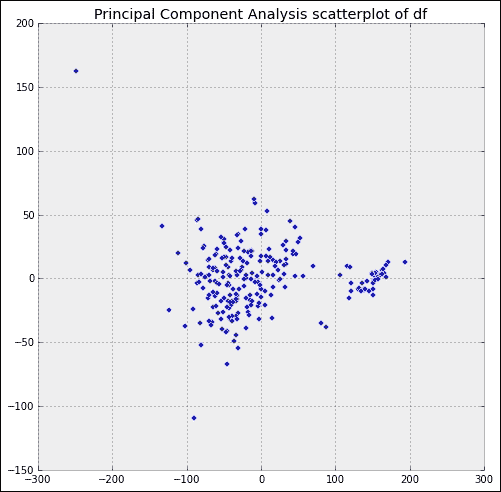

### 等轴测图

我们不一定需要在超平面上投影。 一个巧妙的技巧是假设数据本身位于非线性子流形上，并获得带有该点的对象的表示。 这使我们可以灵活地搜索投影数据满足相关属性的投影。 例如，如果我们要求投影保持点之间的测地距离（只要可能），就可以实现所谓的**等距映射**（ **isomap** ）。

在 SciPy 堆栈中，我们将此方法实现为子模块`sklearn.manifold`中的类`Isomap`：

```py
In [45]: from sklearn.manifold import Isomap
In [46]: model = Isomap().fit(df)
In [47]: isomapped_df = model.transform(df)
In [48]: plt.figure(); \
 ....: plt.scatter(isomapped_df[:,0], isomapped_df[:,1]); \
 ....: plt.title('Isometric Map scatterplot of df'); \
 ....: plt.show()

```

尽管在视觉上有很大的不同，但此方法还为我们提供了两个非常清晰的群集，其中一个群集比另一个群集大得多。 较小的群集显示为清晰对齐的点序列：

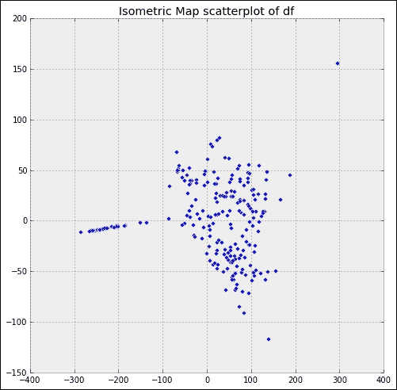

### 光谱嵌入

另一种可能性是通过将光谱分析应用于亲和度/相似度矩阵来非线性地嵌入数据。 结果的质量与前两个示例相似：

```py
In [49]: from sklearn.manifold import SpectralEmbedding
In [50]: model = SpectralEmbedding().fit(df)
In [51]: embedded_df = model.embedding_
In [52]: plt.figure(); \
 ....: plt.scatter(embedded_df[:,0], embedded_df[:,1]); \
 ....: plt.title('Spectral Embedding scatterplot of df'); \
 ....: plt.show()

```

在这种情况下，与前面的示例相比，群集的定义更加清晰。

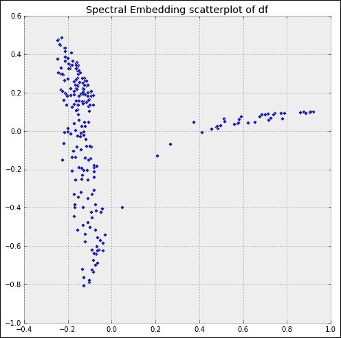

### 局部线性嵌入

从某种意义上讲，与等轴测图类似，另一种可能的投影试图保留局部邻域内的距离-**局部线性嵌入**。 我们再次通过子类`sklearn.manifold`在类`LocallyLinearEmbedding`中实现：

```py
In [53]: from sklearn.manifold import LocallyLinearEmbedding
In [54]: model = LocallyLinearEmbedding().fit(df)
In [55]: lle_df = model.transform(df)
In [56]: plt.figure(); \
 ....: plt.scatter(lle_df[:,0], lle_df[:,1]); \
 ....: plt.title('Locally Linear Embedding scatterplot of df'); \
 ....: plt.show()

```

请注意，高度聚集的两个群集和两个异常值。

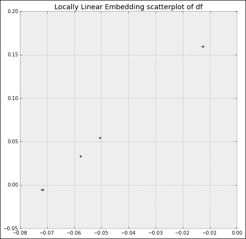

## 聚类

从某种意义上说，聚类与分类问题相似，但更为复杂。 当面对数据集时，我们承认具有某种隐藏结构的可能性，这将使我们能够预测未来数据的行为。 通过查找通用模式并在不同集群中收集符合那些模式的数据来执行此结构的搜索。 因此，我们也将此问题称为**数据挖掘**。

有许多不同的方法可以执行聚类，具体取决于数据量以及关于聚类数量的先验信息。 我们将探索以下设置：

*   MeanShift。
*   高斯混合模型。
*   K-均值。
*   频谱聚类。

### 均值漂移

当数据不超过 10,000 点时，我们采用 **MeanShift** 聚类的技术，并且我们不知道先验需要的聚类数量。 让我们用降维部分中的运行示例进行实验，但是我们将不理会所有投影建议的两个聚类。 我们将让均值漂移聚类为我们做出决定。

我们通过`scikit-learn`工具包的子模块`sklearn.cluster`中的类`MeanShift`在 SciPy 堆栈中实现。 该算法的要素之一是使用径向基函数（在[第 1 章](../Text/1.xhtml#aid-DB7S2 "Chapter 1\. Numerical Linear Algebra")，*数值线性代数*中讨论）进行近似，为此我们需要提供适当的带宽。 该算法（如果未提供）将尝试根据数据进行估算。 此过程可能非常缓慢且昂贵，并且通常由我们自己进行估算是一个好主意，因此我们可以控制资源。 我们可以使用同一子模块中的辅助函数`estimate_bandwidth`来实现。

### 小费

`scikit-learn`工具箱中用于聚类算法的类和例程的实现要求将数据作为`numpy`数组而不是`pandas`数据帧进行馈送。

我们可以使用`dataframe`方法`.values`轻松执行此切换。

```py
In [57]: from sklearn.cluster import MeanShift, estimate_bandwidth
In [58]: bandwidth = estimate_bandwidth(df.values, n_samples=1000)
In [59]: model = MeanShift(bandwidth=bandwidth, bin_seeding=True)
In [60]: model.fit(df.values)

```

此时，对象`model`已成功计算了一系列标签并将它们附加到数据中的每个点，因此可以将它们正确聚类。 我们可以允许某些*无法分类的*点保持未分类的状态-我们通过将可选的布尔值`cluster_all`设置为`False`来实现这一点。 默认情况下，该算法将每条数据强制放入一个群集中。

为了达到质量目的，让我们找到标签的数量并将结果可视化为上一部分的投影之一：

```py
In [61]: np.unique(model.labels_)      # how many clusters?
Out[61]: array([0,  1,  2])
In [62]: plt.figure(); \
 ....: plt.scatter(isomapped_df[:,0], isomapped_df[:,1],
 ....:             c=model.labels_, s = 50 + 100*model.labels_); \
 ....: plt.title('MeanShift clustering of df\n Isometric Mapping \
 ....: scatterplot\n color/size indicates cluster'); \
 ....: plt.tight_layout(); \
 ....: plt.show()

```

请注意，如何正确计算两个清晰的聚类，并且一个离群值收到了自己的聚类。

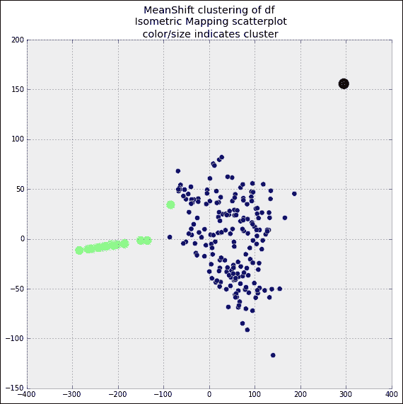

让我们找出这些集群的意义。 首先，离群值：

```py
In [63]: df[model.labels_ == 2]
Out[63]:
Product        Bank account or service  Consumer loan  Credit card  \
Date received 
2014-06-26                         117             19           89 
Product        Credit reporting  Debt collection  Money transfers  Mortgage  \
Date received 
2014-06-26                   85              159                5       420 
Product        Payday loan  Student loan 
Date received 
2014-06-26               7            12 

```

2014 年 7 月 26 日产生的投诉数量有何不同？ 让我们用每个日期簇生成一个图，看看是否可以猜测出它们之间的差异。

```py
In [64]: fig = plt.figure(); \
 ....: ax1 = fig.add_subplot(211); \
 ....: ax2 = fig.add_subplot(212); \
 ....: df[model.labels_==0].plot(ax=ax1); \
 ....: df[model.labels_==1].plot(ax=ax2); \
 ....: plt.show()

```

我们应该得到类似于以下的输出：

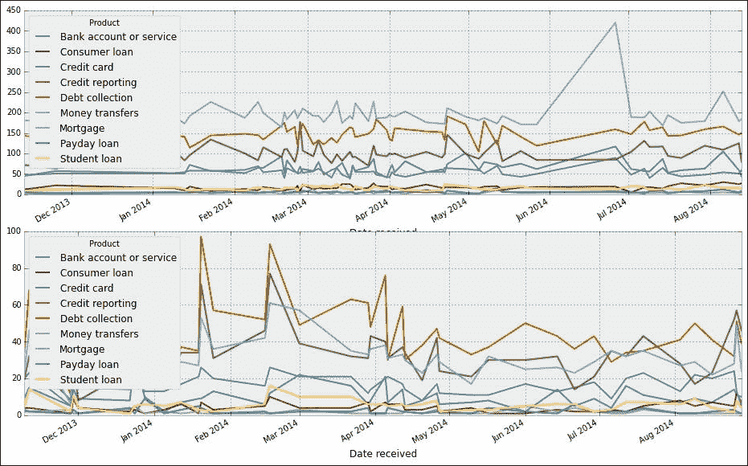

从外观上看，似乎集群是由收集大量投诉而不是少量投诉的日期组成的。 不仅如此：仔细检查发现，从第 0 组开始，抵押贷款无疑是投诉的第一原因。 另一方面，对于第 1 组中的日期，对抵押贷款的投诉被降至第二或第三位，始终落后于收债和发薪日贷款：

```py
In [65]: plt.figure(); \
 ....: df[model.labels_==0].sum(axis=1).plot(label='cluster 0'); \
 ....: df[model.labels_==1].sum(axis=1).plot(label='cluster 1'); \
 ....: plt.legend(); \
 ....: plt.show()

```

确实是这样：

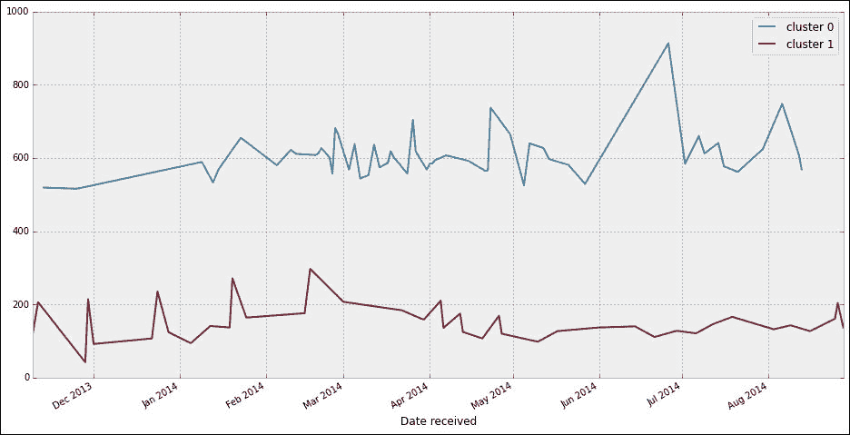

```py
In [66]: df[model.labels_==0].sum(axis=1).describe()
Out[66]:
count    190.000000
mean     528.605263
std       80.900075
min      337.000000
25%      465.000000
50%      537.000000
75%      585.000000
max      748.000000
dtype: float64
In [67]: df[model.labels_==1].sum(axis=1).describe()
Out[67]:
count     42.000000
mean     156.738095
std       56.182655
min       42.000000
25%      124.250000
50%      140.500000
75%      175.750000
max      335.000000
dtype: float64
In [68]: df[model.labels_==2].sum(axis=1)
Out[68]:
Date received
2014-06-26       913
dtype: float64

```

请注意，标记为 1 的群集中的投诉量每天不超过 335 件。 从零群集开始的几天里提出的投诉都在 337 到 748 之间。在离群的日期（2014 年 7 月 26 日），有 913 起投诉。

### 高斯混合模型

高斯混合模型是概率模型，对数据的生成方式和服从的分布进行假设。 这些算法近似于定义所涉及分布的参数。

此方法以其最纯粹的形式实现**期望最大化**（ **EM** ）算法，以拟合模型。 我们使用`scikit-learn`工具包的子模块`sklearn.mixture`中的类`GMM`访问此实现。 不过，此实现要求我们提供所需的群集数量。 与其他方法不同，无论这些人工群集是否具有逻辑意义，它都会尽最大努力将数据分类为所需的多个群集。

为了在不了解所需集群数量的情况下对相对少量的数据执行聚类，我们可以采用高斯混合模型的一种变体，该模型使用变分推断算法来代替。 我们称其为**变分高斯混合**。 在同一子模块中，我们将此算法实现为类`VBGMM`。

对于此特定方法，我们确实需要提供我们期望的簇数的上限，但是该算法将为我们计算最佳数目。

例如，在我们的运行示例中（清楚地显示了两个群集），我们将上限设置为 30，并观察`VBGMM`算法的行为：

```py
In [69]: from sklearn.mixture import VBGMM
In [70]: model = VBGMM(n_components=30).fit(df)
In [71]: labels = model.predict(df)
In [72]: len(np.unique(labels))    # how many clusters?
Out[72]: 2

```

只有两个集群！

```py
In [73]: a, b = np.unique(labels)
In [74]: sizes = 50 + 100 * (labels - a) / float(b-a)
In [75]: plt.figure(); \
 ....: plt.scatter(embedded_df[:,0], embedded_df[:,1],
 ....:             c=labels, s=sizes); \
 ....: plt.title('VBGMM clustering of df\n Spectral Embedding \
 ....: scatterplot\n color/size indicates cluster'); \
 ....: plt.tight_layout(); \
 ....: plt.show()

```

我们应该得到类似于以下的输出：

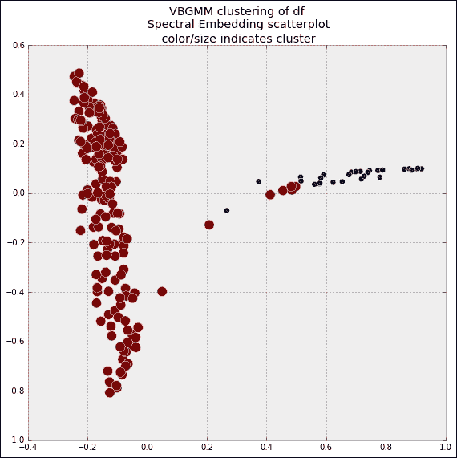

### me

如果我们以前知道所需的聚类数，而无论数据量如何，那么劳埃德算法（最好称为 K-means 方法）就是一个很好的聚类算法。

在模块`scipy.cluster.vq`中，我们提供了一套有效的 k 均值聚类例程。 `scikit-learn`工具包的子模块`sklearn.cluster`中的类`KMeans`实现了并行算法。 例如，如果我们需要使用计算机的所有 CPU 在数据上将分区划分为四个集群，则可以从工具箱中发出以下代码：

```py
In [76]: from sklearn.cluster import KMeans
In [77]: model = KMeans(n_clusters=4, n_jobs=-1).fit(df)
In [78]: plt.figure(); \
 ....: plt.scatter(isomapped_df[:,0], isomapped_df[:,1],
 ....:             c=model.labels_, s=10 + 100*model.labels_); \
 ....: plt.title('KMeans clustering of df\n Isometric Mapping \
 ....: scatterplot\n color/size indicates cluster'); \
 ....: plt.tight_layout(); \
 ....: plt.show()

```

我们应该得到类似于以下的输出：

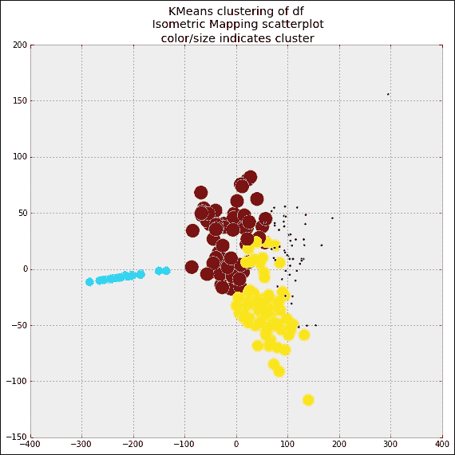

请注意，无论产品如何，该人工聚类仍然如何根据收到的投诉数量对不同的日期进行分类：

```py
In [79]: plt.figure()
In [80]: for label in np.unique(model.labels_):
 ....:     if sum(model.labels_==label) > 1:
 ....:         object = df[model.labels_==label].sum(axis = 1)
 ....:         object.plot(label=label)
 ....:
In [81]: plt.legend(); \
 ....: plt.show()

```

我们应该得到类似于以下的输出：

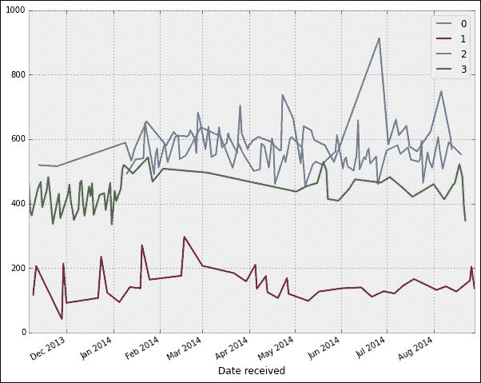

### 小费

就像我们之前的聚类分析一样，此图中未包含的聚类是 2014 年 7 月 26 日这一天，当时收到了近千个投诉。

在海量数据（超过 10,000 点）的情况下，我们经常使用 K 均值的变体，该变体在不同的迭代中对数据的随机采样子集运行，以减少计算时间。 此方法称为**小批量 Kmeans** ，并且已在同一子模块中实现为类`MiniBatchKMeans`。 与使用纯 K 均值相比，聚类的质量稍差一些，但是过程明显更快。

### 光谱聚类

通过在 K 均值之前对数据进行低维频谱嵌入（具有不同的指标），当任何先前方法未能以有意义的方式对数据进行分类时，我们通常能够解决聚类问题。 在`scikit-learn`工具包中，我们有一个基于代数多重网格求解器的非常聪明的实现，作为子模块`sklearn.cluster`中的类`SpectralClustering`。

### 小费

要处理代数多重网格求解器，强烈建议安装软件包`pyamg`。 该软件包由伊利诺伊大学香槟分校伊利诺伊大学计算机系的 Nathan Bell，Luke Olson 和 Jacob Schroder 开发。 这不是绝对必要的，但是这样做将极大地加快我们的计算速度。 可以从 [http://pyamg.org/](http://pyamg.org/) 以多种格式下载该软件包，也可以从控制台使用`pip`，`easy_install`或`conda`命令照常安装。

# 摘要

在本章中，我们探索了 SciPy 堆栈中的高级技术，以执行推断统计，数据挖掘和机器学习。 在下一章中，我们将完全改变齿轮以掌握数字图像处理。