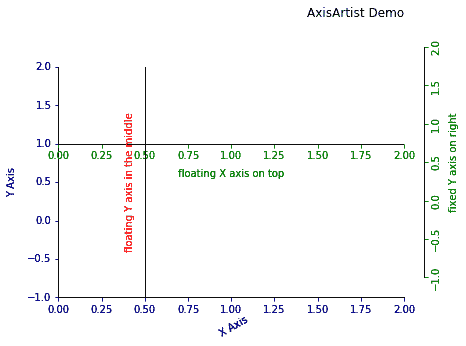
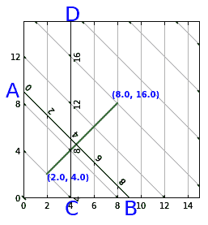
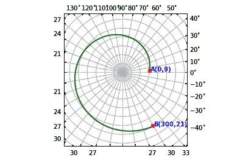
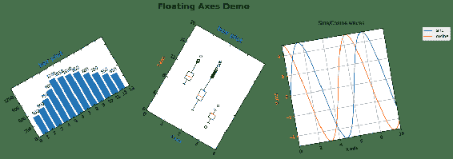
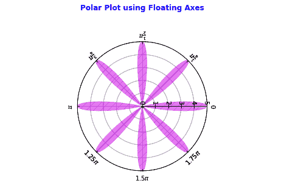
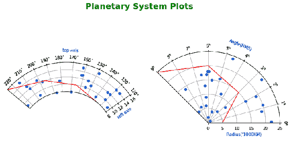

# 使用 axisartist 工具包

在本章中，我们将通过以下食谱学习如何使用`axisartist`工具包的各种功能：

*   了解 AxisArtist 中的属性
*   在矩形框中定义曲线网格
*   在矩形框中定义极轴
*   将浮动轴用于矩形图
*   使用浮动轴创建极轴
*   在浮动极轴上绘制行星系统数据

# 介绍

开发`axisartist`工具包的主要动机是支持曲线网格，例如用于在天文学中绘制行星系统的网格。 它有助于绘制在直角轴和极轴上均具有弯曲轴的图形，还可以帮助绘制具有浮动轴的图形。

`axisartist`使用自 Matplotlib 主`Axes`类派生的自定义`Axes`类，其中每个轴（左，下，上和右）由单独的艺术家管理。 由于`ax.axis`的作用类似于字典，因此`ax.axis["left"]`，`ax.axis["bottom"]`，`ax.axis["top"]`和`ax.axis["right"]`可以访问它们。 我们还可以根据需要定义其他轴。

# 了解 axisartist 中的属性

在本食谱中，我们将学习如何使用`AxisArtist`的基本属性和属性，例如固定轴，浮动轴，标签和刻度。 在本食谱中，我们将不会使用这些属性绘制任何图形。

# 准备

您需要使用以下命令导入所需的库：

```py
import matplotlib.pyplot as plt
import mpl_toolkits.axisartist as AxisArtist
```

# 操作步骤

以下是绘制所需图形的步骤：

1.  定义图形和`AxisArtist`参数，然后将其添加到图形中，如下所示：

```py
fig = plt.figure()
ax = AxisArtist.Axes(fig, [0.1, 0.1, 0.8, 0.8])
fig.add_axes(ax)
```

2.  使用以下命令将上轴和右轴设置为不可见，然后设置轴的标签：

```py
ax.axis["right", "top"].set_visible(False)
ax.set_xlabel("X Axis")
ax.axis["bottom"].label.set_rotation(30)
ax.set_ylabel("Y Axis")
```

3.  在`y=1`处创建一个浮动轴，如下所示：

```py
ax.axis["y=1"] = ax.new_floating_axis(nth_coord=0, value=1.0)
ax.axis["y=1"].label.set_text("floating X axis on top")
```

4.  在`x=0.5`处创建另一个浮动轴，如下所示：

```py
ax.axis["x=0.5"] = ax.new_floating_axis(nth_coord=1, value=0.5)
ax.axis["x=0.5"].set_axis_direction("top")
ax.axis["x=0.5"].label.set_text("floating Y axis in the middle")
```

5.  使用以下命令在右侧创建一个固定轴：

```py
ax.axis["right"] = ax.new_fixed_axis(loc="right", offset=(20, 20))
ax.axis["right"].set_axis_direction("bottom")
ax.axis["right"].label.set_text("fixed Y axis on right")
```

6.  将颜色属性分配给所有轴的刻度线，刻度线标签和标签属性，如下所示：

```py
ax.axis["left", "bottom"].major_ticks.set_color("darkblue")
ax.axis["left", "bottom"].major_ticklabels.set_color("darkblue")
ax.axis["left", "bottom"].label.set_color("darkblue")

ax.axis["right", "y=1"].major_ticks.set_color("green")
ax.axis["right", "y=1"].major_ticklabels.set_color("green")
ax.axis["right", "y=1"].label.set_color("green")
```

7.  如下设置刻度线对齐，填充和 *x* 和 *y* 轴限制：

```py
ax.axis[:].major_ticks.set_tick_out(True)
ax.axis[:].label.set_pad(10)
ax.set_xlim(0,2)
ax.set_ylim(-1,2)
```

8.  通过以下命令设置轴`y=1`的属性：

```py
ax.axis["x=0.5"].toggle(all=False, label=True)
ax.axis["x=0.5"].label.set_color("red")
```

9.  设置图形的标题（在这里，我们使用了`AxisArtist Demo`），最后，在屏幕上显示图形，如下所示：

```py
ax.set_title('AxisArtist Demo', pad=50, loc='right')
plt.show()
```

# 工作原理

这是前面代码的解释：

*   `fig = plt.figure()`定义图形对象。
*   `ax = AxisArtist.Axes(fig, [0.1, 0.1, 0.8, 0.8])`定义`AxisArtist`类在给定坐标处的轴，分别从左侧开始，一直到底部，宽度和高度。
*   `fig.add_axes(ax)`将轴对象添加到图形中。
*   `ax.axis["right", "top"].set_visible(False)`将上轴和右轴（书脊）设置为不可见。 您也可以分别为每个轴设置此设置。
*   `ax.set_xlabel("X Axis")`将 *x* 轴的标签设置为`"X Axis"`。
*   `ax.axis["bottom"].label.set_rotation(30)`将 *x* 轴标签逆时针旋转 30 度。
*   `ax.set_ylabel("Y Axis")`将 *y* 轴标签的标签设置为`"Y Axis"`。
*   `ax.axis["y=1"] = ax.new_floating_axis(nth_coord=0, value=1.0)`定义了一个新轴，如下所示：
    *   `floating axis`的位置会随着在 *x* 或 *y* 轴上设置的限制而变化，因为它是在数据坐标系中以轴的固定值创建的。
    *   `nth_coord`指定新轴是与 *x* 还是 *y* 轴对齐。 设置为 0 时，它平行于 *x* 轴； 如果为 1，则新轴将平行于 *y* 轴。
    *   `value`参数指定轴上的值； 该新轴将被创建。 在这种情况下，由于`value=1.0`参数在`y=1`中创建了它。
    *   `"y=1"`是为此新轴指定的名称，并用它保存在`ax.axis`词典中。
*   `ax.axis["y=1"].label.set_text("floating X axis on top")`设置新浮动轴的标签。
*   `ax.axis["x=0.5"] = ax.new_floating_axis(nth_coord=1, value=0.5)`会再创建一个浮动轴，如下所示：
    *   `nth_coord=1`指定此新轴应平行于 *Y* 轴。
    *   `value=0.5`指定应在`x=0.5`处创建新的浮动轴。
    *   `"x=0.5"`是为此新轴指定的名称。
*   `ax.axis["x=0.5"].set_axis_direction("top")`指定应在轴的哪一侧显示刻度线，刻度标签和轴标签。 顶部表示它们都应位于轴的顶部或左侧，这取决于它是否平行于 *x* 或 *y* 轴。
*   `ax.axis["x=0.5"].label.set_text("floating Y axis in the middle")`设置新轴的标签。
*   `ax.axis["right"] = ax.new_fixed_axis(loc="right", offset=(20, 20))`创建如下固定轴：
    *   固定轴是位置固定的轴，因为它是相对于给定的轴/脊线以指定的偏移量创建的。
    *   `loc="right"`指定应在绘图的右侧创建新轴。
    *   `offset=(20, 20)`指定距默认右轴的磅数偏移（1 点= 1/72 英寸），在这种情况下，该偏移量将变为不可见。 它在 *x* （底部）轴上方 20 个点，在默认右轴的右侧 20 个点。
*   `ax.axis["right"].set_axis_direction("bottom")`指定刻度，刻度标签和轴标签应绘制在新轴的右侧（或当轴平行于 *x* 轴时显示在底部）。
*   `ax.axis["right"].label.set_text("fixed Y axis on right")`设置新轴的标签。
*   `ax.axis["left", "bottom"].major_ticks.set_color("darkblue")`为左（ *y* ）和底部（ *x* ）轴的主要刻度设置深蓝色。
*   `ax.axis["left", "bottom"].major_ticklabels.set_color("darkblue")`将深蓝色设置为刻度标签的颜色。
*   `ax.axis["left", "bottom"].label.set_color("darkblue")`将深蓝色设置为轴标签的颜色。
*   `ax.axis["right", "y=1"].major_ticks.set_color("green")`为`"right"`和`"y=1"`轴的主要刻度线设置绿色。
*   `ax.axis["right", "y=1"].major_ticklabels.set_color("green")`为刻度标签设置绿色。
*   `ax.axis["right", "y=1"].label.set_color("green")`为轴标签设置绿色。
*   `ax.axis[:].major_ticks.set_tick_out(True)`在刻度标签的同一侧设置刻度。 默认情况下，在`axisartist`类中，刻度和刻度标签位于轴的相对侧。 应当注意，默认情况下，在 Matplotlib 主轴中，类，刻度和刻度标签被绘制在该轴的同一侧。`axis[:]`包含字典中的所有元素，这意味着所有轴-默认情况下为四个轴和三个新添加的轴。 当然，`"top"`和`"right"`默认轴设置为`"invisible"`状态，因此您看不到它们的刻度和刻度标签！ 因此，此功能仅适用于所有可见轴。
*   `ax.axis[:].label.set_pad(10)`再次针对所有可见轴在轴及其标签之间添加填充（以便没有重叠）。
*   `ax.set_xlim(0,2)`设置 *x* 轴的最小和最大限制。
*   `ax.set_ylim(-1,2)`设置 *y* 轴的最小和最大限制。
*   `ax.axis["x=0.5"].toggle(all=False, label=True)`使刻度和刻度标签不可见，而轴`x=0.5`的轴标签可见：
    *   `all=False`使刻度，刻度标签和轴标签均不可见。 您也可以一次更改刻度，刻度标签和标签的设置，而不是一次全部更改。
    *   `label=True`使轴标签可见。
    *   我们为`set_axis_direction`参数使用默认选项，即*底部*（与 *y* 轴平行的轴的右侧）。
*   `ax.axis["x=0.5"].label.set_color("red")`为轴`x=0.5`的轴标签设置红色。
*   `plt.show()`在屏幕上显示图形。

执行上述代码后，您应该在屏幕上看到以下示意图：



New floating axes and fixed axes use the same scale as the corresponding main *x* or *y* axis scale. Matplotlib currently does not support different scales for each of these new axes. Version 3.0 of Matplotlib is expected to remove this limitation.

# 在矩形框中定义曲线网格

在本食谱中，我们将学习如何在使用笛卡尔坐标系的矩形轴内创建具有自己的坐标系的曲线网格。 我们将在曲线坐标表示的两个点之间绘制一条简单的线图。

这本质上是一个自定义开发的曲线坐标系，为此，我们必须定义从曲线坐标到笛卡尔坐标并以相反方向映射的函数。 在后续食谱中，我们将学习`axistartist`类提供的预定义转换。

# 准备

您需要使用以下或命令导入所需的库：

```py
import numpy as np
import matplotlib.pyplot as plt
from mpl_toolkits.axisartist import Subplot
from mpl_toolkits.axisartist.grid_helper_curvelinear import GridHelperCurveLinear
```

# 操作步骤

以下是绘制所需图形的步骤：

1.  首先，将图形定义如下：

```py
fig = plt.figure(1, figsize=(7, 4))
```

2.  接下来，定义转换函数以将曲线坐标转换为直线坐标：

```py
# Transformation Function to convert curvilinear coordinates to rectilinear coordinates
def curv2rect_tr(x, y):
    x, y = np.asarray(x), np.asarray(y)
    return x, y - x 
```

3.  定义转换函数以将直线坐标转换为曲线坐标：

```py
# Transformation Function to convert rectilinear coordinates to curvilinear coordinates
def rect2curv_tr(x, y):
    x, y = np.asarray(x), np.asarray(y)
    return x, y + x
```

4.  定义`grid_helper`函数，该函数负责在具有直线坐标的矩形轴上绘制具有曲线坐标的网格线。 它以变换函数为输入，并使用它们绘制网格线：

```py
grid_helper = GridHelperCurveLinear((curv2rect_tr, rect2curv_tr))
```

5.  定义使用上一步中定义的网格助手功能的轴：

```py
ax = Subplot(fig, 1, 1, 1, grid_helper=grid_helper)
```

6.  将刚刚定义的轴添加到图中：

```py
fig.add_subplot(ax)
```

7.  在曲线坐标中定义两个点，并将它们转换为等效的直线坐标：

```py
x, y = curv2rect_tr([2.0, 8.0], [4.0, 16.0])
```

8.  使用直线坐标绘制线图，如下所示：

```py
ax.plot(x, y, linewidth=2.0, color='g')
```

9.  设置纵横比和 *x* 和 *y* 轴极限的值：

```py
ax.set_aspect(1.)
ax.set_xlim(0, 15.)
ax.set_ylim(0, 15.)
```

10.  使用浮动轴方法在曲线坐标中创建 *x* 和 *y* 轴，如下所示：

```py
ax.axis["y"] = ax.new_floating_axis(nth_coord=0, value=4.0)
ax.axis["y"].set_ticklabel_direction('+')
ax.axis["x"] = ax.new_floating_axis(1, 9.0)
ax.axis["x"].set_ticklabel_direction('-')
```

11.  打开背景网格：

```py
ax.grid(True, zorder=0)
```

12.  打印点`A`，`B`，`C`和`D`代表 *x* 和 *y* 轴，曲线坐标中的点绘制为 折线图：

```py
ax.text(-1.5, 8.5, 'A', size=25, weight=50, color='b')
ax.text(8.5, -1.5, 'B', size=25, weight=50, color='b')
ax.text(3.5, -1.5, 'C', size=25, weight=50, color='b')
ax.text(3.5, 15, 'D', size=25, weight=50, color='b')
ax.text(2.0, 1.5, '(2.0, 4.0)', weight='bold', color='b')
ax.text(7.5, 8.5, '(8.0, 16.0)', weight='bold', color='b')
```

13.  最后，使用以下命令在屏幕上显示该图：

```py
plt.show()
```

# 工作原理

这是前面代码的解释：

*   `def curv2rect_tr(x, y)`定义了将曲线坐标转换为直线坐标的功能。 它在新坐标中保留 *x* ，但直线坐标中的 *y* 定义为 *y-x* ：
    *   `x, y = np.asarray(x), np.asarray(y)`将输入参数 *x* 和 *和* 重新定义为 NumPy 数组。
    *   将曲线坐标映射到直线坐标，直线系统的 *x = x* （两个系统中的值相同），直线系统 *y [x] y* =曲线系统的 y-x 。
*   `def rect2curv_tr(x, y)`定义将直线坐标转换为曲线坐标的功能。 它是`curv2rect`函数的反函数。
*   `grid_helper = GridHelperCurveLinear((curv2rect_tr, rect2curv_tr))`定义了一个辅助函数，它使用作为参数提供的转换函数在两个方向上绘制网格线。 因此，将使用新的浮动轴沿这些网格线设置其轴。
*   `ax = Subplot(fig, 1, 1, 1, grid_helper=grid_helper)`将轴定义为子图，如下所示：
    *   `fig`是开头定义的图形对象。
    *   `1,1,1`与`plt.subplot()`表示法相似，并指定它是 1 x 1 网格内的第一个轴。
    *   将先前定义的`grid_helper`作为参数。
*   `fig.add_subplot(ax)`将轴添加到图形中。
*   `x, y = curv2rect_tr([2.0, 8.0], [4.0, 16.0])`在曲线坐标中获取`(2.0, 4.0)`和`(8.0, 16,0)`点，并将其转换为等效的直线坐标，分别为*（2.0，2.0）*和*（8.0，8.0）* 。
*   `ax.plot(x, y, linewidth=2.0, color='g')`绘制线宽为 2.0 点的绿线图。
*   `ax.set_aspect(1.)`将纵横比设置为 1，这意味着 *x* 和 *y* 轴数据标尺都相等。
*   `ax.set_xlim(0, 15.)`设置 *x* 轴的最小和最大限制，`ax.set_ylim(0, 15.)`设置 *y* 轴的限制。
*   `ax.axis["0"] = ax.new_floating_axis(nth_coord=0, value=4.0)`在曲线坐标中为第一个坐标定义浮动轴，该坐标以 4.0 的值切割网格线。 在轴字典中将其命名为`"0"`轴。 该线由图中以蓝色突出显示的点 C 和 D 表示。
*   `ax.axis["0"].set_ticklabel_direction('+')`指定刻度线标签应沿该轴的值递增方向放置在该轴的右侧。 如果为`'-'`，则它们将放置在轴的左侧。 但是，默认情况下，刻度线的位置与刻度线标签的方向相反。
*   `ax.axis["1"] = ax.new_floating_axis(1, 9.0)`定义第二条浮动轴，该第二条浮动轴在 X 轴上的值为 9.0。 在轴字典中将其命名为`"1"`。 该线在图中由以蓝色突出显示的点 A 和 B 表示。
*   `ax.axis["1"].set_ticklabel_direction('-')`指定刻度标签应按递增顺序放置在轴的左侧。 在这种情况下，轴向下（从 0 到 8）增加，因此该方向的左侧在直线上方！ 因此，刻度线标签位于行上方，而刻度线则位于行下方。
*   `ax.grid(True)`显示网格线。
*   `ax.text(-1.5, 8.5, 'A', size=25, weight=50, color='b')`绘制蓝色的点“ A”，大小为 25，权重为 50。类似地，B，C 和 D 点以及（2.0，4.0）和（8.0，16。 ）坐标，用这些指定的属性绘制。
*   `plt.show()`在屏幕上显示图形。

执行上述代码后，您应该在屏幕上看到以下示意图：



# 在矩形框中定义极轴

在前面的食谱中，我们学习了定义自定义变换，并使用它来绘制曲线坐标中的曲线网格线。 但是，它们都使用 *x*，*y* 坐标的笛卡尔坐标系。 在本食谱中，我们将学习如何在矩形框中使用极坐标（角度和半径坐标）。 在本食谱以及所有后续食谱中，我们将使用 Matplotlib 提供的预构建转换。

# 准备

您需要使用以下或命令导入必需的库：

```py
import matplotlib.pyplot as plt
import numpy as np
from mpl_toolkits.axisartist.grid_helper_curvelinear import GridHelperCurveLinear
import mpl_toolkits.axisartist.angle_helper as angle_helper
from matplotlib.projections import PolarAxes
from matplotlib.transforms import Affine2D
from mpl_toolkits.axisartist import SubplotHost, ParasiteAxesAuxTrans
import matplotlib.cbook as cbook
```

# 操作步骤

以下是绘制图形所需的步骤：

1.  如下定义图：

```py
fig = plt.figure(1, figsize=(7, 4))
```

2.  定义转换函数，如下所示：

```py
# PolarAxes.PolarTransform needs angle units as radian. However, we # plot the coordinate system in degrees for easier visualization
curv2rect_tr = Affine2D().scale(np.pi/180., 1.) + 
                          PolarAxes.PolarTransform()
```

3.  计算角度和半径的边界值，以绘制网格线：

```py
#(25, 25) is the number of steps it takes from minimum limit to 
  maximum limit for x and y
# number of grid lines(circular for radius, diagonal for angle) will 
  be influenced by these steps
extreme_finder = angle_helper.ExtremeFinderCycle(25, 25,
                                               lon_cycle=360, 
                                               lat_cycle=None,
                                               lon_minmax=None,     
                                               lat_minmax=(0, 50))
```

4.  定义角度的网格定位器：

```py
# Determine grid values appropriate for the coordinate (degree, 
  minute, second).
grid_locator1 = angle_helper.LocatorDMS(18)
```

5.  定义角度的刻度格式器：

```py
# Use an appropriate formatter to show angle values in degree, 
  minute and second format. 
tick_formatter1 = angle_helper.FormatterDMS()
```

6.  定义半径的网格定位器：

```py
grid_locator2 = MaxNLocator(12)
```

7.  定义绘制网格的网格助手：

```py
grid_helper = GridHelperCurveLinear(curv2rect_tr, 
                                   extreme_finder=extreme_finder,
                                   grid_locator1=grid_locator1, 
                                   tick_formatter1=tick_formatter1,
                                   grid_locator2=grid_locator2)
```

8.  使用前面定义的图形和网格帮助器定义主轴：

```py
ax = SubplotHost(fig, 1, 1, 1, grid_helper=grid_helper)
```

9.  使用以下命令使右轴和上轴的刻度标签可见：

```py
ax.axis["right", "top"].major_ticklabels.set_visible(True)
```

10.  将角度刻度线映射到右轴，将半径刻度线映射到底轴，如下所示：

```py
ax.axis["right"].get_helper().nth_coord_ticks = 0
ax.axis["bottom"].get_helper().nth_coord_ticks = 1
```

11.  使用以下命令将主轴添加到图中：

```py
fig.add_subplot(ax)
```

12.  定义一个寄生轴并将其附加到主轴上：

```py
axp = ParasiteAxesAuxTrans(ax, curv2rect_tr, "equal")
ax.parasites.append(axp)
```

13.  在寄生虫轴上绘制折线图：

```py
intp = cbook.simple_linear_interpolation
axp.plot(intp(np.array([0, 75, 180, 300]), 100), intp(np.array([9., 
                        12., 16, 21]), 100),
                        linewidth=2.0, color='g')
```

14.  在折线图上注释起点和终点：

```py
axp.text(0,7.5, '.', color='r', size=50)
axp.text(3,9.5, 'A(0,9)', color='b', weight='bold')
axp.text(295, 20.5, '.', color='r', size=50)
axp.text(300,21, 'B(300,21)', color='b', weight='bold')
```

15.  设置主轴的长宽比和 *x* 和 *y* 限制：

```py
ax.set_aspect(1.0)
ax.set_xlim(-20, 22)
ax.set_ylim(-25, 20)
```

16.  将网格选项设置为`True`以显示网格：

```py
ax.grid(True)
```

17.  最后，使用以下命令在屏幕上显示图形：

```py
plt.show()
```

# 工作原理

以下是上述代码的说明：

*   `curv2rect_tr = Affine2D().scale(np.pi/180., 1.) + PolarAxes.PolarTransform()`定义主轴和寄生轴之间的转换：
    *   `PolarAxes.PolarTransform()`需要以弧度为单位的角度； 因此，我们添加`scale(np.pi/180., 1.)`以方便度数和弧度之间的转换。
    *   `Affine2D`是两个轴之间的线性变换。
*   `extreme_finder = angle_helper.ExtremeFinderCycle()`计算给定 X，Y 限制和此函数中设置的其他参数的角度和半径的边界值：
    *   `(25, 25)`是从为 x 和 y 设置的最小和最大限制开始执行的步数。
    *   网格线的数量（半径为圆形，角度为对角线）将受这些步骤的影响。
    *   `lon_cycle=360`为角度设置一个周期极限。 由于我们需要极轴，因此我们将其设置为 360 度。
    *   `lat_minmax=(0, 50)`设置半径的最小值和最大值。
*   `grid_locator1 = angle_helper.LocatorDMS(30)`确定适合于角度坐标的网格值（度，分，秒）：
    *   参数中的数字 30 指定应绘制 30 条网格线作为角度坐标，每条网格线将转换为 12 度（360/30）。 但是，您看到的网格线每 10 度绘制一次。
    *   网格线取决于三组参数，并将决定平衡所有三组参数的网格线的最佳位置：
        *   给定 *x* 和 *y* 限制。
        *   赋予`extreme_finder`函数的各种参数。
        *   在`grid_locator`中指定的参数。
*   `tick_formatter1 = angle_helper.FormatterDMS()`格式化角度刻度标签以显示度数。
*   `grid_locator2 = MaxNLocator(12)`确定半径的网格值。 数字 *12* 指定要在绘图上绘制的圆形网格的数量。 在这种情况下，我们在绘图上看到了 12 条网格线。 但是，根据其他参数集，这也可能略有不同。
*   `grid_helper = GridHelperCurveLinear()`绘制给定转换函数，网格定位器和格式器的网格线。
*   `ax = SubplotHost(fig, 1, 1, 1, grid_helper=grid_helper)`使用先前创建的图形和网格帮助器对象定义主轴。
*   `ax.axis["right", "top"].major_ticklabels.set_visible(True)`使右和上轴刻度标签可见，默认情况下不可见。
*   `ax.axis["right"].get_helper().nth_coord_ticks = 0`将右轴映射到角度坐标。 在极坐标中，第一个（0）坐标是一个角度，第二个（1）坐标是半径。
*   `fig.add_subplot(ax)`将主轴添加到图形中。
*   `axp = ParasiteAxesAuxTrans(ax, curv2rect_tr)`使用定义的转换函数在主轴上定义极坐标的寄生轴。
*   `ax.parasites.append(axp)`将寄生轴添加到主轴。
*   `intp = cbook.simple_linear_interpolation`表示将线性插值应用于要在寄生轴上绘制的数据。
*   `axp.plot()`将寄生点的四个点绘制为绿色的线形图，线宽为 2.0。 参数`100`指定从起点到终点移动时要采取的增量数，以便沿轨迹平滑过渡。
*   `axp.text()`绘制红点并用折线起点和终点的坐标对其进行注释。
*   `ax.set_aspect(1.0)`设置 *x* 和 *y* 坐标之间的纵横比。
*   `ax.set_xlim(-20, 22)`和`ax.set_ylim(-25, 20)`指定绘制图形和图表的 *x* 和 *y* 坐标的下限和上限。
*   `ax.grid(True, zorder=0)`设置网格线，`zorder=0`指定在绘制任何其他艺术家之前应绘制网格线。 如果我们不设置此项，您将看到网格线与绿色线图重叠，因为先绘制线图，然后再绘制网格线！ 为了避免这种重叠，我们为网格线的绘制功能设置了`zorder=0`。

执行上述代码后，您应该在屏幕上看到以下示意图：



# 将浮动轴用于矩形图

在本食谱中，我们将学习如何绘制浮动轴。 当我们必须设计一个复杂的仪表板应用程序时，这些功能很有用，在该应用程序中，我们可能必须以不同于标准水平或垂直方向的其他方向放置单个图形或绘图。

我们将绘制三个不同的图以演示浮动轴的各种功能。

# 准备

您需要使用以下或命令导入必需的库：

```py
import pandas as pd
import numpy as np
import matplotlib.pyplot as plt
from matplotlib.transforms import Affine2D
import mpl_toolkits.axisartist.floating_axes as floating_axes
```

# 操作步骤

以下是绘制所有三个图形所需的步骤：

1.  如下定义图：

```py
fig = plt.figure(1, figsize=(14, 6))
```

2.  如下准备数据：

```py
month_num = [1, 2, 3, 4, 5, 6, 7, 8, 9, 10, 11, 12]
units_sold = [500, 600, 750, 900, 1100, 1050, 1000, 950, 800, 700, 
              550, 450] 
```

3.  定义转换函数，如下所示：

```py
curv2rect_tr1 = Affine2D().scale(200, 1).rotate_deg(30)
```

4.  如下定义网格助手功能：

```py
grid_helper1 = floating_axes.GridHelperCurveLinear(curv2rect_tr1, 
                                       extremes=(0, 13, 0, 1400))
```

5.  使用以下命令定义主轴和寄生轴：

```py
ax1 = floating_axes.FloatingSubplot(fig, 131, 
                                    grid_helper=grid_helper1)
fig.add_subplot(ax1)
axp1 = ax1.get_aux_axes(curv2rect_tr1)
```

6.  使用以下参数绘制条形图：

```py
bars = axp1.bar(month_num, units_sold)
for bar in bars:
    height = bar.get_height()
    axp1.text(bar.get_x() + bar.get_width()/2., 1.002*height,'%d' % 
              int(height), 
              ha='center', va='bottom', rotation=30)
```

7.  将刻度线设置为与网格线正确对齐，并指定标题，如下所示：

```py
grid_helper1.grid_finder.grid_locator1._nbins = 14 # X axis ticks
grid_helper1.grid_finder.grid_locator2._nbins = 5 # Y axis ticks
axp1.text(5, 1800, 'bar plot', rotation=30, size=15, weight='bold', 
          color='b')
```

8.  对箱形图重复上述所有步骤，如下所示：

```py
# Read data
wine_quality = pd.read_csv('winequality.csv', delimiter=';')
data = [wine_quality['alcohol'], wine_quality['fixed acidity'], wine_quality['quality']]

# Define transformation function
curv2rect_tr2 = Affine2D().scale(4, 1).rotate_deg(-30)

# Define grid helper function
grid_helper2 = floating_axes.GridHelperCurveLinear(curv2rect_tr2, extremes=(0, 4, 0, 20))

# Define main axes
ax2 = floating_axes.FloatingSubplot(fig, 132, grid_helper=grid_helper2)
fig.add_subplot(ax2)

# Define parasite axes
axp2 = ax2.get_aux_axes(curv2rect_tr2)

# Plot boxplot
axp2.boxplot(data)

# Set the tick and grid lines
grid_helper2.grid_finder.grid_locator1._nbins = 4
grid_helper2.grid_finder.grid_locator2._nbins = 5

# Set title and labels
axp2.text(1, 21, 'box plot', rotation=-30, size=15, weight='bold', color='b')
ax2.axis["bottom"].label.set_text('X axis')
ax2.axis["bottom"].label.set_color('blue')
ax2.axis["left"].label.set_text('Y axis')
ax2.axis["left"].label.set_color('red')
```

9.  同样，对正弦/余弦函数作图重复相同的步骤，如以下代码块所示：

```py
# Prepare data, define transformation and grid helper functions, 
  main axes
x = np.linspace(0, 10, 100)
curv2rect_tr3 = Affine2D().scale(1, 1).rotate_deg(10)
grid_helper3 = floating_axes.GridHelperCurveLinear(curv2rect_tr3, extremes=(0, 10, -5, 5))
ax3 = floating_axes.FloatingSubplot(fig, 133, grid_helper=grid_helper3)
fig.add_subplot(ax3)

# Define parasite axes, plot sine and cosine graphs, set title, 
  legend and grid
axp3 = ax3.get_aux_axes(curv2rect_tr3)
axp3.plot(x, 5*np.sin(x), label='sine')
axp3.plot(x, 5*np.cos(x), label='cosine')
ax3.legend(bbox_to_anchor=(0.35, 0., 1.05, 1.0), borderaxespad=0)
ax3.set_title('Sine/Cosine waves')
ax3.grid()
grid_helper3.grid_finder.grid_locator1._nbins = 5
grid_helper3.grid_finder.grid_locator2._nbins = 5

# Set labels, ticks and ticklabel attributes
ax3.axis["bottom"].label.set_text('X axis')
ax3.axis["bottom"].label.set_color('green')
ax3.axis["bottom"].major_ticks.set_color("green")
ax3.axis["bottom"].major_ticklabels.set_color("green")
ax3.axis["left"].label.set_text('Y axis')
ax3.axis["left"].label.set_color('red')
ax3.axis["left"].major_ticks.set_color("red")
ax3.axis["left"].major_ticklabels.set_color("red")
ax3.axis["bottom", "left"].major_ticks.set_tick_out(True)
ax3.axis["top", "right"].major_ticks.set_visible(False)
```

10.  使用以下命令设置图形的标题，并调整图形之间的间距：

```py
plt.suptitle('Floating Axes Demo',size=20, weight='bold', color='g')
plt.tight_layout()
plt.show()
```

# 工作原理

这是前面代码的解释：

*   `curv2rect_tr1 = Affine2D().scale(200, 1).rotate_deg(30)`是转换函数，其工作原理如下：
    *   `Affine2D`是线性变换。
    *   `scale(200,1)`指定 *x* 和 *y* 轴之间的数据刻度。 这需要根据要在 *x* 和 *y* 轴上绘制的数据范围进行设置。
    *   `rotate_deg(30)`指定将绘图逆时针旋转 30 度。
*   `grid_helper1 = floating_axes.GridHelperCurveLinear(curv2rect_tr1, extremes=(0, 13, 0, 1400))`定义网格线如下：
    *   `curv2rect_tr1`是之前定义的转换函数。
    *   `extremes=(0,13,0,1400)`定义 *x* 和 *y* 轴的上下限。 在此， *x* 轴的范围是 0 到 13， *y* 轴的范围是 0 到 1,400。 注意两个范围之间的差距！ 这就是为什么我们在转换函数中为比例设置（200,1）的原因。
*   `ax1 = floating_axes.FloatingSubplot(fig, 131, grid_helper=grid_helper1)`定义主轴如下：
    *   `131`表示它是三个图的 1 x 3 网格中的第一个图。
*   `fig.add_subplot(ax1)`将主轴添加到图形中。
*   `axp1 = ax1.get_aux_axes(curv2rect_tr1)`定义条形图的寄生轴。
*   `bars = axp1.bar(month_num, units_sold)`在寄生轴上绘制条形图。
*   `for bar in bars`在每个小节上打印带有单位数量的文本。 这与我们先前学到的相同，增加了`rotation=30`，以使文本沿与浮动轴相同的角度定向。
*   `grid_helper1.grid_finder.grid_locator1._nbins = 14`定义 *x* 轴的刻度数。
*   `grid_helper1.grid_finder.grid_locator2._nbins = 5`定义 *y* 轴的刻度数。
*   `axp1.text(5, 1800, 'bar plot', rotation=30, size=15, weight='bold', color='b')`绘制条形图的标题。 通常的`set_title()`方法在这里不起作用，因此我们使用`text`选项！
*   `curv2rect_tr2 = Affine2D().scale(4, 1).rotate_deg(-30)`定义要在不同轴上绘制的箱形图的变换函数，如下所示：
    *   在此，我们基于此图的 *x* 和 *y* 轴的数据使用`scale(4,1)`。
    *   我们使用`rotate_deg(-30)`规定绘图的顺时针旋转 30 度。
*   `grid_helper2 = floating_axes.GridHelperCurveLinear(curv2rect_tr2, extremes=(0, 4, 0, 20))`定义了箱形图的网格助手功能：
    *   `extremes=(0, 4, 0, 20)`指定 *x* 和 *y* 轴的上下限。
*   `ax2 = floating_axes.FloatingSubplot(fig, 132, grid_helper=grid_helper2)`定义用于绘制箱形图的第二条轴：
    *   `132`指定它是 1 x 3 绘图网格上的第二个绘图。
    *   `grid_helper=grid_helper2`指定用于该绘图的网格助手功能。
*   `axp2 = ax2.get_aux_axes(curv2rect_tr2)`定义用于箱形图的寄生轴。
*   `axp2.boxplot(data)`在寄生轴上绘制箱形图。
*   `grid_helper2.grid_finder.grid_locator1._nbins = 4`设置 *x* 轴的刻度数。
*   `grid_helper2.grid_finder.grid_locator2._nbins = 5`设置 *y* 轴的刻度数。
*   `axp2.text(1, 21, 'box plot', rotation=-30, size=15, weight='bold', color='b')`打印与轴的 30 度方向对齐的箱形图的标题。
*   `x = np.linspace(0, 10, 100)`是绘制正弦波和余弦波的数据，作为该图中的第三幅图。
*   `curv2rect_tr3 = Affine2D().scale(1, 1).rotate_deg(10)`为第三个图定义了比例为 1：1 且方向为 10 度的变换函数。
*   `grid_helper3 = floating_axes.GridHelperCurveLinear(curv2rect_tr3, extremes=(0, 10, -5, 5))`定义了第三幅图的网格函数， *x* 极限为 0 到 10， *y* 极限为-5 到+5。
*   `ax3 = floating_axes.FloatingSubplot(fig, 133, grid_helper=grid_helper3)`定义了第三幅图的第三主轴，其中“ 133”指定它是图中 1 x 3 幅图网格上的第三幅图。
*   `axp3 = ax3.get_aux_axes(curv2rect_tr3)`定义了第三幅图的寄生轴。
*   `axp3.plot(x, 5*np.sin(x), label='sine')`在寄生轴上绘制正弦波。
*   `axp3.plot(x, 5*np.cos(x), label='cosine')`在相同的寄生轴上绘制余弦波。
*   `ax3.legend(bbox_to_anchor=(0.35, 0., 1.05, 1.0), borderaxespad=0)`设置图例，但未与轴的方向对齐。
*   `ax3.set_title('Sine/Cosine waves')`会再次打印标题，但不会正确对齐，因此最好使用 text 方法，就像我们对前两个图所做的那样。
*   `ax3.grid()`绘制网格线。 这些将与轴的方向正确对齐，因为它们由网格辅助功能参数控制并指定了`nbins`参数。
*   `grid_helper3.grid_finder.grid_locator1._nbins = 5`指定 *x* 轴上刻度线/网格线的数量。
*   `grid_helper3.grid_finder.grid_locator2._nbins = 5`指定 *y* 轴上刻度线/网格线的数量。
*   `plt.suptitle('Floating Axes Demo',size=20, weight='bold', color='g')`打印整个图形的标题。

执行上述代码后，您应该在屏幕上看到以下示意图：



# 使用浮动轴创建极轴

在第 2 章 *（基本图解*入门）中，我们学习了如何在定义轴的同时使用 pyplot 的`projection='polar'`选项绘制极坐标图。 在本食谱中，我们将学习如何使用浮动轴绘制极坐标图。

# 准备

您需要使用以下或命令导入必需的库：

```py
import numpy as np
import matplotlib.pyplot as plt
from matplotlib.transforms import Affine2D
import mpl_toolkits.axisartist.floating_axes as floating_axes
from matplotlib.projections import PolarAxes
from mpl_toolkits.axisartist.grid_finder import (FixedLocator, MaxNLocator, DictFormatter)
```

# 操作步骤

以下是绘制情节所需的步骤：

1.  如下定义图：

```py
fig = plt.figure(1, figsize=(8, 4))
```

2.  定义转换函数，如下所示：

```py
curv2rect_tr = PolarAxes.PolarTransform()
```

3.  如下定义角度坐标的自定义刻度字典：

```py
pi = np.pi
angle_ticks = [(0, r"$0$"), (.25*pi, r"$\frac{1}{4}\pi$"),
               (.5*pi, r"$\frac{1}{2}\pi$"), (.75*pi, r"$\frac{3}
                {4}\pi$"),
               ( pi, r"$\pi$"), (1.25*pi, r"$1.25\pi$"),
               (1.5*pi, r"$1.5\pi$"), (1.75*pi, r"$1.75\pi$")]
```

4.  根据角度和半径坐标为定义网格定位器和格式器：

```py
grid_locator1 = FixedLocator([value for value, string in 
                              angle_ticks])
tick_formatter1 = DictFormatter(dict(angle_ticks))
grid_locator2 = MaxNLocator(5)
```

5.  定义网格助手功能，如下所示：

```py
grid_helper = floating_axes.GridHelperCurveLinear(curv2rect_tr, 
                               extremes=(2*pi, 0, 5, 0),
                               grid_locator1=grid_locator1,
                               grid_locator2=grid_locator2,
                               tick_formatter1=tick_formatter1,
                               tick_formatter2=None)
```

6.  定义主轴和寄生轴：

```py
main_axes = floating_axes.FloatingSubplot(fig, 111, 
                                          grid_helper=grid_helper)
fig.add_subplot(main_axes)
parasite_ax = main_axes.get_aux_axes(curv2rect_tr)
```

7.  接下来，在寄生轴上绘制极坐标图：

```py
theta = np.arange(0., 2., 1./180.)*np.pi
parasite_ax.fill(theta, 5*np.cos(8*theta), color=(0.8,0.0,0.9), hatch='//', alpha=0.5)
```

8.  将网格设置为绘图的标题，标题，并在屏幕上显示图形：

```py
main_axes.grid(True, zorder=0)
main_axes.set_title('Polar Plot using Floating Axes', weight='bold', color='b', pad=50)
plt.show()
```

# 工作原理

以下是上述代码的说明：

*   `curv2rect_tr = PolarAxes.PolarTransform()`定义极坐标变换函数。
*   `angle_ticks`是用于角度坐标的刻度的字典，其中包含角度的值及其相应的文本表示形式。
*   `grid_locator1   = FixedLocator([value for value, string in angle_ticks])`为角度坐标定义了网格定位器。`FixedLocator()`定义了字典指定的固定位置的刻度/网格位置。
*   `tick_formatter1 = DictFormatter(dict(angle_ticks))`格式化要显示的角度坐标值。
*   `grid_locator2   = MaxNLocator(5)`指定半径坐标的网格定位器。 数字“ 5”表示在半径图上应该有 5 条网格线。
*   `grid_helper     =  floating_axes.GridHelperCurveLinear()`定义网格助手功能。 对于两个坐标，它以相反的顺序使用极限，即上限，然后是下限。 我们使用了`(2*pi, 0, 5, 0)`，这意味着角度的上限为 2 * pi，下限为零。 同样，半径的上限为 5，下限为零。
*   `main_axes = floating_axes.FloatingSubplot(fig, 111, grid_helper=grid_helper)`定义主轴。
*   `parasite_ax = main_axes.get_aux_axes(curv2rect_tr)`定义了寄生轴。
*   `parasite_ax.fill(theta, 5*np.cos(8*theta), color=(0.8,0.0,0.9), hatch='//', alpha=0.5)`使用填充方法和阴影线绘制极坐标图。`color=(0.8,0.0,0.9)`是使用 RGB 通道组合的自定义颜色。
*   `main_axes.grid(True, zorder=0)`将网格线设置为可见。 网格线将在主图之前绘制，因此它们位于主图的背景中。

执行上述代码后，您应该在屏幕上看到以下示意图：



# 在浮动极轴上绘制行星系统数据

在本食谱中，我们将学习有关使用浮动轴在极坐标中绘制行星系统数据的信息。 我们将绘制两个具有不同限制和属性的图表，以展示多种可能性。 我们没有学习任何新功能或代码，只是在实际应用中应用，我们在前面的食谱中学习的功能。

# 准备

您需要使用以下或命令导入必需的库：

```py
import numpy as np
import matplotlib.pyplot as plt
from matplotlib.transforms import Affine2D
import mpl_toolkits.axisartist.floating_axes as floating_axes
from matplotlib.projections import PolarAxes
import mpl_toolkits.axisartist.angle_helper as angle_helper
from mpl_toolkits.axisartist.grid_finder import MaxNLocator
```

# 操作步骤

以下是绘制两个图所需的步骤：

1.  修复种子以确保数据的可重复性：

```py
np.random.seed(19681211)
```

2.  如下定义图：

```py
fig = plt.figure(1, figsize=(12, 6))
```

3.  定义转换函数，网格定位器和格式器，如下所示：

```py
curv2rect_tr1 = Affine2D().translate(-85, 5).scale(np.pi/180., 1.) + PolarAxes.PolarTransform()
grid_locator1 = angle_helper.LocatorDMS(10)
tick_formatter1 = angle_helper.FormatterDMS()
grid_locator2 = MaxNLocator(4)
```

4.  如下设置角度和半径坐标的限制：

```py
# Specify angle coordinate limits in degrees
langle, uangle = 120., 225.
# Specify radial coordinate limits in '1000 km
lradius, uradius = 8, 16
```

5.  定义网格助手功能：

```py
grid_helper1 = floating_axes.GridHelperCurveLinear(curv2rect_tr1, 
                    extremes=(langle, uangle, lradius, uradius),
                    grid_locator1=grid_locator1,  
                    grid_locator2=grid_locator2,
                    tick_formatter1=tick_formatter1,   
                    tick_formatter2=None)
```

6.  定义主轴并将其添加到图中，如下所示：

```py
main_axes1 = floating_axes.FloatingSubplot(fig, 121, grid_helper=grid_helper1)
fig.add_subplot(main_axes1)
```

7.  定义一个函数来设置轴的各种属性，如下所示：

```py
def set_axis_attr(axes, leftlabel, toplabel):
    axes.axis["bottom"].toggle(all=False) # by default all are visible, this makes them all invisible
    axes.axis["right"].toggle(all=False) # by default ticks are visible, so this will make them invisible

    axes.axis["left"].set_axis_direction("bottom")
    axes.axis["left"].label.set(text=leftlabel, color='blue')

   # by default label and ticklabels are invisible, this will make them visible
    axes.axis["top"].toggle(all=True) 
    axes.axis["top"].set_axis_direction("bottom")
    axes.axis["top"].major_ticklabels.set_axis_direction("top")
    axes.axis["top"].label.set_axis_direction("top")
    axes.axis["top"].label.set(text=toplabel, color='blue')

    axes.axis[:].major_ticks.set_tick_out(True)
```

8.  调用上一步中定义的函数：

```py
set_axis_attr(main_axes1, "left axis", "top axis")
```

9.  接下来，如下定义寄生虫轴：

```py
parasite_axes1 = main_axes1.get_aux_axes(curv2rect_tr1)
```

10.  在寄生轴上绘制散点图和折线图：

```py
theta = np.random.randint(langle, uangle, 25) # in degrees
radius = np.random.randint(lradius, uradius, 25)
parasite_axes1.scatter(theta, radius)
parasite_axes1.plot([135, 165, 195, 225], [8, 10, 12, 16], 
                     color='r')
```

11.  使用以下命令设置显示的网格线：

```py
main_axes1.grid(True, zorder=0)
```

12.  对第二个图重复步骤 2 到 10，为您提供以下内容：

```py
curv2rect_tr2 = Affine2D().scale(np.pi/180., 1.) + PolarAxes.PolarTransform()
grid_locator3 = angle_helper.LocatorHMS(10)
tick_formatter3 = angle_helper.FormatterHMS()
grid_locator4 = MaxNLocator(5)

langle, uangle = 0., 135.
lradius, uradius = 0, 25
grid_helper2 = floating_axes.GridHelperCurveLinear(curv2rect_tr2, 
                       extremes=(langle, uangle, lradius, uradius),
                       grid_locator1=grid_locator3, 
                       grid_locator2=grid_locator4,
                       tick_formatter1=tick_formatter3, 
                       tick_formatter2=None)

main_axes2 = floating_axes.FloatingSubplot(fig, 122, grid_helper=grid_helper2)
fig.add_subplot(main_axes2)

set_axis_attr(main_axes2, "Radius('1000KM)", "Angle(HMS)")

parasite_axes2 = main_axes2.get_aux_axes(curv2rect_tr2)

theta = np.random.randint(langle, uangle, 25) # in degrees
radius = np.random.randint(lradius, uradius, 25)
parasite_axes2.scatter(theta, radius)
parasite_axes2.plot([0, 45, 90, 135], [5, 15, 20, 25], color='r')
main_axes2.grid(True, zorder=0)
```

13.  最后，设置图形的标题，并使用以下命令在屏幕上显示图形：

```py
plt.suptitle('Planetary System Plots',size=20, weight='bold', 
              color='g')
plt.show()
```

# 工作原理

由于本食谱中未引入任何新功能或语法，因此在此不再重复代码说明。 所有这些语句和功能已经在本章的早期配方中进行了说明。

唯一的区别是，与第一幅图相比，我们为第二幅图使用了不同的网格定位器和格式化程序。 第一个遵循度，分钟和秒（DMS）格式，而第二个遵循小时，分钟和秒（HMS）格式。 在两个图的上轴刻度标签中都可以看到相同的内容。

运行上述代码后，您应该在屏幕上看到以下图表：

