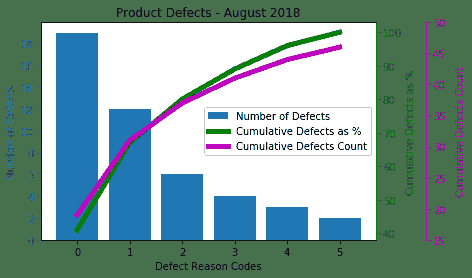
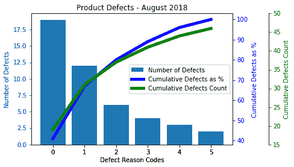
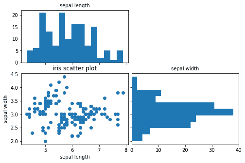
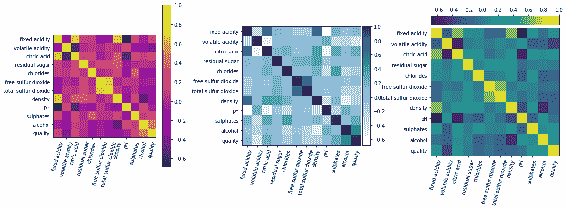
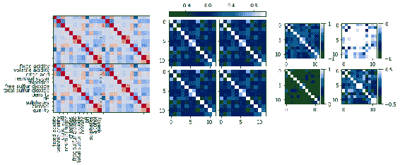
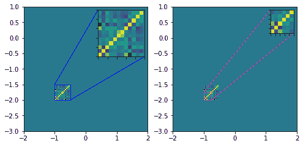
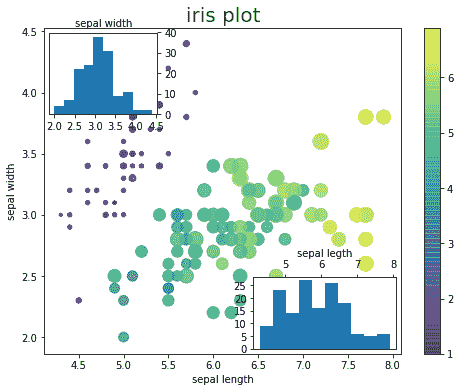

# 十二、使用`axes_grid1`工具包

在本章中，我们将学习`axes_grid1`工具包的功能。 我们将介绍以下食谱：

*   使用`axisartst`和`axesgrid1`工具包绘制双生轴域
*   使用`AxesDivider`绘制散点图和相关的直方图
*   使用`AxesDivider`绘制颜色条
*   使用`ImageGrid`在网格中用颜色条绘制图像
*   使用`inset_locator`放大图像
*   使用`inset_locator`绘制插入轴域

# 介绍

`axes_grid1`工具包旨在提供一组帮助器类，以在网格中绘制带有颜色条的图像，并根据图像大小正确对齐颜色条。 它可用于放大图像的一部分，绘制插入轴域（类似于图片中的图片），绘制二维图和两个变量，从属轴域和锚定艺术家中每个变量的关联直方图。

# 使用`axisartist`和`axesgrid1`工具箱绘制双生轴域

在第 4 章和“开发可视化来提高发布质量”中，我们学习了如何使用双生轴域方法在图的左右轴域上绘制两个不同的比例尺。 在第 9 章和“开发交互式绘图”中，我们学习了如何在 *y* 轴域上绘制不同的测量单位，并再次使用`twinx`方法进行交互式分析 。 在本食谱中，我们将学习如何使用 Matplotlib `twinx`主方法以及`axisartist`和`axes_grid1`工具包在 *y* 轴域上绘制多个比例尺。

# 准备

我们将首先使用 Matplotlib `twinx()`方法绘制图形。 然后，在“更多”部分中，我们将使用`axisartist`和`axes_grid1`工具包再次绘制图形。

您需要使用以下命令导入所需的库：

```py
import matplotlib.pyplot as plt
from matplotlib.ticker import MultipleLocator
```

# 操作步骤

以下是绘制双生轴域图所需的步骤：

1.  定义图形和主轴域（左侧为`ax1`， *y* 轴），如下所示：

```py
fig, ax1 = plt.subplots(1,1)
```

2.  定义双生轴域（右侧为`ax2`， *y* 轴，右侧为`ax3`，另一 *y* 轴）：

```py
ax2 = ax1.twinx()
ax3 = ax1.twinx()
```

3.  放置`ax3`使其不与`ax2`右侧轴域重叠：

```py
ax3.spines["right"].set_position(("axes", 1.15))
```

4.  准备数据并在主轴域`ax1`上绘制产品缺陷条形图：

```py
x = [0, 1, 2, 3, 4, 5]
y = [19, 12, 6, 4, 3, 2]
b = ax1.bar(x, y, label='Number of Defects')
```

5.  在右轴域`ax2`上的折线图中准备数据并按百分比绘制累积缺陷：

```py
y = [41, 67, 80, 89, 96, 100]
l, = ax2.plot(x, y, color='g', lw=5, label='Cumulative Defects as %')
```

6.  准备数据并在第二个右轴域`ax3`上绘制累积的缺陷计数折线图：

```py
y = [19, 31, 37, 41, 44, 46]
l1, = ax3.plot(x, y, color='m', lw=5, label='Cumulative Defects 
               Count')
```

7.  定义步长为`2`的主定位器，并将其应用于主轴域`ax1`的 *y* 轴：

```py
majorLocator = MultipleLocator(2)
ax1.yaxis.set_major_locator(majorLocator)
```

8.  使用以下代码设置 *x* 和 *y* 标签以及所有轴域的限制：

```py
ax1.set(xlabel='Defect Reason Codes', ylabel='Number of Defects')
ax2.set(ylabel='Cumulative Defects as %')
ax3.set_ylim(15,50)
ax3.set_ylabel('Cumulative Defects Count', labelpad=10)
```

9.  如下设置主轴域的图例和标题：

```py
graphs = [b, l, l1]
ax1.legend(graphs, [g.get_label() for g in graphs], loc=5)
ax1.set_title('Product Defects - August 2018')
```

10.  设置标签的颜色：

```py
ax1.yaxis.label.set_color(b.patches[0].get_facecolor())
ax2.yaxis.label.set_color(l.get_color())
ax3.yaxis.label.set_color(l1.get_color())
```

11.  设置两个右轴的颜色，如下所示：

```py
ax2.spines["right"].set_edgecolor(l.get_color())
ax3.spines["right"].set_edgecolor(l1.get_color())
```

12.  设置刻度和刻度标签的颜色，如下所示：

```py
ax1.tick_params(axis='y', colors=b.patches[0].get_facecolor())
ax2.tick_params(axis='y', colors=l.get_color())
ax3.tick_params(axis='y', colors=l1.get_color())
```

13.  最后，使用以下命令在屏幕上显示图形：

```py
plt.show()
```

# 工作原理

这是前面代码的解释：

*   `ax2 = ax1.twinx()`和`ax3 = ax1.twinx()`创建名为`ax2`和`ax3`的逻辑轴域，它们共享主轴域（`ax1`）的 *x* 轴。 *y* 轴在右侧。
*   `ax3.spines["right"].set_position(("axes", 1.15))`将第二个 *y* 轴向右移动主轴域宽度的 15%。 如果我们不这样做，则`ax2`和`ax3`的 *y* 轴将相互重叠，并在同一轴域上同时显示它们的刻度和刻度标签。
*   `x = [0, 1, 2, 3, 4, 5]`是产品缺陷代码的列表，`y = [19, 12, 6, 4, 3, 2]`是缺陷原因代码的列表。
*   `b = ax1.bar(x, y, label='Number of Defects')`绘制了产品缺陷数量的条形图。
*   `y1 = [41, 67, 80, 89, 96, 100]`是累积缺陷占总数百分比的列表。
*   `l, = ax2.plot(x, y1, color='g', lw=5, label='Cumulative Defects as %')`将其绘制为线形图。
*   `y2 = [19, 31, 37, 41, 44, 46]`是累积缺陷计数的列表。
*   `l1, = ax3.plot(x, y2, color='m', lw=5, label='Cumulative Defects Count')`将其绘制为线形图。
*   `majorLocator = MultipleLocator(2)`以`2`的步长定义定位器，`ax1.yaxis.set_major_locator(majorLocator)`将定位器应用于主轴域`ax1`的 *y* 轴。
*   `ax3.set_ylabel('Cumulative Defects Count', labelpad=10)`为最右边的轴设置 *y* 轴标签，而`labelpad=10`指定该轴与其标签之间的间隙，以使标签不与该轴的刻度标签重叠。
*   `ax1.legend(graphs, [g.get_label() for g in graphs], loc=5)`绘制图例如下：
    *   `[g.get_label() for g in graphs]`获取在绘制图形时设置的每个图形的标签列表。
    *   `loc=5`指定将图例绘制在轴的右侧。 有关放置图例的更多选项，请参考第 4 章和“开发可视化来提高发布质量”。

*   `ax1.yaxis.label.set_color(b.patches[0].get_facecolor())`设置主轴域的 *y* 轴标签的颜色，如下所示：
    *   `b.patches[0].get_facecolor()`获取条形图中第一个条的`facecolor`值，`b.patches[]`是另存为色块的条形容器。
    *   使用此命令，而不是显式设置颜色，我们将使用用于绘制图形的颜色并将其用于 *y* 轴标签。 始终使用相同的颜色。
*   `ax2.yaxis.label.set_color(l.get_color())`和`ax3.yaxis.label.set_color(l1.get_color())`获得线图`l`和`l1`的颜色，并将它们应用于各自的标签。
*   `ax2.spines["right"].set_edgecolor(l.get_color())`设置右轴的颜色，用于绘制线图`l`。
*   `ax3.spines["right"].set_edgecolor(l1.get_color())`设置第二个右轴的颜色，用于绘制折线图`l1`。
*   `ax1.tick_params(axis='y', colors=b.patches[0].get_facecolor())`设置刻度和刻度标签的颜色。

执行上述代码后，您应该在屏幕上看到以下图形：



# 更多

现在，我们将使用`axisartist`和`axes_grid1`工具包绘制相同的图形。 遵循的步骤是相同的​​，因此在此我们将不描述每个步骤，而是将整个代码列出在一个块中。 此后，我们将解释这两种方法之间的主要区别。

这是使用`axisartist`和`axes_grid1`工具包绘制图形的完整代码块：

```py
from mpl_toolkits.axes_grid1 import host_subplot
import mpl_toolkits.axisartist as AA
import matplotlib.pyplot as plt

plt.figure()
ax1 = host_subplot(111, axes_class=AA.Axes)

ax1.axis["top"].toggle(all=False) # switch off ticks and ticklabels for 
                                    the top axis
ax2 = ax1.twinx()
ax3 = ax1.twinx()

new_fixed_axis = ax3.get_grid_helper().new_fixed_axis
ax3.axis["right"] = new_fixed_axis(loc="right", axes=ax3, offset=(60, 
                                                                  0))

ax2.axis["right"].toggle(all=True)
ax3.axis["right"].toggle(all=True)

ax1.set_xlabel('Defect Reason Codes')
ax1.set_ylabel('Number of Defects')
ax2.set_ylabel('Cumulative Defects as %')
ax3.set_ylabel('Cumulative Defects Count')

x = [0, 1, 2, 3, 4, 5]
y = [19, 12, 6, 4, 3, 2]
y1 = [41, 67, 80, 89, 96, 100]
y2 = [19, 31, 37, 41, 44, 46]

b = ax1.bar(x, y, label='Number of Defects')
l, = ax2.plot(x, y1, lw=5, label='Cumulative Defects as %', color='b')
l1, = ax3.plot(x, y2, lw=5, label='Cumulative Defects Count', 
               color='g')

ax3.set_ylim(15, 50)
ax1.legend(loc=5)
ax1.set_title('Product Defects - August 2018')

ax1.axis["left"].label.set_color(b.patches[0].get_facecolor())
ax2.axis["right"].label.set_color(l.get_color())
ax3.axis["right"].label.set_color(l1.get_color())

ax1.axis["left"].major_ticks.set_color(b.patches[0].get_facecolor())
ax2.axis["right"].major_ticks.set_color(l.get_color())
ax3.axis["right"].major_ticks.set_color(l1.get_color())

ax1.axis["left"].major_ticklabels.set_color(b.patches[0].get_facecolor())
ax2.axis["right"].major_ticklabels.set_color(l.get_color())
ax3.axis["right"].major_ticklabels.set_color(l1.get_color())

# setting the color for axis itself is not working in AA
ax2.spines["right"].set_color(l.get_color()) 
ax3.spines["right"].set_color(l1.get_color())

ax1.axis[:].major_ticks.set_tick_out(True)
ax2.axis[:].major_ticks.set_tick_out(True)
ax3.axis[:].major_ticks.set_tick_out(True)

plt.show()
```

这是两种方法之间主要区别的解释：

*   而不是使用`plt.subplots()`，这里我们使用`ax1 = host_subplot(111, axes_class=AA.Axes)`，它是`axes_grid1`工具包的辅助函数，它以`axisartist`作为参数。 这意味着`ax1`轴域获得`host_subplot()`和`axisartist`的属性。
*   `ax2=ax1.twinx()`自动为其 *y* 轴映射`ax1`的右脊。
*   但是，对于`ax3`，我们将必须使用以下命令手动创建另一个右轴：
    *   `new_fixed_axis = ax3.get_grid_helper().new_fixed_axis`。
    *   `ax3.axis["right"] = new_fixed_axis(loc="right", axes=ax3, offset=(60, 0))`。
    *   `offset=(60,0)`将轴向右推动`60`点，`0`指向顶部。
*   `ax2.axis["right"].toggle(all=True)`将`ax1`右脊的轴标签，刻度和刻度标签设置为可见。
*   `ax3.axis["right"].toggle(all=True)`将新创建的右轴的轴标签，刻度和刻度标签设置为可见。
*   我们为标签，刻度和刻度标签设置各种属性的方式，与我们在第 12 章“使用`axisartist`工具包”中了解的方法相同。
*   但是，某些属性无法与原始轴类一起正常工作，因为`axisartist`不能继承原始轴类的所有属性。
*   当您使用交互式后端打开该图并放大图形的某些部分时，只有主轴域的 *y* 限制发生变化，而其他 *y* 轴的数据则发生变化。 右（从属轴域）与初始设置相同。 如果不使用`axes_grid1`和`axisartist`来绘制先前的图形，情况并非如此，其中所有 *y* 轴限制都会更改以反映图形的当前部分。

执行前面的代码块后，您应该看到以下图形：



# 使用`AxesDivider`绘制散点图和相关的直方图

在本食谱中，我们将学习如何使用`axes_grdi1`的`AxesDivider`类在主轴域上绘制双变量图，并在主轴域的任意两侧绘制两个单变量图。 这有助于可视化两个变量之间的关系，以及同一图中两个变量的分布情况（尽管三个不同的轴域/曲线）。

从技术上讲，在主轴域上绘制的变量和在主轴域两侧上的单变量图可以不同。 您可以从主轴域的四个侧面中选择任意两个侧面以进行单变量图绘制。 但是，通常的做法是绘制在主轴域的顶部和右侧。

在此配方中，我们将在带有两个变量的主轴域上绘制散点图，并且在主轴域的顶部和右侧，将为散点图所使用的两个变量分别绘制直方图。

# 准备

让我们导入所需的库。 应当指出，我们不是直接导入`AxesDiveder`； 相反，我们正在使用此类的帮助函数`make_axes_locatable`。 您需要使用以下命令导入库：

```py
import numpy as np
import matplotlib.pyplot as plt
from mpl_toolkits.axes_grid1 import make_axes_locatable
import pandas as pd
```

# 操作步骤

以下是绘制图形所涉及的步骤：

1.  使用以下命令加载我们先前已经使用的`Iris`数据集：

```py
iris = pd.read_csv('iris_dataset.csv', delimiter=',')
iris['species'] = iris['species'].map({"setosa" : 0, "versicolor" : 
                                        1, "virginica" : 2})
x, y = iris['sepal_length'], iris['sepal_width']
```

2.  如下定义图形和主轴域：

```py
fig, axmain = plt.subplots(figsize=(8, 6))
```

3.  使用 1 的纵横比在主轴域上绘制散点图

```py
axmain.scatter(x, y)
axmain.set_aspect(1.)
```

4.  定义轴域分割器，以使一个轴域位于主轴域的顶部，另一个轴域位于主轴域的右侧，如下所示：

```py
divider = make_axes_locatable(axmain)
axtop = divider.append_axes("top", size=1.5, pad="15%", 
                             sharex=axmain)
axright = divider.append_axes("right", "100%", 0.1, sharey=axmain)
```

5.  使刻度标签对顶部轴域的 *x* 轴以及右轴域的 *y* 轴不可见，以使它们不与主轴域重叠：

```py
axtop.xaxis.set_tick_params(labelbottom=False)
axright.yaxis.set_tick_params(labelleft=False)
```

6.  在上下轴域上绘制直方图：

```py
axtop.hist(x, bins=15)
axright.hist(y, bins=10, orientation='horizontal')
```

7.  设置顶部轴域的`yticks`，和右侧轴域的`xticks`：

```py
axtop.set_yticks([0, 5, 10, 15, 20])
axright.set_xticks([0, 10, 20, 30, 40])
```

8.  如下设置所有轴域的标签和标题：

```py
axmain.set(xlabel='sepal length', ylabel='sepal width', title='iris 
           scatter plot')
axtop.set_title('sepal length', size=10)
axright.set_title('sepal width', size=10)
```

9.  最后，使用以下命令在屏幕上显示图形：

```py
plt.show()
```

# 工作原理

这是前面代码的解释：

*   前面的示例已经对您熟悉了前三个步骤。
*   `divider = make_axes_locatable(axmain)`定义轴域分离器。 它实质上是定位给定轴域的边界。
*   `axtop = divider.append_axes("top", size=1.5, pad="15%", sharex=axmain)`在主轴域上方定义一个新轴域，如下所示：
    *   `"top"`指定要在当前轴域之上绘制的新轴域。
    *   `size=1.5`指定此新轴域的高度为 1.5 英寸，其宽度与主访问宽度相同。
    *   `pad=15%`指定主轴域与顶部新轴域之间的间隙为主轴域高度的 15%。
    *   `sharex=axmain`指定此新轴域应与主轴域共享 *x* 轴属性，例如轴标签，刻度和刻度标签
*   `axright = divider.append_axes("right", "100%", 0.1, sharey=axmain)`在主轴域右侧定义了一个新轴域，如下所示：
    *   `"right"`指定新轴域应绘制在主轴域的右侧。
    *   `100%`指定新轴域的宽度与主轴域的宽度相同。 新轴域的高度也与主轴域的高度相同，因为它们都共享 *y* 轴。
    *   `0.1`是主轴域和该新轴域之间的填充（以磅为单位）。
    *   `sharey=axmain`指定此新轴域应与主轴域共享 *y* 轴属性，例如轴标签，刻度和刻度标签。
*   `axtop.xaxis.set_tick_params(labelbottom=False)`使 *x* 轴标签对于上轴域不可见。
*   `axright.yaxis.set_tick_params(labelleft=False)`使 *y* 轴标签对于右轴域不可见。
*   `axtop.hist(x, bins=15)`在具有 15 个桶的顶轴域上绘制直方图。
*   `axright.hist(y, bins=10, orientation='horizontal')`使用水平条形图而不是默认垂直条形图在带有 10 个桶的右轴域上绘制直方图。
*   其余的语句设置所有三个轴域的刻度，标签和标题。

运行代码后，您应该在屏幕上看到以下图形：



# 使用`AxesDivider`绘制颜色条

在本食谱中，我们将学习如何使用`AxesDivider`绘制图像的颜色条，以确保其与图像正确对齐。 我们已经使用了`pyplot.colorbar()`很多次，但有时颜色条超出了图像边界。 使用`AxesDivider`和`ImageGrid`，我们将不会看到此问题，如本食谱所示。

我们将在三个轴域上绘制图像–一个使用不带`AxesDivider`的常规`pyplot.colorbar()`； 第二个使用`AxesDivider`和右侧的垂直颜色条; 第三个再次使用`AxesDivider`，但这一次在图像顶部带有水平色条。

# 准备

您需要使用以下命令导入所需的库：

```py
import matplotlib.pyplot as plt
from matplotlib.pyplot import imshow
from mpl_toolkits.axes_grid1 import make_axes_locatable
import numpy as np
import pandas as pd
```

# 操作步骤

以下是使用颜色条绘制图像所涉及的步骤：

1.  将数据集加载到`winequality.csv`上，如下所示：

```py
wine_quality = pd.read_csv('winequality.csv', delimiter=';')
corr_wine = wine_quality.corr()
```

2.  使用以下命令定义该图：

```py
fig = plt.figure(1, (16., 6.))
```

3.  定义第一个子图，绘制图像和颜色条，并使用以下代码设置 *x* 和 *y* 刻度。

```py
plt.subplot(131)
plt.imshow(corr_wine, cmap='plasma')
plt.colorbar()
plt.xticks(range(len(corr_wine)),corr_wine.columns, rotation=75)
plt.yticks(range(len(corr_wine)),corr_wine.columns)
```

4.  使用以下代码，定义第二个子图，绘制图像，定义`AxesDivider`，在右侧绘制颜色条，然后设置 *x* 和 *y* 刻度。

```py
ax2 = plt.subplot(132)
im1 = ax2.imshow(corr_wine, cmap='Blues')
ax2_divider = make_axes_locatable(ax2)
cax1 = ax2_divider.append_axes("right", size="7%", pad=0.03)
plt.colorbar(im1, cax=cax1)
ax2.set_xticks(range(len(corr_wine)))
ax2.set_xticklabels(corr_wine.columns, rotation=75)
ax2.set(yticks=range(len(corr_wine)), yticklabels=corr_wine.columns)
```

5.  定义第三个子图，绘制图像，定义`AxesDivider`，在顶部绘制水平色条，然后按如下所示设置 *x* 和 *y* 刻度。

```py
ax3 = plt.subplot(133)
im2 = ax3.imshow(corr_wine)
ax3_divider = make_axes_locatable(ax3)
cax2 = ax3_divider.append_axes("top", size="7%", pad="2%")
cb2 = plt.colorbar(im2, cax=cax2, orientation="horizontal")
cax2.xaxis.set_ticks_position("top")
ax3.set_xticks(range(len(corr_wine)))
ax3.set_xticklabels(corr_wine.columns, rotation=75)
ax3.set(yticks=range(len(corr_wine)), yticklabels=corr_wine.columns)
```

6.  使用以下命令调整绘图之间的间隔：

```py
plt.tight_layout(w_pad=-1)
```

7.最后，使用以下命令在屏幕上显示图形：

```py
plt.show()
```

# 工作原理

这是前面代码的解释：

*   `fig = plt.figure(1, (16., 6.))`将图 1 定义为`16 x 6`英寸。
*   `plt.subplot(131)`定义`1 x 3`网格上的第一个轴域。
*   `plt.imshow(corr_wine, cmap='plasma')`使用`'plasma'`颜色表绘制相关图。
*   `plt.colorbar()`在其右侧绘制图像的颜色条。
*   `plt.xticks(range(len(corr_wine)),corr_wine.columns, rotation=75)`在`75`度的倾斜度上绘制 *x* 轴刻度和带有属性名称的刻度标签。
*   `plt.yticks(range(len(corr_wine)),corr_wine.columns)`绘制 *y* 轴刻度和刻度标签，没有任何旋转。
*   `ax2 = plt.subplot(132)`在`1 x 3`的网格上定义第二个轴域。
*   `im1 = ax2.imshow(corr_wine, cmap='Blues')`使用`'Blues'`颜色表绘制相关图。
*   `ax2_divider = make_axes_locatable(ax2)`为第二个轴域定义`AxesDivider`函数。
*   `cax1 = ax2_divider.append_axes("right", size="7%", pad=0.03)`使用`AxesDivider`定义了颜色条的新轴域。
*   `"right"`指定将新轴域放置在`ax2`的右侧。
*   `size="7"`指定新轴域的宽度应为`ax2`宽度的 7%。
*   `pad=0.03`指定`ax2`轴域和颜色条轴域之间的间隙应为`ax2`宽度的 3%。
*   `plt.colorbar(im1, cax=cax1)`绘制`ax2`右侧的颜色条，并带有给定的图像和颜色条轴域。
*   `ax2.set_xticks(range(len(corr_wine)))`将 *x* 轴刻度设置为输入数据中我们具有的属性数。
*   `ax2.set_xticklabels(corr_wine.columns, rotation=75)`设置带有属性名称和`75`倾斜度的刻度标签。
*   `ax2.set(yticks=range(len(corr_wine)), yticklabels=corr_wine.columns)`设置 *y* 轴刻度和刻度标签，不旋转。
*   `ax3 = plt.subplot(133)`在`1 x 3`的网格上定义第三个轴域。
*   其余步骤与前面介绍的第二个图完全相同，除了颜色条以水平方向而不是默认垂直方向绘制在图像顶​​部。
*   `plt.tight_layout(w_pad=-1)`调整绘图之间的间隔，以确保没有重叠。 负`w_pad`值用于减小`tight_layout()`使用的默认间隙。

运行上述代码后，您应该在屏幕上看到以下图形。 应该注意的是，在第一个图中，颜色条超出了图像的高度，而在第二个和第三个图中，它与图像的高度或宽度完全匹配，这是使用`AxesDivider`的优点：



# 使用`ImageGrid`在网格中使用颜色条绘制图像

在第 3 章，“绘制多个图形，子图形和图形”和第 6 章，“绘制高级功能”的过程中，我们学习了如何在网格上绘制具有多个网格选项的多个图。 当您尝试使用带有这些选项的网格上的颜色条来绘制图像时，颜色条对齐可能不是我们想要的方式。`axes_grid1`工具包的`ImageGrid`辅助功能可在网格中以正确对齐方式绘制带有颜色条的图像。 我们将在本食谱中学习如何使用这些功能。

我们将在三个不同的图中连续绘制相同的相关图，但是使用网格的不同特征来演示大多数（如果不是全部）可用特征。

# 准备

您需要使用以下命令导入所需的库：

```py
import matplotlib.pyplot as plt
from matplotlib.pyplot import imread, imshow
from mpl_toolkits.axes_grid1 import ImageGrid
import pandas as pd
```

# 操作步骤

以下是绘制所需图形所涉及的步骤：

1.  加载数据并创建具有相同相关矩阵的四个图像的列表，如下所示：

```py
wine_quality = pd.read_csv('winequality.csv', delimiter=';')
corr_wine = wine_quality.corr()

images = []
images.append(corr_wine)
images.append(corr_wine)
images.append(corr_wine)
images.append(corr_wine)
```

2.  定义尺寸为`12 x 8`英寸的图形：

```py
fig = plt.figure(1, (12, 8.))
```

3.  定义要在第一个轴域上绘制的`2 x 2`网格：

```py
grid1 = ImageGrid(fig, 131, nrows_ncols=(2, 2), axes_pad=0.0, 
                  label_mode="1")
```

4.  如下设置 *x* 和 *y* 刻度和刻度标签：

```py
grid1.axes_llc.set_xticks(range(len(corr_wine)))
grid1.axes_llc.set_xticklabels(corr_wine.columns, rotation=90)
grid1.axes_llc.set(yticks=range(len(corr_wine)), 
                   yticklabels=corr_wine.columns)
```

5.  在先前定义的`2 x 2`网格上绘制具有相同相关矩阵的四张图像，没有颜色条，：

```py
for i in range(4):
    gd = grid1[i].imshow(images[i], cmap='coolwarm') 
```

6.  定义另一个要在第二个轴域上绘制的`2 x 2`网格：

```py
grid2 = ImageGrid(fig, 132, nrows_ncols=(2, 2), axes_pad=0.1, label_mode="L", cbar_location="top",
                cbar_mode="single")
```

7.  在先前定义的`2 x 2`网格上，用相同的相关矩阵在上绘制四个图像：

```py
for i in range(4):
    im = grid2[i].imshow(images[i]) 
grid2.cbar_axes[0].colorbar(im)
```

8.  定义要在第三个轴域上绘制的第三个`2 x 2`网格：

```py
grid3 = ImageGrid(fig, 133, nrows_ncols=(2, 2), axes_pad=(0.5, 0.3), 
                  abel_mode="0", 
                  cbar_location="right", cbar_mode="each", 
                  cbar_size="10%", cbar_pad="3%")
```

9.  在先前定义的`2 x 2`网格上绘制具有相同或相关矩阵的四个图像：

```py
limits = ((-1, 1), (-1, 0), (0, 1.), (-0.5, 0.5))
for i in range(4):
    im = grid3[i].imshow(images[i], interpolation="nearest", 
                         vmin=limits[i][0], vmax=limits[i][1]) 
    grid3.cbar_axes[i].colorbar(im) 
    grid3.cbar_axes[i].set_yticks((limits[i][0], limits[i][1])) 
```

10.  最后，使用以下命令在屏幕上显示该图：

```py
plt.show()
```

# 工作原理

这是前面代码的解释：

*   `images = []`用空白初始化图像列表。
*   `images.append(corr_wine)`将`corr_wine`相关矩阵附加到图像列表。 我们重复四次以创建要在`2 x 2`网格上绘制的四个图像的列表。
*   `grid1 = ImageGrid(fig, 131, nrows_ncols=(2, 2), axes_pad=0.0, label_mode="1")`如下定义图像网格：
    *   `fig`指定要在其上绘制网格的图形。
    *   `131`指定它是一个`1 x 3`的网格，并且这是第一个网格。
    *   `nrows_ncols=(2,2)`将网格格式指定为`2 x 2`。
    *   `axes_pad=0.0`指定图像之间的间隔为零。
    *   `label_mode="1"`指定应仅为网格的左下角图像打印刻度标签和轴标签。
*   `grid1.axes_llc.set_xticks(range(len(corr_wine)))`设置 *x* 轴上的刻度线，其数量与相关矩阵中的变量数量一样多。
*   `grid1.axes_llc.set_xticklabels(corr_wine.columns, rotation=90)`在 *x* 轴上以`90`度倾斜度打印带有变量名的刻度标签。
*   `grid1.axes_llc.set(yticks=range(len(corr_wine)), yticklabels=corr_wine.columns)`使用相同的变量名称为 *y* 轴打印刻度和刻度标签，无需旋转。
*   `for i in range(4):`是`for`循环，可在四个网格中一张一张地绘制图像：
    *   `gd = grid1[i].imshow(images[i], cmap='coolwarm')`使用`coolwarm`色彩图绘制图像。
*   `grid2 = ImageGrid()`使用以下参数定义第二个图像网格：
    *   `fig`指定要绘制此网格的图。
    *   `132`指定它是另一个`1 x 3`网格中的第二个网格。
    *   `nrows_ncols=(2,2)`将网格格式指定为`2 x 2`。
    *   `axes_pad=0.1`将图像之间的间隙指定为 0.1 英寸。
    *   `label_mode="L"`指定是要为左右图像绘制的标签，形成`"L"`形状。
    *   `cbar_location="top"`指定颜色条应绘制在图像顶​​部。
    *   `cbar_mode="single"`指定只能在网格顶部绘制一个颜色条。
*   `for i in range(4):`是用于在四个网格上一一绘制图像的`for`循环：
    *   `im = grid2[i].imshow(images[i], cmap='ocean')`使用`'ocean'`颜色表绘制图像。
*   `grid2.cbar_axes[0].colorbar(im)`打印颜色条。
*   `grid3 = ImageGrid()`定义第三个图像网格，其参数如下：
    *   `fig`指定要绘制此网格的图。
    *   `133`指定它是另一个`1 x 3`网格中的第三个网格。
    *   `nrows_ncols=(2,2)`将网格格式指定为`2 x 2`。
    *   `axes_pad=(0.5,0.3)`将图像之间的间距指定为水平`0.5`英寸和垂直`0.3`英寸。
    *   `label_mode="0"`，指定要为所有图像绘制标签。
    *   `cbar_location="right"`指定应在图像的右侧绘制颜色条。
    *   `cbar_mode="each"`指定应在网格中每个图像的右侧绘制颜色条。
    *   `cbar_size="10%"`指定彩条宽度应为图像轴域宽度的`10%`。
    *   `cbar_pad="3%"`指定彩条和图像之间的距离为图像轴域宽度的 3%。
    *   `limits = ((-1, 1), (-1, 0), (0, 1.), (-0.5, 0.5))`指定要应用于四个图像的每个颜色条的下限和上限，而不是绘制 -1 至 +1 的整个范围。
*   `for i in range(4):`是用于在四个网格中一一绘制图像的`for`循环：
    *   `im = grid3[i].imshow(images[i], interpolation="nearest", vmin=limits[i][0], vmax=limits[i][1], cmap='ocean')`使用`'ocean'`色彩图绘制图像。
    *   `interpolation="nearest"`指定值超出指定限制的单元格将填充这些限制内的最近单元格值。
    *   `vmin=limits[i][0]`指定给定`i`图像（元组的第一项）的下限。
    *   `vmax=limits[i][1]`指定给定`i`图像（元组的第二个条目）的上限。
    *   `grid3.cbar_axes[i].colorbar(im)`打印颜色条。
    *   `grid3.cbar_axes[i].set_yticks((limits[i][0], limits[i][1]))`使用给定的限制设置 *y* 轴的刻度和刻度标签。

执行上述代码后，您应该在屏幕上看到以下图形：



# 使用`inset_locator`放大图像

在第 6 章“带有高级功能的绘图”中，我们学习了如何使用 Matplotlib 的面向对象界面在主轴域内绘制插入轴域。 在本食谱和下一篇食谱中，我们将学习如何使用`axes_grid1`工具包的`inset_locator`帮助器功能创建插入轴域并绘制图像和其他图形。

在本食谱中，我们将学习如何放大图像的一部分并将其显示在相同主轴域的插入轴域上。

我们将在两个轴域上绘制图像，并在每个图中放大图像的不同部分。

# 准备

您需要使用以下命令导入所需的库：

```py
import matplotlib.pyplot as plt
import numpy as np
import pandas as pd

from mpl_toolkits.axes_grid1.inset_locator import zoomed_inset_axes
from mpl_toolkits.axes_grid1.inset_locator import mark_inset
```

# 操作步骤

这是绘制图形的必要步骤：

1.  如下定义图形和两个轴域：

```py
fig, (ax1, ax2) = plt.subplots(1, 2, figsize=[8, 4])
```

2.  使用以下命令加载`winequality`数据并计算相关矩阵：

```py
wine_quality = pd.read_csv('winequality.csv', delimiter=';')
corr_wine = wine_quality.corr()
```

3.  创建一个带有零的扩展图像，并将相关矩阵插入其中：

```py
extended_image = np.zeros([100, 100], dtype="d")
ny, nx = corr_wine.shape
extended_image[25:25 + ny, 25:25 + nx] = corr_wine
```

4.  绘制具有给定范围的扩展图像，即 *x* 和 *y* 限制，如下所示：

```py
extent = [-2, 2, -3, 1]
ax1.imshow(extended_image, extent=extent, interpolation="nearest",
           origin="lower")
```

5.  定义插入轴域，如下所示：

```py
axins1 = zoomed_inset_axes(ax1, 3, loc=1)
```

6.  在插入轴域上绘制扩展图像：

```py
axins1.imshow(extended_image, extent=extent, 
              interpolation="nearest", origin="lower")
```

7.  设置 *x* 和 *y* 轴的插入轴域数据限制，并指定要放大的相关矩阵部分：

```py
axins1.set_xlim(-1.0, -0.5)
axins1.set_ylim(-2.0, -1.5)
```

8.  使用以下给定值设置刻度线：

```py
axins1.xaxis.get_major_locator().set_params(nbins=8)
axins1.yaxis.get_major_locator().set_params(nbins=8)
```

9.  将插入轴域的刻度标签设置为在 *x* 和 *y* 轴上均不可见：

```py
plt.xticks(visible=False)
plt.yticks(visible=False)
```

10.  在选定要缩放的部分周围标记一个边界框，并使用线条将其与缩放的插入轴域连接：

```py
mark_inset(ax1, axins1, loc1=2, loc2=4, fc="none", ec="b")
```

11.  对第二个轴域重复执行*步骤 4* 至*步骤 8* ，这将显示放大的图像较小的部分：

```py
ax2.imshow(extended_image, extent=extent, interpolation="nearest",
           origin="lower")

axins2 = zoomed_inset_axes(ax2, 3, loc=1) # zoom = 3
axins2.imshow(extended_image, extent=extent, 
              interpolation="nearest", origin="lower")

axins2.set_xlim(-1.0, -0.75)
axins2.set_ylim(-2.0, -1.75)

axins2.yaxis.get_major_locator().set_params(nbins=8)
axins2.xaxis.get_major_locator().set_params(nbins=8)

plt.xticks(visible=False)
plt.yticks(visible=False)

mark_inset(ax2, axins2, loc1=2, loc2=4, fc="none", ec="m")
```

12.  最后，使用以下命令在屏幕上显示图：

```py
plt.show()
```

# 工作原理

这是前面代码的解释：

*   `extended_image = np.zeros([100, 100], dtype="d")`创建一个用零填充的`100 x 100` NumPy 数组，并将数据类型指定为双精度浮点数。
*   `nx, ny = corr_wine.shape`将相关矩阵的形状分为`nx`和`ny`。
*   `extended_image[25:25 + nx, 25:25 + ny] = corr_wine`将相关矩阵嵌入在`(25, 25)`位置的`100 x 100`零矩阵内，用`corr_wine`的值替换零。
*   `extent = [-2, 2, -3, 1]`指定主轴域的 x 坐标上的数据限制为`(-2, 3)`和 *y* 为`(-3, 1)`。 有关更多详细信息，请参考第 6 章，“带有高级功能的绘图”，“起源和范围”中的配方。
*   `ax1.imshow(extended_image, extent=extent, interpolation="nearest", origin="lower")`在主轴域`ax1`上绘制扩展图像。
*   `axins1 = zoomed_inset_axes(ax1, 3, loc=1)`定义插入轴域如下：
    *   `ax1`是要在其上创建插入轴域的轴域。
    *   `3`指定插入轴域数据比例是主轴域的三倍，因此对于 *x* 和 *y* 轴，主轴域上的一个单位缩放到插入轴域上的三个单位。
    *   `loc=1`指定将插入轴域放置在主轴域的右上角。
*   `axins1.imshow(extended_image, extent=extent, interpolation="nearest", origin="lower")`在插入轴域上绘制相同的扩展图像，并使用与主轴域相同的参数。
*   `axins1.set_xlim(-1.0, -0.5)`和`axins1.set_ylim(-2.0, -1.5)`指定主轴域上要放大的图像部分。
*   `axins1.xaxis.get_major_locator().set_params(nbins=8)`和`axins1.yaxis.get_major_locator().set_params(nbins=8)`定义插入轴域的 *x* 和 *y* 轴上的刻度数。
*   `plt.xticks(visible=False)`和`plt.yticks(visible=False)`使插入标签的 *x* 和 *y* 轴均不可见刻度标签。
*   `mark_inset(ax1, axins1, loc1=2, loc2=4, fc="none", ec="b")`围绕要缩放的图像以及缩放的图像本身绘制边界，然后将它们连接到线条，如下所示：
    *   `ax1`指主轴域。
    *   `axins1`是指插入轴域。
    *   `loc1`和`loc2`指定要连接图像的哪些角；`2`指左上角，`4`指右下角。
    *   `fc="none"`指定不填充连接两个图像的线之间的区域。
    *   `ec="b"`指定连接图像的线应为蓝色。
*   我们的第二个图与第一个图完全相同，只是要放大的图像部分小于第一个图。
*   `axins2.set_xlim(-1.0, -0.75)`和`axins2.set_ylim(-2.0, -1.75)`指定第二幅图要放大的主图像区域。

执行上述代码后，您应该在屏幕上看到以下图形：



# 使用`inset_locator`绘制插入轴域

在本食谱中，我们将学习在主轴域上绘制散点图，并在两个插入轴域上创建两个变量中每个变量的直方图。 我们将使用熟悉的`Iris`数据集来执行此操作。

# 准备

您需要使用以下命令导入所需的库：

```py
import matplotlib.pyplot as plt
import numpy as np
import pandas as pd
from mpl_toolkits.axes_grid1.inset_locator import inset_axes
```

# 操作步骤

这是绘制图形的分步方法：

1.  加载`Iris`数据集，并使用`sepal_length`和`sepal_width`变量映射 *x* 和 *y* 坐标：

```py
iris = pd.read_csv('iris_dataset.csv', delimiter=',')
iris['species'] = iris['species'].map({"setosa" : 0, "versicolor" : 
                        1, "virginica" : 2})
x, y = iris['sepal_length'], iris['sepal_width']
```

2.  如下定义图形和主轴域：

```py
plt.figure(1, (8., 6.))
ax = plt.subplot(111)
```

3.  使用右侧的颜色条绘制散点图：

```py
im = ax.scatter(x, y, c=iris.petal_length, s=100*iris.petal_width, cmap='viridis', alpha=0.7)
plt.colorbar(im)
```

4.  如下定义插入轴域 1 属性：

```py
inset_ax1 = inset_axes(ax, width="40%", height=1., loc=4)
```

5.  在插入轴域 1 上绘制`sepal_length`直方图：

```py
inset_ax1.hist(iris.sepal_length)
```

6.  设置插入轴域的标题和标签，如下所示：

```py
inset_ax1.set_title('sepal length', size=10, pad=20)
inset_ax1.axis["bottom"].toggle(all=False)
inset_ax1.axis["top"].toggle(all=True)
inset_ax1.xaxis.get_major_locator().set_params(nbins=5)
inset_ax1.yaxis.get_major_locator().set_params(nbins=10)
```

7.  如下定义插入轴域 2 属性：

```py
inset_ax2 = inset_axes(ax, width=1.5, height="25%", loc=2)
```

8.在插入轴域 2 上绘制`sepal_width`直方图：

```py
inset_ax2.hist(iris.sepal_width)
```

9.  设置插入轴域的标题和标签，如下所示：

```py
inset_ax2.set_title('sepal width', size=10)
inset_ax2.axis["left"].toggle(all=False)
inset_ax2.axis["right"].toggle(all=True)
inset_ax2.xaxis.get_major_locator().set_params(nbins=6)
inset_ax2.yaxis.get_major_locator().set_params(nbins=10)
```

10.  设置主轴域的标题和标签，如下所示：

```py
ax.set(xlabel='sepal length', ylabel='sepal width')
ax.set_title('iris plot', size=20, color='g')
```

11.  最后，使用以下命令在屏幕上显示图：

```py
plt.show()
```

# 工作原理

这是前面代码的解释：

*   `im = ax.scatter(x, y, c=iris.petal_length, s=100*iris.petal_width, cmap='viridis', alpha=0.7)`在主轴域上绘制散点图，如下所示：
    *   `x`和`y`是要绘制的`sepal_length`和`sepal_width`变量。
    *   `c=iris.petal_length`指定点的颜色应根据其`petal_length`值。
    *   `s=100*iris.petal_width`指定散点图上的点的大小应根据其`petal_width`值乘以`100`来确定。
    *   `cmap='viridis'`指定要使用的颜色表。
    *   `alpha=0.7`指定绘图上点的透明度级别。
*   `plt.colorbar(im)`在主轴域的右侧绘制颜色条。
*   `inset_ax1 = inset_axes(ax, width="40%", height=1., loc=4)`定义插入轴域 1 的属性，如下所示：
    *   `ax`是要放置插入轴域的主轴域。
    *   `width="40%"`指定插入轴域的宽度应为主轴域宽度的`40%`。
    *   `height=1.`指定插入轴域的高度应为 1 英寸。
    *   `loc=4`指定将插入轴域放置在主轴域的右下角。
*   `inset_ax1.hist(iris.sepal_length)`绘制`sepal_length`变量的直方图。
*   `inset_ax1.set_title('sepal legth', size=10, pad=20)`打印尺寸为`10`点的插入轴域标题，并将其定位在顶部轴域上方`20`点，以使刻度标签和标题不重叠。
*   `inset_ax1.axis["bottom"].toggle(all=False)`将底部轴的轴标签，刻度和刻度标签设置为不可见。
*   `inset_ax1.axis["top"].toggle(all=True)`将顶部轴的轴标签，刻度和刻度标签设置为可见。
*   `inset_ax1.xaxis.get_major_locator().set_params(nbins=5)`指定 *x* 轴上的刻度数。
*   `inset_ax1.yaxis.get_major_locator().set_params(nbins=10)`指定 *y* 轴上的刻度数。
*   `inset_ax2 = inset_axes(ax, width=1.5, height="25%", loc=2)`定义第二插入轴域如下：
    *   `width=1.5`将插入轴域的宽度指定为`1.5`英寸。
    *   `height="25%"`指定插入轴域的高度为主轴域高度的`25%`。
    *   `loc=2`指定将插入轴域放置在主轴域的左上角。
*   `ax.set(xlabel='sepal length', ylabel='sepal width')`设置主轴域的 *x* 和 *y* 轴标签。
*   `ax.set_title('iris plot', size=20, color='g')`用`20`点的大小和绿色设置图形的标题。

执行上述代码后，您应该在屏幕上看到以下图形：

