# 五、使用高级功能的绘图

在本章中，我们将学习以下食谱：

*   使用属性循环器
*   绘制路径效果
*   使用转换
*   控制轴域位置
*   使用`gridspec`
*   结合使用`gridspec_kw`和`pyplot.subplots`
*   对齐绘图`gridspec`
*   使用受限布局
*   使用原点和范围进行图像绘制
*   使用 Pandas 的地理绘图

# 使用属性循环器

我们在第 4 章和“开发可视化来提高发布质量”时了解到，Matplotlib 具有默认的颜色循环，当我们在给定轴域上绘制更多图形时，该颜色循环将重复出现。 通过属性循环器，我们可以在单个函数中为多个属性定义此类循环器。 如果要绘制具有重复图案的轴域，则可以使用属性循环器实现。

# 准备

我们将在此处使用面向对象的 API。 在第 4 章“开发可视化以提高发布质量”中，在此示例中使用了`pyplot` API。 导入所需的库：

```py
from cycler import cycler
import numpy as np
from matplotlib.backends.backend_agg import FigureCanvasAgg as FigureCanvas
from matplotlib.figure import Figure
from IPython.core.display import display
```

# 操作步骤

以下代码块绘制了六个领带对象； 后两个是前两个的重复。 在此示例中，它在每四个对象之后重复循环：

1.  定义图形并将其附加到画布上：

```py
fig = Figure()
FigureCanvas(fig)
```

2.  为图形设置`facecolor`，`edgecolor`和`alpha`并添加一个轴域：

```py
fig.set(facecolor='grey', alpha=0.2, edgecolor='m')
ax = fig.add_subplot(111)
```

3.  设置用于绘制图形的数据：

```py
x = np.array([0.2, 0.4, 0.6, 0.8, 0.5])
y = [1, 6, 6, 1, 0]
```

4.  为，，`color`和`hatch`属性定义`custom_cycler`，并将其设置为轴域：

```py
custom_cycler = cycler('color', ['g', 'blue', 'y', 'c']) + \
                cycler('hatch', ['+*', 'xx', '+x', '+O.'])
ax.set_prop_cycle(custom_cycler)
```

5.  绘制六个领带对象的图形：

```py
ax.fill(x+1, y)
ax.fill(x+2, y)
ax.fill(x+3, y)
ax.fill(x+4, y)
ax.fill(x+5, y)
ax.fill(x+6, y)
```

6.  在屏幕上显示该图：

```py
display(fig)
```

# 工作原理

以下是代码的说明：

*   `fig = Figure()`定义图形对象。
*   `FigureCanvas(fig)`将图形对象附加到将在其上绘制图形的画布。
*   `fig.set(facecolor='grey', alpha=0.2, edgecolor='m')`设置图形的各种属性。 通常，我们在 轴域级别的单个图上使用这些属性。 但是在这里，我们在图形级别使用它们。`ax = fig.add_subplot(111)`实例化轴域。
*   `x`和`y`定义绘制领带对象的数据坐标。
*   `cycler()`用两个属性以及每个属性的四个值定义属性周期。 如果我们为每个属性提供更多值，则在覆盖列表中的所有值后，将重复和循环。
*   `ax.set_prop_cycle(custom_cycler)`激活先前定义的自定义属性循环程序。
*   `fill()`使用属性循环程序的中定义的数据坐标和属性绘制领带对象。
*   `display(fig)`在屏幕上显示图形。

您应该在屏幕上输出以下图：

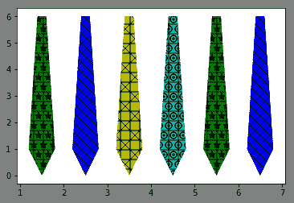

# 更多

我们还可以在全局参数`rcParams`文件 中设置  属性循环程序，该文件随后成为给定会话的默认循环程序。

这是实现此目的的代码：

```py
import matplotlib as mpl
from cycler import cycler
mpl.rc('axes', prop_cycle=cycler('color', ['r', 'orange', 'c', 'y']) +\
                          cycler('hatch', ['x', 'xx-', '+O.', '*']))
```

# 使用路径效果

我们在第 2 章“基本绘图入门”中学习了如何使用和`Path`方法绘制自定义绘图。 在这里，我们将学习如何在各种绘图对象上使用`path_effetcts`属性创建简单阴影和阴影阴影等效果。

# 准备

导入所需的库：

```py
import matplotlib.pyplot as plt
import numpy as np
from matplotlib.patheffects import PathPatchEffect, SimpleLineShadow, Normal
```

# 操作步骤

以下代码块在图形上绘制了 S 型曲线和文本对象，并具有和`path_effects`属性：

1.  定义此会话中所有绘图要使用的样式：

```py
plt.style.use('seaborn-darkgrid')
```

2.  定义图形和图形大小：

```py
plt.subplots(figsize=(10,6))
```

3.  定义图的数据：

```py
x = np.linspace(-10, 10, 50)
y = 1.0 / (1 + np.exp(-x))
```

4.  使用和所需的路径效果定义要在图上打印的文本：

```py
t = plt.text(-10., 1.15, 'Sigmoid with Path Effects', fontsize=40, 
             weight=50, va='center', path_effects=[PathPatchEffect(offset=(3, -3),   
             hatch='xxxx', facecolor='gray'),
             PathPatchEffect(edgecolor='white', linewidth=1.1, 
             facecolor='black')])
```

5.  使用，指定的路径效果绘制 S 型曲线，并在屏幕上显示该图：

```py
plt.plot(x, y, linewidth=8, color='blue', path_effects=
                            [SimpleLineShadow(), Normal()])
plt.show()
```

# 工作原理

这是代码的说明：

*   `plt.style.use('seaborn-darkgrid')`指定用作图的背景的样式。
*   `plt.subplots()`实例化图形对象以指定图形的大小。 如果要使用和默认大小，则不需要此语句。
*   `x`和`y`定义用于绘制 Sigmoid 曲线的数据。
*   `plt.text()`创建一个文本对象，并将其放置在指定的坐标的处：
    *   `(-10., 1.15)`是放置此文本对象的轴域上的坐标。
    *   文本为`Sigmoid with Path Effects`。
    *   `weight`与字体粗细（粗体深度）相同
    *   `va`是垂直对齐。
    *   `path_effects[]`指定要应用于文本对象的`PathPatchEffects`的列表。
    *   `PathPatchEffect()`启用具有各种属性的自定义路径效果。
*   `plt.plot()`再次使用`path_effects[]`绘制了一个 S 型曲线。 在这里，我们使用，预定义路径效果`SimpleLineShadow()`和`Normal()`。

这是输出的样子：

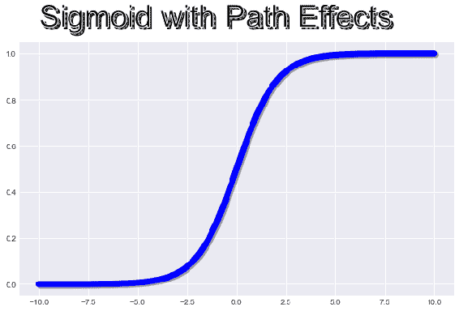

# 更多

我们已经演示了如何在此配方中使用预定义和自定义路径效果。 但是，Matplotlib 中提供了许多预定义的路径效果。 有关所有可能性的完整列表，请参考 [Matplotlib 文档](https://matplotlib.org/api/patheffects_api.html)。

# 使用转换

要引用图形上的特定点，我们需要其坐标。 Matplotlib 使用四种参考数据，轴域，图形和显示的坐标系。 在本食谱中，我们将学习如何使用这些坐标系以及如何从一个坐标系转换为另一个坐标系：

*   **数据**：数据坐标系以输入数据点为坐标，并由`xlim`和`ylim`参数控制以限制要绘制的数据范围 在图上。 从数据坐标系转换为显示坐标系的方法是`ax.transData`。
*   **轴域**：轴域坐标系引用的轴域对象，`(0, 0)`为的轴域的左下角，而`(1, 1)`是轴域的右上角。 指向轴域中心的点的坐标为`(0.5, 0.5)`。 从轴域坐标系转换为的显示坐标系的方法是`ax.transAxes`。
*   **图形**：这是图形对象的引用。 同样，`(0, 0)`表示图的左下角，而`(1, 1)`表示图的右上角。 从  图形坐标系转换为  显示坐标系的方法是`ax.transFigure`。
*   **显示**：这引用输出图形的输出设备，并且以像素坐标表示。

我们还可以使用混合坐标系，其中一个轴使用数据坐标系，另一个轴使用轴域坐标系。

很少使用显示和图形坐标。数据和轴域坐标系使用得更频繁。

我们将有两个配方，一个用来演示数据坐标的转换以显示坐标，另一个演示数据的轴域和混合坐标系统。

# 转换数据坐标以显示坐标

在本食谱中，我们将演示如何转换数据坐标以显示坐标。

# 准备

导入所需的库：

```py
import matplotlib.pyplot as plt
import numpy as np
```

# 操作步骤

以下代码绘制了一个正弦波，并在数据和显示坐标中标注了图形上的一个点：

1.  定义图形并为其添加轴域：

```py
fig = plt.figure()
ax = fig.add_subplot(111)
```

2.  定义正弦曲线的数据并绘制：

```py
theta = np.linspace(0, 2*np.pi, 128)
y = np.sin(theta)
ax.plot(theta, y, 'r-*')
```

3.  在数据坐标系上定义点，并将其转换为显示坐标系：

```py
xdata, ydata = 3, 0
xdisplay, ydisplay = ax.transData.transform_point((xdata, ydata))
```

4.  定义要在文本描述周围使用的边框的属性：

```py
bbox = dict(boxstyle="round", fc="1.0")
```

5.  定义要在和批注中使用的箭头属性：

```py
arrowprops = dict(arrowstyle="->", color='green', lw=5, 
             connectionstyle="angle,angleA=0,angleB=90,rad=10")
```

6.  定义用于指定，坐标的偏移量，以在绘图上放置文字描述：

```py
offset = 72
```

7.  在数据坐标系的中定义该点的注释：

```py
data = ax.annotate('data = (%.1f, %.1f)' % (xdata, ydata),
                  (xdata, ydata), xytext=(-2*offset, offset), 
                   textcoords='offset points', bbox=bbox, arrowprops=arrowprops)
```

8.  在显示坐标系的中定义该点的注释：

```py
disp = ax.annotate('display = (%.1f, %.1f)' % (xdisplay, ydisplay),
                  (xdisplay, ydisplay), xytext=(0.5*offset, -offset),
                   xycoords='figure pixels', textcoords='offset 
                   points',bbox=bbox, arrowprops=arrowprops)
```

9.  在屏幕上显示该图：

```py
plt.show()
```

# 工作原理

这是代码的说明：

*   `theta`和`y`是绘制正弦波的数据点。 零到`2 * pi`覆盖了一个波周期。
*   `xdata`和`ydata`是数据坐标系中的坐标； 在这种情况下，其值为`3`和`0`。 我们将看到该特定点在绘图上的位置。
*   `xdisplay`和`ydisplay`是显示格式中同一点的坐标。 我们已经使用`ax.transData.transform_point((xdata, ydata))`对其进行了转换。
*   `bbox`指定将在其中显示文本的边框样式。
*   `arrowprops`指定描述点和图形上实际点的文本之间的连接样式。 在下一章中，我们将学习有关文本注释的更多信息。
*   `offset=72`用于指定要放置文本框的坐标。 该偏移量相对于要注释的点的`xy`坐标。*x* 坐标的正偏移量表示该点的右侧，而负值表示该点的左侧。 同样 *y* 坐标的正偏移量表示该点上方，而负值表示该点下方。
*   `ax.annotate()`绘制注释（描述观察点的文本），该注释指向和观察，并给出观察的文本描述。 第一个`annotate()`语句为数据坐标系绘制注释，为，第二个语句为显示系统坐标系绘制注释。
    *   `annotate()`中的第一个参数是注释的文本描述
    *   `(xdata, ydata)`是要注释的点的坐标
    *   `xycoords`（第一个注释中未提供，因为它使用默认数据坐标系）指定`xy`使用哪个坐标系
    *   `xytext`指定要放置文字说明的坐标
    *   `textcoords`指定文本坐标的坐标系
    *   偏置点中的点是单位长度，等于 1/72 英寸，因此当我们指定`72`偏置点时，它等于 1 英寸
*   在第二个`annotate()`语句中，我们明确指定了`xycoords='figure pixels'`，因为我们不想使用默认值，而是使用`figure pixels`坐标。

以下是输出图：

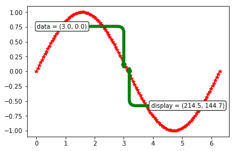

请注意，箭头未完全对准同一点。 这是因为各种输出设备的默认设置有所不同。 这就是为什么不经常使用显示坐标的原因。 它们仅在需要捕获键盘或鼠标事件的交互式绘图中有用。

# 更多

在注释的上下文中，有许多选项可以指定图上某个点的坐标。 有关选项的完整列表，请参阅 [Matplotlib 文档](https://matplotlib.org/api/_as_gen/matplotlib.axes.Axes.annotate.html)。

# 使用轴域和混合坐标系变换

在本食谱中，我们将学习如何使用，轴域和混合坐标系。

# 准备

导入所需的库：

```py
import matplotlib.pyplot as plt
import numpy as np
import matplotlib.patches as patches
import matplotlib.transforms as transforms
from scipy.stats import norm
from matplotlib.ticker import MultipleLocator
```

# 操作步骤

以下代码块绘制了两个图表，以演示轴域和数据的混合坐标系：

1.  固定随机状态以确保可重复性，并设置要在此会话中使用的样式：

```py
np.random.seed(19681211)
plt.style.use('ggplot')
```

2.  用尺寸定义图形并为其添加轴域：

```py
fig = plt.figure(figsize=(10,5))
ax1 = fig.add_subplot(121)
```

3.  定义散点图的数据，并使用`plot`方法而不是`scatter`方法对其进行绘制：

```py
x, y = 50*np.random.rand(2, 500)
ax1.plot(x, y, 'cH') 
```

4.  定义一个椭圆形面片并将其添加到轴域：

```py
ellipse = patches.Ellipse((0.5, 0.5), 0.6, 0.3, transform=ax1.transAxes,
                           facecolor='blue', alpha=0.3)
ax1.add_patch(ellipse)

# remove the comment below to check if Ellipse remains at the same place, 
# since it is on axes co-ordinates
#ax.set_xlim(10,40) 
```

5.  在第二个轴域上定义，并在其上绘制两个具有不同均值的正态分布，但  的标准偏差相同：

```py
ax2 = fig.add_subplot(122)

mu1, mu2 = 0, 0.3
sigma = 0.1

x1 = np.linspace(mu1 - 3*sigma, mu1 + 3*sigma, 100)
                 ax2.plot(x1, norm.pdf(x1, mu1, sigma))

x2 = np.linspace(mu2 - 3*sigma, mu2 + 3*sigma, 100)
                 ax2.plot(x2, norm.pdf(x2, mu2, sigma))
```

6.  为第二个轴域设置的标题和`xaxis_major_locator`：

```py
ax2.set_title(r'$\sigma=0.05 \/ \dots \/ \sigma=0.25$', fontsize=16)
              ax2.xaxis.set_major_locator(MultipleLocator(0.1))
```

7.  将的 *y* 坐标转换为轴域坐标，并将 *x* 坐标保持为数据坐标：

```py
trans = transforms.blended_transform_factory(ax2.transData, ax2.transAxes)
```

8.  用矩形框突出显示 0.05 到 0.25 `stddev`区域，在数据中显示 *x* 坐标，并且在轴域上显示 *y* 坐标：

```py
rect = patches.Rectangle((0.05, 0), width=0.2, height=1,transform=trans, 
                         color='green', alpha=0.3)
ax2.add_patch(rect)

plt.show()
```

# 工作原理

这是代码的说明：

`np.random.seed()` is required to ensure that we get the same data points from any `np.random.*` function we may use subsequently. This ensures repeatability of the graph. 

*   `plt.style.use('ggplot')`指定用于图形的样式。
*   `ax1.plot(x, y, 'cH')`在`ax1`色块上绘制 500 个随机点。
    *   `Ellipse()`在`ax1`轴域中心添加一个椭圆形色块。
    *   `(0.5, 0.5)`是，椭圆中心的坐标，0.6 是宽度，而 0.3 是  高度。
    *   `transform=ax1.transAxes`指定在将图片显示在屏幕上之前，轴域坐标系中的坐标必须转换为显示坐标。
*   在`ax2`上，我们使用的`norm`函数绘制了两个均值（`mu`）和标准偏差（`sigma`）正态分布的图。
*   `ax2.set_title(r'$\sigma=0.05 \/ \dots \/ \sigma=0.25$', fontsize=16)`使用正则表达式将设置为标题。 在下一章有关文本和数学表达式的章节中，我们将学到更多信息。
*   `ax2.xaxis.set_major_locator(MultipleLocator(0.1))`确保在 *x* 轴上以 0.1 个间隔放置刻度线，而不是使用默认刻度线。
*   `trans = transforms.blended_transform_factory(ax2.transData, ax2.transAxes)`定义要用于 *x* 和 *y* 轴的坐标系。
*   `rect = patches.Rectangle((0.05, 0), width=0.2, height=1, transform=trans, color='green', alpha=0.3)`定义一个矩形补丁：
    *   `(0.05, 0)`是矩形左下角的坐标
    *   `width=0.2`是数据坐标系在中的宽度，因此在 *x* 轴上转换为 0.25（从 0.05 开始）
    *   `height=1`是轴域坐标系中中矩形的高度，因此跨越轴域完整高度（100%）
    *   `transform=trans`是要使用的坐标系（在上一步中定义）。

这是输出的样子：

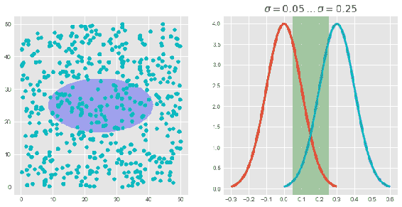

# 控制轴域位置

在第 3 章和“绘制多个图表，子图和图形”中，我们了解了用于创建各种图形布局的`plt.subplot()`，`plt.subplots()`和`plt.subplot2grid()`函数。 我们将在本章稍后再学习一个函数`GridSpec()`。 它们每个都为设计和所需的图形布局提供了更高的灵活性。 但是，它们都带有预定义的参数，使用这些参数可以控制图中的轴域位置。 用户可以获得的最大灵活性是能够指定精确的坐标和放置在和图形布局中的轴域的大小。 这就是我们将从本食谱中学到的东西。

# 准备

我们将在此食谱中使用或面向对象的 API。 导入所需的库：

```py
import numpy as np
from matplotlib.backends.backend_agg import FigureCanvasAgg as 
                                            FigureCanvas
from matplotlib.figure import Figure
from IPython.core.display import display
```

# 操作步骤

以下代码块绘制了四个图形，第四个是三个轴域的子集，因此它是其他轴域内的轴域（重叠）：

1.  修复随机状态以确保可重复性：

```py
np.random.seed(19681211)
```

2.  使用，图形尺寸和图像分辨率定义图形并将图形附加到画布上：

```py
fig = Figure(figsize=(10,6), dpi=100)
FigureCanvas(fig)
fig.set(facecolor='c', alpha=0.1, edgecolor='m')
```

3.  定义第一轴域并设置`title`和`ylabel`：

```py
ax1 = fig.add_axes([0.0, 0.55, 0.4, 0.4])
ax1.set_ylabel('volts')
ax1.set_title('a sine wave')
```

4.  定义正弦波的数据，并将其绘制在的第一个轴域上：

```py
t = np.arange(0.0, 1.0, 0.01)
s = np.sin(2*np.pi*t)
line, = ax1.plot(t, s, color='blue', lw=2)
```

5.  在第二个轴域上定义，并在其上绘制直方图：

```py
ax2 = fig.add_axes([0.0, 0.1, 0.4, 0.4])
n, bins, patches = ax2.hist(np.random.randn(1000), 50,
                            facecolor='yellow', edgecolor='blue')
ax2.set_xlabel('time (s)')
```

6.  在接下来的两个绘图中为定义数据：

```py
x = np.linspace(0, 10, 20)
y = (x+5)*(x-7)*(x-9) - 150
```

7.  定义或第三轴域（左，底，宽度，高度），并绘制由`x`和`y`定义的曲线：

```py
ax3 = fig.add_axes([0.5, 0.1, 0.4, 0.85]) 
ax3.plot(x, y, 'g--')
ax3.set(xlabel='x', ylabel='y', title='outer axes')
```

8.  定义第四轴域，并通过反转`x`和`y`绘制相同的曲线：

```py
ax4 = fig.add_axes([0.575, 0.6, 0.2, 0.25]) 
ax4.plot(y, x, 'r-*')
ax4.set(xlabel='y', ylabel='x', title='inset axes')
```

9.  在屏幕上显示该图：

```py
display(fig)
```

# 工作原理

这是代码的说明：

*   `ax1 = fig.add_axes([0.0, 0.55, 0.4, 0.4])`向图形对象添加新轴域：
    *   坐标位于的图形坐标系中，并指定为距离左侧和底部的轴域起点，以及轴域的宽度和高度。
    *   第一个坐标`0.0`表示，轴域从最左端开始
    *   第二个坐标`0.55`表示轴域从底部底部图形高度的的 55% 开始
    *   第三个坐标`0.4`指定该轴域的宽度的为该图宽度的的 40% 
    *   第四个坐标`0.4`指定轴域的高度的是该图的高度的 40% 
    *   在此轴域上绘制了一个正弦图
*   `ax2 = fig.add_axes([0.0, 0.1, 0.4, 0.4])`是第二个轴，它的大小也与和的第一个相同，从到的最左端开始，是图形高度从底部开始的 10%。 在此轴域上绘制直方图。
*   `ax3 = fig.add_axes([0.5, 0.1, 0.4, 0.85])`是第三根轴。 它从左侧图形的 50% 开始，从底部底部图形的 10% 开始，的宽度是的图形宽度的 40% ， 的高度为身高的的 85%。 在此轴域上绘制了一个绿色多项式。
*   `ax4 = fig.add_axes([0.575, 0.6, 0.2, 0.25])`是图中带有标题插入轴的第四根轴。 该轴从的图形宽度（从到左）的图形高度的 57.5% 处开始，并从图形的底部的图形高度的 60% 开始，宽度为 图形宽度的的 20% 和图形高度的的 25%。 从和先前的轴中提取相同的多项式，但是用的红色表示 *x* 和 *y* 轴的互换。

从此处的输出中可以看出，第四轴在第三轴之内； 它是另一个轴内的一个轴：

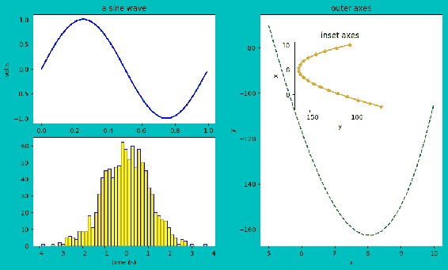

# 用于图形布局的`GridSpec`

`GridSpec()`是用于复杂图形布局的另一个强大功能。`plt.subplot()`和`plt.subplot2grid()`实例化图形后，一次添加一个图，并且在中指定图形布局，每个子图中的行数和列数，其后是图的序列号 从右到上到下。 但是`plt.subplots()`一次就定义了整个图形布局，就行数和列数而言，然后使用和对应索引访问了每个图/轴。`GridSpec()`允许在图形布局中创建多个网格，每个网格类似于`plt.subplots()`。 在本食谱中，我们将学习如何使用`GridSpec()`以及如何将`GridSpec()`关键字参数与`plt.subplots()`一起使用。

# 使用`GridSpec`

在本食谱中，我们将学习如何将`GridSpec()`用于图形布局。

# 准备

导入所需的库：

```py
import numpy as np
import matplotlib.pyplot as plt
import matplotlib.patches as patches
from matplotlib.gridspec import GridSpec
```

# 操作步骤

以下代码块使用`GridSpec()`定义了两个`3 x 3`网格。 在`grid1`中，我们绘制了四个图形，每个图形具有不同的宽度和高度。 在`grid2`中，我们使用宽度和高度比绘制了九个图，以使高度在同一行中对所有图都是，相同，而宽度是，对于列中的所有图形都相同：

1.  修复随机状态以提高可重复性：

```py
np.random.seed(19681211)
```

2.  定义此会话中要使用的样式：

```py
plt.style.use('seaborn')
```

3.  定义图形的大小并定义布局：

```py
fig = plt.figure(figsize=(14,10))
gs1 = GridSpec(ncols=3, nrows=3, left=0.05, right=0.5, wspace=0.2, 
               hspace=0.1)
```

4.  在和`gs1`上定义一个轴：

```py
ax1 = fig.add_subplot(gs1[0, 0])
```

5.  定义一个椭圆形面片并将其添加到`ax1`轴域的中：

```py
ellipse = patches.Ellipse((0.5, 0.5), 0.7, 0.3, transform=ax1.transAxes, facecolor='blue', alpha=0.3)
ax1.add_patch(ellipse)
```

6.  在`gs1`上定义第二个轴并在其上绘制直方图：

```py
ax2 = fig.add_subplot(gs1[0, 1:])
ax2.hist(np.random.randn(1000), 50, facecolor='yellow', 
         edgecolor='blue')
```

7.  在`gs1`上定义第三个轴，并在其上绘制散点图：

```py
ax3 = fig.add_subplot(gs1[1:, 0])
x, y = 50*np.random.rand(2, 500)
ax3.plot(x, y, 'cH', alpha=0.3) 
```

8.  在`gs1`上定义第四个轴，并绘制`polar`图：

```py
ax4 = fig.add_subplot(gs1[1:, 1:], projection='polar')
N = 30
theta = np.linspace(0.0, 2 * np.pi, N, endpoint=False)
radii = 10 * np.random.rand(N)
width = np.pi / 4 * np.random.rand(N)
bars = ax4.bar(theta, radii, width=width, bottom=0.0)
```

9.  在极坐标图的上使用自定义颜色和透明度：

```py
for r, bar in zip(radii, bars):
    bar.set_facecolor(plt.cm.BuPu(r / 10.))
    bar.set_alpha(0.5)
```

10.  使用宽度和高度比率参数定义第二个`GridSpec` `gs2`：

```py
widths = [2, 3, 1.5]
heights = [1, 3, 2]
gs2 = GridSpec(ncols=3, nrows=3, left=0.55, right=0.95, wspace=0.2, 
      hspace=0.1, width_ratios=widths, height_ratios=heights)
```

11.  定义另一个`polar`图的数据，绘制 9 个极坐标图，并在屏幕上显示整个图形：

```py
theta = np.arange(0., 2., 1./180.)*np.pi
for row in range(3):
    for col in range(3):
        ax = fig.add_subplot(gs2[row, col], projection='polar')
        ax.plot((col+2)*theta, theta/(row+6))
        ax.plot(theta, np.cos((row+5)*theta))
        ax.plot(theta, [1.25]*len(theta))
plt.show()
```

# 工作原理

代码的工作方式如下：

*   `plt.style.use('seaborn')`指定，将使用 seaborn 样式。
*   `gs1 = GridSpec(ncols=3, nrows=3, left=0.05, right=0.5, wspace=0.2, hspace=0.1)`创建第一个网格：
    *   `ncols`和`nrows`指定网格布局，在这种情况下为`3 x 3`网格
    *   `left`和`right`坐标在的图形坐标系中，并指定网格从，`left`处开始以及在处结束的位置`right`
    *   `wspace`控制一行中各图之间的间隔
    *   `hspace`控制列中各图之间的间隔
*   `ax1 = fig.add_subplot(gs1[0, 0])`为网格中的第一个单元格创建一个轴域实例。
*   `patches.Ellipse()`定义了一个椭圆形面片，其坐标在轴域坐标系的中指定。`ax1.add_patch(ellipse)`将椭圆补丁添加到轴域`ax1`。
*   `ax2 = fig.add_subplot(gs1[0, 1:])`为的第二个和的第一行的的第三个单元格创建轴实例`ax2`的。 在此轴域上绘制直方图。
*   `ax3 = fig.add_subplot(gs1[1:, 0])`为的第二个和的第一列的中的第三个单元创建轴实例`ax3`。 在该轴域上绘制了 500 个随机数的散点图。
*   `ax4 = fig.add_subplot(gs1[1:, 1:], projection='polar')`为第一行和第二行以及第一行和第二列创建一个极轴域实例`ax4`。 它占据`gs1`的`2 x 2`个单元格。 在此轴域上绘制了一个极坐标图。
*   `gs2 = GridSpec(ncols=3, nrows=3, left=0.55, right=0.95, wspace=0.2, hspace=0.1, width_ratios=widths, height_ratios=heights)`创建第二个网格的，同样是`3 x 3`网格：
    *   同样在这里和左右坐标位于和图形坐标系中
    *   `width_ratios`和`height_ratios`分别指定行和列中的相对宽度和高度
    *   如宽度和高度比率参数中所指定的，在此网格中使用`widths`和`heights`不同绘制了九个极坐标图

您应该看到下图是上述代码的输出：

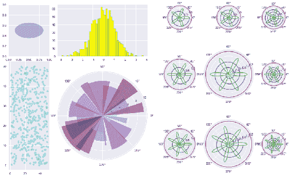

# 更多

在前面的示例中，我们使用`width_ratios`和`height_ratios`参数使用`GridSpec()`定义所需的网格。 可以将相同的参数传递给`plt.subplots()`以绘制我们在前面的示例中创建的相似网格。 这是代码：

```py
widths = [2, 3, 1.5]
heights = [1, 3, 2]
t = np.arange(0.0, 1.0, 0.01)
s = np.sin(2*np.pi*t)

### Passing keyword specs to plt
gs_kw = dict(width_ratios=widths, height_ratios=heights)

fig, axes = plt.subplots(ncols=3, nrows=3, figsize=(10,8), gridspec_kw=gs_kw)
for r, row in enumerate(axes):
    for c, ax in enumerate(row):
        ax.plot(t, s)
        label = 'Width: {}\nHeight: {}'.format(widths[c], heights[r])
                 ax.annotate(label, (0.1, 0.5), xycoords='axes  
                 fraction', va='center')

fig.tight_layout()

plt.show()
```

这是输出，具有与使用`GridSpec()`之前看到的布局完全相同的布局：

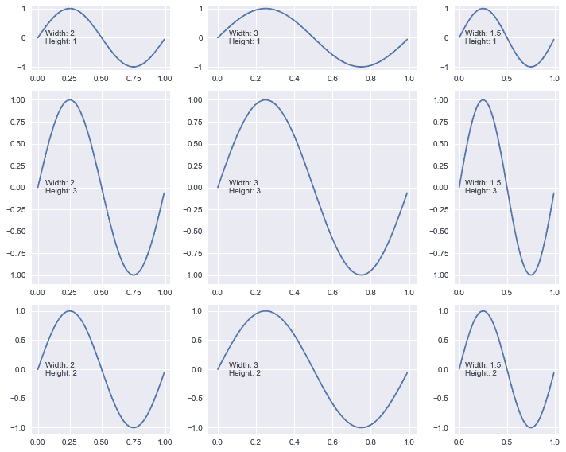

# `GridSpec`对齐

当我们创建多个网格并将其并排放置在图中时，有时它们可​​能在，顶部，底部或两者处未对齐。 在本食谱中，我们将学习如何避免此类对齐问题。

# 准备

我们将为此示例使用一个误差线图示例。 我们还将学习如何创建恒定误差线，对称和非对称误差线以及误差线采样。

让我们导入所需的库：

```py
import matplotlib.pyplot as plt
from matplotlib.gridspec import GridSpec
```

# 操作步骤

以下代码块绘制了五个图，其中第一个网格中有三个，第二个网格中有两个。 我们在第一个网格上绘制恒定误差线以及对称和非对称误差线，在第二个网格上绘出所有误差线和采样误差线：

1.  定义图形的大小并设置此会话要使用的样式：

```py
fig = plt.figure(figsize=(8,8))
plt.style.use('seaborn-deep')
```

2.  定义用于绘制图形的函数：

```py
def plot_errorbar(axs, x, y, xerr=None, yerr=None, errevery=1, 
                  title=None, xlabel=None, ylabel=None, fmt=None):
    ax = fig.add_subplot(axs)
    ax.errorbar(x, y, xerr=xerr, yerr=yerr, errorevery=errevery, 
                fmt=fmt)
    ax.set(title=title, xlabel=xlabel, ylabel=ylabel)
```

3.  使用`GridSpec`使用`3 x 1`布局定义第一个网格`gs1`：

```py
gs1 = GridSpec(3, 1)
```

4.  定义指数曲线的数据：

```py
x = np.arange(0.1, 5, 0.5)
y = np.exp(-x)
```

5.  在 *x* 和 *y* 轴域上绘制带有恒定误差的误差线：

```py
plot_errorbar(gs1[0], x, y, xerr=0.8, yerr=0.3, title='Constant 
              Errors', xlabel='X', ylabel='Y', fmt='-o')
```

6.  将的变化误差定义为`x`的函数，然后仅绘制`yerror`：

```py
error = 0.1 + 0.25 * x
plot_errorbar(gs1[1], x, y, yerr=error, title='Variable Symmetric 
              Error', xlabel='X', ylabel='Y', fmt='-o')
```

7.  定义和边界错误以创建不对称错误栏：

```py
lower_error = 0.5 * error
upper_error = error
asymmetric_error = [lower_error, upper_error]
plot_errorbar(gs1[2], x, y, xerr=asymmetric_error, title='Variable 
              Asymmetric Error', xlabel='X', ylabel='Y', fmt='o')
```

8.  在第一个网格`gs1`的上调整图之间的间距：

```py
gs1.tight_layout(fig, rect=[0, 0, 0.5, 1])
```

9.  用较小的时间间隔为指数曲线定义数据：

```py
x = np.arange(0.1, 5, 0.1)
y = np.exp(-x)
```

10.  用`2 x 1`布局定义第二个网格`gs2`：

```py
gs2 = GridSpec(2, 1)
```

11.  将和变化误差定义为`x`的非线性函数，并在误差栏中绘制所有误差点：

```py
yerr = 0.1 + 0.1 * np.sqrt(x)
plot_errorbar(gs2[0], x, y, yerr=yerr, title='All Errorbars', xlabel='X', ylabel='Y', fmt='-')
```

12.  仅每五个样本错误绘制一次：

```py
plot_errorbar(gs2[1], x, y, yerr=yerr, errevery=5, title='only every 5th errorbar', 
              xlabel='X', ylabel='Y', fmt='-')
```

13.  调整`gs2`上各图之间的间隔：

```py
gs2.tight_layout(fig, rect=[0.5, 0, 1, 1], h_pad=0.5)
```

14.  如果的两个网格在的顶部或底部未对齐，请尝试匹配它们以正确对齐：

```py
top = min(gs1.top, gs2.top)
bottom = max(gs1.bottom, gs2.bottom)

gs1.update(top=top, bottom=bottom)
gs2.update(top=top, bottom=bottom)

plt.show()
```

# 这个怎么运作 ...

这是代码的说明：

*   `plot_errorbar()`是用户定义的函数，用于使用，给定要绘制的参数，例如`axes`，`data`和其他控制曲线的参数来绘制误差图。
*   `gs1 = GridSpec(3, 1)`定义了一个`3 x 1`的网格`gs1`。
*   `plot_errorbar()`在 x 和 *y* 轴上均以恒定误差绘制轴域`gs1[0]`上的误差线：
    *   图中水平线的长度表示`X`中的误差大小。
    *   垂直线的长度表示`Y`中的误差大小。
    *   在第一个图中，它们的大小和的大小相同，但它们的值相差很大，分别为 0.8 和 0.3。 这是因为，`x`，和`y`轴上的比例不同。 如果我们想将它们放置在和相同的比例尺上，则应在绘图上设置`aspect=1`。
*   `plot_errorbar()`仅绘制第二个误差线，用于随`x`变化但对称的`yerror`，曲线的两侧误差相等。
*   为`xerror`绘制了第三条误差线，该`xerror`也在变化，但在和平均值两侧的值不相等的情况下是不对称的。 在这种情况下，如果将误差限制在上下限的某些边界内，则会发生这种情况。
*   `gs1.tight_layout(fig, rect=[0, 0, 0.5, 1])`确保使用图形坐标系统设置`gs1`的边界，从图形的左下角到图形的宽度的一半 和全高。 正如我们在第 3 章，“绘制多个图表，子图和图形”中所了解的`tight_layout()`一样，这也确保了网格内各图之间有足够的间隙。
*   `gs2 = GridSpec(2, 1)`定义第二个网格，即`2 x 1`。
*   在此网格上，我们再次绘制仅用于`yerror`的标准误差线，该误差线随的第一个轴的变化，而在的第二个轴上的变化，我们绘出另一个误差线 ，但每 5 个错误进行一次采样，而不是像在  第一轴上那样绘制每个错误项。
*   当我们有两个大小不等的网格时，它们的顶部，底部或两者的对齐方式可能不太好。 其中一个可能相对于另一个网格上升或下降。 在这种情况下，您需要在，顶部和底部分别计算两个网格的，的最小值或最大值，并强制两个网格都遵循这些最小值/最大值，以便它们都对齐 。
*   `top = min(gs1.top, gs2.top)`计算两个顶部的最小值。
*   `bottom = max(gs1.bottom, gs2.bottom)`从两个底部计算最大值。
*   `gs1.update(top=top, bottom=bottom)`和`gs2.update(top=top, bottom=bottom)`强制两个网格具有相同的顶部和底部位置，以便它们对齐。

执行上述代码后，您应该在屏幕上看到下图：

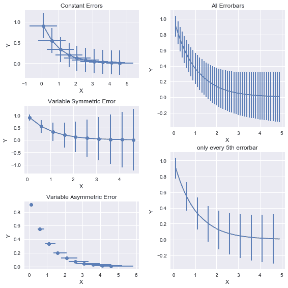

# 布局受限

约束布局类似于紧密布局，但是使用了一种不同的算法，该算法被认为更加准确和高效。 但是，在撰写本文时，它仍在测试中，因此可能会或可能不会继续。

对于此配方，我们将使用与上一个配方相同的误差线，但使用具有受约束布局的单个网格。

# 准备

导入所需的库：

```py
import matplotlib.pyplot as plt
from matplotlib.gridspec import GridSpec
```

# 操作步骤

以下代码块在同一网格中绘制了五个误差线图，并使用受约束的布局来确保图之间的正确对齐和适当的间距，以使标签或刻度上没有重叠：

1.  定义图形和大小，并设置约束布局，然后设置用于此会话的样式：

```py
fig = plt.figure(figsize=(8,8), constrained_layout=True)
plt.style.use('bmh')
```

2.  定义函数以绘制误差条形图：

```py
def plot_errorbar(ax, x, y, xerr=None, yerr=None, errevery=1,  
                  title=None, xlabel=None, ylabel=None, fmt=None):
    ax.errorbar(x, y, xerr=xerr, yerr=yerr, errorevery=errevery, fmt=fmt)
    ax.set(title=title, xlabel=xlabel, ylabel=ylabel)
```

3.  为指数曲线定义和数据：

```py
x = np.arange(0.1, 5, 0.5)
y = np.exp(-x)
```

4.  使用`GridSpec`使用`6 x 2`布局定义网格`gs`并向其中添加轴：

```py
gs = GridSpec(6, 2, figure=fig)
ax = fig.add_subplot(gs[0:2, 0])
```

5.  在`x`和`y`上绘制一个带有恒定误差的误差线：

```py
plot_errorbar(ax, x, y, xerr=0.1, yerr=0.3, title='Constant Errors', 
              xlabel='X', ylabel='Y', fmt='-o')
```

6.  绘制带有`x`和`y`对称误差的函数的误差条：

```py
error = 0.1 + 0.2 * x
ax = fig.add_subplot(gs[2:4, 0])
plot_errorbar(ax, x, y, yerr=error, title='Variable Symmetric 
              Error', xlabel='X', ylabel='Y', fmt='-o')
```

7.  在`x`上定义一个有界误差，产生不对称误差条，并绘制误差条：

```py
lower_error = 0.4 * error
upper_error = error
asymmetric_error = [lower_error, upper_error]
ax = fig.add_subplot(gs[4:, 0])
plot_errorbar(ax, x, y, xerr=asymmetric_error, title='Variable 
              Asymmetric Error', xlabel='X', ylabel='Y', fmt='o')
```

8.  为指数曲线以较小的间隔定义和数据：

```py
x = np.arange(0.1, 5, 0.1)
y = np.exp(-x)
```

9.  再次根据`x`定义误差，但为非线性函数，并绘制误差线：

```py
yerr = 0.1 + 0.1 * np.sqrt(x)
ax = fig.add_subplot(gs[:3, 1])
plot_errorbar(ax, x, y, yerr=yerr, title='All Errorbars', xlabel='X', ylabel='Y', fmt='-')
```

10.  将一个轴添加到网格，并使用每五个错误项来绘制误差线，而不是绘制所有误差线，以创建示例误差线：

```py
ax = fig.add_subplot(gs[3:, 1])
plot_errorbar(ax, x, y, yerr=yerr, errevery=5, title='only every 5th 
              errorbar', xlabel='X', ylabel='Y', fmt='-')
```

11.  调整绘图之间的间距，并在屏幕上显示图形：

```py
fig.set_constrained_layout_pads(w_pad=2./72., h_pad=2./72., 
                                hspace=0.2, wspace=0.2)
plt.show()
```

# 工作原理

大部分解释已在先前的配方中给出：

*   `fig = plt.figure(figsize=(8,8), constrained_layout=True)`指定  图形尺寸，设置`constrained_layout`并实例化图形。
*   `fig.set_constrained_layout_pads(w_pad=2./72., h_pad=2./72., hspace=0.2, wspace=0.2)`确保  网格中各图之间的正确对齐和间距：
    *   它有四个参数，我们可以设置这些参数来控制绘图之间的间隔。
    *   `w_pad`和`h_pad`以英寸为单位指定，并在数据坐标系中固定，因此，即使图形大小发生变化，图之间的空间也不会改变，因为它是固定空间 。
    *   当我们在的图形坐标系中指定`wspace`和`hspace`时，如果图形尺寸发生变化，则图之间的间距也会成比例地变化。
    *   `w_pad`和`wspace`控制同一行中图之间的空间，而`h_pad`和`hspace`控制一列中图之间的空间。

这是输出的外观。 背景与之前的和配方不同，因为在这种情况下我们使用了不同的样式：

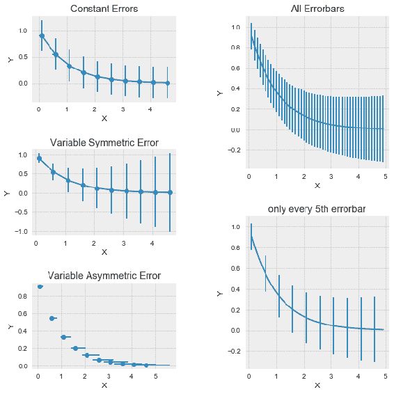

# 使用`GridSpecFromSubplotSpec`

`GridSpecFromSubplotSpec()`是可用于多个网格中图形布局的另一种方法。 这有点类似于`subplot2grid()`方法，我们在第 3 章和“绘制多个图表，子图和图形”中了解到。 我们还将看到`GridSpecFromSubplotSpec()`创建的复杂网格如何利用`constrained_layout`更好地对齐图中所有网格中的所有图。

# 准备

导入所需的库：

```py
import matplotlib.pyplot as plt
from matplotlib.gridspec import GridSpec, GridSpecFromSubplotSpec
```

# 操作步骤

以下代码块在一张图中绘制了不同格数和大小的三个网格：

1.  定义用于此会话的样式，带有大小的图形，然后设置`constrained_layout`：

```py
plt.style.use('ggplot')
fig = plt.figure(figsize=(12,6), constrained_layout=True)
```

2.  用`1 x 3`布局定义网格，该布局连续包含三个网格：

```py
gs0 = GridSpec(1, 3, figure=fig)
```

3.  定义每个网格布局：

```py
gs00 = GridSpecFromSubplotSpec(2, 2, subplot_spec=gs0[0])
gs01 = GridSpecFromSubplotSpec(3, 2, subplot_spec=gs0[1])
gs02 = GridSpecFromSubplotSpec(3, 3, subplot_spec=gs0[2])
```

4.  使用`for`循环为每个网格绘制每个网格内的每个单元格：

```py
for a in range(2):
    for b in range(2):
        fig.add_subplot(gs00[a, b])

for a in range(3):
    for b in range(2):
    fig.add_subplot(gs01[a, b])

for a in range(3):
    for b in range(3):
    fig.add_subplot(gs02[a, b])
```

5.  调整绘图之间的间距，并在屏幕上显示图形：

```py
fig.set_constrained_layout_pads()
plt.show()
```

# 工作原理

在此示例中，我们没有绘制任何图形，只是绘制单元格以演示如何使用，`GridSpecFromSubplotSpec()`方法：

*   `fig = plt.figure(figsize=(12,6), constrained_layout=True)`定义并实例化具有`constrained_layout`设置为`True`的图形对象。 重要的是在此处将`constrained_layout`标志设置为`True`，否则，在代码末尾将无法识别`fig.set_constrained_layout_pads()`语句。 与`tight_layout()`相比，这是有区别的，如我们先前所见，即使在图形实例化时未将此标志设置为`true`的情况下，它也可以工作。
*   `gs0 = GridSpec(1, 3, figure=fig)`定义图中的网格结构。 在这里，我们定义了三个网格，它们全部排成一行：
    *   如果要使用`constrained_layout`选项，则需要`figure=fig`引用`GridSpec()`中的图形实例。 对于`tight_layout()`，无需指定此参数。
*   `gs00 = GridSpecFromSubplotSpec(2, 2, subplot_spec=gs0[0])`定义网格内的布局。 在这里，我们为第一个网格使用`2 x 2`布局。
*   类似地，我们为第二个网格使用`3 x 2`，为第三个网格使用`3 x 3`。
*   `fig.set_constrained_layout_pads()`应用，约束布局，以在网格内和网格之间的图之间正确对齐和间隔。 我们在此使用所有和默认参数。

该图的外观如下：

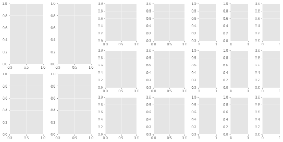

作为练习，您可以尝试使用严格的`layout()`替换约束布局选项。 即使对所有可用参数（例如`pad`，`w_pad`，`h_pad`）进行了任何级别的优化，也可能无法获得与`constrained_layout`一样清晰的对齐方式和间距。

# 使用原点和范围进行图像定向

我们已经学习了如何使用`imshow()`方法绘制二维彩色图像。 默认情况下，`imshow()`使用轴左上角的作为数据坐标的原点`(0, 0)`，并相对于这些坐标填充图像。 如果我们想将其更改为左下角，并沿每个轴扩展  数据限制，则 的原点和范围参数`imshow()`方法帮助。

# 准备

导入所需的库：

```py
import numpy as np
import matplotlib.pyplot as plt
from matplotlib.ticker import MultipleLocator
```

# 操作步骤

以下代码块在两个图中绘制了一张鸟图像六次，其中是默认参数，而是可选原点和范围参数，每个参数都有不同的选项来演示 这些参数如何影响图像的方向：

1.  阅读鸟的图像（[改编自 Coursera 的“机器学习”课程](https://www.coursera.org/learn/machine-learning?action=enroll)）：

```py
img = plt.imread('bird_small.png')
```

2.  定义一个函数来绘制图像：

```py
def plot(ax, origin, extent, title):
    ax.imshow(img, origin=origin, extent=extent)
    ax.xaxis.set_major_locator(MultipleLocator(25))
    ax.yaxis.set_major_locator(MultipleLocator(25))
    ax.set_title(title) 
```

3.  定义，图形，尺寸和布局：

```py
fig1, axs1 = plt.subplots(1, 3, figsize=(12,6))
```

4.  使用和原点参数为同一张图片绘制三个图像，并使用不同的选项：

```py
plot(axs1[0], None, None, title='default')
plot(axs1[1], 'upper', None, title='origin=upper')
plot(axs1[2], 'lower', None, title='origin=lower')
plt.tight_layout()
```

5.  定义和第二个图形，其大小和布局为：

```py
fig2, axs2 = plt.subplots(1, 3, figsize=(12,6))
```

6.  为  范围参数用不同的选项绘制同一张图片的三幅图像：

```py
plot(axs2[0], None, None, title='default')
plot(axs2[1], 'upper', (-25, 150, 150, -25), title='origin=upper \n 
     extent=(-25, 150, 150, -25)')
plot(axs2[2], 'lower', (-25, 150, -25, 150), title='origin=lower \n 
     extent=(-25, 150, -25, 150)')
```

7.  调整绘图之间的间距，并在屏幕上显示图形：

```py
plt.tight_layout()
plt.show()
```

# 工作原理

这是此代码如何工作的说明：

*   `img = plt.imread('bird_small.png')`将图像读取到 NumPy 数组中，Matplotlib 可以理解。
*   为了避免为每个绘图重复代码，我们定义了`plot`函数，该函数针对给定的参数集绘制图形。
*   `ax.xaxis.set_major_locator(MultipleLocator(25)`在 x 轴上的上以`25`的间隔设置刻度线。 我们对 *y* 轴也重复相同的操作。
*   在*图 1* 的第一行中，我们使用和默认参数`origin`和`extent`绘制图，然后分别使用范围参数的默认值`origin='upper'`和`origin='lower'`来绘制。请注意，默认值和`origin='upper'`相同。 使用`origin='lower'`时，的图像会上下颠倒，因为 *y* 坐标会从上到下从下到上（从 0 到 125）变化。 现在您可以在图片的左下角看到`(0, 0)`坐标。
*   在*图 2* 中，我们设置了与默认范围选项不同的扩展区选项，以查看区别：
    *   在数据坐标系的中设置范围参数（左，右，下，上）。
    *   对于的第一张图片，我们使用的默认参数。
    *   对于第二张图像，我们使用`(-25, 150, 150, -25)` ，表示左侧为 -25，右侧为 150，底部为 150，顶部为 -25。 这将设置适合图像的边框。 如果这些坐标超出  原始图像数据限制，则它将使用  插值选项填充其他像素； 如果它们较小，则它将使用重新采样选项来减小尺寸。

该图的外观如下：

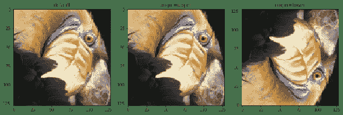

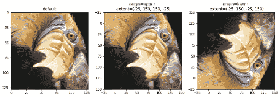

# 使用 Pandas 的地理绘图

在本食谱中，我们将学习如何使用 Matplotlib 随附的`geopandas`程序包绘制地理地图。 Matplotlib 支持用于高级地理地图的第三方第三方软件包，例如`Basemap`（将于 2020 年停用）和`Cartopy`（替代底图）。 我们将在第 14 章“使用 Cartopy 绘制地理地图”中学习使用 Cartopy。

# 准备

导入所需的库：

```py
import geopandas as gpd
import matplotlib.pyplot as plt
```

# 操作步骤

以下代码块突出显示了全球各地气象站的位置。 这些站监视天气和气候变化：

1.  从世界银行集团的*气候变化知识*门户下载要在地图上绘制位置的形状文件：

```py
world_wc = gpd.read_file('GRDC.shp')
world_wc.head() # View the first 5 rows of the data, it is a pandas  
function
```

[来源 URL](http://climate4development.worldbank.org/open/#precipitation)

形状文件包含全球气象站的位置，这些位置监视着全球的天气变化。 尽管我们在这里使用`.shp`文件，但它需要相应的`.shx`，`.sbx`等。 ZIP 文件中的所有文件均应解压缩并放置在工作目录中。 否则，此代码将失败。 所有形状文件都是如此。

2.  从 [thematicmapping.org](http://thematicmapping.org) 下载世界边界的形状文件：

```py
world_borders = gpd.read_file('TM_WORLD_BORDERS_SIMPL-0.3.shp')
world_borders.head()    
```

[来源 URL](http://thematicmapping.org/downloads/world_borders.php)

3.  初始化图形和坐标轴，并设置用于此会话的样式：

```py
plt.style.use('dark_background')
fig,ax = plt.subplots(figsize=(12,9))
```

4.  在`ax`上绘制*全球天气变化*数据：

```py
world_wc.plot(ax=ax)
```

5.  绘制简单的世界地图边框：

```py
world_borders.boundary.plot(ax=ax,color='#cccccc',linewidth=0.6)
```

6.  在屏幕上显示该图：

```py
plt.show()
```

# 工作原理

这是代码的说明：

*   从代码中提到的 URL 下载形状文件（`.shp`）。
*   第一个具有气象站的位置，和的位置，第二个具有和世界的边界。
*   这些文件位于一个 ZIP 文件中，该文件包含具有不同文件扩展名的多个不同文件。 我们应该提取所有这些文件并将它们放在工作目录中。 尽管我们在代码中仅使用`.shp`文件进行读取，但它会内部调用 ZIP 文件中的其他文件。
*   `gpd.read_file()`读取`.shp`文件的的内容。 第一次读取会加载  气象站位置数据，将加载至边界数据。
*   `world_wc.plot(ax=ax)`在地图上绘制气象站的位置。
*   `world_borders.boundary.plot()`绘制边界信息。 请注意，此处我们使用的是，Pandas `plot`函数，而不是 Matplotlib `plot`函数。 这就是为什么您在这里看不到绘图方法的常用格式的原因！

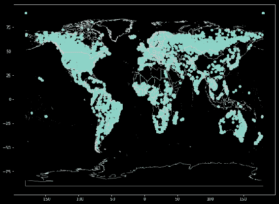

蓝点表示气象站的位置。