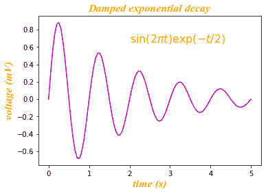
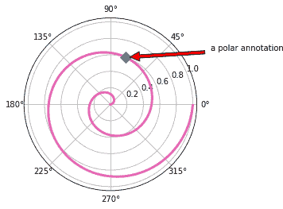
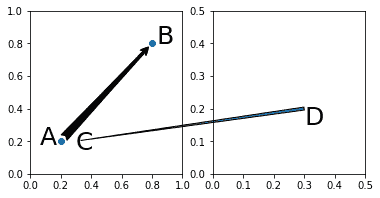
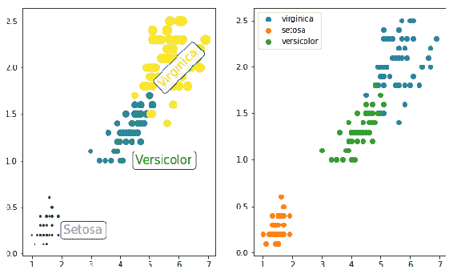
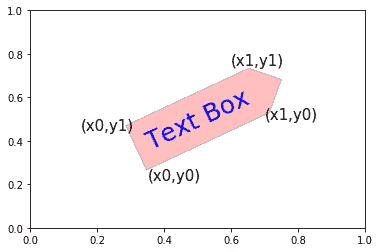
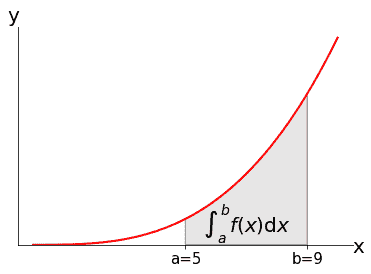
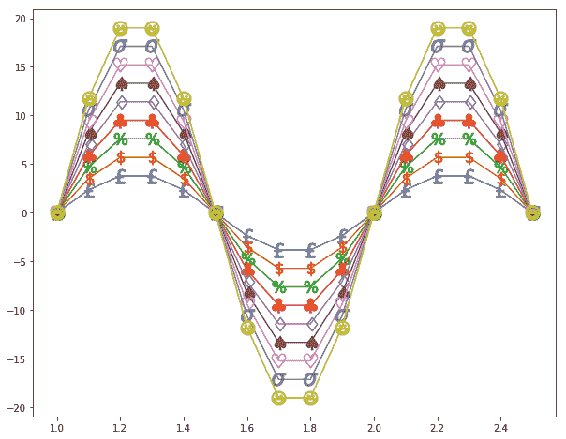
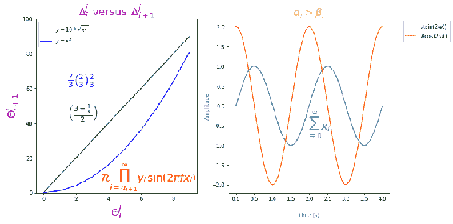
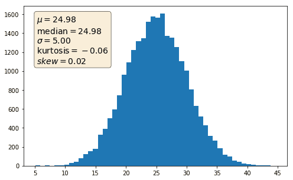
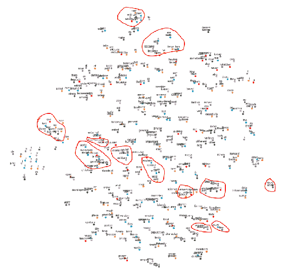

# 嵌入文本和表达式

在本章中，我们将学习如何使用以下配方将文本和数学表达式嵌入绘图中：

*   将数学表达式与字体字典配合使用
*   在极坐标图上注释点
*   使用`ConnectionPatch`
*   使用文字框
*   在积分曲线下绘制面积
*   定义自定义标记
*   使用分数，正则数学表达式和符号
*   二维空间中的词嵌入

# 介绍

如果您想将用户的注意力吸引到绘图的特定区域，想要提供其他信息或为绘图的某些部分提供说明，则的注释和文本会很方便。 它们还有助于创建故事情节，并为任何正式演示提供对数据的更多见解。 在本章中，我们将学习如何使用这些功能。

# 将数学表达式与字体字典配合使用

在本食谱中，我们将学习如何使用字体字典将数学表达式嵌入文本中，以将相同的属性应用于绘图上的所有文本，包括标题，标签和文本表达式。

# 做好准备

导入所需的库：

```py
import numpy as np
import matplotlib.pyplot as plt
```

# 怎么做...

以下代码块绘制了一个衰减的指数函数。 首先，我们定义具有所有必需属性的字体字典，然后将其应用于图形上的每个文本元素，包括标题以及 *x* 和 *y* 标签。 这样可以确保图形上的文本外观和感觉一致：

1.  定义`font`字典以应用于绘图中的所有文本：

```py
font = {'family': 'DejaVu Sans', 'name': 'Times New Roman',
        'style': 'italic', 'color': 'orange',
        'weight': 'bold', 'size': 16}
```

2.  定义指数衰减曲线的数据并绘制：

```py
t = np.linspace(0.0, 5.0, 100)
y = np.sin(2*np.pi*t) * np.exp(-t/2)
plt.plot(t, y, 'm')
```

3.  定义文本，标题和标签，然后在绘图上打印它们：

```py
plt.text(2, 0.65, r'$\sin(2 \pi t) \exp(-t/2)$', fontdict=font)
plt.title('Damped exponential decay', fontdict=font)
plt.xlabel('time (s)', fontdict=font)
plt.ylabel('voltage (mV)', fontdict=font)
```

4.  调整空间以防止`ylabel`出现剪切，并在屏幕上显示该图：

```py
plt.subplots_adjust(left=0.15)
plt.show()
```

# 这个怎么运作...

这是代码的说明：

*   `font`是我们要应用于每个文本项的各种文本属性的字典：
    *   `family`和`name`代表字体系列和字体名称
    *   `style`表示它是斜体还是正常
    *   `weight`表示它是否为粗体
    *   `size`代表字体大小
*   `t = np.linspace(0.0, 5.0, 100)`在 0.0 到 5.0 的范围内定义 100 个点，它们之间的间距相等
*   `y`被定义为`sin` *，* `exponential`，*，*和`t`的函数
*   `plt.title()` *，* `plt.xlabel()` *，*和`plt.ylabel()`现在都已经为您所熟悉，但是我们添加了一个附加的`fontdict`参数，该参数为特定属性定义了特定参数 词典
*   `plt.text(2, 0.65, r'$\sin(2 \pi t) \exp(-t/2)$', fontdict=font)`在数据坐标系上的坐标（2，0.65）上打印文本：
    *   `text`以正则表达式格式表示； 因此，它包含在`r'..... '`中
    *   当文本包含数学符号/表达式，例如`sin`或`pi`时，则必须将其括在`$....$`中
    *   具有特殊含义的字符之前应加反斜杠（`\`），以便它们的特殊含义将出现在图形上，例如`pi`

执行代码后，您应该获得以下输出图：



# 在极坐标图上注释点

在本食谱中，我们将学习如何注释极坐标图上的特定点。

# 做好准备

导入所需的库：

```py
import numpy as np
import matplotlib.pyplot as plt
```

# 怎么做...

以下代码块绘制了一个极坐标图，并在其上标注了一个点：

1.  定义图形和坐标轴，并声明极坐标投影：

```py
fig = plt.figure()
ax = fig.add_subplot(111, projection='polar')
```

2.  定义极坐标图的数据并绘制：

```py
r = np.arange(0,1,0.001)
theta = 2 * 2*np.pi * r
ax.plot(theta, r, color=[0.9,0.4,0.7], lw=3)
```

3.  在极坐标曲线的 600 点绘制一个带有菱形标记的点：

```py
ind = 600
pointr, pointtheta = r[ind], theta[ind]
ax.plot([pointtheta], [pointr], 'D', markersize=10)
```

4.  定义菱形点的注释并在屏幕上显示图形：

```py
ax.annotate('a polar annotation',
             xy=(pointtheta, pointr), xytext=(1.0, 0.75), 
             textcoords='figure 
             fraction', arrowprops=dict(facecolor='red', 
             shrink=0.05), 
             horizontalalignment='right', 
             verticalalignment='bottom')
plt.show()
```

# 这个怎么运作...

这是代码的说明：

*   `fig.add_subplot(111, projection='polar')`定义轴并将其声明为极坐标图。 您也可以使用`polar=True`代替`projection='polar'`
*   `r`和`theta`设置极坐标图的半径和角度数据
*   `ax.plot(theta, r, color=[0.9,0.4,0.7], lw=3)`用`theta`和`r`绘制极坐标图：
    *   使用 R，G 和 B 颜色值指定颜色以创建自定义颜色。 R，G 和 B 值从 0（暗）到 1（亮）变化。
    *   `lw=3`为极坐标图指定 3 的线宽。
*   `ax.plot([pointtheta], [pointr], 'D', markersize=10)`在极坐标图上绘制菱形点，坐标为`pointtheta`和`pointr`； 它在用于绘制极坐标图的数据点列表中由其索引（600）表示：
*   `ax.annotate()`用其文本描述（`'a polar annotation'`）注释该点：
    *   `xy`指定要注释的点的坐标（极坐标）
    *   `xytext`指定放置文字说明的坐标
    *   `textcoords`为指定的文本坐标指定坐标系统，在这种情况下为图形坐标
    *   `arrowprops`指定文本和绘图上的点之间的箭头的属性

您应该在屏幕上看到以下图形：



# 使用 ConnectionPatch

在本食谱中，我们将学习如何使用`ConnectionPatch()`方法连接同一图形上的两个点或同一图形上的两个不同图形。 当试图显示绘图上两个点之间的关系时，这很方便。

# 做好准备

导入所需的库：

```py
from matplotlib.patches import ConnectionPatch
import matplotlib.pyplot as plt
```

# 怎么做...

以下代码块绘制了两个轴，四个点以及它们之间的连通性。 这是一种没有任何文本的注释：

1.  定义图形，尺寸，布局和轴：

```py
fig, (ax1, ax2) = plt.subplots(1, 2, figsize=(6, 3))
```

2.  在数据坐标系上定义两个点，并为其声明坐标系：

```py
pointA = (0.2, 0.2)
pointB = (0.8, 0.8)
coordsA = "data"
coordsB = "data"
```

3.  定义两点之间的连接：

```py
con = ConnectionPatch(pointA, pointB, coordsA, coordsB, arrowstyle="fancy", 
                      shrinkA=5, shrinkB=5, fc="k")
```

4.  在`ax1`上用标记`"o"`绘制两个点：

```py
ax1.plot([pointA[0], pointB[0]], [pointA[1], pointB[1]], "o")
```

5.  将连接艺术家添加到`ax1`：

```py
ax1.add_artist(con)
```

6.  在`ax1`上打印`A`，`B`和`C`点的文本，并设置 *x* 和 *y* 轴限制：

```py
ax1.text(0.06, 0.18, 'A', size=25, weight=50)
ax1.text(0.83, 0.8, 'B', size=25, weight=50)
ax1.text(0.3, 0.15, 'C', size=25, weight=50)
ax1.set_xlim(0, 1)
ax1.set_ylim(0, 1)
```

7.  再定义两个点`C`和`D`，并分配坐标系; 两者都是相同的坐标，但在两个不同的轴上：

```py
pointC = (0.3, 0.2)
coordsC = "data"
coordsD = "data"
```

8.  定义`C`和`D`之间的连接，将其添加到`ax2`，添加文本注释并为 *x* 和 *y* 轴设置限制：

```py
con = ConnectionPatch(xyA=pointC, xyB=pointC, coordsA=coordsC, 
                      coordsB=coordsD, axesA=ax2, axesB=ax1, 
                      arrowstyle="wedge", shrinkB=5)
ax2.add_artist(con)
ax2.text(0.3, 0.15, 'D', size=25, weight=50)
ax2.set_xlim(0, .5)
ax2.set_ylim(0, .5)
```

9.  在屏幕上显示该图：

```py
plt.show()
```

# 这个怎么运作...

这是代码的说明：

*   `fig, (ax1, ax2) = plt.subplots(1, 2, figsize=(6, 3))`定义大小为（6，3）的图形，并在图形上连续显示两个轴。
*   `pointA`和`pointB`是两点的坐标。
*   `coordsA`和`coordsB`是各自的坐标系。
*   `ConnectionPatch()`定义`pointA`和`pointB`之间的连接：
    *   `arrowstyle`指定一个`"fancy"`箭头。
    *   `shrinkA`和`shrinkB`指定箭头尖端应与它们指向的点相距多远，`shrink`越高，距离就越长。
    *   `fc='k'`将面部颜色指定为黑色。
*   `ax1.add_artist(con)`绘制先前在轴 1 上定义的连接路径
*   然后在适当的坐标上使用`ax1.text()`在轴 1 上绘制`A`，`B`和`C`点。
*   `pointC`和`pointD`在数据坐标系上具有完全相同的坐标，但在两个不同的轴上。
*   正如我们之前所做的，绘制`pointC`和`pointD`之间的连接，唯一的区别是`arrowstyle="wedge"`

我们得到以下输出：



You can replace A, B, C, and D with any text that describes the relationship between the points being connected!

# 使用文字框

在本食谱中，我们将学习如何嵌入文本框以标识图中的不同聚类。 我们将使用一个熟悉的`Iris`数据集，其中包含三个数据簇。

# 做好准备

导入所需的库：

```py
import numpy as np
import pandas as pd
import matplotlib.pyplot as plt
```

# 怎么做...

以下代码块在两个不同的轴上两次绘制`Iris`数据。 一个使用常规图例来指示三个具有不同颜色和标签的不同群集。 另一个在点集群中使用文本框指示类：

1.  定义图形，大小及其布局：

```py
fig, ax = plt.subplots(1,2, figsize=(10,6))
```

2.  使用熊猫读取`Iris`数据集：

```py
iris = pd.read_csv('iris_dataset.csv', delimiter=',')
iris['species1'] = iris['species'].map({"setosa" : 0, "versicolor" : 
                   1, "virginica" : 2})
```

3.  使用`Iris`数据集的两个属性绘制散点图：

```py
ax[0].scatter(iris.petal_length, iris.petal_width, 
              s=10*iris.petal_length*iris.petal_width, 
              c=iris.species1)
```

4.  定义要嵌入到图形中的文本框的边界框属性：

```py
bbox_props = dict(boxstyle="round", fc="w", ec="0.25", alpha=0.9)
```

5.  定义文本框并在第一个轴上绘制它们：

```py
ax[0].text(2.75, 0.25, "Setosa", ha="center", va="center", size=15, 
           color='m', bbox=bbox_props)
ax[0].text(5.5, 1.0, "Versicolor", ha="center", va="center", 
           size=15,color='g', bbox=bbox_props)
ax[0].text(6.0, 2.0, "Virginica", ha="center", va="center", size=15, 
           rotation=45, color='y', bbox=bbox_props)
```

6.  使用另一种方法通过标签和图例来区分集群：

```py
x,y = iris['petal_length'], iris['petal_width']
classes = set(iris['species'])
for name in classes:
    index = iris['species'] == name
    ax[1].scatter(x[index], y[index], marker='o', label=name)
plt.legend()
plt.show()
```

# 这个怎么运作...

这是代码的说明：

*   正如我们之前所做的那样，首先使用熊猫读取数据，然后在相同的`Iris`数据集中创建另一个新的`species1`属性，以将数字类别分别保存为 0、1、2 如`map`功能中所给。
*   `ax[0].scatter()`绘制了`petal_length`和`petal_width`的散点图，因为存在三类，所以数据点形成了三个簇，以不同的颜色显示。
*   `bbox_props = dict(boxstyle="round", fc="w", ec="0.25", alpha=0.9)`定义带有以下内容的文本框：
    *   `boxstyle`为圆形边缘
    *   脸色如白
    *   边缘颜色为浅灰色
    *   透明度降低
*   `ax[0].text()`绘制文本框，每个群集一个。 它类似于我们先前所学的绘制文本，只是现在文本位于`bbox`的内部（如先前所定义）。 整个文本框位于数据坐标系中的默认坐标处，这是默认值。
*   前两个文本框是水平的，但是第三个文本框是自变量中指定的 45 度旋转。
*   然后，我们使用标签和图例属性绘制相同的图，只是为了展示实现相同输出的另一种方式。 当我们在[第 2 章](../Text/2.xhtml)和*基本图解*入门中介绍了散点图时，我们没有解释图例来指示哪个类/颜色属于哪个类名。 在这里，我们将学习如何做到这一点：
    *   `x,y = iris['petal_length'], iris['petal_width']` 获得 ， `petal_length` 和 `petal_width` 到 *x* 和 *y* 坐标
    *   `classes = set(iris['species']` 在数据集中获得唯一的类
*   `for`循环一次绘制每个类的散点图：
    *   `index = iris['species'] == name`获取给定类名称的索引
    *   `ax[1].scatter(x[index], y[index])`绘制给定索引的散点图

以下是执行代码后应获得的输出图：



# 还有更多...

在此示例中，我们使用了预定义的`"round"` `boxstyle`。 有许多预定义的选项，例如`"circle"`，`"darrow"`，`"larrow"`，`"rarrow"`，`"square"`，`"sawtooth"`和`"roundtooth"`。

我们还可以定制开发这些 boxstyle，如下所示：

1.  导入所需的库：

```py
import matplotlib.pyplot as plt
from matplotlib.path import Path
```

2.  定义一个用于绘制自定义文本框的函数：

```py
def tbox_custom_style(x0, y0, width, height, size, mutation_aspect=1):
    pad = 0.5 * size
    x0, y0 = x0 - pad, y0 - pad
    width, height = width + 2 * pad, height + 2 * pad
    x1, y1 = x0 + width, y0 + height

    # Define the points along with first curve to be drawn
    verts = [(x0, y0), (x1, y0),(x1 + 2*pad, y0 + 2*pad),(x1, y1), 
             (x0, y1), (x0, y0)] 

    # How to draw the plot along above points
    codes = [Path.MOVETO, # Go to first point specified in verts
             Path.LINETO, # Draw a line from first point to 
                            second point
             Path.LINETO,
             Path.LINETO, # Draw another line from current point to 
                            next point
             Path.LINETO, # Draw another line from current point to 
                            next point
             Path.CLOSEPOLY]     # Close the loop
     # Create complete path with points and lines/curves
     path = Path(verts, codes)
     return path
```

3.  定义图形，并在文本框的四个角添加一个文本框和文本标签：

```py
fig, ax = plt.subplots()
ax.text(0.5, 0.5, 'Text Box', size=25, va="center", ha="center",    
        rotation=25, 
        color='b', bbox=dict(boxstyle=tbox_custom_style, alpha=0.25, 
        fc='r',ec='k'))
ax. text(0.35, 0.22, '(x0,y0)', size=15)
ax. text(0.7, 0.5, '(x1,y0)', size=15)
ax. text(0.6, 0.75, '(x1,y1)', size=15)
ax. text(0.15, 0.45, '(x0,y1)', size=15)

plt.show()
```

下面是它的工作原理：

*   `tbox_custom_style(x0, y0, width, height, size, mutation_aspect=1)`是用户定义的绘制框的函数：
    *   它采用`ax.text()`方法提供的 size 参数，并在内部按比例计算`width`和`height`。
    *   它以（`x0, y0`）为参考点（0,0）。
    *   `mutation_aspect`是与我们提供的尺寸成比例的比例因子。
    *   此自定义`boxstyle`函数在定义中需要所有这些参数。 我们可以使用这些参数在此函数中绘制任何自定义对象。
*   要绘制带框的箭头，我们需要连接五个点。 我们使用大小`x0, y0`，`width`和`height`定义了这五个点。 然后我们使用`path`方法连接这五个点，正如我们在[第 2 章](../Text/2.xhtml)和*基本绘图入门*中所了解的那样。
*   我们在`ax.text()`调用中提供此自定义函数作为`boxstyle=tbox_custom_style`的参数：
    *   `size=25`指定文本的字体大小，与字体大小成正比
    *   `va`和`ha`指定文本的垂直和水平对齐方式
    *   `rotation`指定文本框的旋转角度
    *   `color`指定文本的颜色
    *   `fc`指定面部颜色
    *   `ec`指定边缘颜色
    *   `alpha`指定文本框的透明度

您应该看到以下作为代码输出：



# 在积分曲线下绘制区域

在本食谱中，我们将学习如何在曲线下绘制定义的区域，以及如何将等式作为文本嵌入到绘图中。

# 做好准备

导入所需的库：

```py
import numpy as np
import matplotlib.pyplot as plt
from matplotlib.patches import Polygon
```

# 怎么做...

以下代码块绘制了一个三阶`y = x ** 3`的多项式，并绘制了该曲线下 *x* 轴上两点之间的面积，这是受两点限制的函数的积分：

1.  定义两个点 a 和 b，它们是要绘制的积分的极限以及积分函数的数据：

```py
a, b = 5, 9 # integral limits in which the area to be plotted
x = np.linspace(0, 10)
y = x ** 3 # 3rd order Polynomial curve
```

2.  定义图形和轴并绘制积分函数，在下限将 *y* 轴极限设置为`0`：

```py
fig, ax = plt.subplots()
plt.plot(x, y, 'r', linewidth=2)
plt.ylim(0)
```

3.  在`a`和`b`的两个边界之间绘制阴影区域：

```py
intx = np.linspace(a, b)
inty = intx ** 3
verts = [(a, 0)] + list(zip(intx, inty)) + [(b, 0)]
poly = Polygon(verts, facecolor='0.9', edgecolor='0.5')
ax.add_patch(poly)
```

4.  将积分函数作为文本嵌入到绘图中：

```py
plt.text(0.5 * (a + b), 60, r"$\int_a^b f(x)\mathrm{d}x$",
         horizontalalignment='center', fontsize=20)
```

5.  绘制 *x* 和 *y* 轴符号：`x`和`y`：

```py
plt.figtext(0.9, 0.1, 'x', size=20)
plt.figtext(0.1, 0.9, 'y', size=20)
```

6.  使右棘和上棘不可见：

```py
ax.spines['right'].set_visible(False)
ax.spines['top'].set_visible(False)
```

7.  设置 *x* 轴的刻度和刻度标签，并且不设置 *y* 轴的刻度：

```py
ax.set_xticks((a, b))
ax.set_xticklabels(('a=5', 'b=9'), size=15)
ax.set_yticks([])
plt.show()
```

# 这个怎么运作...

这是代码的说明：

*   `a`和`b`是我们需要绘制面积的积分极限。
*   `x`是 50 个（默认）值的数组，均等分布在 0 到 10 之间，`y`是 x 的三阶多项式。
*   `plt.plot(x, y, 'r', linewidth=2)`绘制多项式曲线，`plt.ylim(0)`将 *y* 轴的下限设置为 0。
*   `intx`是在`a`和`b`之间平均分布的 50 个点的阵列。
*   `inty`是与`intx`中的 50 个点相对应的 50 个点的数组，它们落在`a`和`b`之间的多项式曲线上。
*   `verts`是形成从点`(a,0)`到`intx`和`inty`以及随后的`(b,0)`形成的所有点的多项式的点的列表。
*   `poly = Polygon(verts, facecolor='0.9', edgecolor='0.5')`使用`facecolor=0.9`（接近白色）和`edgecolor=0.5`（灰色）定义`verts`阵列中所有点形成的多边形。
*   `ax.add_patch(poly)`将`poly`色块添加到轴上。
*   `plt.text()`在` (0.5*(a+b), 60)`坐标处加上`fontsize`为`20`的文本。
*   在正则表达式中，以下内容适用：
    *   `int`是整数符号
    *   `_a`是下标`a`，它是积分的下限
    *   `^b`是作为积分上限的上标
    *   `f(x)`照原样进行
    *   `mathrm{d}`指定要以罗马字体打印 *d*
    *   `x`将按原样打印
*   `plt.figtext(0.9, 0.1, 'x', size=20)`是在图形坐标系上绘制的文本，并绘制了大小为 20 的 *x* 轴。类似地， *y* 轴绘制为（0.1，0.9） 在图形坐标系上。
*   `ax.spines['right'].set_visible(False)`设置右脊为不可见，`ax.spines['top'].set_visible(False)`设置顶脊为不可见。
*   `ax.set_xticks((a, b))`在`a`和`b`设置刻度。
*   `ax.set_xticklabels(('a=5', 'b=9'), size=15)`将`fontsize`设置为`15`。

我们得到的输出如下：



# 定义自定义标记

在[第 2 章](../Text/2.xhtml)和*基本绘图入门*中，我们学习了如何使用 Matplotlib 提供的预定义标记。 在这里，我们将学习如何定义我们自己的标记并使用它们绘制正弦曲线。

# 做好准备

导入所需的库：

```py
import matplotlib.pyplot as plt
import numpy as np
```

# 怎么做...

以下是绘制每个标记的正弦曲线的代码：

1.  定义用于绘制正弦曲线的数据：

```py
x = np.arange(1, 2.6, 0.1) 
y = np.sin(2 * np.pi * x)
```

2.  定义图形和大小：

```py
plt.subplots(figsize=(10,8))
```

3.  定义自定义标记的列表：

```py
custom_markers = ['$'+x+'$' for x in 
                 ['£','\$','\%','\clubsuit','\diamondsuit',
                  '\spadesuit','\heartsuit','\sigma', '" />']]
```

4.  绘制每个标记的正弦曲线：

```py
for i,marker in enumerate(custom_markers):
    plt.plot(x, 2*(i+2)*y, marker=marker, markersize=15) 
```

5.  在屏幕上显示该图：

```py
plt.show()
```

# 这个怎么运作...

这是前面代码的解释：

*   `x`和`y`是绘制正弦曲线的数据点。
*   `custom_markers`是自定义标记的列表； 它支持所有数学符号和 unicode 支持的表情符号。 这就是为什么需要将它们包含在`'$....$'`中。
*   `for`循环绘制`custom_markers`列表中每个标记的正弦曲线，`markersize`为 15。

这是输出的样子：



# 分数，正则数学表达式和符号

在本食谱中，我们将学习如何将小数，二项式，符号和数学表达式嵌入绘图以及属性（例如标签和标题）。 在每个图上绘制的功能与其中嵌入的各种文本元素均不相关。 它们全部旨在演示如何在图上打印各种文本元素。

# 做好准备

导入所需的库：

```py
import matplotlib.pyplot as plt
import numpy as np
```

# 怎么做...

下面的代码块连续绘制两个图表，每个图表中有两个函数，并且每个图表上都有各种文本元素：

1.  定义图形，尺寸和布局：

```py
fig, ax = plt.subplots(1,2, figsize=(12,6))
```

2.  定义要绘制的曲线的数据：

```py
x = np.linspace(0, 9, 10)
y = 10*np.sqrt(x**2)
y1 = x ** 2
```

3.  用正则表达式和数学符号绘制曲线和图例：

```py
ax[0].plot(x, y, 'g', label=r'$y=10*\sqrt{x^2}$')
ax[0].plot(x, y1, 'b',label=r'$y={x^2}$')
ax[0].legend()
```

4.  使用正则表达式和数学符号设置`x`和`y`标签和标题：

```py
ax[0].set_xlabel(r'$\Theta_i^j$', fontsize=20, color='#800080')
ax[0].set_ylabel(r'$\Theta_{i+1}^j$', fontsize=20, color='#800080')
ax[0].set_title(r'$\Delta_i^j \hspace{0.4} \mathrm{versus} \hspace{0.4} '
      r'\Delta_{i+1}^j$', fontsize=20, color='m')
```

5.  将 y 轴限制设置为 0 到 100，以便有足够的空间来嵌入图例和所有其他文本：

```py
ax[0].set_ylim(0,100)
```

6.  定义三个文本对象并将它们嵌入到相同的轴上：

```py
text1 = r'$\frac{2}{3} \binom{2}{3} \stackrel{2}{3}$'
text2 = r'$\left(\frac{3 - \frac{1}{x}}{2}\right)$'
text3 = r'$\mathcal{R}\prod_{i=\alpha_{i+1}}^\infty \gamma_i\/\sin(2 \pi f x_i)$'
ax[0].text(1.5, 60, text1, fontsize=20, va='bottom', color='b')
ax[0].text(1.5, 40, text2, fontsize=20, va='bottom', color='g')
ax[0].text(3.5, 0, text3, fontsize=20, va='bottom', color='r')
```

7.  定义要在第二条轴上绘制的曲线的数据：

```py
A, B = 1, 2
t = np.arange(0.0, 4.0, 0.01)
s = A*np.sin(np.pi*t)
c = B*np.cos(np.pi*t)
```

8.  绘制正弦曲线和余弦曲线，并以它们的功能作为标签：

```py
ax[1].plot(t,s, label=r'$\mathcal{A}\mathrm{sin}(2 \omega t)$')
ax[1].plot(t,c, label=r'$\mathcal{B}\mathrm{cos}(2 \mathit{\omega} t)$')
```

9.  使用数学符号设置标题以及 *x* 和 *y* 轴标签和图例：

```py
ax[1].set_title(r'$\alpha_i > \beta_i$', fontsize=20, color='#A1F92F')
ax[1].set_xlabel('time (s)', labelpad=20, color=(0.25, 0.5, 0.9))
ax[1].set_ylabel('Amplitude', color=(0.25, 0.5, 0.9))
ax[1].legend(bbox_to_anchor=(1.02, 1.05), borderaxespad=2)
```

10.  用正则表达式和数学符号嵌入文本：

```py
ax[1].text(1.9, -0.6, r'$\sum_{i=0}^\infty x_i$', fontsize=20, color='#808080')
```

11.  调整绘图之间的空间，并在屏幕上显示图形：

```py
plt.tight_layout()
plt.show()
```

# 这个怎么运作...

现在让我们看看这段代码是如何工作的：

*   `x`，`y`和`y1`定义要在第一张图表上绘制的两条曲线的数据
*   `label=r'$y=10*\sqrt{x^2}$'`定义了以*绿色*绘制的第一条曲线的标签
    *   它是一个正则表达式，因此包含在`r'......'`中
    *   `sqrt`是数学符号，因此整个表达式都包含在`$ ..... $`中
*   同样，打印第二条曲线的`label`（以`blue`颜色绘制）
*   在`Theta_i^j`中，`Theta`表示大写希腊字母 ***Θ*** ，`'*_*'`表示下标，`'*^*'`表示上标。
*   在`r'$\Delta_i^j \hspace{0.4} \mathrm{versus} \hspace{0.4}`和`r'\Delta_{i+1}^j$'`中，`'`连接两个正则表达式，它们跨越两行：
    *   `Delta_i^j`代表大写希腊字母**Δ**，其中*下标 i* 和*上标 j*
    *   `hspace{0.4}`代表之间的空白
    *   `mathrm{versus}`以罗马字体打印`versus`（`mathrm`中的`rm`代表罗马）
    *   `Delta_{i+1}^j`是**Δ**，带有*下标 i + 1* 和*上标 j*
*   在`r'$\frac{2}{3} \binom{2}{3} \stackrel{2}{3}$'`中：
    *   `frac{2}{3}`在 3 上打印 2 张，中间有一条水平线，`frac`代表小数
    *   `binom{2}{3}`在括号内打印 2 到 3
    *   `stackrel{2}{3}`堆叠打印 3 张以上的 2 张
*   在`r'$\left(\frac{3 - \frac{1}{x}}{2}\right)$'`中：
    *   `'left('`打印横跨整个表达式的左方括号`"("`
    *   `"right)"`打印右关闭括号`")"`
    *   `frac`是分数，其工作方式与之前所述的相同

*   在`r'$\mathcal{R}\prod_{i=\alpha_{i+1}}^\infty \gamma_i\/\sin(2 \pi f x_i)$'`中，以下内容适用
    *   `mathcal{R}`以书法字体打印“ R”（`mathcal`中的`cal`代表书法）：
    *   `prod`以大字体打印大写希腊字母Π
    *   `prod`之后的 `"*_*"`是下标，但与 `prod` 和 `sum` 之类的大符号一起使用时，它的工作原理略有不同。 符号
    *   `alpha`是小写希腊字母*α*
    *   `infty`打印无穷大符号。 **∞**
    *   `gamma`打印小写希腊字母**γ**
    *   `\/`打印空白（类似于`hspace`）
    *   `sin`代表正弦函数
    *   `pi`打印小写希腊字母π。
*   `ax[0].text()`在指定为前两个参数的 x 和 y 坐标的`ax[0]`轴上打印文本，然后以指定的字体大小，对齐方式和颜色在要打印的图形上打印文本。
*   在`ax[1]`轴上，我们分别绘制了振幅为 A 和 B 的正弦和余弦曲线。
*   `mathcal`打印*书法*字体，`mathrm`打印*罗马*字体，`mathit`打印*斜体*字体。
*   `omega`打印小写希腊字母ω，`alpha`打印小写希腊字母 ***α，*** 和`beta`打印小写希腊字母 ***β*** 。
*   `sum`以大字体打印大写希腊字母 ***∑*** 。

我们得到以下输出：



# 还有更多...

让我们举一个实际的例子，结合使用文本框和数学符号。

让我们为正态分布生成随机数并绘制直方图。 然后，我们将该直方图的描述性统计信息作为图形框嵌入文本框中。 以下代码块为我们做到了：

1.  导入所需的库：

```py
import numpy as np
import matplotlib.pyplot as plt
from scipy.stats import kurtosis, skew
```

2.  设置可重复性的种子，使用尺寸和轴定义图形：

```py
np.random.seed(19681211)
fig, ax = plt.subplots(figsize=(8,5))
```

3.  定义直方图的数据，并计算此分布的描述统计量：

```py
x = np.random.normal(25, 5, 25000)
mu = x.mean()
median = np.median(x)
sigma = x.std()
minimum = x.min()
maximum = x.max()
kurt = kurtosis(x)
skw = skew(x)
```

4.  定义一个包含所有描述性统计量的文本字符串：

```py
textstr = 
 '$\mathrm{min}=%.2f$\n$\mathrm{max}=%.2f$\n$\mathrm{median}=%.2f$\n$\mathcal{   \mu=%.2f}$\n
           $\mathcal{\sigma=%.2f}$\n\$\mathit{kurtosis}=%.2f$\n$\mathit{skew}=%.2f$\n' 
           % (minimum, maximum, median, mu, sigma, kurt, skw)
```

5.  绘制直方图：

```py
ax.hist(x, 50)
```

6.  定义要在其中放置描述性统计信息的边界框的属性：

```py
props = dict(boxstyle='round', facecolor='wheat', alpha=0.5)
```

7.  在轴坐标的左上方放置一个文本框：

```py
ax.text(0.05, 0.95, textstr, transform=ax.transAxes, fontsize=14,
         verticalalignment='top', bbox=props)
```

8.  在屏幕上显示该图：

```py
plt.show()
```

您应该从此代码块获得以下输出：



# 二维的词嵌入

对于**自然语言处理**（ **NLP** ）应用程序，由于机器只能处理数字数据，因此需要以数字格式表示单词。 在数字数组中表示单词的过程称为“单词嵌入”，因为这些数组（单词表示形式）中的每一个都是 n 维空间中的一个点，其中“ `n`”是维数/特征数（ 数组）代表每个单词。

根据 NLP 应用程序的类型，对**机器学习**（ **ML** ）算法进行了训练，以学习单词表示。 单词表示的典型长度可以在 50 到 300 维之间变化，这是无法可视化或理解的。 使用降维技术（例如 PCA 或 t-SNE），可以将该高维空间缩小为二维或三维空间，以便可以将其绘制在图形上以可视化相似词是否彼此接近 。 如果是这样，那么我们的机器学习算法就可以正常工作； 否则，事实并非如此。

对于此示例，我采用了用跳过语法算法学习的单词表示，并使用 t-SNE 算法将其简化为二维空间。 在此配方中绘制了最终的二维输出。

对于同一示例，我们还将在[第 11 章](../Text/10.xhtml)和*使用 mplot3d 工具包*的 3D 图中看到三维表示形式和相应的图。

# 做好准备

导入所需的库。 请注意，`pickle`是一个 Python 软件包，用于以二进制格式保存和检索文件。 我们将在这里使用它来加载以前保存的二维单词表示形式和一个单词词典，该单词词典将数字表示形式映射到将在绘图上显示的文本单词：

```py
import matplotlib.pyplot as plt
import pickle
```

# 怎么做...

以下步骤实现了所需的逻辑：

1.  使用`pickle`加载数据：

```py
twod_embeddings = pickle.load(open('twod_embeddings','rb'))
reverse_dictionary = pickle.load(open('word_reverse_dictionary','rb'))
```

2.  使用`rcParams`设置图形参数：

```py
plt.rcParams['axes.labelsize'] = 20
plt.rcParams['axes.labelweight'] = 'bold'
plt.rcParams['xtick.labelsize'] = 15
plt.rcParams['ytick.labelsize'] = 15
```

3.  定义图形和轴：

```py
fig, ax = plt.subplots(figsize=(20,20))
```

4.  绘制散点图并使用`annotate`嵌入单词：

```py
num_points = 400
words = [reverse_dictionary[i] for i in range(1, num_points+1)]
for i, label in enumerate(words):
    x, y = twod_embeddings[i,:]
    ax.scatter(x, y)
    ax.annotate(label, xy=(x, y), xytext=(5, 3), textcoords='offset points',ha='right', va='bottom')
```

5.  设置标签：

```py
ax.set_xlabel('X')
ax.set_ylabel('Y')
```

6.  在屏幕上显示图：

```py
plt.show()
```

# 这个怎么运作...

这是前面代码的解释：

*   `twod_embeddings = pickle.load(open('twod_embeddings','rb'))`加载二维单词表示。 如前所述，`pickle`是 Python 包，用于以二进制格式保存和检索文件。 我们正在从 `twod_embeddings`文件加载数据，`'rb'`表示以二进制格式读取。
*   `reverse_dictionary = pickle.load(open('word_reverse_dictionary','rb'))`加载用于将数字映射到相应文本单词的单词词典，该单词词典将显示在绘图上。
*   `plt.rcParams['axes.labelsize'] = 20`设置 *x* 和 *y* 轴`labelsize`。
*   `plt.rcParams['axes.labelweight'] = 'bold'`设置 *x* 和 *y* `labelweight`。
*   `plt.rcParams['xtick.labelsize'] = 15`设置 *x 轴*刻度值的大小。
*   `plt.rcParams['ytick.labelsize'] = 15`设置 *y 轴*刻度值的大小。
*   `fig, ax = plt.subplots(figsize=(20,20))`定义并实例化绘制绘图的图形和轴。
*   `num_points = 400`，我们仅绘制前 400 个单词。 我们使用 t-SNE 算法在减小尺寸的同时设置了此限制，因为超过此数量可能会导致绘图中的单词重叠。
*   `words = [reverse_dictionary[i] for i in range(1, num_points+1)]`创建一个包含 400 个单词的列表，`reverse_dictionary`存储这些单词，它们的索引从 1 到 400+（训练集的总词汇量）开始。
*   `x, y = twod_embeddings[i,:]`从`twod_embeddings`降维数组中读取单词的坐标，并将其映射到 x 和 y。
*   `ax.scatter(x, y)`绘制由 x 和 y 坐标表示的单词。
*   `ax.annotate(label, xy=(x, y), xytext=(5, 3), textcoords='offset points',ha='right', va='bottom')`在绘制的点旁边绘制相应的单词，`label`表示该单词。 此外，`xy`表示要注释的点的坐标，`xytext`表示要绘制文字的坐标； `textcoords`指定`xytext `的坐标系，最后`ha`和`va`指定文本的水平和垂直对齐。
*   `ax.set_xlabel('X')`设置 x 轴标签。
*   `ax.set_ylabel('Y')`设置 y 轴标签。
*   `plt.show()`在屏幕上显示绘图。

在运行前面的代码时，您应该得到如下图。 稍后将以红色圆圈标记的单词组添加到图中，以表示相似的单词彼此相邻显示，这表明学习算法做得相当好：

