# 第 6 章。使用地图

在本章中，我们将介绍以下主题：

*   可视化 2D 数组的内容
*   向图中添加颜色图例
*   可视化非均匀 2D 数据
*   可视化 2D 标量场
*   可视化轮廓线
*   可视化 2D 矢量场
*   可视化 2D 矢量场的流线

# 简介

到现在为止，我们已经涵盖了基本一维字符数据的绘图基元。 通过绘制某种类型的地图，您可以可视化两个变量对第三个变量的影响。 想象一下，您的气象站遍布全国。 地图可视化可以一目了然显示全国的降雨和风向分布。 matplotlib 提供了由简单 API 驱动的强大原语来创建地图。

# 可视化 2D 数组的内容

让我们从最基本方案开始。 我们有一个 2D 数组，我们想可视化它的内容。 例如，我们将可视化 Mandelbrot 集。 Mandelbrot 集（一种著名的分形形状）将多次迭代与平面上的每个点相关联。

## 怎么做...

我们将首先用值填充 2D 正方形数组，然后调用`pyplot.imshow()`到使其可视化，如以下代码所示：

```py
import numpy as np
import matplotlib.cm as cm
from matplotlib import pyplot as plt 

def iter_count(C, max_iter): 
  X = C 
  for n in range(max_iter): 
    if abs(X) > 2.: 
      return n 
    X = X ** 2 + C 
  return max_iter 

N = 512 
max_iter = 64 
xmin, xmax, ymin, ymax = -2.2, .8, -1.5, 1.5 
X = np.linspace(xmin, xmax, N) 
Y = np.linspace(ymin, ymax, N) 
Z = np.empty((N, N)) 

for i, y in enumerate(Y): 
  for j, x in enumerate(X): 
    Z[i, j] = iter_count(complex(x, y), max_iter)

plt.imshow(Z, cmap = cm.gray)
plt.show()
```

根据您的计算机，此脚本可能需要几秒钟到几分钟才能产生输出。 减少`N`，即我们正在填充的正方形数组的大小，将减少计算量。 结果将是 Mandelbrot 集的所有分形荣耀的视图：

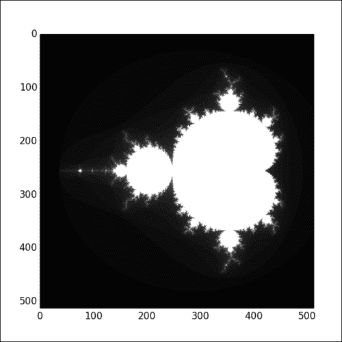

注意，在轴上显示的坐标是 2D 数组索引。

## 工作原理...

`pyplot.imshow()`功能非常简单； 给它一个 2D 数组，它将渲染一张图片，其中每个像素代表一个从 2D 数组获取的值。 像素的颜色是从颜色表中选取的-数组的每个值都在`[0, 1]`间隔内线性归一化。 `pyplot.imshow()`函数可渲染人物，但不会显示它。 与往常一样，我们应该致电`pyplot.show()`来查看该图。 但是，具有两个具有类似名称的功能可能会引起混淆。

脚本的其余部分生成我们的示例数据。 创建 2D 数组`Z`，然后用双循环填充。 此循环对`[-2.2, 0.8]*[-1.5, 1.5]`正方形进行采样。 对于每个样本，`iter_count`函数都会计算 Mandelbrot 集的迭代次数。 `Z`数组中的数据可能来自文件或任何其他来源。

## 还有更多…

我们从`pyplot.imshow()`得到的结果有点原始。 轴上显示的坐标是 2D 数组索引。 我们可能更喜欢不同的坐标； 在这种情况下，我们采样的正方形的坐标。 此处使用的色图不理想。 可以使用`pyplot.imshow()`的可选参数来解决。 让我们将呼叫更改为`pyplot.imshow()`：

```py
plt.imshow(Z, cmap = cm.binary, extent=(xmin, xmax, ymin, ymax))
```

由于我们使用了颜色表，因此我们应该导入 matplotlib 的颜色表模块。 在脚本的开头，添加以下行：

```py
import matplotlib.cm as cm
```

虽然数据严格相同，但是输出将更改：


`extent` 可选参数指定 2D 数组中存储的数据的坐标系。 坐标系是四个值的元组。 最小和最大范围在水平轴上，然后在垂直轴上。 现在，轴显示我们采样以计算 Mandelbrot 集的正方形的坐标。 参数`cmap`指定颜色表。

现在，让我们在脚本中将样本数据的大小从`512`减小为`32`。 输出将类似于以下屏幕截图：

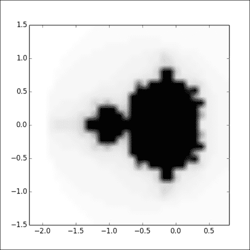

我们使用`32*32`样本而不是`512*512`样本来表示 Mandelbrot 集。 但是的结果并不小。 实际上，`pyplot.imshow()`所做的不只是为 2D 数组着色像素。 如果输入数据小于或大于数字，`pyplot.imshow()`功能将产生给定任意大小的图片并执行插值。 在此示例中，我们可以看到默认插值是线性的。 这并不总是理想的。 `pyplot.imshow()`函数有一个可选参数`interpolation`，它允许我们指定要使用的插值类型。 matplotlib 提供了令人印象深刻的插值方案列表。 让我们看一下最简单的插值方案：最近邻插值：

```py
plt.imshow(Z, cmap = cm.binary, interpolation = 'nearest', extent=(xmin, xmax, ymin, ymax))
```

原始数据现在更加明显：

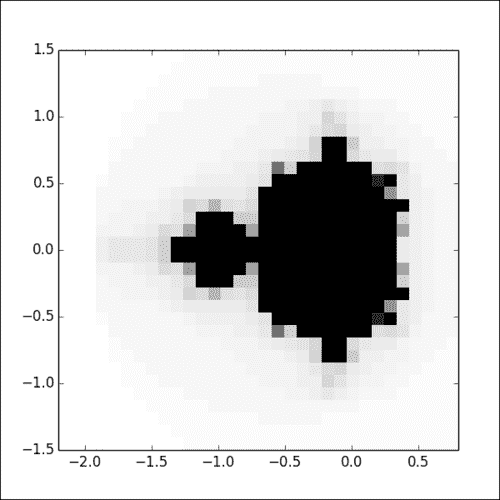

我们可能想使用比细线线性插值更复杂的插值方案。 后者计算起来很便宜，但会产生难看的伪像。 让我们使用双三次插值，使用`interpolation = 'bicubic'`。 我们会得到更好的结果：


### 注意

matplotlib 具有更复杂的插值方案，例如 `sinc`和 `lanzcos`。

# 向图中添加颜色图例

彩色图是产生可读和视觉悦目的图形的关键要素。 但是，我们在这里进行科学，而审美只是一个副目标。 使用颜色表时，我们想知道哪个值对应于给定的颜色。 在本食谱中，我们将探讨一种将此类信息添加到图形的简单方法。

## 怎么做...

我们将使用相同的示例 Mandelbrot 集。 我们只需将调用添加到`pyplot.colorbar()`：

```py
import numpy as np
from matplotlib import pyplot as plt 
import matplotlib.cm as cm 

def iter_count(C, max_iter): 
  X = C 
  for n in range(max_iter): 
    if abs(X) > 2.: 
      return n 
    X = X ** 2 + C 
  return max_iter 

N = 512 
max_iter = 64 
xmin, xmax, ymin, ymax = -2.2, .8, -1.5, 1.5 
X = np.linspace(xmin, xmax, N) 
Y = np.linspace(ymin, ymax, N) 
Z = np.empty((N, N)) 

for i, y in enumerate(Y): 
  for j, x in enumerate(X): 
    Z[i, j] = iter_count(complex(x, y), max_iter) 

plt.imshow(Z, 
            cmap = cm.binary, 
            interpolation = 'bicubic', 
            extent=(xmin, xmax, ymin, ymax)) 
cb = plt.colorbar(orientation='horizontal', shrink=.75) 
cb.set_label('iteration count') 

plt.show()
```

代码前面的将产生以下输出：

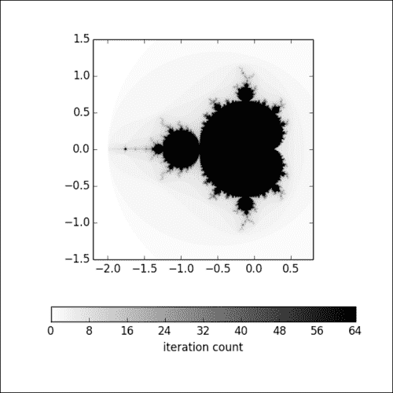

整洁的颜色条可让您将颜色表中的颜色与感兴趣的值相关联。 这是 Mandelbrot 迭代计数。

## 工作原理...

大部分脚本与上一食谱中介绍的脚本严格相同。 脚本的相关内容如下：

```py
cb = plt.colorbar(orientation='horizontal', shrink=.75) 
cb.set_label('iteration count')
```

`pyplot.colorbar()`函数向 matplotlib 发出信号，要求我们将颜色条显示为。 为了演示，我们在此处使用一些可选参数。 `orientation`参数用于选择颜色条是垂直还是水平。 默认情况下为垂直。 `shrink`参数用于将颜色栏缩小为其默认大小。 默认情况下，颜色栏没有图例。 可以设置图例，但这样做有点尴尬。 调用`pyplot.colorbar()`函数将产生一个`Colorbar`实例。 然后，我们调用该`Colorbar`实例的`set_label()`方法。

# 可视化非均匀 2D 数据

到目前为止，我们假设已对 2D 数据进行了统一采样； 我们的数据以网格模式进行采样。 但是，非均匀采样的数据非常普遍。 例如，我们可能希望可视化气象站的测量结果。 尽可能地建立气象站； 它们被布置成一个完美的网格。 在进行采样功能时，我们可能会使用不产生网格布局的复杂采样过程（自适应采样，准随机采样等）。 在这里，我们展示了一种处理此类 2D 数据的简单方法。

## 怎么做...

该脚本绘制了从与先前配方相同的正方形采样的 Mandelbrot 集。 但是，我们不使用常规的网格采样，而是对 Mandelbrot 集进行随机采样，如下例所示：

```py
import numpy as np
from numpy.random import uniform, seed 

from matplotlib import pyplot as plt 
from matplotlib.mlab import griddata 
import matplotlib.cm as cm 

def iter_count(C, max_iter): 
  X = C 
  for n in range(max_iter): 
    if abs(X) > 2.: 
      return n 
    X = X ** 2 + C 
  return max_iter 

max_iter = 64 
xmin, xmax, ymin, ymax = -2.2, .8, -1.5, 1.5 

sample_count = 2 ** 12 
A = uniform(xmin, xmax, sample_count) 
B = uniform(ymin, ymax, sample_count) 
C = [iter_count(complex(a, b), max_iter) for a, b in zip(A, B)] 
N = 512 
X = np.linspace(xmin, xmax, N) 
Y = np.linspace(ymin, ymax, N) 
Z = griddata(A, B, C, X, Y, interp = 'linear') 

plt.scatter(A, B, color = (0., 0., 0., .5), s = .5) 
plt.imshow(Z, 
            cmap = cm.binary, 
            interpolation = 'bicubic', 
            extent=(xmin, xmax, ymin, ymax)) 
plt.show()
```

该脚本将显示随机采样的 Mandelbrot 集。 样本点显示为黑色小点：

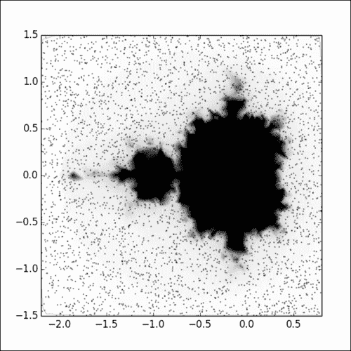

显然，由于的随机采样过程，结果比常规采样的结果更加混乱。 但是，我们仅使用了 4,096 个样本，而不是先前示例中使用的 262,144 个样本，因此我们得到的结果是令人满意的。 通过 matplotlib 的**非均匀采样**功能，使用自适应采样方法将使您能够以比常规网格采样低得多的计算成本获得 Mandelbrot 集的高分辨率视图。

## 工作原理...

首先，该脚本对 Mandelbrot 集进行随机采样，这由脚本的以下部分完成：

```py
sample_count = 2 ** 12 
A = uniform(xmin, xmax, sample_count) 
B = uniform(ymin, ymax, sample_count) 
C = [iter_count(complex(a, b), max_iter) for a, b in zip(A, B)]
```

数组`A`和`B`保存样本的坐标，而列表`C`包含这些样本中每个样本的值。

然后，脚本将从不均匀的样本中生成一个二维数据数组，这由以下部分完成：

```py
N = 512 
X = np.linspace(xmin, xmax, N) 
Y = np.linspace(ymin, ymax, N) 
Z = griddata(A, B, C, X, Y, interp = 'linear') 
```

数组`X`和`Y`定义了规则的网格。 阵列`Z`是通过内插非均匀样本而构建的 2D 阵列。 该插值是通过`matplotlib.mlab`程序包中的`griddata()`功能完成的。 由于现在有了 2D 数组，因此可以使用`pyplot.imshow()`函数对其进行可视化。 对`pyplot.scatter()`的附加调用用于显示原始采样点。

为了演示，我们对`pyplot.griddata()`使用线性插值，并使用可选参数`interp`。 默认情况下，此参数设置为`'nn'`，代表自然邻居插值。 后一种方案在大多数情况下是首选，因为它非常健壮。

# 可视化 2D 标量字段

matplotlib 和 NumPy 提供一些有趣的机制，使二维标量场的可视化变得方便。 在本食谱中，我们展示了一种非常简单的方法来可视化 2D 标量场。

## 怎么做...

`numpy.meshgrid()`函数从显式 2D 函数生成样本。 然后，`pyplot.pcolormesh()`是用于显示功能，如以下代码所示：

```py
import numpy as np
from matplotlib import pyplot as plt 
import matplotlib.cm as cm 
n = 256 
x = np.linspace(-3., 3., n) 
y = np.linspace(-3., 3., n) 
X, Y = np.meshgrid(x, y) 

Z = X * np.sinc(X ** 2 + Y ** 2) 

plt.pcolormesh(X, Y, Z, cmap = cm.gray) 
plt.show()
```

前面的脚本将产生以下输出：

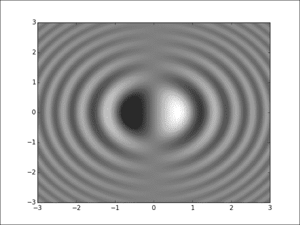

注意明智地选择颜色表会有所帮助； 在此，负值显示为黑色，正值显示为白色。 这样，我们就可以一目了然地看到符号和大小信息。 使用从红色到蓝色，中间为白色的颜色表，效果更好。

## 工作原理...

`numpy.meshgrid()`函数取两个坐标`x`和`y`，并建立两个坐标为`X`和`Y`的网格。 因为`X`和`Y`是 NumPy 2D 数组，所以我们可以像处理单个变量一样操作它们。 我们不必编写循环来生成矩阵`Z`。 这使得计算标量字段简洁明了：

```py
Z = X * numpy.sinc(X ** 2 + Y ** 2) 
```

然后，调用函数`pyplot.pcolormesh()`渲染样本。 我们可以从`pyplot.imshow()`获得相同的结果。 但是，我们只需要在此处传递`X`，`Y`和`Z`即可获得正确的坐标系，而不是使用可选参数。 这样做使脚本更易于阅读。 同样，对于大量数据，`pyplot.pcolormesh()`可能会快得多。

# 可视化轮廓线

到目前为止，我们已经通过给每个数据点着色来可视化数据，并在顶部插入了一些插值。 matplotlib 能够为 2D 数据提供更复杂的表示形式。 **等高线**以相同的值链接所有点，从而帮助您捕获否则可能不容易看到的要素。 在本食谱中，我们将看到如何显示这种轮廓线。

## 怎么做...

功能`pyplot.contour()`允许您生成轮廓注释。 为了演示，让我们重用先前食谱中的代码，以研究 Mandelbrot 集的放大部分：

```py
import numpy as np
from matplotlib import pyplot as plt 
import matplotlib.cm as cm 

def iter_count(C, max_iter): 
  X = C 
  for n in range(max_iter): 
    if abs(X) > 2.: 
      return n 
    X = X ** 2 + C 
  return max_iter 

N = 512 
max_iter = 64 
xmin, xmax, ymin, ymax = -0.32, -0.22, 0.8, 0.9 
X = np.linspace(xmin, xmax, N) 
Y = np.linspace(ymin, ymax, N) 
Z = np.empty((N, N)) 

for i, y in enumerate(Y): 
  for j, x in enumerate(X): 
    Z[i, j] = iter_count(complex(x, y), max_iter) 

plt.imshow(Z, 
            cmap = cm.binary, 
            interpolation = 'bicubic', 
            origin = 'lower', 
            extent=(xmin, xmax, ymin, ymax)) 

levels = [8, 12, 16, 20] 
ct = plt.contour(X, Y, Z, levels, cmap = cm.gray) 
plt.clabel(ct, fmt='%d') 

plt.show()
```

前面的脚本将显示带有复杂轮廓注释的 Mandelbrot 集的详细信息：

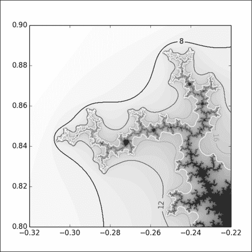

## 工作原理...

我们认识到先前在 Mandelbrot 套装中展示的配方中使用的代码。 唯一的区别是，我们通过更改`xmin`，`xmax`，`ymin`和`ymax`的值来放大 Mandelbrot 集的特定细节。 和以前一样，我们使用`pyplot.imshow()`渲染每个样本的迭代计数。

仅添加了一个：调用`pyplot.contour()`。 此函数获取样本网格的坐标`X`和`Y`以及存储在矩阵`Z`中的样本。 然后，该功能将渲染与`levels`列表中指定的值相对应的轮廓。 可以使用可选参数`cmap`使用色图对级别进行着色。 我们可以使用可选参数`color`为所有轮廓指定一种唯一的颜色。

每个轮廓的水平可以用色条显示或直接在图形上显示。 `pyplot.contour()`函数返回`Contour`实例。 `pyplot.clabel()`函数采用`Contour`实例和一个可选的格式字符串来渲染每个轮廓的标签。

## 还有更多...

在此，轮廓仅显示为线条。 但是，我们可以显示填充轮廓。 让我们在之前使用的 Mandelbrot 集的相同细节上进行演示：

```py
import numpy as np
from matplotlib import pyplot as plt 
import matplotlib.cm as cm 

def iter_count(C, max_iter): 
  X = C 
  for n in range(max_iter): 
    if abs(X) > 2.: 
      return n 
    X = X ** 2 + C 
  return max_iter 

N = 512 
max_iter = 64 
xmin, xmax, ymin, ymax = -0.32, -0.22, 0.8, 0.9 
X = np.linspace(xmin, xmax, N) 
Y = np.linspace(ymin, ymax, N) 
Z = np.empty((N, N)) 

for i, y in enumerate(Y): 
  for j, x in enumerate(X): 
    Z[i, j] = iter_count(complex(x, y), max_iter) 
levels = [0, 8, 12, 16, 20, 24, 32] 
plt.contourf(X, Y, Z, levels, cmap = cm.gray, antialiased = True) 
plt.show()
```

上面的脚本将产生以下输出：

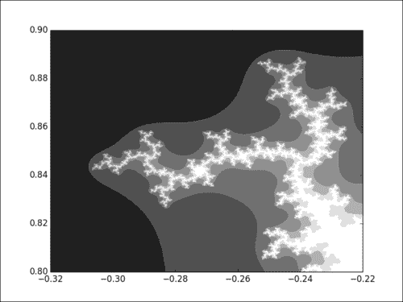

在这里，我们简单地用`pyplot.contourf()`将替换为`pyplot.contour()`，并为轮廓使用了附加等级。 默认情况下，不填充轮廓。 我们使用`antialiased`可选参数来获得更悦目的结果。

# 可视化 2D 矢量场

到目前为止，我们一直在使用 2D 标量字段：将值与 2D 平面的每个点相关联的函数。 向量场将 2D 向量关联到 2D 平面的每个点。 向量场在物理学中很常见，因为它们提供了微分方程的解。 matplotlib 提供了可视化矢量场的功能。

## 准备

对于此示例，我们将需要 SymPy 包； 用于符号计算的软件包。 该包仅用于使示例简短，并且对于使用矢量字段不是必需的。

## 怎么做...

为了说明矢量场的可视化，让我们可视化圆柱周围不可压缩流体的速度流。 我们无需费心如何计算这样的矢量场，而仅需担心如何显示它。 我们需要`pyplot.quiver()`功能； 请参考以下代码：

```py
import numpy as np
import sympy 
from sympy.abc import x, y 
from matplotlib import pyplot as plt 
import matplotlib.patches as patches 

def cylinder_stream_function(U = 1, R = 1): 
  r = sympy.sqrt(x ** 2 + y ** 2) 
  theta = sympy.atan2(y, x) 
  return U * (r - R ** 2 / r) * sympy.sin(theta) 

def velocity_field(psi): 
  u = sympy.lambdify((x, y), psi.diff(y), 'numpy') 
  v = sympy.lambdify((x, y), -psi.diff(x), 'numpy') 
  return u, v 

U_func, V_func = velocity_field(cylinder_stream_function() ) 

xmin, xmax, ymin, ymax = -2.5, 2.5, -2.5, 2.5 
Y, X = np.ogrid[ymin:ymax:16j, xmin:xmax:16j] 
U, V = U_func(X, Y), V_func(X, Y) 

M = (X ** 2 + Y ** 2) < 1\. 
U = np.ma.masked_array(U, mask = M) 
V = np.ma.masked_array(V, mask = M) 

shape = patches.Circle((0, 0), radius = 1., lw = 2., fc = 'w', ec = 'k', zorder = 0) 
plt.gca().add_patch(shape) 

plt.quiver(X, Y, U, V, zorder = 1) 

plt.axes().set_aspect('equal') 
plt.show()
```

上面的脚本将产生以下输出：

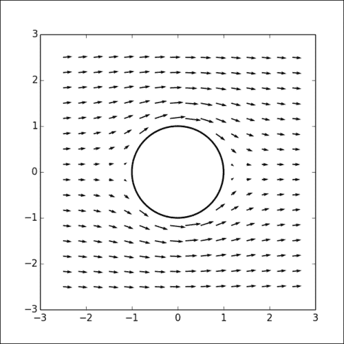

## 工作原理...

尽管脚本长，但纯图形部分很简单。 向量字段存储在矩阵`U`和`V`中：我们从向量字段中采样的每个向量的坐标。 矩阵`X`和`Y`包含样本位置。 矩阵`X`，`Y`，`U`和`V`被传递到 `pyplot.quiver()`，从而渲染矢量场。 请注意，`pyplot.quiver()`只能使用`U`和`V`作为参数，但图例将显示样本的索引而不是其坐标。

由于我们在此处用作说明的矢量场是圆柱体周围的流体流动，圆柱体本身显示如下：

```py
shape = patches.Circle((0, 0), radius = 1., lw = 2., fc = 'w', ec = 'k', zorder = 0) 
plt.gca().add_patch(shape)
```

圆柱体内的矢量场不会出现； 我们使用蒙版数组。 我们首先创建一个定义应显示哪些样本的蒙版。 然后，将此掩码应用于`U`和`V`，如以下脚本所示：

```py
M = (X ** 2 + Y ** 2) < 1\. 
U = np.ma.masked_array(U, mask = M) 
V = np.ma.masked_array(V, mask = M) 
```

这使您可以隐藏解决方案中的奇点。

# 可视化 2D 矢量场的流线

使用箭头指向表示矢量场效果很好。 但是 matplotlib 可以做得更好，它可以显示矢量场的流线。 一条流线显示了矢量场的流动方式。 在本食谱中，我们将向您展示如何创建流线型。

## 怎么做...

让我们使用上一个配方的流体流动示例。 我们将简单地用流线替换箭头，如以下代码所示：

```py
import numpy as np
import sympy 
from sympy.abc import x, y 
from matplotlib import pyplot as plt 
import matplotlib.patches as patches 

def cylinder_stream_function(U = 1, R = 1): 
  r = sympy.sqrt(x ** 2 + y ** 2) 
  theta = sympy.atan2(y, x) 
  return U * (r - R ** 2 / r) * sympy.sin(theta) 

def velocity_field(psi): 
  u = sympy.lambdify((x, y), psi.diff(y), 'numpy') 
  v = sympy.lambdify((x, y), -psi.diff(x), 'numpy') 
  return u, v 

psi = cylinder_stream_function() 
U_func, V_func = velocity_field(psi) 

xmin, xmax, ymin, ymax = -3, 3, -3, 3 
Y, X = np.ogrid[ymin:ymax:128j, xmin:xmax:128j] 
U, V = U_func(X, Y), V_func(X, Y) 

M = (X ** 2 + Y ** 2) < 1\. 
U = np.ma.masked_array(U, mask = M) 
V = np.ma.masked_array(V, mask = M) 
shape = patches.Circle((0, 0), radius = 1., lw = 2., fc = 'w', ec = 'k', zorder = 0) 
plt.gca().add_patch(shape) 

plt.streamplot(X, Y, U, V, color = 'k') 

plt.axes().set_aspect('equal') 
plt.show()
```

前面的脚本将显示圆柱周围的流，如以下屏幕快照中的所示：

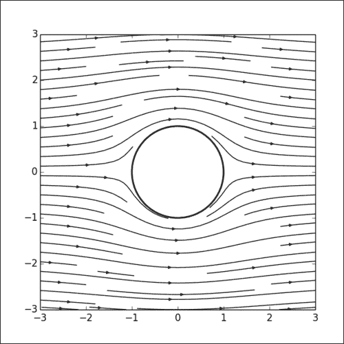

## 工作原理...

生成样本矢量坐标的代码与先前的配方相同。 在这里，我们使用更多样本（用`128*128`代替`32*32`）来获得准确的流线型。 除此之外，唯一的区别是我们使用`pyplot.streamlines()`代替了`pyplot.quiver()`的。 四个必需参数相同：样本的坐标`X`和`Y`，以及向量的坐标`U`和`V`。 可选参数`color`用于设置流线的颜色。

## 还有更多...

我们可以使用带有可选参数`color`和`cmap`的颜色表为流线着色：

```py
plt.streamplot(X, Y, U, V, color = U ** 2 + V ** 2, cmap = cm.binary)
```

`color`参数采用 2D 数组，该数组用于为流线着色。 在此示例中，颜色反映了流的速度，如以下输出所示：

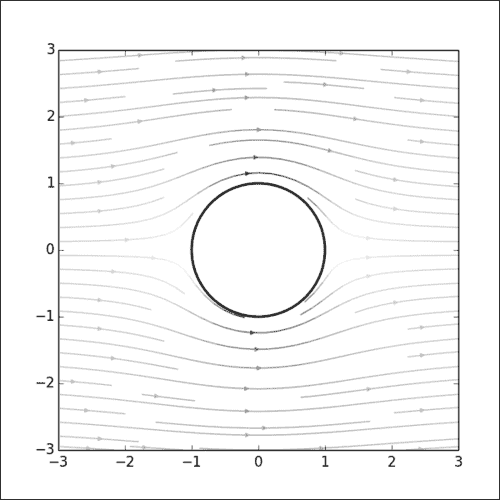