# 七、处理 3D 图形

在本章中，我们将介绍以下主题：

*   创建 3D 散点图
*   创建 3D 线形图
*   在 3D 中绘制标量场
*   绘制参数化 3D 曲面
*   将 2D 图形嵌入 3D 图形
*   创建 3D 条形图

## 简介

matplotlib 对三维图的支持不断增加。 从 1.2 版开始，制作 3D 图形的 API 与 2D API 非常相似。 在地块上再增加一个维度可以一目了然地可视化更多信息。 此外，3D 图在演示文稿或上课期间非常引人注目。 在本章中，我们将探讨 matplotlib 在第三维中可以做什么。

## 创建 3D 散点图

散点图是非常简单的图。 对于数据集的每个点，图中显示一个点。 一个点的坐标就是相应数据的坐标。 我们已经在第 1 章“第一步”中探索了二维散点图。 在本秘籍中，我们将看到三个维度的散点图以相同的方式工作，但变化很小。

为了使本示例中的数据有趣，我们将使用洛伦兹奇异吸引子。 这是一个 3D 结构，代表了来自气象学的简单动力系统的解决方案。 这个动力学系统是一个著名的教科书例子，一个混沌系统。

### 操作步骤

在下面的代码中，我们将从`Axes`实例调用图形渲染方法，而不是从`pyplot`调用方法：

```py
import numpy as np
from mpl_toolkits.mplot3d import Axes3D
import matplotlib.pyplot as plt

## Dataset generation
a, b, c = 10., 28., 8\. / 3.
def lorenz_map(X, dt = 1e-2):
  X_dt = np.array([a * (X[1] - X[0]),
                             X[0] * (b - X[2]) - X[1],
                             X[0] * X[1] - c * X[2]])
  return X + dt * X_dt

points = np.zeros((2000, 3))
X = np.array([.1, .0, .0])
for i in range(points.shape[0]):
  points[i], X = X, lorenz_map(X)

## Plotting
fig = plt.figure()
ax = fig.gca(projection = '3d')

ax.set_xlabel('X axis')
ax.set_ylabel('Y axis')
ax.set_zlabel('Z axis')
ax.set_title('Lorenz Attractor a=%0.2f b=%0.2f c=%0.2f' % (a, b, c))

ax.scatter(points[:, 0], points[:, 1],  points[:, 2], zdir = 'y', c = 'k')
plt.show()
```

上面的代码将显示现在熟悉的用户界面，如下图：

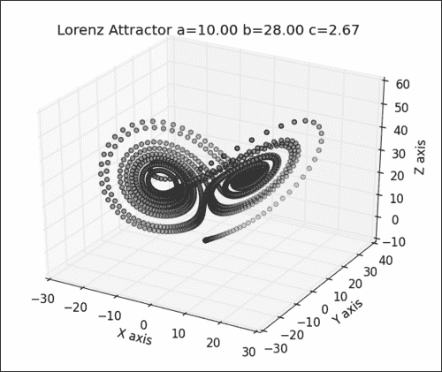

在我们眼前，洛伦兹吸引子！ 如果将鼠标拖到图形中（按住鼠标左键移动鼠标），则 3D 形状将旋转，就像您正在操纵轨迹球一样。 您可以旋转图形并以所有可能的角度检查洛伦兹吸引子。

请注意，尽管所有点都以蓝色显示，但有些点趋向于白色阴影。 matplotlib 应用这种类似于雾的效果来增强散点图的深度感知。 距我们较远的点将抖动为白色，这是文艺复兴时期画家已经知道的古老技巧。

### 工作原理

对于本示例，我们不会在数据生成上花太多时间； 这不是重点。 我们只需要知道数据集存储在具有三列的矩阵点中，每个维度一列。

在使用 matplotlib 进行三维操作之前，我们首先需要为 matplotlib 导入 3D 扩展名：这是以下`import`指令的目的：

```py
from mpl_toolkits.mplot3d import Axes3D
```

到目前为止，在的大部分时间内，我们已经通过调用`pyplot`中的方法提交了所有渲染指令。 但是，对于三维图，涉及的内容更多，如以下代码所示：

```py
fig = plt.figure()
ax = fig.gca(projection = '3d')
```

我们创建一个`Figure`实例，并将一个`Axes3D`实例附加到该实例。 当`Axes`实例负责通常的 2D 渲染时，`Axes3D`将负责 3D 渲染。 然后，3D 散点图的工作方式与 2D 散点图完全相同，如以下代码所示：

```py
ax.scatter(points[:, 0], points[:, 1],  points[:, 2])
```

我们给出要表示的点的`X`，`Y`和`Z`坐标。 在这里，我们仅给出点矩阵的三列。 我们可以使用普通的 Python 列表，但是为了方便起见，我们使用 NumPy 数组。 再次注意，我们调用了`Axes3D`实例的`scatter()`方法，而不是`pyplot`中的`scatter`方法。 `Axes3D`中只有`scatter()`方法会解释 3D 数据。

最后，尽管在`Axes3D`实例中调用了它们，但是我们在第 3 章，“处理标注”中探讨的功能也可用。 用`set_title()`设置标题，并用`set_xlabel()`，`set_ylabel()`和`set_zlabel()`标注轴。

### 更多

正如我们已经看到的，3D 中的散点图的工作方式与 2D 中的散点图相同。 实际上，除了用于创建`Axes3D`实例的设置代码之外，所有内容似乎都像在 2D 模式下一样工作。 这不仅仅是印象。 例如，自定义散点图的工作方式完全相同。 让我们通过替换对`Axes3D.scatter()`的调用来更改标记的形状和颜色，如下所示：

```py
ax.scatter(points[:, 0], points[:, 1],  points[:, 2],
                 marker = 's',
                 edgecolor = '.5',
           facecolor = '.5')
```

现在，输出将如下图所示：

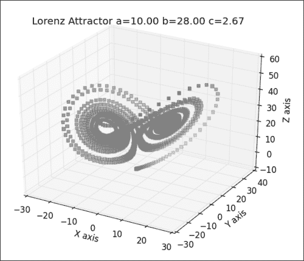

实际上，第 2 章“自定义颜色和样式”中的所有技巧都可以在 3D 中实现。

## 创建 3D 线形图

正如先前的秘籍所展示的那样，在创建三维图形时，我们在前几章中学到的内容是正确的。 让我们通过绘制 3D 参数曲线来确认这一点。 在此秘籍中，我们保留与上一个秘籍相同的数据集； 就是洛伦兹吸引子。

### 操作步骤

在 2D 中，我们通过调用`pyplot.plot()`绘制曲线。 正如前面的秘籍所暗示的，我们要做的就是设置一个`Axes3D`实例并调用其`plot()`方法，如以下代码所示：

```py
import numpy as np
from mpl_toolkits.mplot3d import Axes3D
import matplotlib.pyplot as plt

a, b, c = 10., 28., 8\. / 3.
def lorenz_map(X, dt = 1e-2):
  X_dt = np.array([a * (X[1] - X[0]),
                            X[0] * (b - X[2]) - X[1],
                            X[0] * X[1] - c * X[2]])
  return X + dt * X_dt

points = np.zeros((10000, 3))
X = np.array([.1, .0, .0])
for i in range(points.shape[0]):
  points[i], X = X, lorenz_map(X)

fig = plt.figure()
ax = fig.gca(projection = '3d')
ax.plot(points[:, 0], points[:, 1],  points[:, 2], c = 'k')
plt.show()
```

前面的代码将显示熟悉的洛伦兹吸引子，但是这些点通过曲线链接，而不是简单地显示每个数据点，如下图所示：

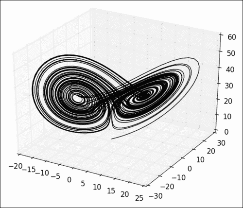

当我们使用用户界面旋转视图时，洛伦兹吸引子的特殊缠绕螺旋结构非常明显。

### 工作原理

对于任何三维图形，我们首先设置一个`Axes3D`实例。 然后，对`plot()`的调用类似于其 2D 对应项：我们为每个维度提供一个列表，并为每个维度提供点的坐标。

## 绘制 3D 标量场

到目前为止，我们已经看到 3D 图基本上模仿了 2D 对应图。 但是，还有 matplotlib 的三维绘图功能。 许多特定于三维的图形也是可能的。 让我们从一个简单的用例开始：将 2D 标量场绘制为 3D 表面。

### 操作步骤

和往常一样，我们将要生成一些测试数据，设置一个`Axes3D`实例，然后将我们的数据传递给它：

```py
import numpy as np
from matplotlib import cm
from mpl_toolkits.mplot3d import Axes3D
import matplotlib.pyplot as plt

x = np.linspace(-3, 3, 256)
y = np.linspace(-3, 3, 256)
X, Y = np.meshgrid(x, y)
Z = np.sinc(np.sqrt(X ** 2 + Y ** 2))

fig = plt.figure()
ax = fig.gca(projection = '3d')
ax.plot_surface(X, Y, Z, cmap=cm.gray)
plt.show()
```

上面的代码将显示下图：

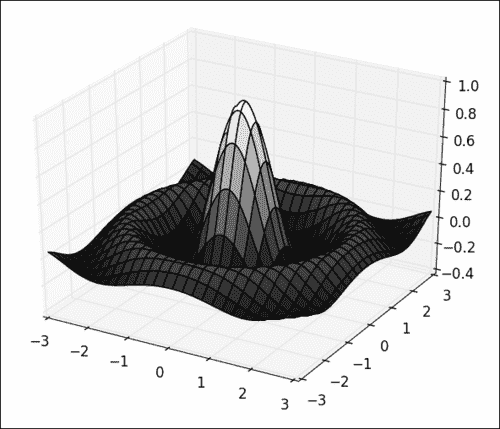

### 工作原理

数据生成的工作方式与第 6 章和“处理地图”中演示的完全相同。 将创建两个矩阵`X`和`Y`，其中包含规则网格的坐标。 我们计算矩阵`Z`以及`X`和`Y`的标量场函数。

从这里开始，事情变得非常琐碎。 我们调用`plot_surface()`方法，该方法使用`X`，`Y`和`Z`将标量场显示为 3D 曲面。 颜色来自颜色表（`cmap`可选参数）和矩阵`Z`。

### 更多

您可能不希望看到 3D 表面上显示的黑色曲线。 可以使用`plot_surface()`的一些其他可选参数来完成，如以下代码所示：

```py
ax.plot_surface(X, Y, Z,
    cmap=cm.gray,
    linewidth=0,
    antialiased=False)
```

黑色曲线现已消失，从而使图形更简单：

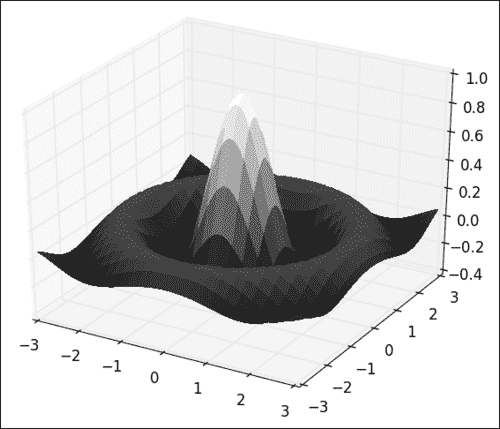

另一方面，我们可能想要保留黑色曲线并摆脱花哨的颜色。 也可以使用`plot_surface()`的可选参数来完成，如以下代码所示：

```py
ax.plot_surface(X, Y, Z, color = 'w')
```

并且仅保留黑色曲线，从而形成了极简的表面图，如下图所示：

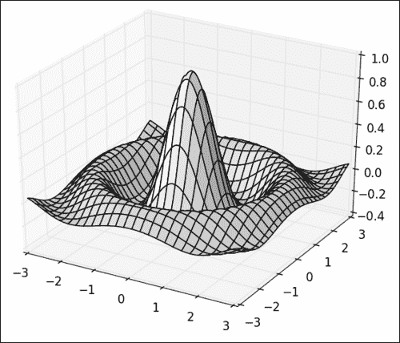

最后，我们可能希望摆脱隐藏面的去除，并希望表面由线框制成。 现在，这不是`plot_surface()`可以实现的。 但是，`plot_wireframe()`正是为此而制作的，如以下代码所示：

```py
ax.plot_wireframe(X, Y, Z, cstride=8, rstride=8, color = 'k')
```

现在，以线框样式渲染相同的曲面，如下图所示：

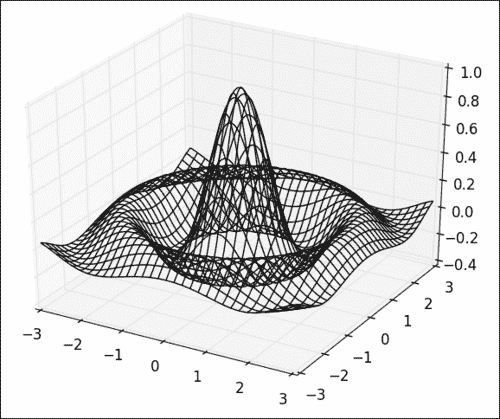

`plot_wireframe()`参数采用与输入相同的`X`，`Y`和`Z`坐标作为`plot_surface()`参数。 我们使用两个可选参数`rstride`和`cstride`来告诉 matplotlib 跳过`X`和`Y`轴上的每八个坐标。 如果没有这个，曲线之间的间隔将太小，我们将只能看到一个大的黑色轮廓。

## 绘制参数化 3D 曲面

在先前的秘籍中，我们使用`plot_surface()`绘制了标量场：即`f(x, y) = z`形式的函数。 但是，matplotlib 能够绘制通用的参数化 3D 曲面。 让我们通过绘制圆环来演示这一点，圆环是一个相当简单的参数化曲面。

### 操作步骤

我们将使用以下代码再次使用`plot_surface()`显示圆环：

```py
import numpy as np
from mpl_toolkits.mplot3d import Axes3D
import matplotlib.pyplot as plt

## Generate torus mesh
angle = np.linspace(0, 2 * np.pi, 32)
theta, phi = np.meshgrid(angle, angle)
r, R = .25, 1.
X = (R + r * np.cos(phi)) * np.cos(theta)
Y = (R + r * np.cos(phi)) * np.sin(theta)
Z = r * np.sin(phi)

## Display the mesh
fig = plt.figure()
ax = fig.gca(projection = '3d')
ax.set_xlim3d(-1, 1)
ax.set_ylim3d(-1, 1)
ax.set_zlim3d(-1, 1)
ax.plot_surface(X, Y, Z, color = 'w', rstride = 1, cstride = 1)
plt.show()
```

前面的代码将显示我们的圆环，如下所示：

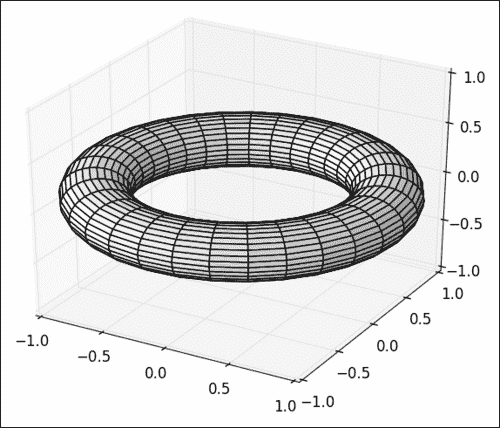

### 工作原理

圆环是可以用两个参数`theta`和`phi`进行参数化的曲面，其范围从`0`到`2 * pi`，如下代码所示：

```py
angle = np.linspace(0, 2 * np.pi, 32)
theta, phi = np.meshgrid(angle, angle)
```

`theta`和`phi`变量描述了规则的网格布局。 圆环网格的 3D 坐标根据`theta`和`phi`编写，如以下代码所示：

```py
r, R = .25, 1.
X = (R + r * np.cos(phi)) * np.cos(theta)
Y = (R + r * np.cos(phi)) * np.sin(theta)
Z = r * np.sin(phi)
```

然后，我们只需将`X`，`Y`和`Z`传递给`plot_surface()`方法。 `plot_surface()`方法假定`X`，`Y`和`Z`是网格数据。 我们需要设置可选参数`rstride`和`cstride`，以明确`X`，`Y`和`Z`是网格数据。

我们明确地将的轴限制设置为`[-1, 1]`范围。 默认情况下，在创建 3D 图时，matplotlib 将自动缩放每个轴。 我们的圆环在`X`和`Y`轴的`[-1, 1]`范围内延伸，但仅在`Z`轴的`[-.25, .25]`范围内延伸。 如果让 matplotlib 缩放轴，则圆环将显示在`Z`轴上拉伸，如下图所示：

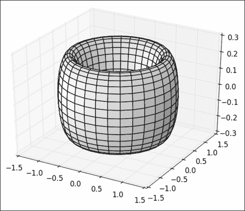

因此，在绘制 3D 曲面时，我们必须手动设置每个轴范围以获得正确缩放的视图。

### 更多

如前面的秘籍所示，我们可以使用以下代码将对`plot_surface()`的调用替换为对`plot_wireframe()`的调用，以获取圆环的线框视图：

```py
ax.plot_wireframe(X, Y, Z, color = 'k', rstride = 1, cstride = 1)
```

这个简单的更改足以获得线框视图，如下图所示：

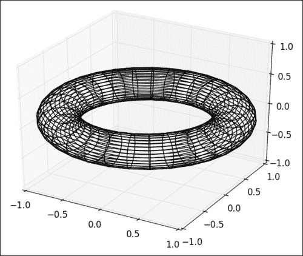

## 将 2D 图形嵌入 3D 图形

我们已经在第 3 章“处理标注”来了解如何对图形进行注释。 注释三维图形的一种有效方法是简单地使用二维图形。 此秘籍是说明这种可能性的简单示例。

### 操作步骤

为了说明这个想法，我们将仅使用我们之前已经看到的图元绘制一个简单的 3D 表面和两条曲线，如以下代码所示：

```py
import numpy as np
from mpl_toolkits.mplot3d import Axes3D
import matplotlib.pyplot as plt
x = np.linspace(-3, 3, 256)
y = np.linspace(-3, 3, 256)
X, Y = np.meshgrid(x, y)
Z = np.exp(-(X ** 2 + Y ** 2))
u = np.exp(-(x ** 2))

fig = plt.figure()
ax = fig.gca(projection = '3d')
ax.set_zlim3d(0, 3)
ax.plot(x, u, zs=3, zdir='y', lw = 2, color = '.75')
ax.plot(x, u, zs=-3, zdir='x', lw = 2., color = 'k')
ax.plot_surface(X, Y, Z, color = 'w')

plt.show()
```

上面的代码将产生下图：

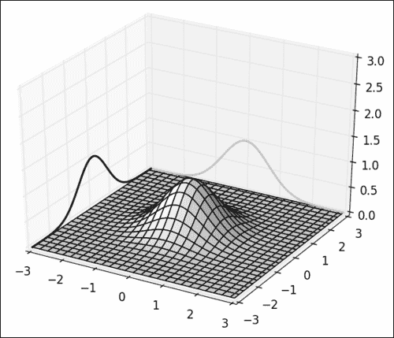

黑色和灰色曲线绘制为投影在平面上的 2D 曲线。

### 工作原理

如先前秘籍所示，将生成 3D 表面。 `Axes3D`实例`ax`支持常用的 2D 渲染命令，例如`plot()`，如以下代码所示：

```py
ax.plot(x, u, zs=3, zdir='y', lw = 2, color = '.75')
```

但是，对`plot()`的调用具有两个新的可选参数：`zs`和`zdir`：

*   `Zdir`：这决定了要在哪个平面上绘制 2D 图，X，Y 或 Z
*   `Zs`：这确定平面的偏移

因此，要将 2D 图形嵌入 3D 图形中，我们只需要记住`Axes3D`即可使用所有 2D 图元。 我们只有两个可选参数`zdir`和`zs`，以设置放置需要绘制图形的平面。

### 更多

将 2D 图形嵌入到 3D 图形中非常简单，但是使用到目前为止我们探索的简单基元创建复杂图形提供了很多可能性。 例如，我们已经知道使用以下代码制作分层条形图的一切：

```py
import numpy as np
from matplotlib import cm
import matplotlib.colors as col
from mpl_toolkits.mplot3d import Axes3D
import matplotlib.pyplot as plt

## Data generation
alpha = 1\. / np.linspace(1, 8, 5)
t = np.linspace(0, 5, 16)
T, A = np.meshgrid(t, alpha)
data = np.exp(-T * A)

## Plotting
fig = plt.figure()
ax = fig.gca(projection = '3d')
cmap = cm.ScalarMappable(col.Normalize(0, len(alpha)), cm.gray)
for i, row in enumerate(data):
  ax.bar(4 * t, row, zs=i, zdir='y', alpha=0.8, color=cmap.to_rgba(i))
plt.show()
```

上面的代码将产生下图：

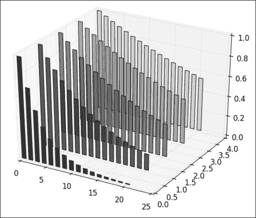

我们可以看到前面的代码使用了前面各章中介绍的功能：

*   条形图的创建已在第 1 章，“第一步”中进行了介绍。
*   第 2 章“自定义颜色和样式”中已经介绍了使用颜色表对条形图进行着色。
*   本秘籍涵盖了条形图的分层

## 创建 3D 条形图

在 3D 图形中使用几个 2D 图层，我们可以绘制多个条形图。 但是，我们也可以使用完整的 3D 和带有实际 3D 条形图的条形图。

### 操作步骤

为了演示 3D 条形图，我们将使用先前秘籍中的简单合成数据集，如以下代码所示：

```py
import numpy as np
from mpl_toolkits.mplot3d import Axes3D
import matplotlib.pyplot as plt

## Data generation
alpha = np.linspace(1, 8, 5)
t = np.linspace(0, 5, 16)
T, A = np.meshgrid(t, alpha)
data = np.exp(-T * (1\. / A))

## Plotting
fig = plt.figure()
ax = fig.gca(projection = '3d')

Xi = T.flatten()
Yi = A.flatten()
Zi = np.zeros(data.size)

dx = .25 * np.ones(data.size)
dy = .25 * np.ones(data.size)
dz = data.flatten()

ax.set_xlabel('T')
ax.set_ylabel('Alpha')
ax.bar3d(Xi, Yi, Zi, dx, dy, dz, color = 'w')

plt.show()
```

这次，这些条显示为 3D 块，如下图所示：

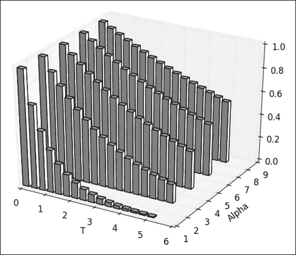

### 工作原理

这些条以网格布局放置在中。 `bar3d()`方法采用六个必填参数作为输入。 前三个参数是每个条形图下端的`X`，`Y`和`Z`坐标。 在这里，我们根据数据集构建条形的坐标，如下所示：

```py
Xi = T.flatten()
Yi = A.flatten()
Zi = np.zeros(data.size)
```

每个小节将从同一级别`0`开始。 `X`和`Y`坐标是数据集的坐标。 `bar3d()`方法将坐标列表而不是网格坐标作为输入，这就是为什么我们在矩阵`A`和`T`上调用`flatten`方法的原因。

`bar3d()`方法的接下来的三个必需参数是每个尺寸上每个条的尺寸。 在此，条形的高度取自`data`矩阵。 钢筋的宽度和深度设置为`.25`，如以下代码所示：

```py
dx = .25 * np.ones(data.size)
dy = .25 * np.ones(data.size)
dz = data.flatten()
```

现在，我们可以使用以下代码调用`bar3d()`：

```py
ax.bar3d(Xi, Yi, Zi, dx, dy, dz, color = 'w')
```