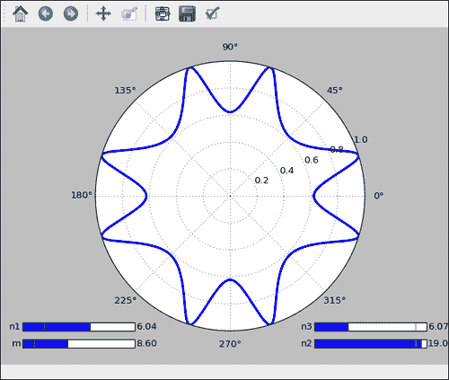
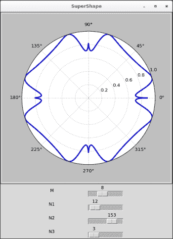
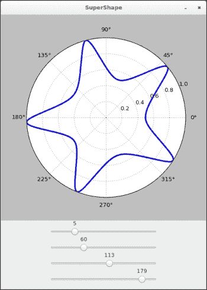
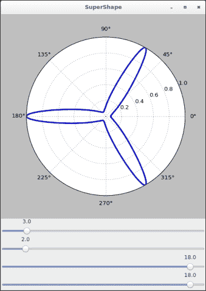

# 第 8 章。用户界面

在本章中，我们将介绍：

*   制作用户可控制的图
*   将图整合到 Tkinter 用户界面中
*   将图整合到 wxWidgets 用户界面中
*   将图整合到 GTK 用户界面中
*   将图整合到 Pyglet 应用程序中

# 简介

matplotlib 不仅可以绘制图表 它可以绘制您可以与之交互的图形。 交互式可视化可能是探索一些数据并发现一些有趣模式的好方法。 同样，交互式人物可以为教学目的提供很好的支持。 在本章中，我们将探讨创建 **交互式绘图**所必须使用的不同选项。

# 制作用户可控制的绘图

开箱即用的不需要任何其他程序包，matplotlib 提供了在图上添加控制器的原语，以便用户可以与其交互。 在本食谱中，我们将了解如何绘制著名的参数曲线： SuperShape 曲线。 该曲线由六个参数控制：A，B，M，N1，N2 和 N3。 这些参数确定曲线的形状。 用户可以通过在图形上移动光标来交互式设置它们。

## 怎么做...

以下代码将使用`pyplot.plot()`显示一条曲线，这时应该很简单。 但是，我们现在使用用户界面元素（通常更称为**小部件**），即滑块。 可以通过以下步骤完成：

1.  我们从必要的导入指令开始，如下所示：

    ```py
    import numpy as np
    from matplotlib import pyplot as plt
    from matplotlib.widgets import Slider
    ```

2.  SuperShape 曲线由以下功能定义：

    ```py
    def supershape_radius(phi, a, b, m, n1, n2, n3):
      theta = .25 * m * phi
      cos = np.fabs(np.cos(theta) / a) ** n2
      sin = np.fabs(np.sin(theta) / b) ** n3
      r = (cos + sin) ** (-1\. / n1)
      r /= np.max(r)
      return r
    ```

3.  然后，我们使用以下代码定义 SuperShape 曲线的参数的初始值：

    ```py
    phi = np.linspace(0, 2 * np.pi, 1024)
    m_init = 3
    n1_init = 2
    n2_init = 18
    n3_init = 18
    ```

4.  我们定义图并按如下所示放置滑块：

    ```py
    fig = plt.figure()
    ax = fig.add_subplot(111, polar = True)

    ax_m  = plt.axes([0.05, 0.05, 0.25, 0.025])
    ax_n1 = plt.axes([0.05, 0.10, 0.25, 0.025])
    ax_n2 = plt.axes([0.7, 0.05, 0.25, 0.025])
    ax_n3 = plt.axes([0.7, 0.10, 0.25, 0.025])

    slider_m  = Slider(ax_m,  'm',  1, 20, valinit = m_init)
    slider_n1 = Slider(ax_n1, 'n1', .1, 10, valinit = n1_init)
    slider_n2 = Slider(ax_n2, 'n2', .1, 20, valinit = n2_init)
    slider_n3 = Slider(ax_n3, 'n3', .1, 20, valinit = n3_init)
    ```

5.  我们使用以下代码绘制一次曲线：

    ```py
    r = supershape_radius(phi, 1, 1, m_init, n1_init, n2_init, n3_init)
    lines, = ax.plot(phi, r, lw = 3.)
    ```

6.  我们指定用户更新滑块时的操作，如以下代码所示：

    ```py
    def update(val):
        r = supershape_radius(phi, 1, 1, np.floor(slider_m.val), slider_n1.val, slider_n2.val, slider_n3.val)
        lines.set_ydata(r)
        fig.canvas.draw_idle()

    slider_n1.on_changed(update)
    slider_n2.on_changed(update)
    slider_n3.on_changed(update)
    slider_m.on_changed(update)
    ```

7.  现在，我们已经完成，可以使用以下命令结束脚本：

    ```py
    plt.show()
    ```

8.  The preceding code will display a curve as expected, with (rudimentary) slider controls, as shown in the following figure:

    

您可以拖动左侧或右侧的滑块，以查看曲线的变化。 请注意，在较旧的计算机上，动画感觉很慢。

## 工作原理...

该代码比平时更长。 让我们分手吧！

SuperShape 曲线是极线。 `supershape_radius`函数计算`[0, 2 * pi]`间隔中每个角度的半径。 该函数将角度阵列和 SuperShape 曲线的六个参数作为输入。

我们显式创建一个`Figure`实例`fig`和一个`Axes`实例`ax`，如以下代码所示：

```py
fig = plt.figure()
ax = fig.add_subplot(111, polar = True)
```

所有小部件都在`matplotlib.widgets`包中定义。 我们在图中为参数 M，N1，N2 和 N3 放置了四个滑块控件。

每个滑块与与通过调用`plot.axes()`创建的子图相关联。 每个`Slider`实例都是通过调用`Slider`构造函数来创建的。 构造函数采用四个强制性参数：子图实例，标签，最小值和最大值。 我们使用可选参数`valinit`设置每个滑块的初始位置，如以下代码所示：

```py
ax_m  = plt.axes([0.05, 0.05, 0.25, 0.025])
ax_n1 = plt.axes([0.05, 0.10, 0.25, 0.025])
ax_n2 = plt.axes([0.7, 0.05, 0.25, 0.025])
ax_n3 = plt.axes([0.7, 0.10, 0.25, 0.025])

slider_m  = Slider(ax_m,  'm',  1, 20, valinit = m_init)
slider_n1 = Slider(ax_n1, 'n1', .1, 10, valinit = n1_init)
slider_n2 = Slider(ax_n2, 'n2', .1, 20, valinit = n2_init)
slider_n3 = Slider(ax_n3, 'n3', .1, 20, valinit = n3_init)
```

我们绘制曲线本身，但是跟踪要渲染的内容：`lines`变量中存储的线的集合，这是使用以下代码完成的：

```py
lines, = ax.plot(phi, r, lw = 3.)
```

我们定义了每个滑块在更改位置时的行为：它们将调用名为`update`的函数：

```py
slider_n1.on_changed(update)
slider_n2.on_changed(update)
slider_n3.on_changed(update)
slider_m.on_changed(update)
```

`update`函数读取每个滑块的位置，并更新要显示的曲线的每个点的位置，更新线的集合，最后，将更改通知给`Figure`实例`fig`， 如以下代码所示：

```py
def update(val):
    lines.set_ydata(supershape_radius(phi, 1, 1, np.floor(slider_m.val), slider_n1.val, slider_n2.val, slider_n3.val))
    fig.canvas.draw_idle()
```

最后，我们准备使用以下命令绘制所有内容：

```py
plt.show()
```

## 还有更多...

尽管滑块控件绝对是一种交互式调整参数的好方法，但是`matplotlib.widgets`软件包中提供了更多小部件。 按钮和复选框也可用。

# 将绘图集成到 Tkinter 用户界面

matplotlib 提供了基本的小部件来构建交互式图形。 但是，这些小部件非常初级，不能很好地扩展，而只需要几个控制器即可。 真正的图形用户界面库更适合于创建复杂的交互。 幸运的是，Python 附带了这样的库： **Tkinter** 。 Tkinter 允许您创建一些小部件并为其提供 Windows 布局。 更好的是，matplotlib 提供了一个方便的钩子，可以将绘图集成到使用 Tkinter 制作的用户界面中。 在本食谱中，我们将重现前面的示例，但将 Tkinter 用于用户界面部分。

## 怎么做...

方便地， matplotlib 提供了一个特殊的 Tkinter 小部件，可用于渲染图形。 如前面的食谱中所述，更新了该特殊小部件中的图形。 这是我们需要遵循的步骤：

1.  We start with the mandatory import directives as follows:

    ```py
    import numpy as np
    from tkinter import *

    from matplotlib.backends.backend_tkagg import FigureCanvasTkAgg
    from matplotlib.figure import Figure
    ```

    请注意，此处 Tkinter 的 import 指令对 Python 3 有效。如果使用 Python 2，则应将`tkinter`替换为`Tkinter`。

2.  然后，我们使用以下代码定义 SuperShape 曲线的函数：

    ```py
    def supershape_radius(phi, a, b, m, n1, n2, n3):
      theta = .25 * m * phi
      cos = np.fabs(np.cos(theta) / a) ** n2
      sin = np.fabs(np.sin(theta) / b) ** n3
      r = (cos + sin) ** (-1\. / n1)

      r /= np.max(r)
      return r
    ```

3.  我们定义了一个实用程序对象，以将范围线性缩放为另一个范围，如下所示：

    ```py
    class LinearScaling(object):
      def __init__(self, src_range, dst_range):
        self.src_start, src_diff = src_range[0], src_range[1] - src_range[0]
        self.dst_start, dst_diff = dst_range[0], dst_range[1] - dst_range[0]
        self.src_to_dst_coeff = dst_diff / src_diff
        self.dst_to_src_coeff = src_diff / dst_diff

      def src_to_dst(self, X):
        return (X - self.src_start) * self.src_to_dst_coeff + self.dst_start

      def dst_to_src(self, X):
        return (X - self.dst_start) * self.dst_to_src_coeff + self.src_start
    ```

4.  现在进入了用户界面，该用户界面的编码如下：

    ```py
    class SuperShapeFrame(Frame):
      def __init__(self, master = None):
        Frame.__init__(self, master)
        self.grid()
        self.m = 3
        self.n1 = 2
        self.n1_scaling = LinearScaling((.1, 20), (0, 200))
        self.n2 = 18
        self.n2_scaling = LinearScaling((.1, 20), (0, 200))
        self.n3 = 18
        self.n3_scaling = LinearScaling((.1, 20), (0, 200))

        self.fig = Figure((6, 6), dpi = 80)
        canvas = FigureCanvasTkAgg(self.fig, master = self)
        canvas.get_tk_widget().grid(row = 0, column = 0, columnspan = 4)
        label = Label(self, text = 'M')
        label.grid(row = 1, column = 1)
        self.m_slider = Scale(self, from_ = 1, to = 20, orient = HORIZONTAL, command = lambda i : self.update_m())

        self.m_slider.grid(row = 1, column = 2)

        label = Label(self, text = 'N1')
        label.grid(row = 2, column = 1)
        self.n1_slider = Scale(self, from_ = 0, to = 200, orient = HORIZONTAL, command = lambda i : self.update_n1())
        self.n1_slider.grid(row = 2, column = 2)

        label = Label(self, text = 'N2')
        label.grid(row = 3, column = 1)
        self.n2_slider = Scale(self, from_ = 0, to = 200, orient = HORIZONTAL, command = lambda i : self.update_n2())
        self.n2_slider.grid(row = 3, column = 2)

        label = Label(self, text = 'N3')
        label.grid(row = 4, column = 1)
        self.n3_slider = Scale(self, from_ = 0, to = 200, orient = HORIZONTAL, command = lambda i : self.update_n3())
        self.n3_slider.grid(row = 4, column = 2)

        self.draw_figure()

      def update_m(self):
        self.m = self.m_slider.get()
        self.refresh_figure()

      def update_n1(self):
        self.n1 = self.n1_scaling.dst_to_src(self.n1_slider.get())
        self.refresh_figure()

      def update_n2(self):
        self.n2 = self.n2_scaling.dst_to_src(self.n2_slider.get())
        self.refresh_figure()

      def update_n3(self):
        self.n3 = self.n3_scaling.dst_to_src(self.n3_slider.get())
        self.refresh_figure()

      def refresh_figure(self):
        r = supershape_radius(self.phi, 1, 1, self.m, self.n1, self.n2, self.n3)
        self.lines.set_ydata(r)
        self.fig.canvas.draw_idle()
      def draw_figure(self):
        self.phi = np.linspace(0, 2 * numpy.pi, 1024)
        r = supershape_radius(self.phi, 1, 1, self.m, self.n1, self.n2, self.n3)
        ax = self.fig.add_subplot(111, polar = True)
        self.lines, = ax.plot(self.phi, r, lw = 3.)
        self.fig.canvas.draw()
    ```

5.  最后，我们设置并启动我们的用户界面，如下所示：

    ```py
    app = SuperShapeFrame()
    app.master.title('SuperShape')
    app.mainloop()
    ```

6.  The SuperShape curve is drawn and can be controlled with four slider widgets as shown in the following figure:

    

## 工作原理...

在此示例中，的所有工作均由`SuperShapeFrame`对象完成，该对象是`TKinter Frame`类的子类。 `Frame`对象只是 Tkinter 词典中的一个窗口。

matplotlib 提供了一个`FigureCanvasTKAgg`对象作为`matplotlib.backends.backend_tkagg`模块的一部分。 `FigureCanvasTKAgg`对象封装了`Figure`实例，其行为类似于 Tkinter 对象。 因此，在此示例中，我们创建一个窗口（`Frame`对象），并使用小部件填充该窗口：四个滑块实例和一个`FigureCanvasTKAgg`实例。 画布创建如下：

```py
self.fig = Figure((6, 6), dpi = 80)
canvas = FigureCanvasTkAgg(self.fig, master = self)
```

我们首先创建一个 matplotlib 图形，并将其作为参数传递给`FigureCanvasTkAgg`构造函数。 我们不需要跟踪画布本身。 我们只需要跟踪该数字即可。 画布的大小取决于图形的大小及其分辨率。 在这里，我们的数字是 80 dpi 的六个单位的正方形：480 像素。

我们需要执行两个操作：绘制图形并刷新它。 我们只需要画一次图。 然后，当用户更改我们显示的曲线的某些参数时，我们必须刷新图形。

使用`draw_figure()`方法绘制该图，如下所示：

```py
  def draw_figure(self):
    self.phi = np.linspace(0, 2 * np.pi, 1024)
    r = supershape_radius(self.phi, 1, 1, self.m, self.n1, self.n2, self.n3)
    ax = self.fig.add_subplot(111, polar = True)
    self.lines, = ax.plot(self.phi, r, lw = 3.)
    self.fig.canvas.draw()
```

我们将`Axes`实例`ax`附加到我们的`Figure`实例。 我们绘制曲线并跟踪此操作的结果：线的集合。 最后，我们告诉画布渲染图。

使用`refresh_figure()`方法刷新图，如下所示：

```py
  def refresh_figure(self):
    r = supershape_radius(self.phi, 1, 1, self.m, self.n1, self.n2, self.n3)
    self.lines.set_ydata(r)
    self.fig.canvas.draw_idle()
```

刷新图形时，我们不会重新绘制所有图形（但是可以那样做）。 我们只需更新行集合并通知画布来更新图形。 每次用户修改滑块时，我们通过调用`refresh_figure()`刷新图形。

使用 Tkinter 滑块的一个怪癖是这些滑块仅返回整数值； 但是，实际上，至少在科学或工程领域，我们需要浮点值。 要解决，我们实现了`LinearScaling`类，将值从一个范围线性缩放到另一个范围。 滑块的范围为 0 到 200。为四个参数中的每个参数创建一个`LinearScaling`实例，以将滑块位置转换为参数的实际值。

# 将绘图集成到 wxWidgets 用户界面

使用 Tkinter，我们可以将 matplotlib 的绘图功能与功能齐全的 GUI 库相结合。 该解决方案的优点是仅依赖于标准 Python。 但是，针对 Tkinter 的经典说法是外观：用户界面具有自己的外观，而不是其运行平台的外观。

wxWidgets 用户界面是 Python 的另一个 GUI 模块，它绑定了 wx 库。 wx 库公开了用于在 Windows，OS X 和 Linux 上创建图形界面的通用 API。 用 wx 创建的图形界面将具有运行它们的平台的外观。 在本食谱中，我们将研究如何将 wxWidgets 与 matplotlib 接口。

## 怎么做...

总体思路与 matplotlib / Tkinter 集成所做的非常相似。 matplotlib 提供了一个特殊的 wxWidget 小部件，该小部件嵌入了`Figure`对象。 创建和更新`Figure`对象的工作方式与以前相同，如以下步骤所示：

1.  我们从如下的导入指令开始：

    ```py
    import wx
    import numpy as np

    from matplotlib.backends.backend_wxagg import FigureCanvasWxAgg
    from matplotlib.figure import Figure
    ```

2.  我们添加了使用以下代码定义 SuperShape 曲线的函数：

    ```py
    def supershape_radius(phi, a, b, m, n1, n2, n3):
      theta = .25 * m * phi

      cos = np.fabs(np.cos(theta) / a) ** n2
      sin = np.fabs(np.sin(theta) / b) ** n3
      r = (cos + sin) ** (-1\. / n1)
      r /= np.max(r)
      return r
    ```

3.  我们将要需要一个实用程序对象，以将从一个范围线性缩放到另一个范围，如下所示：

    ```py
    class LinearScaling(object):
      def __init__(self, src_range, dst_range):
        self.src_start, src_diff = src_range[0], src_range[1] - src_range[0]
        self.dst_start, dst_diff = dst_range[0], dst_range[1] - dst_range[0]
        self.src_to_dst_coeff = dst_diff / src_diff
        self.dst_to_src_coeff = src_diff / dst_diff

      def src_to_dst(self, X):
        return (X - self.src_start) * self.src_to_dst_coeff + self.dst_start

      def dst_to_src(self, X):
        return (X - self.dst_start) * self.dst_to_src_coeff + self.src_start
    ```

4.  我们使用以下代码定义用户界面：

    ```py
    class SuperShapeFrame(wx.Frame):
      def __init__(self, parent, id, title):
        wx.Frame.__init__(self, parent, id, title,
          style = wx.DEFAULT_FRAME_STYLE ^ wx.RESIZE_BORDER,
          size = (480, 640))
        self.m = 3
        self.n1 = 2
        self.n1_scaling = LinearScaling((.01, 20), (0, 200))

        self.n2 = 18
        self.n2_scaling = LinearScaling((.01, 20), (0, 200))

        self.n3 = 18
        self.n3_scaling = LinearScaling((.01, 20), (0, 200))

        self.fig = Figure((6, 6), dpi = 80)

        panel = wx.Panel(self, -1)
        self.m_slider = wx.Slider(panel, -1, self.m, 1, 20, size = (250, -1), style = wx.SL_AUTOTICKS | wx.SL_HORIZONTAL | wx.SL_LABELS)

        self.n1_slider = wx.Slider(panel, -1, self.n1_scaling.src_to_dst(self.n1), 0, 200, size = (250, -1), style = wx.SL_AUTOTICKS | wx.SL_HORIZONTAL | wx.SL_LABELS)

        self.n2_slider = wx.Slider(panel, -1, self.n1_scaling.src_to_dst(self.n2), 0, 200, size = (250, -1), style = wx.SL_AUTOTICKS | wx.SL_HORIZONTAL | wx.SL_LABELS)

        self.n3_slider = wx.Slider(panel, -1, self.n1_scaling.src_to_dst(self.n3), 0, 200, size = (250, -1), style = wx.SL_AUTOTICKS | wx.SL_HORIZONTAL | wx.SL_LABELS)

        self.m_slider.Bind(wx.EVT_SCROLL, self.on_m_slide)
        self.n1_slider.Bind(wx.EVT_SCROLL, self.on_n1_slide)
        self.n2_slider.Bind(wx.EVT_SCROLL, self.on_n2_slide)
        self.n3_slider.Bind(wx.EVT_SCROLL, self.on_n3_slide)

        sizer = wx.BoxSizer(wx.VERTICAL)
        sizer.Add(FigureCanvasWxAgg(panel, -1, self.fig), 0, wx.TOP)
        sizer.Add(self.m_slider,  0, wx.ALIGN_CENTER)
        sizer.Add(self.n1_slider, 0, wx.ALIGN_CENTER)
        sizer.Add(self.n2_slider, 0, wx.ALIGN_CENTER)
        sizer.Add(self.n3_slider, 0, wx.ALIGN_CENTER)
        panel.SetSizer(sizer)

        self.draw_figure()

      def on_m_slide(self, event):
        self.m = self.m_slider.GetValue()
        self.refresh_figure()

      def on_n1_slide(self, event):

        self.n1 = self.n1_scaling.dst_to_src(self.n1_slider.GetValue())
        self.refresh_figure()

      def on_n2_slide(self, event):
        self.n2 = self.n2_scaling.dst_to_src(self.n2_slider.GetValue())
        self.refresh_figure()
      def on_n3_slide(self, event):
        self.n3 = self.n3_scaling.dst_to_src(self.n3_slider.GetValue())
        self.refresh_figure()

      def refresh_figure(self):
        r = supershape_radius(self.phi, 1, 1, self.m, self.n1, self.n2, self.n3)
        self.lines.set_ydata(r)
        self.fig.canvas.draw_idle()

      def draw_figure(self):
        self.phi = np.linspace(0, 2 * np.pi, 1024)
        r = supershape_radius(self.phi, 1, 1, self.m, self.n1, self.n2, self.n3)
        ax = self.fig.add_subplot(111, polar = True)
        self.lines, = ax.plot(self.phi, r, lw = 3.)

        self.fig.canvas.draw()
    ```

5.  现在，我们可以按照下面的初始化和启动用户界面：

    ```py
    app = wx.App(redirect = True)
    top = SuperShapeFrame(None, -1, 'SuperShape')
    top.Show()
    app.MainLoop()
    ```

6.  This script produces a window showing the SuperShape curve. As in the previous recipes of this chapter, moving the sliders will modify the curve's shape, as shown in the following figure:

    

用户界面的外观将根据在哪个平台上运行脚本而有所不同：Linux，Windows，OS X 等。

## 工作原理...

matplotlib 在`matplotlib.backends.backend_wxagg`模块中提供`FigureCanvasWxAgg`对象。 `FigureCanvasWxAgg`对象是一个 wxWidget 小部件，其中包含 matplotlib 图形。 该小部件的实际大小取决于它包含的图形。 在这里，我们创建一个 6 x 6 单位的`Figure`实例，每单位 80 像素：480 x 480 像素。 创建`Figure`实例及其小部件就像运行以下代码一样容易：

```py
self.fig = Figure((6, 6), dpi = 80)
canvas = FigureCanvasWxAgg(canvas_container, -1, self.fig)
```

与 Tkinter 示例一样，使用 matplotlib 小部件需要执行两个步骤。 我们必须绘制该图并进行更新。 同样，我们创建`draw_figure()`和`refresh_figure()`方法来处理这些步骤。

`draw_figure()`方法创建一个`Axes`实例，绘制曲线并跟踪结果，即一组线。 最后，该图呈现如下：

```py
  def draw_figure(self):
    self.phi = np.linspace(0, 2 * np.pi, 1024)
    r = supershape_radius(self.phi, 1, 1, self.m, self.n1, self.n2, self.n3)
    ax = self.fig.add_subplot(111, polar = True)
    self.lines, = ax.plot(self.phi, r, lw = 3.)

    self.fig.canvas.draw()
```

然后，由于需要用户输入，每次需要刷新图形时，我们将其称为`refresh_figure()`。 `refresh_figure()`方法使用以下代码更新绘制绘图的线组：

```py
  def refresh_figure(self):
    r = supershape_radius(self.phi, 1, 1, self.m, self.n1, self.n2, self.n3)
    self.lines.set_ydata(r)
    self.fig.canvas.draw_idle()
```

因此，正如我们所看到的，使用 wxWidget 或 Tkinter 不会在 matplotlib 方面引入任何明显的区别。 请注意，就像 Tkinter 一样，wxWidgets 滑块只能输出整数值的位置，并且我们必须使用先前配方的`LinearScaling`对象来获取实际值的位置。

# 将绘图集成到 GTK 用户界面

**GTK** 是一个用户界面库，在 Linux 环境中特别流行。 GTK 非常完整，其针对 Python 的 PyGObject 绑定使用起来特别方便。 在本食谱中，我们演示了如何将 GTK 与 matplotlib 接口。 我们使用 SuperShape 应用程序进行此演示。

## 准备

此食谱演示了如何将最新的 Python 绑定用于 GTK PyGObject。 因此，您将需要安装 PyGObject （大多数 Linux 发行版都具有标准软件包），并且显然如果您还没有 GTK，则需要安装 GTK。

## 怎么做...

到现在为止，如果经历了 Tkinter 和 WxWidget 上的先前食谱，则将看到 matplotlib 与用户界面集成方式的一种模式。 这里的模式是相同的：Matplolib 提供了特定于 GTK 的画布对象，该对象嵌入了`Figure`实例。 可以通过以下步骤将绘图集成到 GTK 用户界面：

1.  我们从必要的导入指令开始，如下所示：

    ```py
    from gi.repository import Gtk
    import numpy as np
    from matplotlib.figure import Figure
    from matplotlib.backends.backend_gtk3agg import FigureCanvasGTK3Agg
    ```

2.  我们添加以下 SuperShape 曲线定义：

    ```py
    def supershape_radius(phi, a, b, m, n1, n2, n3):
      theta = .25 * m * phi
      cos = np.fabs(np.cos(theta) / a) ** n2
      sin = np.fabs(np.sin(theta) / b) ** n3
      r = (cos + sin) ** (-1\. / n1)
      r /= np.max(r)
      return r
    ```

3.  然后，我们使用以下代码定义用户界面：

    ```py
    class SuperShapeWindow(Gtk.Window):
      def __init__(self):
        Gtk.Window.__init__(self, title = 'SuperShape')

        layout_box = Gtk.Box.new(Gtk.Orientation.VERTICAL, 0)
        self.add(layout_box)
        self.m = 3
        self.n1 = 2
        self.n2 = 18
        self.n3 = 18

        self.fig = Figure((6, 6), dpi = 80)
        w, h = self.fig.get_size_inches()
        dpi_res = self.fig.get_dpi()
        w, h = int(np.ceil(w * dpi_res)), int(np.ceil(h * dpi_res))

        canvas = FigureCanvasGTK3Agg(self.fig)
        canvas.set_size_request(w, h)
        layout_box.add(canvas)

        self.m_slider = Gtk.HScale.new(Gtk.Adjustment(self.m, 1, 20, 1., .1, 1))
        self.m_slider.connect('value-changed', self.on_m_slide)
        layout_box.add(self.m_slider)

        self.n1_slider = Gtk.HScale.new(Gtk.Adjustment(self.n1, .01, 20, 1., .1, 1))
        self.n1_slider.connect('value-changed', self.on_n1_slide)
        layout_box.add(self.n1_slider)

        self.n2_slider = Gtk.HScale.new(Gtk.Adjustment(self.n2, .01, 20, 1., .1, 1))
        self.n2_slider.connect('value-changed', self.on_n2_slide)
        layout_box.add(self.n2_slider)

        self.n3_slider = Gtk.HScale.new(Gtk.Adjustment(self.n3, .01, 20, 1., .1, 1))
        self.n3_slider.connect('value-changed', self.on_n3_slide)
        layout_box.add(self.n3_slider)

        self.draw_figure()
      def on_m_slide(self, event):
        self.m = self.m_slider.get_value()

        self.refresh_figure()

      def on_n1_slide(self, event):
        self.n1 = self.n1_slider.get_value()
        self.refresh_figure()
      def on_n2_slide(self, event):
        self.n2 = self.n2_slider.get_value()
        self.refresh_figure()

      def on_n3_slide(self, event):
        self.n3 = self.n3_slider.get_value()
        self.refresh_figure()

      def draw_figure(self):
        self.phi = np.linspace(0, 2 * np.pi, 1024)
        ax = self.fig.add_subplot(111, polar = True)
        r = supershape_radius(self.phi, 1, 1, self.m, self.n1, self.n2, self.n3)
        self.lines, = ax.plot(self.phi, r, lw = 3.)
        self.fig.canvas.draw()

      def refresh_figure(self):
        r = supershape_radius(self.phi, 1, 1, self.m, self.n1, self.n2, self.n3)
        self.lines.set_ydata(r)
        self.fig.canvas.draw_idle()
    ```

4.  总结一下，我们设置了，并使用以下代码启动了该应用程序：

    ```py
    win = SuperShapeWindow()
    win.connect('delete-event', Gtk.main_quit)
    win.show_all()
    Gtk.main()
    ```

5.  The SuperShape curve is shown in a window, and the parameters of the curve can be adjusted with the sliders, as shown in the following figure:

    

## 工作原理...

matplotlib 在`matplotlib.backends.backend_gtk3agg`模块中提供`FigureCanvasGTK3Agg`对象。 `FigureCanvasGtk3Agg`对象是一个包含 matplotlib 图形的 GTK 小部件。 我们必须使用以下代码设置 canvas 对象的大小：

```py
  self.fig = Figure((6, 6), dpi = 80)

  w, h = self.fig.get_size_inches()
  dpi_res = self.fig.get_dpi()
  w, h = int(np.ceil(w * dpi_res)), int(np.ceil(h * dpi_res))

  canvas = FigureCanvasGTK3Agg(self.fig)
  canvas.set_size_request(w, h)
```

从那里，我们回到了熟悉的组织。 我们有，`draw_figure()`方法创建图和`refresh_figure()`方法更新图。 这些方法与 WxWidget 配方的方法相同。 WxWidget 配方的一些细微差异来自 GTK API 规范。 例如，GTK 中的滑块小部件可与浮点单元一起使用。

# 在 Pyglet 应用程序中整合绘图

Pyglet 是一个编写良好的 Python 模块，可以在任何平台上使用 OpenGL。 使用 Pyglet（从而使用 OpenGL）可以最大程度地使用计算机的图形硬件。 例如，使用 Pyglet 在具有花哨过渡效果的三个相邻屏幕上显示图形将非常容易。 在本食谱中，我们将了解如何将 matplotlib 与 Pyglet 进行接口。 与前面的示例一样，我们将在整个屏幕上显示 SuperShape 曲线，并且没有任何小部件。

## 怎么做...

Pyglet 与小部件没有[TNTinter]和 wxWidgets 具有相同的功能。 该脚本将曲线渲染为内存图像。 然后，该图像将简单地显示在整个屏幕表面上。 因此，该图将以全屏模式显示。 让我们看看如何使用以下代码完成此操作：

```py
import pyglet, StringIO
import numpy as np

from matplotlib.figure import Figure
from matplotlib.backends.backend_agg import FigureCanvasAgg

def render_figure(fig):
  w, h = fig.get_size_inches()
  dpi_res = fig.get_dpi()
  w, h = int(np.ceil(w * dpi_res)), int(np.ceil(h * dpi_res))

  canvas = FigureCanvasAgg(fig)
  pic_data = StringIO.StringIO()
  canvas.print_raw(pic_data, dpi = dpi_res)
  return pyglet.image.ImageData(w, h, 'RGBA', pic_data.getvalue(), -4 * w)
def draw_figure(fig):
  X = np.linspace(-6, 6, 1024)
  Y = np.sinc(X)

  ax = fig.add_subplot(111)
  ax.plot(X, Y, lw = 2, color = 'k')

window = pyglet.window.Window(fullscreen = True)
dpi_res = min(window.width, window.height) / 10
fig = Figure((window.width / dpi_res, window.height / dpi_res), dpi = dpi_res)

draw_figure(fig)
image = render_figure(fig)

@window.event
def on_draw():
  window.clear()
  image.blit(0, 0)

pyglet.app.run()
```

该脚本将以全屏模式显示曲线，并利用整个屏幕表面。 请注意，您必须按 *Esc* 键以关闭应用程序。

## 工作原理...

matplotlib 提供了一个特殊对象`FigureCanvasAgg`，作为`matplotlib.backends.backend_agg`模块的一部分。 该对象构造函数将图形作为输入，并将结果呈现到文件中。 使用`print_raw`方法，文件将包含原始像素数据。 标准的`StringIO`模块允许我们创建一个内存文件。 因此，我们仅要求`FigureCanvasAgg`渲染为`StringIO`文件，如下所示：

```py
  canvas = FigureCanvasAgg(fig)
  pic_data = StringIO.StringIO()
  canvas.print_raw(pic_data, dpi = dpi_res)
```

然后，我们可以检索内存中的数据并将其用于创建 Pyglet `Image`对象，如下所示：

```py
pyglet.image.ImageData(w, h, 'RGBA', pic_data.getvalue(), -4 * w)
```

注意，我们必须指定图片的宽度`w`和高度`h`。 可以使用以下代码从`Figure`实例的尺寸及其分辨率推导得出：

```py
  w, h = fig.get_size_inches()
  dpi_res = fig.get_dpi()
  w, h = int(np.ceil(w * dpi_res)), int(np.ceil(h * dpi_res))
```

该配方更一般地向您展示如何将 matplotlib 图形渲染到内存缓冲区中。 例如，可以编写一个脚本，在内存中呈现多个图形，然后将其输入模块以创建视频。 因为所有这些都发生在内存中，所以它比仅将图片文件保存在硬盘上并随后将图片编译成视频要快。