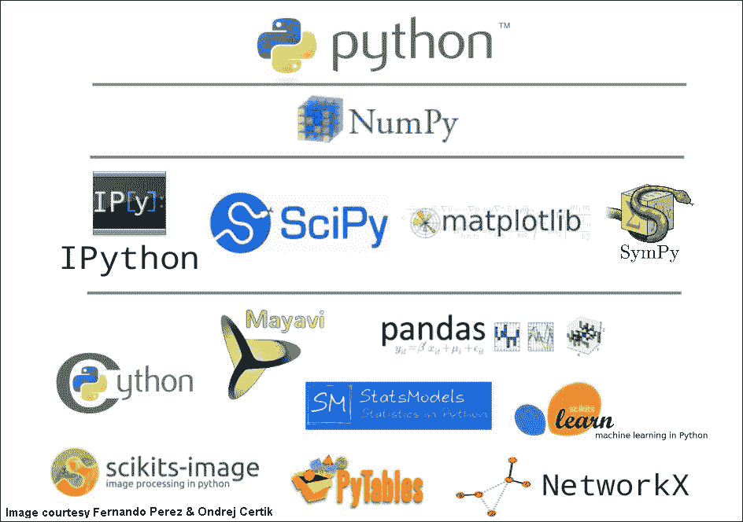

# 一、NumPy 简介

> “我宁愿使用通用语言进行数学运算，也不愿尝试使用数学语言进行通用编程。”
> 
> -- John D Cook

在过去的十年中，Python 已成为科学计算中最受欢迎的编程语言之一。 其成功的原因很多，随着您着手本书，这些原因将逐渐变得明显。 与许多其他数学语言（例如 MATLAB，R 和 Mathematica）不同，Python 是一种通用编程语言。 因此，它为构建科学应用程序并将其进一步扩展到任何商业或学术领域提供了合适的框架。 例如，考虑一个（某种）简单的应用程序，该应用程序要求您编写软件并预测博客文章的受欢迎程度。 通常，这些是您要执行此操作的步骤：

1.  生成博客文章及其相应评级的语料库（假设此处的评级可适当量化）。
2.  制定一个模型，该模型根据与博客文章相关的内容和其他数据生成评分。
3.  根据您在步骤 1 中找到的数据来训练模型。请继续进行此操作，直到您对模型的可靠性充满信心为止。
4.  将模型部署为 Web 服务。

通常，在执行这些步骤时，您会发现自己在不同的软件堆栈之间跳转。 第 1 步需要进行大量的网页抓取。 Web 抓取是一个非常普遍的问题，几乎每种编程语言都有一些工具可以抓取 Web（如果您已经在使用 Python，则可能会选择 BeautifulSoup 或 Scrapy）。 第 2 步和第 3 步涉及解决机器学习问题，并且需要使用复杂的数学语言或框架，例如 Weka 或 MATLAB，这只是提供机器学习功能的众多工具中的少数几种。 同样，步骤 4 可以使用许多不同的工具以多种方式实现。 没有一个正确的答案。 由于这个问题已经被许多科学家和软件开发人员充分研究和解决（在一定程度上），因此，找到可行的解决方案并不困难。 但是，诸如稳定性和可伸缩性之类的问题可能会严重限制您在问题的每个步骤中对编程语言，Web 框架或机器学习算法的选择。 这就是 Python 胜过大多数其他编程语言的地方。 前面的所有步骤（以及更多步骤）都只能使用 Python 和一些第三方 Python 库来完成。 这种使用 Python 开发软件的灵活性和便捷性正是使其成为科学计算生态系统的理想宿主。 在 *Ivan Idris* 所写的《Python 数据分析》中可以找到关于 Python 作为成熟的应用程序开发语言的非常有趣的解释。精确地讲，Python 是一种用于快速原型制作的语言，并且由于其随着时间的推移而获得了广泛的科学生态系统，它也被用于构建生产质量的软件。 这个生态系统的基础是 NumPy。

**数字 Python**（**NumPy**）是 Numeric 包的后续产品。 它最初由 Travis Oliphant 编写，是 Python 科学计算环境的基础。 它在 2005 年初从功能更广泛的 SciPy 模块分支出来，并于 2006 年中首次稳定发布。 从那以后，它在从事数学，科学和工程领域的 Python 爱好者中越来越受欢迎。 本书的目的是使您对 NumPy 足够熟悉，以便您能够使用它并使用它构建复杂的科学应用程序。

# 科学的 Python 堆栈

让我们首先简要浏览一下 **Python 科学计算**（**SciPy**）堆栈。

### 注意

请注意，SciPy 可能意味着很多事情：名为 [scipy](http://www.scipy.org/scipylib) 的 Python 模块，[整个 SciPy 栈](http://www.scipy.org/about.html)，或在世界各地举行的有关科学 Python 的三个会议中的任何一个。



Figure 1: The SciPy stack, standard, and extended libraries

IPython 的主要作者 Fernando Perez 在 2012 年加拿大 PyCon 的主题演讲中说：

> “科学计算的发展不仅仅是因为软件的发展，而且还因为我们作为科学家所做的不仅仅是浮点运算。”

这正是 SciPy 栈拥有如此丰富的功能的原因。 大多数 SciPy 栈的演进是由试图以通用编程语言解决科学和工程问题的科学家和工程师团队推动的。 对 NumPy 为什么如此重要的一个单方面的解释是，它提供了科学计算中大多数任务所必需的核心多维数组对象。 这就是为什么它是 SciPy 栈的根本原因。 NumPy 使用久经考验的科学库，提供了一种简单的方法来与遗留的 Fortran 和 C/C++ 数字代码对接，我们知道该库已经运行了数十年。 全世界的公司和实验室都使用 Python 将已经存在很长时间的遗留代码粘合在一起。 简而言之，这意味着 NumPy 允许我们站在巨人的肩膀上。 我们不必重新发明轮子。 这是每个其他 SciPy 软件包的依赖项。 NumPy `ndarray`对象实际上是下一章的主题，它是 Pythonic 接口，用于用 Fortran，C 和 C++ 编写的库所使用的数据结构。 实际上，NumPy `ndarray`对象使用的内部内存布局实现 C 和 Fortran 布局。 这将在以后的章节中详细讨论。

堆栈的下一层包括 SciPy，matplotlib，IPython（Python 的交互式外壳；我们将在整本书中将其用作示例，其安装和使用的详细信息将在后面的部分中提供）以及 SymPy 模块。 SciPy 提供了生态系统主要部分所依赖的大部分科学和数字功能。 Matplotlib 是 Python 中的事实绘图和数据可视化库。 IPython 是用于 Python 中科学计算的日益流行的交互式环境。 实际上，该项目已经进行了如此积极的开发并享有很高的知名度，以至于它不再局限于 Python，而且将其功能扩展到其他科学语言，尤其是 R 和 Julia。 堆栈中的这一层可以看作是 NumPy 的面向核心数组的功能与堆栈较高层提供的特定于域的抽象之间的桥梁。 这些特定于领域的工具通常称为 SciKits，受欢迎的工具包括 scikit-image（图像处理），scikit-learn（机器学习），statsmodels（统计信息），pandas（高级数据分析）等等。 由于科学的 Python 社区非常活跃，因此几乎不可能在 Python 中列出每个科学软件包，并且针对大量的科学问题总是有很多发展。 跟踪项目的最佳方法是参与社区。 加入邮件列表，编写代码，将软件用于日常计算需求并报告错误，这非常有用。 本书的目标之一是使您足够感兴趣，以积极地参与科学的 Python 社区。

# NumPy 数组的必要性

初学者提出的一个基本问题是。 为什么数组对于科学计算完全必要？ 当然，可以对任何抽象数据类型（如列表）执行复杂的数学运算。 答案在于数组的众多属性，这些属性使它们明显更有用。 在本节中，让我们看一下其中的一些属性，以强调为什么诸如 NumPy `ndarray`对象之类的东西根本不存在。

## 表示矩阵和向量

矩阵和向量的抽象数学概念是许多科学问题的核心。 数组为这些概念提供了直接的语义链接。 确实，每当一本数学文献提到矩阵时，就可以安全地将数组视为代表矩阵的软件抽象。 在科学文献中，`A[ij]`等表达式通常用于表示数组`A`的第`i`行和`j`列的元素。 NumPy 中的相应表达将简单地是`A[i, j]`。 对于矩阵运算，NumPy 数组还支持向量化（有关详细信息，请参见第 3 章，“使用 Numpy 数组”），这大大加快了执行速度。 向量化使代码更简洁，更易于阅读，并且更类似于数学符号。 像矩阵一样，数组也可以是多维的。 数组的每个元素都可以通过一组称为**索引**的整数来寻址，而使用整数集访问数组的元素的过程称为**索引**。 确实可以在不使用数组的情况下实现此功能，但这将很麻烦并且非常不必要。

## 效率

效率在软件中可能意味着很多事情。 该术语可用于指代程序的执行速度，其数据检索和存储性能，其内存开销（程序执行时消耗的内存）或其整体吞吐量。 就几乎所有这些特性而言，NumPy 数组都比大多数其他数据结构要好（只有少数例外，例如 pandas，`DataFrame`或 SciPy 的稀疏矩阵，我们将在后面的章节中介绍）。 由于 NumPy 数组是静态类型且同质的，因此可以用编译语言实现快速数学运算（默认实现使用 C 和 Fortran）。 效率（在同类数组上运行快速算法的可用性）使 NumPy 变得流行且重要。

## 易于开发

NumPy 模块是用于数学任务的现成功能的强大平台。 它极大地增加了 Python 的开发难度。 以下是该模块包含的内容的简要概述，我们将在本书中探讨其中的大部分内容。 有关 NumPy 模块的详细介绍，请参见 *Travis Oliphat* 所写的权威的《NumPy 指南》。 NumPy API 非常灵活，以至于科学 Python 社区已广泛采用它作为构建科学应用程序的标准 API。 可以参考 *Van Der Walt* 等人所写的《NumPy 数组：有效数值计算的结构》：

| **子模块** | **内容** |
| --- | --- |
| `numpy.core` | 基本对象 |
| `lib` | 其他工具 |
| `linalg` | 基本线性代数 |
| `fft` | 离散傅立叶变换 |
| `random` | 随机数生成器 |
| `distutils` | 增强的构建和发行版 |
| `testing` | 单元测试 |
| `f2py` | Fortran 代码的自动包装 |

# 学术界和工业界的 NumPy

有人说，如果您在时代广场站足够长的时间，就会遇到世界上每个人。 现在，您必须已经确信 NumPy 是 SciPy 的时代广场。 如果您使用 Python 编写科学应用程序，那么不需深入研究 NumPy，您将无能为力。 图 2 显示了不同抽象级别的科学计算中 SciPy 的范围。 红色箭头表示科学软件应具有的各种低级功能，蓝色箭头表示利用这些功能的不同应用程序领域。 配备 SciPy 栈的 Python 处于提供这些功能的语言的最前沿。

Google 学术搜索 NumPy 会返回近 6,280 个结果。 其中一些是有关 NumPy 和 SciPy 栈本身的论文和文章，还有许多是有关 NumPy 在各种研究问题中的应用的。 学者们喜欢 Python，SciPy 栈作为世界上无数大学和研究实验室中科学编程的主要语言越来越受欢迎，这说明了 Python。 许多科学家和软件专业人员的经验已发布在 Python 网站上：


Figure 2: Python versus other languages

# 书中使用的代码约定

现在，Python 和 NumPy 的信誉已经确立，让我们动手吧。

本书中所有 Python 代码使用的默认环境是 IPython。 下一节将介绍如何安装 IPython 和其他工具。 在整本书中，您只需在命令窗口或 IPython 提示符下输入输入即可。 除非另有说明，否则`code`将引用 Python 代码，`command`将引用 bash 或 DOS 命令。

所有 Python 输入代码都将按照以下代码段格式进行格式化：

```py
 In [42]: print("Hello, World!")
```

上一小段中的`In [42]:`表示这是第 42 个 IPython 会话输入。 同样，所有命令行输入的格式将如下：

```py
 $ python hello_world.py 
```

在 Windows 系统上，相同的命令如下所示：

```py
C:\Users\JohnDoe> python hello_world.py
```

为了保持一致，无论操作系统如何，`$`符号都将用于表示命令行提示符。 诸如`C:\Users\JohnDoe>`之类的提示将不会出现在书中。 通常，`$`符号表示 Unix 系统上的 bash 提示，但是相同的命令（无需键入实际的美元符号或任何其他字符）也可以在 Windows 上使用。 但是，如果您使用的是 Cygwin 或 Git Bash，则也应该能够在 Windows 上使用 Bash 命令。

请注意，如果您在 Windows 上安装 Git，则默认情况下 Git Bash 可用。

# 安装要求

让我们看一下在继续之前需要设置的各种要求。

## 使用 Python 发行版

本书所需的三个最重要的 Python 模块是 NumPy，IPython 和 matplotlib。 在本书中，代码基于 Python 3.4 / 2.7 兼容版本，NumPy 1.9 版本和 matplotlib 1.4.3。 安装这些要求（甚至更多）的最简单方法是安装完整的 Python 发行版，例如 Enthought Canopy，EPD，Anaconda 或 PythonXY。 一旦安装了其中任何一个，就可以安全地跳过本节的其余部分，并且应该可以开始了。

### 注意

面向 Canopy 用户的注意事项：可以使用 Canopy GUI，该 GUI 包括嵌入式 IPython 控制台，文本编辑器和 IPython Notebook 编辑器。 使用命令行时，为了获得最佳效果，请使用 Canopy 的“工具”菜单中的 **Canopy 终端**。

Windows OS 用户注意事项：除了 Python 发行版，您还可以从 [Ghristoph Gohlke 网站](http://www.lfd.uci.edu/~gohlke/pythonlibs/)安装预构建的 Windows python 扩展软件包。

## 使用 Python 包管理器

您还可以使用以下命令之一使用 Python 软件包管理器（例如 enpkg，Conda，PIP 或 EasyInstall）来安装需求。 将`numpy`替换为您要安装的其他任何软件包名称，例如`ipython`，`matplotlib`等：

```py
$ pip install numpy
$ easy_install numpy
$ enpkg numpy # for Canopy users
$ conda install numpy # for Anaconda users**

```

## 使用本机软件包管理器

如果要使用的 Python 解释器随操作系统一起提供，而不是第三方安装，则您可能更喜欢使用特定于操作系统的软件包管理器，例如 aptitude，yum 或 Homebrew。 下表说明了包管理器和用于安装 NumPy 的相应命令：

| **包管理器** | **命令** |
| --- | --- |
| `apt` | `$ sudo apt-get install python-numpy` |
| `yum` | `$ yum install python-numpy` |
| `brew` | `$ brew install numpy` |

请注意，在带有 Homebrew 的 OS X 系统上安装 NumPy（或任何其他 Python 模块）时，Python 最初应与 Homebrew 一起安装。

有关详细的安装说明，请参见 NumPy，IPython 和 matplotlib 的相应网站。 作为预防措施，要检查 NumPy 是否已正确安装，请打开 IPython 终端并键入以下命令：

```py
 In [1]: import numpy as np 
 In [2]: np.test()
```

如果第一个语句看起来什么也没做，则表明这是一个好兆头。 如果执行时没有任何输出，则表示已安装 NumPy 并将其正确导入到 Python 会话中。 第二条语句运行 NumPy 测试套件。 这不是绝对必要的，但永远不要太谨慎。 理想情况下，它应运行几分钟并产生测试结果。 它可能会生成一些警告，但是这些都不会引起警报。 如果您愿意，也可以运行 IPython 和 matplotlib 的测试套件。

### 注意

请注意，只有从源代码安装了 matplotlib 时，matplotlib 测试套件才能可靠运行。 但是，测试 matplotlib 并不是非常必要。 如果您可以导入 matplotlib 而没有任何错误，则表明它可以使用了。

恭喜你！ 我们现在准备开始。

# 总结

在本章中，我们向自己介绍了 NumPy 模块。 我们了解了 NumPy 是如何为从事科学计算工作的人们提供的有用软件工具。 我们安装了完成本书其余部分所需的软件。

在下一章中，我们将介绍功能强大的 NumPy `ndarray`对象，向您展示如何有效地使用它。