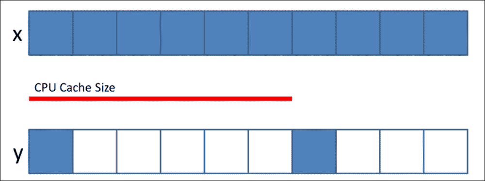
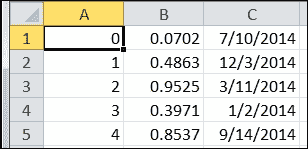

# 四、NumPy 核心和子模块

在上一章介绍了这么多 NumPy 函数之后，我希望您仍然记得 NumPy 的核心，即`ndarray`对象。 我们将完成`ndarray`的最后一个重要属性：步幅，它将为您提供完整的内存布局图。 另外，该向您展示 NumPy 数组不仅可以处理数字，还可以处理各种类型的数据； 我们将讨论记录数组和日期时间数组。 最后，我们将展示如何从文件中读取/写入 NumPy 数组，并开始使用 NumPy 进行一些实际的分析。

本章将涉及的主题是：

*   NumPy 数组的核心：内存布局
*   结构数组（记录数组）
*   NumPy 数组中的日期时间
*   NumPy 数组中的文件 I/O

# 步幅

步幅是 NumPy 数组中的索引方案，它指示要跳转以查找下一个元素的字节数。 我们都知道 NumPy 的性能改进来自具有固定大小项的同构多维数组对象`numpy.ndarray`对象。 我们已经讨论了`ndarray`对象的`shape`（维度），数据类型和顺序（C 风格的行主要索引数组和 Fortran 风格的列主要数组）。现在让我们仔细看看**步幅**。

让我们首先创建一个 NumPy 数组并更改其形状以查看步幅的差异。

1.  创建一个 NumPy 数组，看一下步幅：

    ```py
          In [1]: import numpy as np
          In [2]: x = np.arange(8, dtype = np.int8)
          In [3]: x
          Out[3]: array([0, 1, 2, 3, 4, 5, 6, 7])
          In [4]: x.strides
          Out[4]: (1,)
          In [5]: str(x.data)
          Out[5]: '\x00\x01\x02\x03\x04\x05\x06\x07'
    ```

    创建一维数组`x`，其数据类型为 NumPy 整数`8`，这意味着数组中的每个元素都是 8 位整数（每个 1 字节，总共 8 个字节）。 步幅表示遍历数组时在每个维度上步进的字节元组。 在上一个示例中，它是一个维度，因此我们将元组获得为`(1, )`。 每个元素与其前一个元素相距 1 个字节。 当我们打印出`x.data`时，我们可以获得指向数据开头的 Python 缓冲区对象，在示例中从`x01`到`x07`。

2.  更改形状并查看步幅变化：

    ```py
          In [6]: x.shape = 2, 4 
          In [7]: x 
          Out[7]: 
          array([[0, 1, 2, 3], 
                 [4, 5, 6, 7]], dtype=int8) 
          In [8]: x.strides 
          Out[8]: (4, 1) 
          In [9]: str(x.data) 
          Out[9]: '\x00\x01\x02\x03\x04\x05\x06\x07' 
          In [10]: x.shape = 1,4,2 
          In [11]: x.strides 
          Out[11]: (8, 2, 1) 
          In [12]: str(x.data) 
          Out[12]: '\x00\x01\x02\x03\x04\x05\x06\x07' 

    ```

    现在我们将`x`的尺寸更改为 2 乘以 4，然后再次检查步幅。 我们可以看到它变为`(4, 1)`，这意味着第一维中的元素相隔四个字节，并且数组需要跳转四个字节才能找到下一行，但是第二维中的元素仍相隔 1 个字节， 跳一个字节以查找下一列。 让我们再次打印出`x.data`，我们可以看到数据的内存布局保持不变，但是步幅改变了。 当我们将形状更改为三维时，会发生相同的行为：`1 x 4 x 2`数组。 （如果我们的数组是按照 Fortran 样式顺序构建的，会怎样？由于形状的变化，步幅将如何变化？尝试创建一个以列为主的数组，并执行相同的操作来检验这一点。）

3.  所以现在我们知道了什么是步幅，以及它与`ndarray`对象的关系，但是步幅如何改善我们的 NumPy 体验？ 让我们进行一些步幅操作以更好地理解这一点：两个数组的内容相同，但步幅却有所不同：

    ```py
          In [13]: x = np.ones((10000,)) 
          In [14]: y = np.ones((10000 * 100, ))[::100] 
          In [15]: x.shape, y.shape 
          Out[15]: ((10000,), (10000,)) 
          In [16]: x == y 
          Out[16]: array([ True,  True,  True, ...,  True,  True,
          True], dtype=bool) 

    ```

4.  我们创建两个 NumPy 数组`x`和`y`并进行比较； 我们可以看到两个数组相等。 它们具有相同的形状，所有元素都是一个，但是实际上这两个数组在内存布局方面是不同的。 让我们简单地使用您在第 2 章， “NumPy `ndarray`对象”中了解的`flags`属性来检查两个数组的内存布局。

    ```py
          In [17]: x.flags 
          Out[17]: C_CONTIGUOUS : True 
                   F_CONTIGUOUS : True 
                   OWNDATA : True 
                   WRITEABLE : True 
                   ALIGNED : True 
                   UPDATEIFCOPY : False 

          In [18]: y.flags 
          Out[18]: C_CONTIGUOUS : False 
                   F_CONTIGUOUS : False 
                   OWNDATA : False 
                   WRITEABLE : True 
                   ALIGNED : True 
                   UPDATEIFCOPY : False 

    ```

5.  我们可以看到`x`数组在 C 和 Fortran 顺序中都是连续的，而`y`则不是。 让我们检查一下步幅差异：

    ```py
          In [19]: x.strides, y.strides 
          Out[19]: ((8,), (800,)) 

    ```

    数组`x`是连续创建的，因此在同一维中，每个元素相隔八个字节（`numpy.ones`的默认`dtype`是 64 位浮点数）； 但是，`y`是由每 100 个元素`10000 * 100`的子集创建的，因此内存布局中的索引架构不是连续的。

6.  尽管`x`和`y`具有相同的形状，但`y`中的每个元素彼此相距 800 个字节。 使用 NumPy 数组`x`和`y`时，您可能不会注意到索引的差异，但是内存布局确实会影响性能。 让我们使用 IPython 中的`%timeit`函数进行检查：

    ```py
          In [18]: %timeit x.sum() 
          100000 loops, best of 3: 13.8 µs per loop 
          In [19]: %timeit y.sum() 
          10000 loops, best of 3: 25.9 µs per loop 

    ```

通常，在固定的高速缓存大小的情况下，当步幅大小变大时，命中率（在高速缓存中找到数据的内存访问量的百分比）相对较低，而未命中率（必须访问的内存访问量的百分比） 到内存）将会更高。 缓存命中时间和未命中时间构成了平均数据访问时间。 让我们尝试从缓存的角度再次来看我们的示例。 步幅较小的数组`x`快于`y`步幅较大的数组。 性能差异的原因是 CPU 将数据从主存储器分块地拉到其缓存中，步幅越小意味着需要的传输越少。 有关详细信息，请参见下图，其中红线表示 CPU 缓存的大小，蓝框表示包含数据的内存布局。

显然，如果同时需要`x`和`y`，则 100 个蓝色框的数据将减少`x`所需的缓存时间。



Cache and the x, y array in the memory layout

# 结构化数组

结构化数组或记录数组在执行计算时很有用，同时您可以将密切相关的数据保持在一起。 例如，当您处理事件数据并且每个事件都包含地理坐标和发生时间时，在计算最终结果时，您可以轻松地找到相关的地理位置和时间点以进行进一步的可视化。 NumPy 还提供了创建记录数组的强大功能，因为一个 NumPy 数组中存在多种数据类型。 但是，在 NumPy 中仍然需要遵守的一个原则是，每个字段中的数据类型（您可以将其视为记录中的列）需要是同质的。 以下是一些简单的示例，向您展示其工作方式：

```py
In [20]: x = np.empty((2,), dtype = ('i4,f4,a10')) 
In [21]: x[:] = [(1,0.5, 'NumPy'), (10,-0.5, 'Essential')] 
In [22]: x 
Out[22]: 
array([(1, 0.5, 'NumPy'), (10, -0.5, 'Essential')], 
      dtype=[('f0', '<i4'), ('f1', '<f4'), ('f2', 'S10')]) 

```

在上一个示例中，我们使用`numpy.empty()`创建了一个一维记录数组，并指定了元素的数据类型-第一个元素是`i4`（32 位整数，其中`i`代表有符号整数， `4`表示 4 个字节，例如`np.int32`），第二个元素是 32 位浮点数（`f`代表`float`也是 4 个字节），第三个元素是长度小于或等于 10 的字符串。我们按照指定的数据类型顺序将值分配给定义的数组。

您可以看到`x`的打印输出，该输出现在包含三种不同类型的记录，并且我们还在`dtype`中获得了默认字段名称：`f0`，`f1`和`f2`。 当然，您可以指定字段名称，如以下示例所示。

这里要注意的一件事是，我们使用了打印输出数据类型-`i4`和`f4`前面有一个`<`，而`<`代表字节顺序*大端*（指示内存地址增加顺序）：

```py
In [23]: x[0] 
Out[23]: (1, 0.5, 'NumPy') 
In [24]: x['f2'] 
Out[24]: 
array(['NumPy', 'Essential'], dtype='|S10') 

```

检索数据的方式保持不变，我们使用索引来获取记录，但是此外，我们可以使用字段名称来获取某些字段的值，因此在上一个示例中，我们使用`f2`来获取字符串字段。 在下面的示例中，我们将创建名为`y`的`x`视图，并查看其如何与原始记录数组交互：

```py
In [25]: y = x['f0'] 
In [26]: y 
Out[26]: array([ 1, 10]) 
In [27]: y[:] = y * 10 
In [28]: y 
Out[28]: array([ 10, 100]) 
In [29]: y[:] = y + 0.5 
In [30]: y 
Out[30]: array([ 10, 100]) 
In [31]: x 
Out[31]: 
array([(10, 0.5, 'NumPy'), (100, -0.5, 'Essential')], 
      dtype=[('f0', '<i4'), ('f1', '<f4'), ('f2', 'S10')]) 

```

这里`y`是`x`中字段`f0`的视图。 在记录数组中，NumPy 数组的特征仍然保留。 当您将标量 10 乘以时，它仍然适用于`y`的整个数组（广播规则），并且始终采用数据类型。 您可以在乘法之后看到，我们在`y`上添加了`0.5`，但是由于字段`f0`的数据类型是 32 位整数，结果仍然是`[10, 100]`。 另外，`y`是`x`中`f0`的视图，因此它们共享相同的内存块。 当我们在`y`中进行计算后打印出`x`时，我们发现`x`中的值也已更改。

在进一步介绍记录数组之前，让我们先整理一下如何定义记录数组。 最简单的方法如上一个示例所示，在该示例中，我们初始化 NumPy 数组，并使用字符串参数指定字段的数据类型。

NumPy 可以接受多种形式的字符串参数（有关详细信息，请参见[这里](http://docs.scipy.org/doc/numpy/user/basics.rec.html)； 最优选的可以选自以下之一：

| **数据类型** | **表示形式** |
| --- | --- |
| `b1` | 字节 |
| `i1`，`i2`，`i4`，`i8` | 1、2、4 和 8 个字节的带符号整数 |
| `u1`，`u2`，`u4`，`u8` | 1、2、4 和 8 个字节的无符号整数 |
| `f2`，`f4`，`f8` |  2、4 和 8 个字节的浮点数 |
| `c8`，`c16` | 8 和 16 个字节的复数 |
| `a<n>` | 长度为`n`的定长字符串 |

您也可以在字符串参数前面加上重复的数字或形状，以定义字段的维，但是在记录数组中，它仍仅被视为一个字段。 在下面的示例中，让我们尝试使用形状作为字符串参数的前缀：

```py
In [32]: z = np.ones((2,), dtype = ('3i4, (2,3)f4')) 
In [32]: z 
Out[32]: 
array([([1, 1, 1], [[1.0, 1.0, 1.0], [1.0, 1.0, 1.0]]), 
       ([1, 1, 1], [[1.0, 1.0, 1.0], [1.0, 1.0, 1.0]])], 
      dtype=[('f0', '<i4', (3,)), ('f1', '<f4', (2, 3))]) 

```

在前面的示例中，字段`f0`是尺寸为`3`的一维数组，`f1`是形状为`(2, 3)`的二维数组。 现在，我们很清楚记录数组的结构以及如何定义它。 您可能想知道默认字段名称是否可以更改为对您的分析有意义的名称？ 当然可以！ 这是这样的：

```py
In [33]: x.dtype.names 
Out[33]: ('f0', 'f1', 'f2') 
In [34]: x.dtype.names = ('id', 'value', 'note') 
In [35]: x 
Out[35]: 
array([(10, 0.5, 'NumPy'), (100, -0.5, 'Essential')], 
      dtype=[('id', '<i4'), ('value', '<f4'), ('note', 'S10')]) 

```

通过将新的字段名称分配回`dtype`对象中的名称属性，我们可以获得自定义的字段名称。 或者，您可以通过使用带有元组的列表或字典来初始化记录数组时执行此操作。 在以下示例中，我们将使用列表和字典来创建两个具有自定义字段名称的相同记录数组：

```py
In [36]: list_ex = np.zeros((2,), dtype = [('id', 'i4'), ('value', 'f4', (2,))]) 
In [37]: list_ex 
Out[37]: 
array([(0, [0.0, 0.0]), (0, [0.0, 0.0])], 
      dtype=[('id', '<i4'), ('value', '<f4', (2,))]) 
In [38]: dict_ex = np.zeros((2,), dtype = {'names':['id', 'value'], 'formats':['i4', '2f4']}) 
In [39]: dict_ex 
Out[39]: 
array([(0, [0.0, 0.0]), (0, [0.0, 0.0])], 
      dtype=[('id', '<i4'), ('value', '<f4', (2,))]) 

```

在列表示例中，我们为每个字段创建一个元组（字段名称，数据类型和形状）。 `shape`参数是可选的； 您也可以使用数据类型参数指定形状。 使用字典定义字段时，有两个必需的键（`names`和`formats`），每个键都有大小相等的值列表。

在继续下一节之前，我们将向您展示如何一次访问记录数组中的多个字段。 以下示例仍使用我们在自定义字段开头创建的数组`x`：`id`，`value`和`note`：

```py
In [40]: x[['id', 'note']] 
Out[40]: 
array([(10, 'NumPy'), (100, 'Essential')], 
      dtype=[('id', '<i4'), ('note', 'S10')]) 

```

您可能会发现此示例过于简单； 如果是这样，您可以尝试使用[来自维基百科的数据](https://en.wikipedia.org/wiki/List_of_countries_and_dependencies_by_population)从包含国家名称，人口和排名的真实示例创建一个新的记录数组。 这样会更有趣！

## NumPy 中的日期和时间

当您进行时间序列分析时，日期和时间很重要，从简单的事情（如在博物馆中累积每天的访客）到复杂的事情（如对犯罪预测的趋势回归）。 从 NumPy 1.7 开始，NumPy 核心支持日期时间类型（尽管它仍处于试验阶段，并且可能会发生变化）。 为了区别于 Python 中的`datetime`对象，数据类型称为`datetime64`。

本节将介绍`numpy.datetime64`的创建，时间增量算法以及单位与 Python 之间的转换`datetime`。 让我们使用 ISO 字符串创建一个`numpy.datetime64`对象：

```py
In [41]: x = np.datetime64('2015-04-01') 
In [42]: y = np.datetime64('2015-04') 
In [43]: x.dtype, y.dtype 
Out[43]: (dtype('<M8[D]'), dtype('<M8[M]')) 

```

`x`和`y`都是`numpy.datetime64`对象，并由 ISO 8601 字符串构造（通用日期格式-有关详细信息，请参见[这里](https://en.wikipedia.org/wiki/ISO_8601)。 但是`x`的输入字符串包含天单位，而`y`的字符串则没有。 创建 NumPy `datetime64`时，它将自动从输入字符串的形式中进行选择，因此当我们为`x`和`y`都打印出`dtype`时，我们可以看到`x`的单位为`D`。 ]代表几天，而`y`和单位`M`代表几个月。 `<`也是字节序，这里是大端，`M8`是`datetime64`的缩写（从`np.int64`实现）。 `numpy.datetime64`支持的默认日期单位是年（`Y`），月（`M`），周（`W`）和天（`D`），而时间单位是小时（`h`）。 ，分钟（`m`），秒（`s`）和毫秒（`ms`）。

当然，我们在创建数组时可以指定单位，也可以使用`numpy.arange()`方法创建数组的序列。 请参阅以下示例：

```py
In [44]: y = np.datetime64('2015-04', 'D') 
In [45]: y, y.dtype 
Out[45]: (numpy.datetime64('2015-04-01'), dtype('<M8[D]')) 
In [46]: x = np.arange('2015-01', '2015-04', dtype = 'datetime64[M]') 
In [47]: x 
Out[47]: array(['2015-01', '2015-02', '2015-03'], dtype='datetime64[M]') 

```

但是，当 ISO 字符串仅包含日期单位时，不允许指定时间单位。 将触发`TypeError`，因为日期单位和时间单位之间的转换需要选择时区和给定日期的特定时间：

```py
In [48]: y = np.datetime64('2015-04-01', 's') 
TypeError: Cannot parse "2015-04-01" as unit 's' using casting rule 'same_kind' 

```

接下来，我们将对两个`numpy.datetime64`数组进行减法运算，您将看到只要两个数组之间的日期/时间单位是可转换的，广播规则仍然有效。 我们使用先前创建的相同数组`x`，并为以下示例创建一个新的`y`：

```py
In [49]: x 
Out[49]: array(['2015-01', '2015-02', '2015-03'], dtype='datetime64[M]') 
In [50]: y = np.datetime64('2015-01-01') 
In [51]: x - y 
Out[51]: array([ 0, 31, 59], dtype='timedelta64[D]') 

```

有趣的是，`x`减去`y`的结果数组是`[0, 31, 59]`，而不是日期，并且`dtype`更改为`timedelta64[D]`。 由于 NumPy 的核心没有物理量系统，因此创建了`timedelta64`数据类型以补充`datetime64`。 在上一个示例中，`[0, 31, 59]`是`x`中每个元素中从`2015-01-01`开始的单位，单位是天（`D`）。 您也可以在`datetime64`和`timedelta64`之间进行算术运算，如以下示例所示：

```py
In [52]: np.datetime64('2015') + np.timedelta64(12, 'M') 
Out[52]: numpy.datetime64('2016-01') 
In [53]: np.timedelta64(1, 'W') / np.timedelta64(1, 'D') 
Out[53]: 7.0 

```

在本节的最后部分，我们将讨论`numpy.datetime64`和 Python `datetime`之间的转换。 尽管`datetime64`对象从 NumPy 数组继承了许多特征，但是使用 Python `datetime`对象（例如`date`和`year`属性，`isoformat`等）仍然有一些好处，反之亦然 。 例如，您可能具有`datetime`对象的列表，并且可能希望将其转换为用于算术或其他 NumPy 函数的`numpy.datetime64`。 在下面的示例中，我们将以两种方式将现有的`datetime64`数组`x`转换为 Python `datetime`列表：

```py
In [54]: x 
Out[54]: array(['2015-01', '2015-02', '2015-03'], dtype='datetime64[M]') 
In [55]: x.tolist() 
Out[55]: 
[datetime.date(2015, 1, 1), 
 datetime.date(2015, 2, 1), 
 datetime.date(2015, 3, 1)] 
In [56]: [element.item() for element in x] 
Out[56]: 
[datetime.date(2015, 1, 1), 
 datetime.date(2015, 2, 1), 
 datetime.date(2015, 3, 1)] 

```

我们可以看到带有`for`循环的`numpy.datetime64.tolist()`和`numpy.datetime64.item()`可以实现相同的目标，即将数组转换为 Python `datetime`对象的列表。 但是不用说，我们都知道哪种方法更适合进行转换（如果您不知道答案，请快速浏览第 3 章，“使用 Numpy 数组”。）另一方面，如果您已经有了 Python `datetime`的列表，并想将其转换为 NumPy `datetime64`数组，则只需使用`numpy.array()`函数。

## 文件 I/O 和 NumPy

现在我们可以执行 NumPy 数组计算和操作，并且知道如何构造记录数组，现在是时候进行一些实际的分析了，方法是将文件读入 NumPy 数组并将结果数组输出到文件中以进行进一步的分析。

我们应该谈论先读取文件然后导出文件。 但是现在，我们将逆转此过程，先创建一个记录数组，然后将其输出到 CSV 文件。 我们将导出的 CSV 文件读入 NumPy 记录数组，并将其与原始记录数组进行比较。 我们将要创建的样本数组将包含一个带有连续整数的`id`字段，一个包含随机浮点数的`value`字段和一个带有`numpy.datetime64['D']`的`date`字段。 本练习将使用您从前面的章节中获得的所有知识。 让我们开始创建记录数组：

```py
In [57]: id = np.arange(1000) 
In [58]: value = np.random.random(1000) 
In [59]: day = np.random.random_integers(0, 365, 1000) * np.timedelta64(1,'D') 
In [60]: date = np.datetime64('2014-01-01') + day 
In [61]: rec_array = np.core.records.fromarrays([id, value, date], names='id, value, date', formats='i4, f4, a10') 
In [62]: rec_array[:5] 
Out[62]: 
rec.array([(0, 0.07019801437854767, '2014-07-10'), 
       (1, 0.4863224923610687, '2014-12-03'), 
       (2, 0.9525277614593506, '2014-03-11'), 
       (3, 0.39706873893737793, '2014-01-02'), 
       (4, 0.8536589741706848, '2014-09-14')], 
      dtype=[('id', '<i4'), ('value', '<f4'), ('date', 'S10')]) 

```

我们首先创建代表所需字段的三个 NumPy 数组：`id`，`value`和`date`。 创建`date`字段时，我们将`numpy.datetime64`与大小为`1000`的随机 NumPy 数组结合使用，以模拟从`2014-01-01`到`2014-12-31`范围内的随机日期（365 天）。

然后我们使用`numpy.core.records.fromarrays()`函数将三个数组合并为一个记录数组，并分配`names`（字段名称）和`formats`（数据类型）。 这里要注意的一件事是，记录数组不支持`numpy.datetime64`对象，因此我们将其作为长度为 10 的日期/时间字符串存储在数组中。

如果您使用的是 Python 3，则会在记录数组（例如`b'2014-09-25'`）的日期/时间字符串的前面找到前缀`b`。 `b`在这里代表“字节字面值”，这意味着它仅包含 ASCII 字符（Python 3 中的所有字符串类型均为 Unicode，这是 Python 2 和 3 之间的一大变化）。 因此，在 Python 3 中，将对象（`datetime64`）转换为字符串将添加前缀以区分普通字符串类型。 但是，这不会影响下一步将记录数组导出到 CSV 文件中的操作：

```py
In [63]: np.savetxt('./record.csv', rec_array, fmt='%i,%.4f,%s') 

```

我们使用`numpy.savetxt()`函数来处理导出，并使用`fmt`参数将第一个参数指定为导出文件的位置，数组名称和格式。 我们有三个具有三种不同数据类型的字段，我们想在 CSV 文件的每个字段之间添加`,`。 如果您更喜欢其他定界符，请在`fmt`参数中替换逗号。 我们还消除了`value`字段中的冗余数字，因此我们使用`%.4f`仅在文件的小数点后指定四位数字。 现在，您可以转到我们在第一个参数中指定的文件位置，以检查 CSV 文件。 在电子表格软件程序中将其打开，您将看到以下内容：



接下来，我们将 CSV 文件读取到记录数组中，并使用`value`字段生成一个名为`mask`的掩码字段，该掩码字段表示一个大于或等于 0.75 的值。 然后，我们将新的`mask`字段追加到记录数组。 让我们先阅读 CSV 文件：

```py
In [64]: read_array = np.genfromtxt('./record.csv', dtype='i4,f4,a10', delimiter=',', skip_header=0) 
In [65]: read_array[:5] 
Out[65]: 
array([(0, 0.07020000368356705, '2014-07-10'), 
       (1, 0.486299991607666, '2014-12-03'), 
       (2, 0.9524999856948853, '2014-03-11'), 
       (3, 0.3971000015735626, '2014-01-02'), 
       (4, 0.8536999821662903, '2014-09-14')], 
      dtype=[('f0', '<i4'), ('f1', '<f4'), ('f2', 'S10')]) 

```

我们使用`numpy.genfromtxt()`将文件读入 NumPy 记录数组。 第一个参数仍然是我们要访问的文件位置，`dtype`参数是可选的。 如果未指定，NumPy 将使用各列的内容分别确定`dtype`参数。 由于我们清楚地了解数据，因此建议您在每次读取文件时指定一次。

`delimiter`参数也是可选的，默认情况下，任何连续的空格都用作分隔符。 但是，对于 CSV 文件，我们使用了`,`。 我们在方法中使用的最后一个可选参数是`skip_header`。 尽管我们没有在文件中的记录顶部添加字段名称，但是 NumPy 提供了跳过文件开头多行的功能。

除了`skip_header`之外，`numpy.genfromtext()`函数还支持 22 种以上的操作参数以微调数组，例如定义缺失值和填充值。 有关更多详细信息，请参阅[这里](http://docs.scipy.org/doc/numpy-1.10.0/reference/generated/numpy.genfromtxt.html)。

现在将数据读到记录数组中，您将发现第二个字段是小数点后四位数以上，这是我们在导出 CSV 时指定的。 这样做的原因是因为我们在读取时使用`f4`作为其数据类型。NumPy 将填充空数字，但有效的四位数字与文件中的数字相同。 您可能还会注意到我们丢失了字段名，因此让我们指定它：

```py
In [66]: read_array.dtype.names = ('id', 'value', 'date') 

```

本练习的最后一部分是创建一个基于`value`字段的值大于或等于`0.75`的掩码变量。 我们将新的掩码数组作为新列附加到`read_array`中：

```py
In [68]: mask = read_array['value'] >= 0.75 
In [69]: from numpy.lib.recfunctions import append_fields 
In [70]: read_array = append_fields(read_array, 'mask', data=mask, dtypes='i1') 
In [71]: read_array[:5] 
Out[71]: 
masked_array(data = [(0, 0.07020000368356705, '2014-07-10', 0) 
 (1, 0.486299991607666, '2014-12-03', 0)

 (2, 0.9524999856948853, '2014-03-11', 1) 
 (3, 0.3971000015735626, '2014-01-02', 0) 
dtype = [('id', '<i4'), ('value', '<f4'), ('date', 'S10'), ('mask','i1')]) 

```

仅当直接导入`numpy.lib.recfunctions`且模块中具有`append_field()`功能时，才能访问它。 追加一个记录数组就像追加一个 NumPy 数组一样简单：第一个参数是基本数组；第二个参数是基本数组。 第二个参数是新字段名称`mask`以及与之关联的数据; 最后一个参数是数据类型。 由于掩码是布尔数组，因此 NumPy 会自动将掩码应用于记录数组，但是我们仍然可以看到在`read_array`中添加了一个新字段，掩码的值反映了阈值（`>= 0.75`） `value`字段。 这只是向您展示如何将 NumPy 数组与数据文件连接的开始。 现在是时候对您的数据进行一些真实的分析了！

# 总结

在本章中，我们介绍了`ndarray`对象的最后一个重要组成部分：步幅。 当您使用不同的方式初始化 NumPy 数组时，我们看到了内存布局和性能上的巨大差异。 我们还了解了记录数组（结构化数组）以及如何在 NumPy 中操纵日期/时间。 最重要的是，我们看到了如何使用 NumPy 读写数据。

NumPy 的强大功能不仅在于其性能或功能，还在于它使分析变得如此容易。 尽可能多地将 NumPy 与您的数据一起使用！

接下来，我们将研究使用 NumPy 进行线性代数和矩阵计算。