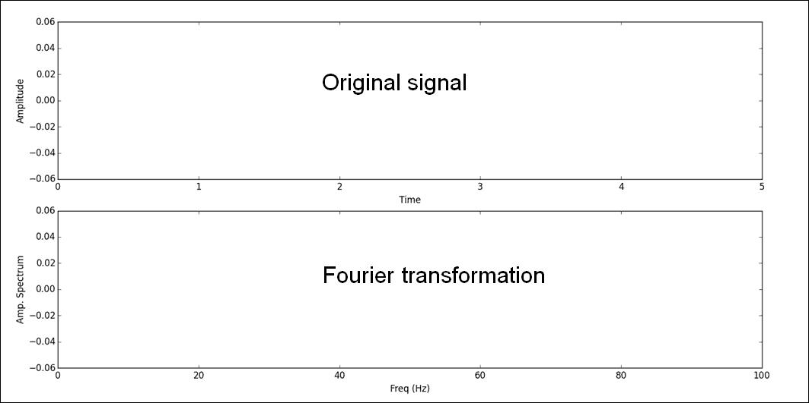
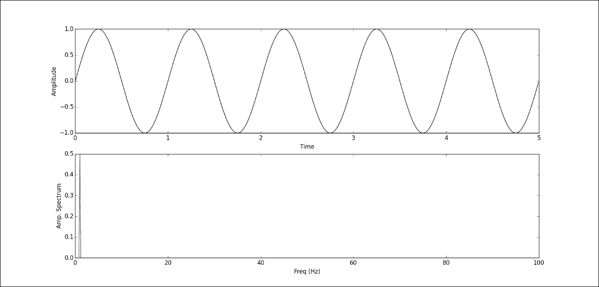
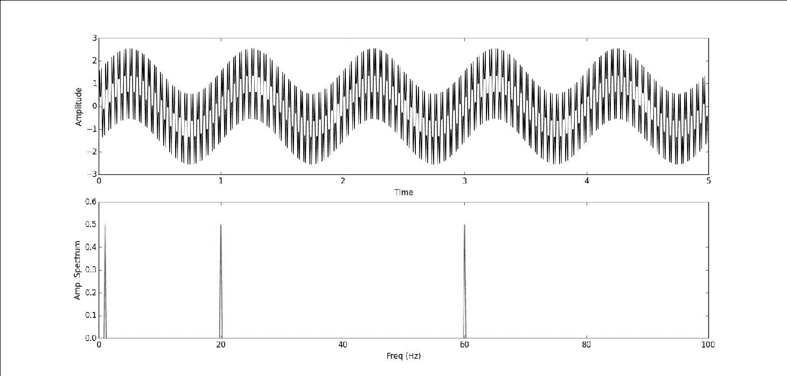
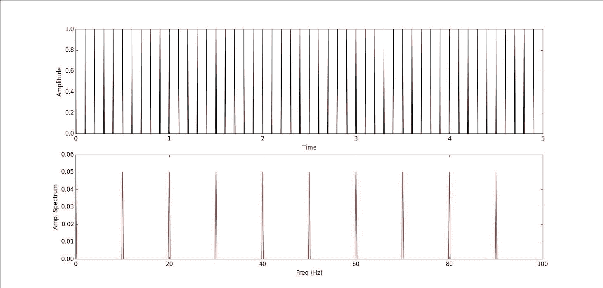
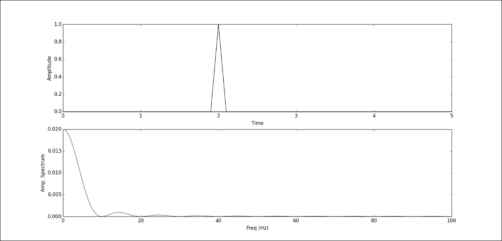
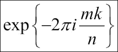
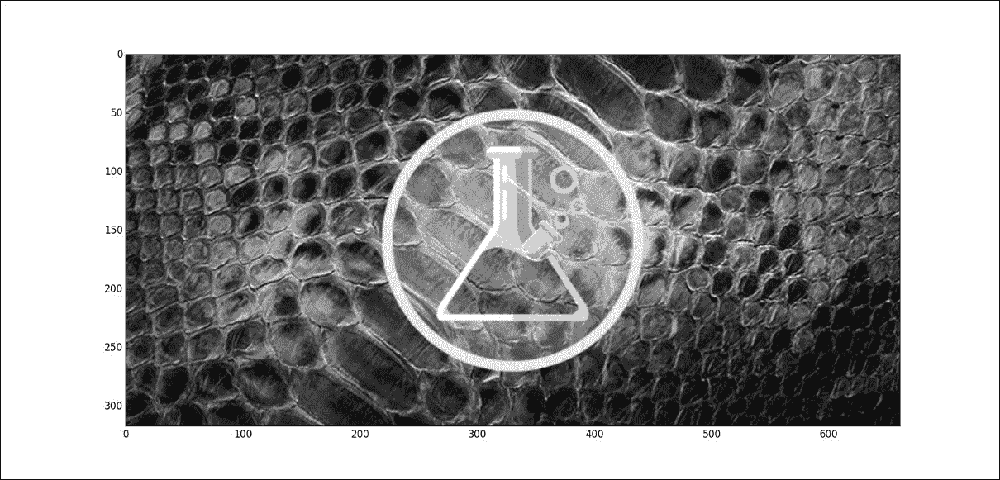
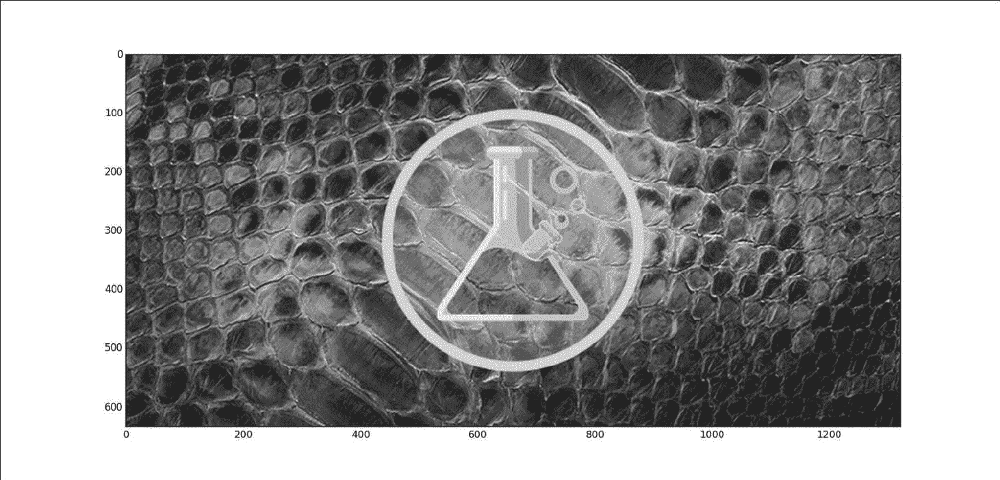

# 六、NumPy 中的傅立叶分析

除其他事项外，傅立叶分析通常用于数字信号处理。 这要归功于它在将输入信号（时域）分离为以离散频率（频域）起作用的分量方面如此强大。 开发了另一种快速算法来计算**离散傅里叶变换**（**DFT**），这就是众所周知的**快速傅里叶变换**（**FFT**），它为分析及其应用提供了更多可能性。 NumPy 针对数字计算，也支持 FFT。 让我们尝试使用 NumPy 在应用上进行一些傅立叶分析！ 注意，本章假定不熟悉信号处理或傅立叶方法。

本章将涉及的主题是：

*   傅立叶分析的基础
*   一维和二维傅立叶变换
*   频谱密度估计
*   时频分析

## 开始之前

众所周知，傅里叶分析将函数表示为周期分量的总和（正弦和余弦函数的组合），并且这些分量能够恢复原始函数。 它在数字信号处理（例如滤波，插值等）中具有广泛的应用，因此我们在不提供 NumPy 的任何应用细节的情况下就不想谈论 NumPy 中的傅立叶分析。 为此，我们需要一个可视化的模块。

Matplotlib 是我们将在本章中使用的可视化模块。 [请从官方网站下载并安装它](http://matplotlib.org/downloads.html)。 或者，如果您正在使用 Anaconda 之类的 Scientific Python 发行版，则应该已经包括了 matplotlib。

我们将编写一个名为`show()`的简单显示函数，以帮助我们了解本章中的练习示例。 函数输出如下图所示：



上图显示原始函数（信号），下图显示傅立叶变换。 请在 IPython 命令提示符下键入以下代码，或将其保存到`.py`文件并将其加载到提示符：

```py
##### The Plotting Functions ####import matplotlib.pyplot as plt 
import numpy as np 
def show(ori_func, ft, sampling_period = 5): 
    n = len(ori_func) 
    interval = sampling_period / n 
    plt.subplot(2, 1, 1) 
    plt.plot(np.arange(0, sampling_period, interval), ori_func, 'black') 
    plt.xlabel('Time'), plt.ylabel('Amplitude') 
    plt.subplot(2,1,2) 
    frequency = np.arange(n / 2) / (n * interval) 
    nfft = abs(ft[range(int(n / 2))] / n ) 
    plt.plot(frequency, nfft, 'red') 
    plt.xlabel('Freq (Hz)'), plt.ylabel('Amp. Spectrum') 
    plt.show() 

```

这是一个名为`show()`的显示函数，它具有两个输入参数：第一个是原始信号函数（`ori_func`），第二个是其傅里叶变换（`ft`）。 此方法将使用`matplotlib.pyplot`模块创建两个折线图：顶部带有黑线的原始信号，其中 *x* 轴表示时间间隔（在我们所有的示例中，我们设置了默认值，信号采样周期为 5 秒）， *y* 轴代表信号的幅度。 图表的下部是带有红线的傅里叶变换，其中 *x* 轴表示频率， *y* 轴代表振幅频谱。

在下一节中，我们将简单地介绍不同类型的信号波，并使用`numpy.fft`模块计算傅立叶变换。 然后我们调用`show()`函数以提供它们之间的视觉比较。

## 信号处理

在本节中，我们将使用 NumPy 函数来模拟多个信号函数并将其转换为傅立叶变换。 我们将重点介绍`numpy.fft`及其相关函数。 我们希望在本节之后，您将对在 NumPy 中使用傅立叶变换有所了解。 理论部分将在下一部分中介绍。

我们要使用的第一个示例是心跳信号，它是一系列正弦波。 频率为每分钟 60 次（1Hz），我们的采样周期为 5 秒长，采样间隔为 0.005 秒。 首先创建正弦波：

```py
In [1]: time = np.arange(0, 5, .005) 
In [2]: x = np.sin(2 * np.pi * 1 * time) 
In [3]: y = np.fft.fft(x) 
In [4]: show(x, y) 

```

在此示例中，我们首先创建了采样时间间隔并将其保存到名为`time`的`ndarray`中。 然后，我们将`time`数组乘以`2π`并将其频率设为 1Hz 传递给`numpy.sin()`方法，以创建正弦波（`x`）。 然后将傅立叶变换应用于`x`并将其保存到`y`。 最后，我们使用预定义的方法`show()`与正弦波及其归一化的 Fourier 变换进行视觉比较，如下图所示：



上方的绿线代表心跳波； 因为我们使用 1Hz 持续 5 秒钟，所以获得了 5 个连续的正弦波。 这里要注意的一件事是，我们的采样间隔为 0.005 秒，这意味着我们使用 200 点（`1 / 0.005`）来模拟一个波形，因此它看起来相对平滑。 如果增加采样间隔（减少每个波的点数），我们将获得更强烈的正弦波。 图表的下部是基于频率（所谓的频谱）的标准化傅里叶变换的绝对值。 我们可以看到在 1Hz 处有一个高点，与我们的原始波频率相匹配。

接下来，我们将尝试计算多频正弦波并对其傅里叶变换进行计算。 在此之后，我们可能对傅立叶变换有了更清晰的了解。 以下代码显示了如何执行此操作：

```py
In [8]: x2 = np.sin(2 * np.pi * 20 * time) 
In [9]: x3 = np.sin(2 * np.pi * 60 * time) 
In [10]: x += x2 + x3 
In [11]: y = np.fft.fft(x) 
In [12]: show(x, y) 

```

首先，我们再创建两个频率不同的正弦波，频率为 20Hz 的`x2`和 60Hz 的`x3`，然后将它们添加到原始的 1Hz 正弦波`x`中。 然后我们将修改后的`x`传递给傅立叶变换，并使用预定义的`show()`绘制图形。 您可以在下图中看到它：



在上方的绿色折线图中，我们可以看到正弦波组合了不同的频率，但实际上很难区分它们。 但是，在计算傅立叶变换并将其转换到频域之后，我们可以在下部的红色折线图中清楚地看到已识别出三个高点，分别是 1Hz，20Hz 和 60Hz。 这与我们原始的正弦波频率匹配。

从这两个示例中，您必须能够对傅立叶变换有所了解。 接下来，我们将演示另外三种信号处理：一种用于正方形信号，一种用于脉冲，另一种用于随机信号。

首先，我们使用`numpy.zeros()`以相同的时间间隔（`time`）创建方波信号。 我们希望方波频率为 10Hz，幅度为 1，因此我们将每 20 个时间间隔（`200/10`）设置为值 1，来模拟波浪并将其传递给傅立叶变换，如下面的代码块所示：

```py
In [13]: x = np.zeros(len(time)) 
In [14]: x[::20] = 1 
In [15]: y = np.fft.fft(x) 
In [16]: show(x, y) 

```

此代码生成以下图形：



从上方的绿色折线图中，我们可以在 5 秒（10Hz）中看到 50 个连续的方波，但是当我们计算其傅立叶变换时，我们在频谱中获得了几个红色的高点，而不是 10Hz 时的一个红色高点。 您可能想知道方波是否也是周期函数，但是傅立叶变换为什么与正弦波有很大不同？ 请记住，傅立叶变换将时域转换为频域，但是在引擎盖下，有一系列正弦和余弦函数可以分解原始函数。 我们仍然可以看到红色的高点是规则间隔的，间隔为 10Hz。

接下来，我们将生成一个没有任何频率的单脉冲信号，并且将要计算其傅立叶变换。 将其与以前的方波进行比较，您可能会对傅里叶变换有更好的了解：

```py
In [17]: x = np.zeros(len(time)) 
In [18]: x[380:400] = np.arange(0, 1, .05) 
In [19]: x[400:420] = np.arange(1, 0, -.05) 
In [20]: y = np.fft.fft(x) 
In [21]: show(x, y) 

```

首先我们创建一个与时间变量大小相同的全零`ndarray`，然后生成一个单脉冲信号，该信号在 2 秒时发生（`x`数组的第 400 个元素 ）。 我们在 2 秒左右的时间内占用了 40 个元素来模拟脉冲：20 个元素从 0 增加到 1，另一半从 1 减少到 0。我们将一个脉冲信号传递给傅里叶变换，并使用`show()`进行视觉比较。

下图中上部的绿色折线图是我们模拟的一脉冲信号，下部的红色折线图是其傅里叶变换。 我们可以看到下面图表中的最高点出现在等于 0 的频率上，这很有意义，因为我们的模拟信号没有任何频率。 但是，在零频率之后，我们仍然可以看到来自变换过程的两个不同频率的高点。



本节的最后一个示例是随机信号处理。 与前面的示例一样，我们还将 5 秒作为 100 个随机信号的总采样周期，该随机信号没有任何固定的频率与之关联。 然后，我们将随机信号传递给傅立叶变换，以获得其频域。 代码块如下：

```py
In [22]: x = np.random.random(100) 
In [23]: y = np.fft.fft(x) 
In [24]: show(x, y) 

```

以下是由代码生成的图形：


看完这些示例之后，我们知道如何在 NumPy（简称为`numpy.fft.fft()`）中使用傅立叶变换-并且对傅立叶变换的外观有了一些了解。 在下一节中，我们将重点介绍理论部分。

## 傅立叶分析

定义 DFT 的方法很多。 但是，在 NumPy 实现中，DFT 定义为以下公式：


`A[k]`代表离散傅里叶变换，`a[m]`代表原始函数。 `a[m] -> A[k]`的转换是从配置空间到频率空间的转换。 让我们手动计算此方程，以更好地了解转换过程。 我们将使用具有 500 个值的随机信号：

```py
In [25]: x = np.random.random(500) 
In [26]: n = len(x) 
In [27]: m = np.arange(n) 
In [28]: k = m.reshape((n, 1)) 
In [29]: M = np.exp(-2j * np.pi * k * m / n) 
In [30]: y = np.dot(M, x) 

```

在此代码块中，`x`是我们的模拟随机信号，其中包含 500 个值，并且在公式中对应于`a[m]`。 根据`x`的大小，我们计算出：



然后将其保存到`M`。 最后一步是使用`M`和`x`之间的矩阵乘法来生成 DFT 并将其保存到`y`中。

让我们通过将其与内置`numpy.fft`进行比较来验证结果：

```py
In [31]: np.allclose(y, np.fft.fft(x)) 
Out[31]: True 

```

如我们所料，手动计算的 DFT 与 NumPy 内置模块相同。 当然，`numpy.fft`就像 NumPy 中的任何其他内置模块一样-已经过优化，并且已应用 FFT 算法。 让我们比较一下我们的手动 DFT 和`numpy.fft`的性能：

```py
In [32]: %timeit np.dot(np.exp(-2j * np.pi * np.arange(n).reshape((n, 1)) * np.arange(n) / n), x) 
10 loops, best of 3: 18.5 ms per loop 
In [33]: %timeit np.fft.fft(x) 
100000 loops, best of 3: 10.9 µs per loop 

```

首先，我们将此方程式实现代码放在一行上，以测量执行时间。 我们可以看到它们之间的巨大性能差异。 在引擎盖下，NumPy 使用`FFTPACK`库执行傅立叶变换，该傅立叶变换在性能和准确性上都是非常稳定的库。

#### 提示

如果您仍然觉得`FFTPACK`不够快，通常有一个`FFTW`库的性能要比`FFTPACK`好，但是从`FFTPACK`到`FFTW`的加速将不会那么快。

接下来，我们将计算逆 DFT。 iDFT 将频率序列映射回原始时间序列，该序列由以下公式定义：


我们可以看到反方程与 DFT 方程的不同之处在于指数参数的符号和通过`1 / n`进行归一化。 让我们再次进行手动计算。 由于指数参数的符号更改，我们可以重复使用先前代码中的`m`，`k`和`n`变量，只需重新计算`M`：

```py
In [34]: M2 = np.exp(2j * np.pi * k * m / n) 
In [35]: x2 = np.dot(y, M2) / n 

```

再次，让我们用原始随机信号`x`验证计算出的逆 DFT 结果`x2`。 两者`ndarray`应该相同：

```py
In [36]: np.allclose(x, x2) 
Out[36]: True 

```

当然，`numpy.fft`模块还支持逆 DFT 调用`numpy.fft.ifft()`以执行计算，如以下示例所示：

```py
In [37]: np.allclose(x, np.fft.ifft(y)) 
Out[37]: True 

```

您可能会注意到，在前面的示例中，我们始终使用一维数组作为输入信号。 这是否意味着`numpy.fft`仅处理一维数据？ 当然不是; `numpy.fft`也可以处理二维或多维数据。 在开始这一部分之前，我们想谈谈返回的 FFT 数组的顺序和`numpy.fft`中的`shift`方法。

让我们创建一个包含 10 个随机整数的简单信号数组，并计算其傅里叶变换：

```py
In [38]: a = np.random.randint(10, size = 10) 
In [39]: a 
Out[39]: array([7, 4, 9, 9, 6, 9, 2, 6, 8, 3]) 
In [40]: a.mean() 
Out[40]: 6.2999999999999998 
In [41]: A = np.fft.fft(a) 
In [42]: A 
Out[42]: 
array([ 63.00000000 +0.00000000e+00j,   
        -2.19098301 -6.74315233e+00j, 
        -5.25328890 +4.02874005e+00j, 
        -3.30901699 -2.40414157e+00j, 
        13.75328890 -1.38757276e-01j,    
      1.00000000 -2.44249065e-15j, 
        13.75328890 +1.38757276e-01j, 
     -3.30901699 +2.40414157e+00j, 
        -5.25328890 -4.02874005e+00j, 
     -2.19098301 +6.74315233e+00j]) 
In [43]: A[0] / 10 
Out[43]: (6.2999999999999998+0j) 
In [44]: A[int(10 / 2)] 
Out[44]: (1-2.4424906541753444e-15j) 

```

在此示例中，`a`是我们的原始随机信号，`A`是`a`的傅立叶变换。 当我们调用`numpy.fft.fft(a)`时，结果`ndarray`遵循“标准”顺序，其中第一个值`A[0]`包含零频率项（信号的均值）。 进行归一化处理（将其除以原始信号数组的长度`A[0] / 10`)时，我们得到的值与计算信号数组的平均值（`a.mean()`）时的值相同。

然后`A[1:n/2]`包含正频率项，`A[n/2 + 1: n]`包含负频率项。 在我们的示例中，当输入为偶数时，`A[n/2]`代表正数和负数。 如果要将零频率分量移到频谱中心，可以使用`numpy.fft.fftshift()` 例程。 请参见以下示例：

```py
In [45]: np.fft.fftshift(A) 
Out[45]: 
array([  1.00000000 -2.44249065e-15j,   
     13.75328890 +1.38757276e-01j, 
        -3.30901699 +2.40414157e+00j, 
        -5.25328890 -4.02874005e+00j, 
        -2.19098301 +6.74315233e+00j, 
        63.00000000 +0.00000000e+00j, 
        -2.19098301 -6.74315233e+00j, 
     -5.25328890 +4.02874005e+00j, 
        -3.30901699 -2.40414157e+00j,   
     13.75328890 -1.38757276e-01j]) 

```

从此示例中，您可以看到`numpy.fft.fftshift()`交换了数组中的半空间，因此零频率分量移到了中间。 `numpy.fft.ifftshift`是反函数，将顺序移回“标准”。

现在，我们要谈谈多维 DFT。 让我们从二维开始。 您可能会看到以下等式与一维 DFT 非常相似，而第二维以明显的方式扩展。 多维 DFT 的思想是相同的，较高维中的逆函数也是如此。 您也可以尝试修改先前的代码，以将一维 DFT 计算为二维或多维 DFT，以更好地理解过程。 但是，现在我们仅要演示如何将`numpy.fft`用于二维和多维傅里叶变换：


```py
In [46]: x = np.random.random(24) 
In [47]: x.shape = 2,12 
In [48]: y2 = np.fft.fft2(x) 
In [49]: x.shape = 1,2,12 
In [50]: y3 = np.fft.fftn(x, axes = (1, 2)) 

```

从这些示例中，您可以看到我们将`numpy.fft.fft2()`用于二维傅立叶变换，将`numpy.fft.fftn()`称为多维。 `axes`参数是可选的； 它指示要计算 FFT 的轴。 对于二维，如果未指定轴，则使用最后两个轴。 对于多维，模块使用所有轴。 在前面的示例中，我们仅应用了最后两个轴，因此傅立叶变换结果将与二维轴相同。 让我们来看看：

```py
In [51]: np.allclose(y2, y3) 
Out[51]: True 

```

## 傅立叶变换应用

在前面的部分中，您学习了如何将`numpy.fft`用于一个一维和多维`ndarray`，并在幕后了解了实现细节。 现在是一些应用的时候了。 在本节中，我们将使用傅立叶变换进行一些图像处理。 我们将分析频谱，然后对图像进行插值以将其放大到两倍大小。 首先，[让我们从 Packt Publishing 网站博客文章中下载练习图像](https://www.packtpub.com/books/content/python-data-scientists)。 将映像另存为本地目录`scientist.png`。


这是 RGB 图像，这意味着，当我们将其转换为`ndarray`时，它将是三维的。 为了简化练习，我们使用`matplotlib`中的图像模块读取图像并将其转换为灰度：

```py
In [52]: from matplotlib import image 
In [53]: img = image.imread('./scientist.png') 
In [54]: gray_img = np.dot(img[:,:,:3], [.21, .72, .07]) 
In [55]: gray_img.shape 
Out[55]: (317L, 661L) 
In [56]: plt.imshow(gray_img, cmap = plt.get_cmap('gray')) 
Out[56]: <matplotlib.image.AxesImage at 0xa6165c0> 
In [57]: plt.show() 

```

您将得到以下图像作为结果：



预处理部分完成。 我们将图像读取到三维`ndarray`（`img`）中，并应用[亮度]公式使用`0.21R + 0.72G + 0.07B`将 RGB 图像转换为灰度图像 。 我们使用`matplotlib`中的`pyplot`模块显示灰度图像。 这里我们在图中未应用任何轴标签，但是从轴比例可以看到`ndarray gray_img`代表`317 x 661`像素的图像。

接下来，我们将进行傅立叶变换并显示频谱：

```py
In [58]: fft = np.fft.fft2(gray_img) 
In [59]: amp_spectrum = np.abs(fft) 
In [60]: plt.imshow(np.log(amp_spectrum)) 
Out[60]: <matplotlib.image.AxesImage at 0xcdeff60> 
In [61]: plt.show() 

```

此代码将给出以下输出：


首先，我们对`gray_img`使用二维傅立叶变换，并使用对数刻度色图绘制幅度谱。 我们可以看到，由于零频率分量，拐角有所不同。 请记住，当我们使用`numpy.fft.fft2()`时，该顺序遵循*标准*的顺序，并且我们希望将零频分量置于中心。 因此，让我们使用`shift`例程：

```py
In [62]: fft_shift = np.fft.fftshift(fft) 
In [63]: plt.imshow(np.log(np.abs(fft_shift))) 
Out[63]: <matplotlib.image.AxesImage at 0xd201dd8> 
In [64]: plt.show() 

```

这会将图像更改为：


现在我们可以看到零频率分量位于中心。 让我们转到本练习的最后一步：对图像进行插值以扩大尺寸。 我们在这里使用的技术非常简单。 我们将零频率插值到`fft_shift`数组中，并使它变成两倍大小。 然后我们将`fft_shift`逆转为标准阶数，并进行另一次逆转换回到原始域：

```py
In [65]: m, n = fft_shift.shape 
In [66]: b = np.zeros((int(m / 2), n)) 
In [67]: c = np.zeros((2 * m - 1, int(n / 2))) 
In [68]: fft_shift = np.concatenate((b, fft_shift, b), axis = 0) 
In [69]: fft_shift = np.concatenate((c, fft_shift, c), axis = 1) 
In [70]: ifft = np.fft.ifft2(np.fft.ifftshift(fft_shift)) 
In [71]: ifft.shape 
Out[71]: (633L, 1321L) 
In [72]: ifft = np.real(ifft) 
In [73]: plt.imshow(ifft, cmap = plt.get_cmap('gray')) 
Out[73]: <matplotlib.image.AxesImage at 0xf9a0f98> 
In [74]: plt.show() 

```



在上一个代码块中，我们首先获取了`fft_shift`数组的形状（大小与`gray_img`相同）。 然后我们创建了两个零`ndarrays`并将它们沿四个方向填充到`fft_shift`数组中以将其放大。 因此，当我们将修改后的`fft_shift`数组逆回到标准阶数时，零频率将完美地位于中间。 当我们进行逆变换时，您可以看到形状已经加倍。 为了让`pyplot`模块绘制新数组，我们需要将数组转换为实数。 绘制新数组后，我们可以看到轴刻度是其大小的两倍。 而且，我们几乎不会丢失任何细节或图像模糊。 已使用傅立叶变换对图像进行插值。

## 总结

在本章中，我们介绍了一维和多维傅立叶变换的用法以及它们在信号处理中的应用方式。 现在，您了解了 NumPy 中离散傅立叶变换的实现，并且我们在手动实现的脚本与 NumPy 内置模块之间进行了性能比较。

我们还完成了图像插值的实际应用，并且由于了解`matplotlib`包的一些基础知识而获得了加号。

在下一章中，我们将看到如何使用`numpy.distutils()`子模块分发代码。