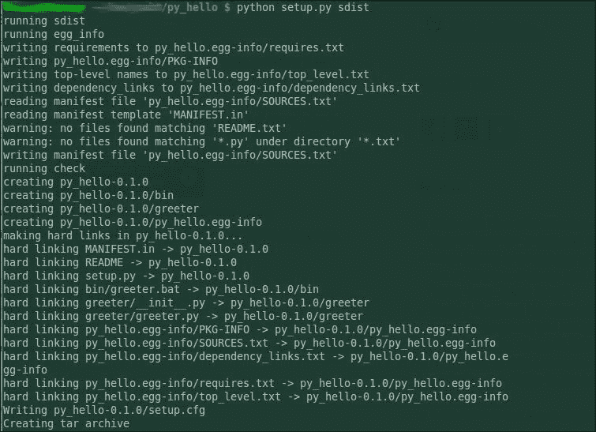

# 七、构建和分发 NumPy 代码

在现实世界中，您将编写一个应用程序，以将其分发到 World 或在其他各种计算机上重用。 为此，您希望应用程序以标准方式打包，以便社区中的每个人都能理解和遵循。 正如您现在已经注意到的那样，Python 用户主要使用名为`pip`的程序包管理器来自动安装其他程序员创建的模块。 Python 具有一个称为 **PyPI**（ **Python 软件包索引**）的打包平台，该平台是 50,000 多个 Python 软件包的官方中央存储库。 一旦在 PyPi（又名 *Cheese Shop*）中注册了软件包，世界各地的其他用户都可以在使用`pip`等软件包管理系统对其进行配置后进行安装。 Python 随附了许多解决方案，可帮助您构建代码以准备分发给 *Cheese Shop* ，并且在本章中，我们将重点介绍两个此类工具，`setuptools` 和`Distutils` 除了这两个工具之外，我们还将研究 NumPy 提供的称为`numpy.distutils`的特定模块。 该模块使程序员更容易构建和分发特定于 NumPy 的代码。 该模块还提供了其他功能，例如用于编译 Fortran 代码，调用`f2py,`等的方法。 在本章中，我们将通过以下步骤来学习包装工作流程：

*   我们将建立一个小的但可行的设置
*   我们将说明将 NumPy 模块集成到您的设置中的步骤
*   我们将说明如何在 Internet 上注册和分发您的应用程序

# 介绍 Distutils 和 setuptools

在开始之前，首先让我们了解这些工具是什么以及为什么我们偏爱另一个工具。 `Distutils`是 Python 默认提供的框架，`setuptools`建立在标准`Distutils`的基础上，以提供增强的功能和特性。 在现实世界中，您将永远不会使用`Distutils`。 您可能想单独使用`Distutils`的唯一情况是`setuptools`不可用。 （良好的设置脚本应在继续之前检查`setuptools`的可用性。）在大多数情况下，用户最好安装`setuptools`，因为当今大多数软件包都是基于它们构建的。 在接下来的章节中，我们将使用`setuptools`来构建 Cython 代码; 因此，出于我们的目的，我们现在将安装`setuptools`并从现在开始广泛使用它。

接下来，让我们从安装必需的工具开始，以构建我们的第一个虚拟（但有效）安装程序。 安装程序正常运行后，我们将在熊猫脚本模块的真实脚本中深入介绍 NumPy 的更多功能。 我们将研究脚本中进行的检查，以使其更强大，以及在发生故障时如何提供更多信息。

# 准备工具

要在您的系统上安装`setuptools`，您需要先从 [https://pypi.python.org/pypi/setuptools](https://pypi.python.org/pypi/setuptools) 下载系统中的`ez_setup.py`，然后从命令提示符处执行以下操作 ：

```py
    $ python ez_setup.py

```

要测试`setuptools`的安装，请打开 Python shell 并键入以下内容：

```py
> import setuptools 

```

如果前面的导入没有给出任何错误，则说明我们已成功安装`setuptools`。

# 建立第一个工作发行版

我们前面提到的所有工具（`setuptools`，`Distutils`和`numpy.distutils`）都围绕功能设置。 为了了解大多数包装要求，我们将研究一个简单的设置功能，然后研究一个成熟的安装程序。 要创建基本的安装程序，我们需要使用有关程序包的元数据调用安装程序功能。 让我们叫第一个包`py_hello`，它只有一个功能`greeter`，并且在调用时只打印一条消息。 可从[的 Bitbucket 存储库下载该程序包 https://bitbucket.org/tdatta/books/src/af376df081ef/python/simple_setup/?at=master](https://bitbucket.org/tdatta/books/src/af376df081ef/python/simple_setup/?at=master) 该项目的项目目录结构如下 以下：

```py
py_hello 
├── README 
├── MANIFEST.in 
├── setup.py 
├── bin 
│   └── greeter.bat 
└── greeter 
    ├── __init__.py 
    ├── greeter.py 

```

让我们在这里看一些标准文件：

*   `README`-此文件用于存储有关您的项目的信息。 该文件不是系统所需的文件，如果没有该文件，您仍将获得安装程序的构建，但是将其保留在此处是一种很好的做法。
*   `MANIFEST.in`-这是一个文本文件，`Distutils`使用该文本文件来收集项目中的所有文件。 这非常重要，只有此处列出的文件才会进入最终安装程序`tar`存档。 除了指定最终安装程序中应包含的文件之外，`manifest`还可以用于从项目目录中排除某些文件。 `manifest`文件是必需的； 如果不存在，则在使用`setup.py`时会出现错误。 如果您具有`svn`设置，则可以使用`sdist`命令通过解析`.svn`文件并构建`manifest.in`文件来自动包含文件。
*   `__init__.py`-该文件对于 Python 将该目录识别为模块很重要。 创建后可以将其留空。

要为此安装程序创建安装程序，我们在根目录中有`setup.py`，它使用`setuptools`中的`setup`函数：

```py
from setuptools import setup 
import os 
description = open(os.path.join(os.path.dirname(__file__), 'README'), 'r').read() 
setup( 
    name = "py_hello", 
    packages = ["greeter"], 
    scripts = ["bin/greeter.bat"], 
    include_package_data = True, 
    package_data = { 
        "py_hello":[] 
        }, 
    version = "0.1.0", 
    description = "Simple Application", 
    author = "packt", 
    author_email = "packt@packt.com", 
    url = "https://bitbucket.org/tdatta/book/py_hello", 
    download_url = "https://bitbucket.org/tdatta/book/py_hello/zipball/master", 
    keywords = ["tanmay", "example_seutp", "packt"  "app"], 
    install_requires=[ 
        "setup >= 0.1"], 
    license='LICENSE', 
    classifiers = [ 
        "Programming Language :: Python", 
        "Development Status :: release 0.1", 
        "Intended Audience ::  new users", 
        "License :: Public", 
        "Operating System :: POSIX :: Linux", 
        "Topic :: Demo", 
        ], 
    long_description = description 
    ) 

```

以下是安装程序中使用的选项：

*   `name`-这是安装 TAR 归档文件的名称。
*   `packages`-这是一个列出要包含的软件包的列表。
*   `scripts`-这是要安装到`/usr/bin.`等标准位置的脚本的列表。在此特定情况下，仅存在一个 echo 脚本。 这样做的目的是向读者展示如何将软件包附带脚本。
*   `package_data`-这是字典，具有与文件列表相关联的键（包）。
*   `version`：-这是您的项目的版本。 这将附加到安装程序名称的末尾。
*   `long_description`-在 PyPI 网站上显示时，它将转换为 HTML。 它应该包含有关您的项目打算提供的信息。 您可以直接在脚本中编写它； 但是，最佳实践是维护`README`文件并从此处读取说明。
*   `install_required`-这是用于添加安装依赖性的列表。 您将添加代码中使用的第三方模块的名称和版本。 请注意遵循约定以在此处指定版本。
*   `classifiers`-当您在 PyPI 网站上上传软件包时，将选中此选项。 您应该从以下网站提供的选项中进行选择： [https://pypi.python.org/pypi?:action=list_classifiers](https://pypi.python.org/pypi?:action=list_classifiers)

现在，使用`build`选项运行`setup.py`应该不会给您任何错误，并生成带有`.egg-info`后缀的文件夹。 此时，您可以使用`sdist`选项运行`setup.py`，并创建一个可以与世界共享的软件包。

您应该看到最终消息为**创建 tar 归档文件**，如下所示：



要测试该软件包，可以按照以下步骤将其安装在本地计算机上：

```py
python setup.py install 

```

并按以下所示检查它：


这时，在`cmd/bash`提示符下写`greeter`，您将看到一条消息`does nothing`。 该回显消息来自`greeter.bat`，我们将其放置在安装文件的`scripts`键中。

下一部分可以添加到此框架`setup.py`以包括`NumPy`特定的功能。

## 添加 NumPy 和非 Python 源代码

接下来，我们将研究一些特定于 NumPy 的代码，并了解如何提高设置的错误处理能力； 通常，我们将探索一些良好的编程习惯。 我们还将展示如何将非 Python 源（`c,fortran`或`f2py`）添加到安装程序中。 以下分析显示了完整代码的一部分，您可以在随附的代码文件中或在 [https://bitbucket.org/tdatta/books/](https://bitbucket.org/tdatta/books/) 中找到这些代码：

```py
if sys.version_info[0] < 3: 
   import __builtin__ as builtins 
else: 
   import builtins 

..... 
..... 
..... 
For full sample look for setup.py file with the accompanying CD
..... 
..... 

#define a function to import numpy if available and return true else false 

def is_numpy_installed(): 
   try: 
        import numpy 
   except ImportError: 
        return False 
   return True  
# next we will import setuptools feature here  
# We need to do this here because setuptools will "Monkey patch" the setup function 
# 
SETUPTOOLS_COMMANDS = set([ 
    'develop', 'release', 'bdist_egg','bdist_rpm', 
    'bdist_wininst', 'install_egg_info', 'build_sphinx', 
    'easy_install', 'upload', 'bdist_wheel', 
    '--single-version-externally-managed', 
]) 

if SETUPTOOLS_COMMANDS.intersection(sys.argv): 
    import setuptools 
    extra_setuptools_args = dict( 
        zip_safe-False # Custom clean command to remove build artifacts 

# The main function where we link everything 

def setup_package(): 

   # check NumPy and raise excpetions 

    if is_numpy_installed() is False: 
        raise ImportError("Numerical Python (NumPy) is not installed. The package requires it be installed. Installation instruction available at the NumPy website") 

    from numpy.distutils.core import setup, Extension 

    # add extension from Fortran 

    ext1 = Extension(name = "firstExt", 
                     sources = ['firstExt.f']) 
    ext2  = Extension(name = "convolutedExt", 
                      sources = ['convolutedExt.pyf, stc2.f'], 
                      include_dir = ['paths to include'], 
                      extra_objects = "staticlib.a") 

    metadata = dict(name = "yourPackage", 
                    description="short desc", 
                    license = "licence info here", 
                    ext_modules = [ext1, ext2] 
                    .. 
                    # metadata as we set previously 
                    .. 
                    **extra_setuptools_args 
    ) 

    setup(**metadata) 

if __name__ == "__main__": 
    setup_package() 

```

上面的脚本从完整的工作设置中删除，着重于几乎所有设置脚本中都可以找到的某些方面。 这些任务确保您已完成足够的错误处理，并且脚本在不解释/提示下一步操作的情况下不会失败：

1.  检查是否已安装 NumPy。 此处用来确保已安装 NumPy 的模式是一种标准模式，您可以将其用于计划使用的所有模块，并且是安装程序所必需的。 为了执行此任务，我们首先构建一个函数`is_numpy_installed`尝试导入`numpy`并返回一个布尔值。 您可能会为安装文件可能使用的所有外部软件包创建类似的功能。 高级用户可以使用 Python 装饰器来以更优雅的方式进行处理。 如果此函数返回错误值，则安装程序应输出警告/信息，以防没有此软件包无法完成安装。
2.  将`Extensions`添加到设置文件中。
3.  `Extension`类是使我们能够向安装程序中添加非 Python 代码的对象。 `sources`参数可能包含 Fortran 源文件列表。 但是，列表源可能最多包含一个`f2py`签名文件，然后扩展模块的名称必须与签名文件中使用的`<module>`匹配。 `f2py`签名文件必须恰好包含一个 Python 模块块，否则安装程序将无法构建。 您可以决定不在`sources`参数中添加签名文件。 在这种情况下，`f2py`将扫描 Fortran 源文件以获取常规签名，以构造 Fortran 代码的包装器。 可以使用`Extension`类参数`f2py_options`来指定`f2py`进程的其他选项。 这些选项不在本书的讨论范围内，大多数读者不会使用它们。 有关更多详细信息，用户可以参考`api`文档中的`numpy.distutils`扩展类。

可以按以下方式测试安装文件：

```py
 $ python <setup.py file> build_src build_ext --help 

```

这里的`build_src`参数用于构造 Fortran 包装器扩展模块。 这里假定用户在其计算机上安装了 C/C++ 和 Fortran 编译器。

# 测试您的包裹

非常重要的一点是，所构建的软件包可以在用户的​​计算机上正常运行/安装。 因此，您应该花时间测试软件包。 测试安装背后的总体思路是创建一个 virtualenv 并尝试安装该软件包或完全使用另一个系统。 在此阶段遇到的任何错误都应删除，并且作者应尝试确保更容易遵循这些异常。 异常也应尝试提供解决方案。 此阶段的常见错误是：

*   关于预装模块和库的假设。
*   开发人员可能会忘记在安装文件中包含依赖项。 如果使用新的 virtualenv 来测试安装程序，则会捕获此错误。
*   权限和提升的权限要求。
*   某些用户可能对计算机具有只读访问权限。 这很容易被忽略，因为大多数开发人员在自己的机器上都没有这种情况。 如果程序包的提供者遵循正确的方法来选择要写入的目录，则应该不会出现此问题。 通常，通过使用没有管理员访问权限的用户测试脚本来检查这种情况是一种很好的做法。

# 分发您的应用程序

完成模块/应用程序的所有开发并准备好完整的正常工作的应用程序和设置文件后，下一个任务就是与世界分享您的辛勤工作，使他人受益。 使用 PyPI 将其发布到全世界的步骤非常简单。 作为软件包作者，您需要做的第一件事就是注册自己。 您可以直接从命令行执行以下操作：

```py
 **$ python setup.py register
    running register
    running egg_info
    ....
    ....
    We need to know who you are, so please choose either:
     1\. use your existing login,
     2\. register as a new user,
     3\. have the server generate a new password for you (and email it to you), or
     4\. quit
    Your selection [default 1]:** 
```

### 提示

如果`setup.py`中缺少任何文件的正确元数据信息，则此过程将失败。 确保首先工作`setup.py`。

最后，您可以通过执行以下操作在 PyPI 上上传您的发行版：

```py
 $ python setup.py sdist upload 

```

希望，如果您正确键入了所有内容，您的应用程序将被打包并在 PyPI 上供世界使用。

# 总结

在本章中，我们介绍了用于打包和分发应用程序的工具。 我们首先看了一个更简单的`setup.py`文件。 您研究了功能设置的属性以及这些参数如何链接到最终安装程序。 接下来，我们添加了与 NumPy 相关的代码，并添加了一些异常处理代码。 最后，我们构建了安装程序并学习了如何在 *Cheese Shop*（PyPI 网站）上上传它。 在下一章中，您将研究通过将 Python 代码的一部分转换为 Cython 来进一步加速 Python 代码的方法。