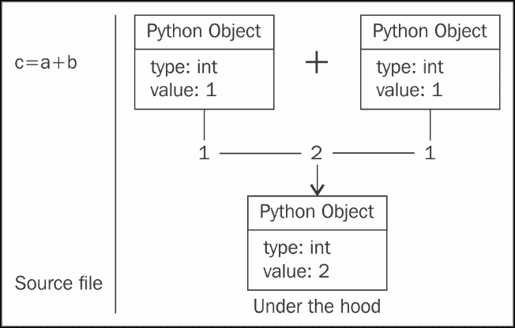

# 八、使用 Cython 加速 NumPy

Python 与 NumPy 库相结合为用户提供了编写高度复杂的函数和分析的工具。 随着代码的大小和复杂性的增长，代码库中的低效率问题开始蔓延。一旦项目进入完成阶段，开发人员就应开始关注代码的性能并分析瓶颈。 Python 提供了许多工具和库来创建优化且性能更快的代码。

在本章中，我们将研究一种名为 Cython 的工具。 Cython 是 Python 和“ Cython”语言的静态编译器，在从事科学图书馆/数值计算的开发人员中特别流行。 许多用 Python 编写的著名分析库都大量使用 Cython（熊猫，SciPy，scikit-learn 等）。

Cython 编程语言是 Python 的超集，用户仍然喜欢 Python 所提供的所有功能和更高层次的结构。 在本章中，我们将研究 Cython 起作用的许多原因，并且您将学习如何将 Python 代码转换为 Cython。 但是，本章不是 Cython 的完整指南。

在本章中，我们将介绍以下主题：

*   在我们的计算机上安装 Cython
*   将少量 Python 代码重写为 Cython 版本并进行分析
*   学习在 Cython 中使用 NumPy

# 优化代码的第一步

每个开发人员在优化其代码时应注意的问题如下：

*   您的代码执行多少个函数调用？
*   有多余的电话吗？
*   该代码使用了多少内存？
*   是否存在内存泄漏？
*   瓶颈在哪里？

前四个问题主要由探查器工具回答。 建议您至少学习一种分析工具。 分析工具将不在本章中介绍。 在大多数情况下，建议先尝试优化函数调用和内存使用，然后再使用低级方法，例如 Cython 或汇编语言（使用 C 衍生语言）。

一旦确定了瓶颈，并且解决了算法和逻辑的所有问题，Python 开发人员便可以进入 Cython 的世界，以提高应用程序的速度。

# 设置 Cython

Cython 是一个将类型定义的 Python 代码转换为 C 代码的编译器，该代码仍在 Python 环境中运行。 最终输出是本机代码，其运行速度比 Python 生成的字节码快得多。 在大量使用循环的代码中，Python 代码加速的幅度更加明显。 为了编译 C 代码，首要条件是在计算机上安装 C / C ++编译器，例如`gcc`（Linux）或`mingw`（Windows）。

第二步是安装 Cython。 Cython 与其他带有 Python 模块的库一样，可以使用任何首选的方法（pip，easy_install 等）进行安装。 完成这两个步骤后，您可以通过尝试从 Shell 调用 Cython 来测试设置。 如果收到错误消息，则说明您错过了第二步，需要重新安装 Cython 或从 Cython 官方网站（ [http://cython.org/#download](http://cython.org/#download) ）下载 TAR 归档文件，然后 从此下载的`root`文件夹中运行以下命令：

```py
 **python setup.py install** 

```

正确完成所有操作后，您可以继续使用 Cython 编写第一个程序。

# Cython 中的 Hello world

Cython 程序看起来与 Python 程序非常相似，但大多带有附加的类型信息。 让我们看一个简单的程序，该程序计算给定`n`的 *n* <sup class="calibre26">第</sup>斐波那契数：

```py
defcompute_fibonacchi(n): 
    """ 
    Computes fibonacchi sequence 

    """ 

    a = 1 
    b = 1 
    intermediate = 0  
    for x in xrange(n): 
intermediate = a 
        a = a + b 
        b = intermediate 
    return a 

```

让我们研究一下该程序，以了解在调用带有某些数字输出的函数时幕后的情况。 假设`compute_fibonacchi(3)`。

众所周知，Python 是一种解释性和动态语言，这意味着您无需在使用变量之前声明变量。 这意味着在函数调用开始时，Python 解释器无法确定`n`将保留的值的类型。 当您使用某个整数值调用函数时，Python 会通过名为 **boxing** 和 **unboxing** 的过程自动为您进行类型推断。

在 Python 中，一切都是对象。 因此，当您输入`1`或`hello`时，Python 解释器将在内部将其转换为对象。 在许多在线材料中，此过程也称为拳击。 该过程可以可视化为：


那么当您将函数应用于对象时会发生什么呢？ Python 解释器必须做一些额外的工作来推断类型并应用函数。 在一般意义上，下图说明了 add 函数在 Python 中的应用。 Python 是一种解释型语言，它在优化函数调用方面做得并不出色，但是可以使用 C 或 Cython 很好地优化它们：



这种装箱和拆箱不是免费的，需要花费宝贵的计算时间。 当这样的操作被循环执行多次时，效果变得更加显着。

在 *n = 20* 上运行时，以下程序在 IPython 笔记本上每个循环大约需要 1.8 微秒：


现在让我们将该程序重写为 Cython：

```py
defcompute_fibonacchi_cython(int n): 
cdefint a, b, intermediate, x 
    a, b= 1, 1 
    intermediate, x  = 0, 0 
    for x in xrange(n): 
        intermediate = a 
        a = a+b 
        b = intermediate 
    return a 

```

该程序每个循环花费`64.5`纳秒：


### 提示

尽管在此示例代码中提高速度非常重要，但这不是您将遇到的实际代码，因此您应始终记住首先在代码上运行探查器并确定需要优化的部分。 同样，在使用 Cython 时，开发人员应考虑在使用静态类型和灵活性之间进行权衡。 使用类型会降低灵活性，有时甚至会降低可读性。

通过删除`xrange`并改用`for`循环，可以进一步改进此代码。 当您对模块的所有组件/功能都满意并且没有错误后，用户可以将这些功能/过程存储在扩展名为`.pyx`的文件中。 这是 Cython 使用的扩展名。 将此代码与您的应用程序集成的下一步是在安装文件中添加信息。

在这里，出于说明目的，我们将代码存储在名为`fib.pyx`的文件中，并创建了一个构建该模块的安装文件：

```py
from distutils.core import setup, Extension 
from Cython.Build import cythonize 
from Cython.Distutils import build_ext 

setup( 
ext_modules=[Extension('first', ['first.pyx'])], 
cmdclass={'build_ext': build_ext} 
) 

```

在这里，请注意扩展名`first` 的名称与模块的名称完全匹配。 如果您无法保持相同的名称，则将收到一个神秘的错误：


# 多线程代码

您的应用程序可能会使用多线程代码。 由于 **全局解释器锁** （ **GIL** ），Python 不适合多线程代码。 好消息是，在 Cython 中，您可以显式解锁 GIL，并使您的代码真正成为多线程。 只需在您的代码中放置一个`with nogil:`语句即可。 您以后可以在代码中使用`with gil`获取 GIL：

```py
with nogil: 
<The code block here> 
function_name(args) with gil:  
<function body> 

```

# NumPy 和 Cython

Cython 具有内置支持，可提供对 NumPy 阵列的更快访问。 这些功能使 Cython 成为优化 NumPy 代码的理想人选。 在本节中，我们将研究用于计算欧式期权价格的代码，欧式期权是一种使用蒙特卡洛技术的金融工具。 不期望有金融知识； 但是，我们假设您对蒙特卡洛模拟有基本的了解：

```py
defprice_european(strike = 100, S0 = 100, time = 1.0,  
rate = 0.5, mu = 0.2, steps = 50,  
N = 10000, option = "call"): 

dt = time / steps 
rand = np.random.standard_normal((steps + 1, N)) 
S = np.zeros((steps+1, N)); 
S[0] = S0 

for t in range(1,steps+1): 
S[t] = S[t-1] * np.exp((rate-0.5 * mu ** 2) * dt 
+ mu * np.sqrt(dt) * rand[t]) 
price_call = (np.exp(-rate * time) 
* np.sum(np.maximum(S[-1] - strike, 0))/N) 
price_put = (np.exp(-rate * time) 
* np.sum(np.maximum(strike - S[-1], 0))/N) 

returnprice_call if option.upper() == "CALL" else price_put 

```

以下是前面示例的 Cythonized 代码：

```py
import numpy as np 
def price_european_cython(double strike = 100,doubleS0 = 100, 
                          double time = 1.0, double rate = 0.5, 
                          double mu = 0.2, int steps = 50,  
                   long N = 10000, char* option = "call"): 
   cdef double dt = time / steps 
   cdefnp.ndarray rand = np.random.standard_normal((steps + 1, N)) 
   cdefnp.ndarray S = np.zeros([steps+1, N], dtype=np.float) 
       #cdefnp.ndarrayprice_call = np.zeroes([steps+1,N],     dtype=np.float) 
       S[0] = S0 

   for t in xrange(1,steps+1): 
           S[t] = S[t-1] * np.exp((rate-0.5 * mu ** 2) * dt 
                               + mu * np.sqrt(dt) * rand[t]) 
           price_call = (np.exp(-rate * time) 
                  * np.sum(np.maximum(S[-1] - strike, 0))/N) 
           price_put = (np.exp(-rate * time) 
                  * np.sum(np.maximum(strike - S[-1], 0))/N) 

   return price_call if option.upper() == "CALL" else price_put 

```

与此相关的安装文件如下所示：

```py
from distutils.core import setup, Extension 
from Cython.Build import cythonize 
from Cython.Distutils import build_ext 
import numpy.distutils.misc_util 

include_dirs = numpy.distutils.misc_util.get_numpy_include_dirs() 

setup( 

name="numpy_first", 
    version="0.1", 
ext_modules=[Extension('dynamic_BS_MC', 
                           ['dynamic_BS_MC.pyx'], 
include_dirs = include_dirs)], 
cmdclass={'build_ext': build_ext} 
) 

```

虽然通过 Cython 代码获得的加速效果非常好，并且您可能会倾向于在 Cython 中编写大多数代码，但建议仅将性能至关重要的部分转换为 Cython。 NumPy 在优化对数组的访问和执行更快的计算方面做得非常出色。 该代码可以视为描述该代码的理想候选者。 前面的代码有很多“松散的结局”，可以当作练习来解决 Python 中的性能问题，并在采用 Cython 方式之前先最佳地使用 NumPy。 由于 Python 的动态特性，盲目地对 NumPy 代码进行 Cython 化的速度提升可能不如具有真正问题的最优编写代码那样快。

最后，我们介绍在 Cython 中开发模块时应遵循的以下内容：

1.  用纯 Python 编写代码并进行测试。
2.  运行探查器并确定要关注的关键区域。
3.  创建一个新模块以保存 Cython 代码（`<module_name>.pyx`）。
4.  将这些区域中的所有变量和循环索引转换为它们的 C 对应物。
5.  使用以前的测试设置进行测试。
6.  将扩展名添加到安装文件中。

# 摘要

在本章中，我们了解了如何将 Python 代码隐蔽到 Cython 中。 我们还研究了一些涉及 NumPy 数组的示例 Python 代码。 我们简要介绍了 Python 语言中装箱和拆箱的概念以及它们如何影响代码性能。 我们还说明了如何显式解锁臭名昭著的 GIL。 为了进一步深入研究 Cython，我们建议 *学习 Cython 编程* ， *Philip Herron* ， *Packt Publishing* 。 在下一章中，您将了解 NumPy C API 以及如何使用它。